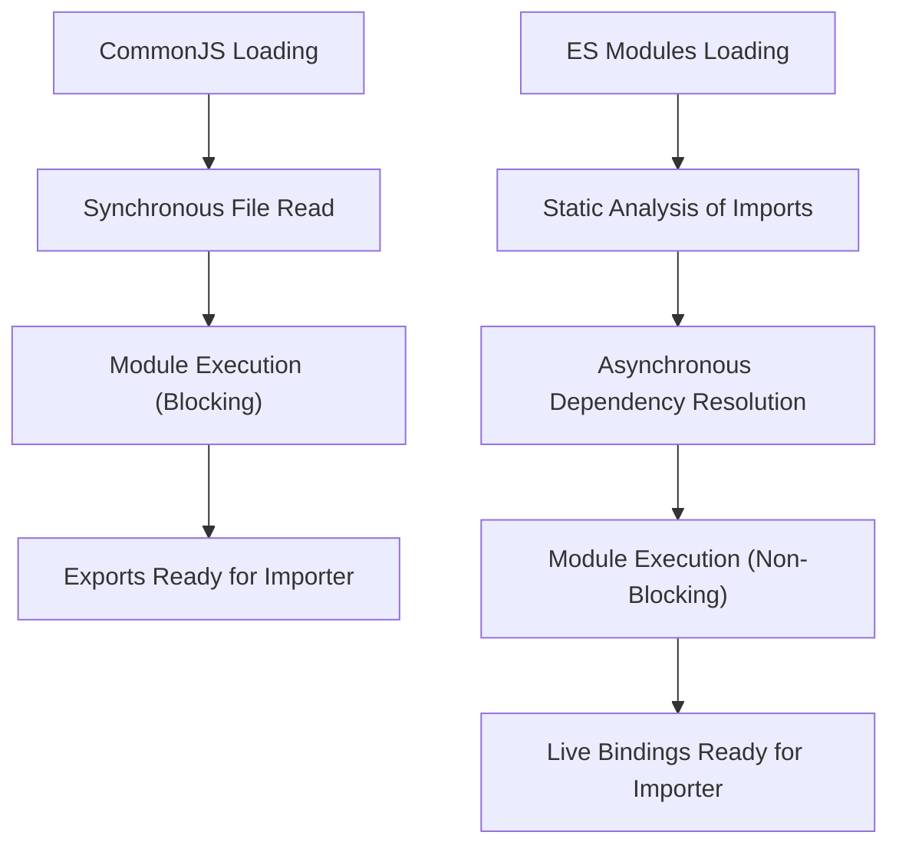

## Module Systems: CommonJS (require) vs. ES Modules (import)
### Core Concepts

*   **CommonJS (CJS):** Node.js's original, synchronous module system.
    *   **Loading:** Modules are loaded synchronously, meaning execution blocks until the required module is fully loaded and processed.
    *   **Syntax:** Uses `require()` for importing and `module.exports` (or `exports`) for exporting.
    *   **Context:** Primarily designed for server-side environments where file system access is immediate.
*   **ES Modules (ESM):** The official JavaScript standard for modules.
    *   **Loading:** Modules are loaded asynchronously. Their dependencies are resolved and fetched before the module itself executes, enabling parallel fetching.
    *   **Syntax:** Uses `import` for importing and `export` for exporting.
    *   **Context:** Designed for both browser and server environments, emphasizing static analysis benefits.

### Key Details & Nuances

*   **CommonJS Characteristics:**
    *   **Value Copy:** When a module is `require`d, a copy of its `module.exports` object is returned. Subsequent changes to primitive exports in the original module are *not* reflected. For objects, changes to properties *are* reflected as it's a reference copy.
    *   **Dynamic Loading:** `require()` can be called conditionally at any point in the code, allowing for dynamic module loading.
    *   **Built-in Globals:** `__dirname` and `__filename` are readily available.
    *   **`this` Context:** Inside a CJS module, `this` refers to `module.exports`.
*   **ES Modules Characteristics:**
    *   **Live Bindings:** Imports are live references to the original module's exports. If the exported value changes in the source module, the imported value reflects that change.
    *   **Static Analysis:** The module graph can be determined without executing code. This enables optimizations like tree-shaking (removing unused exports) and better tooling.
    *   **Strict Mode:** All ESM modules run in strict mode by default.
    *   **Top-level `await`:** Allowed in ESM, simplifying asynchronous module initialization without wrapping in an `async` function.
    *   **No Built-in Globals:** `__dirname` and `__filename` are not directly available. `import.meta.url` is used for similar path resolution.
    *   **Named vs. Default Exports:** Supports both named exports (multiple exports by name) and a single default export.
*   **Node.js Module Resolution:**
    *   **File Extensions:**
        *   `.mjs`: Always treated as ESM.
        *   `.cjs`: Always treated as CJS.
        *   `.js`: Default behavior depends on `package.json`.
    *   **`package.json` `type` field:**
        *   `"type": "module"`: All `.js` files in that package (and its subdirectories, unless overridden) are treated as ESM.
        *   `"type": "commonjs"` (or omitted): All `.js` files are treated as CJS.
*   **Interoperability:**
    *   **ESM `import` CJS:** ES Modules can `import` CommonJS modules. The CJS `module.exports` becomes the default export of the ESM import. Named exports from CJS are generally not reliably available without specific Babel transforms or Node.js features.
    *   **CJS `require` ESM:** CommonJS **cannot directly `require()`** ES Modules. To use an ESM from CJS, a dynamic `import()` expression (which returns a Promise) must be used.

### Practical Examples

**1. CommonJS Module Example**

```javascript
// math.js (CommonJS)
function add(a, b) {
  return a + b;
}

module.exports = {
  add,
  subtract: (a, b) => a - b
};

// app.js (CommonJS)
const { add, subtract } = require('./math.js');

console.log('CJS Add:', add(5, 3));      // Output: CJS Add: 8
console.log('CJS Subtract:', subtract(5, 3)); // Output: CJS Subtract: 2
```

**2. ES Module Example**

```javascript
// math.mjs (ES Module)
export function add(a, b) {
  return a + b;
}

export const subtract = (a, b) => a - b;

// app.mjs (ES Module)
import { add, subtract } from './math.mjs';

console.log('ESM Add:', add(10, 5));      // Output: ESM Add: 15
console.log('ESM Subtract:', subtract(10, 5)); // Output: ESM Subtract: 5
```

**3. Module Loading Flow Comparison**



### Common Pitfalls & Trade-offs

*   **Direct `require()` of ESM:** A common mistake is trying to `require()` an ESM module from a CJS context; it will throw an error. Dynamic `import()` is required and is asynchronous.
*   **Default vs. Named Imports (CJS to ESM):** When an ESM imports a CJS module, the CJS `module.exports` becomes the ESM's default import. Accessing "named" exports from a CJS module via ESM `import { name } from 'module';` will often fail or behave unexpectedly.
*   **Circular Dependencies:** While both can technically handle them, CJS returns an incomplete `exports` object during a circular `require`. ESM can be stricter and might throw errors or result in `undefined` values for live bindings if not carefully managed.
*   **Tooling/Transpilation:** Older Node.js versions or browser environments often require transpilation (e.g., Babel, TypeScript) to convert ESM syntax to CJS or older JavaScript for compatibility. This adds complexity to the build process.
*   **Dual Package Hazard:** For library authors, supporting both CJS and ESM consumers simultaneously can be challenging, leading to increased bundle sizes, more complex build setups, and potential compatibility issues.

### Interview Questions

1.  **Q:** What are the fundamental differences between CommonJS and ES Modules in Node.js regarding their loading mechanism and how they handle imported values?
    **A:** CommonJS uses a synchronous `require()` that returns a copy of the `module.exports` object, meaning changes to exported primitives after import are not reflected. ES Modules use asynchronous `import` statements and provide live bindings, where imported values are references to the original exports, reflecting any subsequent changes. CJS is dynamic (can import conditionally at runtime), while ESM is static (imports are resolved before execution).

2.  **Q:** When starting a new Node.js project, would you prefer CommonJS or ES Modules? Justify your choice and mention the key benefits.
    **A:** For a new Node.js project, I would prefer ES Modules. The main benefits include: being the official JavaScript standard, enabling static analysis and optimizations like tree-shaking (reducing bundle size), supporting top-level `await`, and providing better long-term tooling support and ecosystem alignment. While CJS is still widely used, ESM offers a more modern, efficient, and standardized approach.

3.  **Q:** Can a CommonJS module import an ES Module, and vice versa? Explain any limitations or special considerations.
    **A:** An ES Module can `import` a CommonJS module; the CJS `module.exports` becomes the default export for the ESM. However, a CommonJS module **cannot directly `require()`** an ES Module. To use an ESM from CJS, one must use a dynamic `import()` expression, which is asynchronous and returns a Promise. This often necessitates refactoring CJS code to handle the asynchronous nature or using wrapper functions.

4.  **Q:** How does Node.js determine whether a `.js` file should be treated as CommonJS or an ES Module?
    **A:** Node.js uses a "module resolution algorithm." The primary methods are:
    *   **File Extension:** `.mjs` files are always treated as ES Modules, and `.cjs` files are always treated as CommonJS.
    *   **`package.json` `type` field:** If a `package.json` file (in the current directory or an ancestor) specifies `"type": "module"`, all `.js` files within that package (by default) are treated as ES Modules. If `"type"` is `"commonjs"` (or omitted), `.js` files are treated as CommonJS.
    *   **`exports` field in `package.json`:** This field can define conditional exports, allowing a package to expose different entry points for CJS and ESM consumers.

5.  **Q:** Discuss the concept of "tree-shaking" and its relevance to ES Modules. Is it possible with CommonJS, and why/why not?
    **A:** Tree-shaking is a build optimization process that eliminates dead code (unused imports/exports) from the final bundle. It's highly relevant to ES Modules because ESM's static nature allows build tools (like Webpack, Rollup) to analyze the module graph at compile time and identify exactly what is being imported and used. CommonJS, due to its dynamic `require()` statements and value-copy behavior, makes static analysis much harder. Tools generally cannot reliably determine if a CJS export is unused without executing the code, making effective tree-shaking largely impossible with CJS.