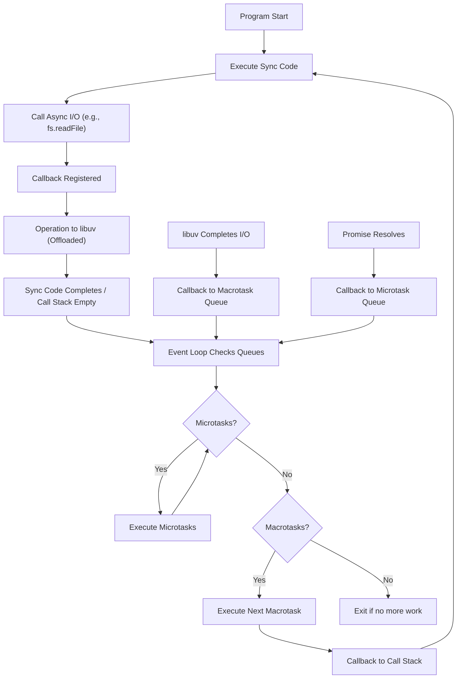

## Core Modules: `fs`, `path`, `os`, `http`
### Core Concepts
*   **Node.js Runtime:** A JavaScript runtime environment built on Chrome's V8 JavaScript engine. It allows JavaScript to be executed outside of a web browser, typically for server-side applications, command-line tools, and desktop applications.
    *   Leverages V8 for high-performance JavaScript execution.
    *   Uses `libuv` library for asynchronous I/O operations, providing cross-platform abstraction for non-blocking I/O.
*   **Event-Driven Architecture:** Node.js operates on a single-threaded, non-blocking I/O model, driven by an event loop.
    *   Instead of spawning new threads for each request, it registers callbacks for I/O operations.
    *   When an I/O operation completes, its callback is placed in an event queue and executed by the single Event Loop thread once the Call Stack is empty. This makes it highly efficient for I/O-bound tasks.

### Key Details & Nuances
*   **The Event Loop:** The heart of Node.js's async nature. It constantly checks if the Call Stack is empty, and if so, it moves pending callbacks from the Event Queue to the Call Stack for execution.
    *   **Phases:** The Event Loop has distinct phases (timers, pending callbacks, idle/prepare, poll, check, close callbacks) which determine when specific types of callbacks are executed.
    *   **Microtasks vs. Macrotasks:** `Promise.then`/`await` callbacks are Microtasks (processed after the current script but before the next Macrotask). `setTimeout`, `setImmediate`, I/O callbacks are Macrotasks (processed in the Event Loop phases). Microtasks have higher priority and are executed completely before the Event Loop moves to the next Macrotask.
    *   **Blocking Operations:** Any synchronous code that takes significant time (e.g., heavy CPU computation, `fs.readFileSync`) will block the Event Loop, preventing other queued events/callbacks from being processed. This is a critical performance bottleneck.
*   **Core Modules (`fs`, `path`, `os`, `http`):** Built-in modules fundamental to Node.js development.
    *   **`fs` (File System):** Provides methods for interacting with the file system.
        *   **Asynchronous (preferred):** `fs.readFile()`, `fs.writeFile()`, `fs.promises.readFile()`. Non-blocking. Use Promises/async-await for cleaner async flow.
        *   **Synchronous (avoid for server apps):** `fs.readFileSync()`, `fs.writeFileSync()`. Blocks the Event Loop until the operation completes. Only suitable for CLI tools or initial startup scripts where blocking is acceptable.
        *   **Streams:** `fs.createReadStream()`, `fs.createWriteStream()`. Efficient for handling large files by processing data in chunks, reducing memory footprint and improving throughput.
    *   **`path`:** Utilities for working with file and directory paths.
        *   **Platform-agnostic:** Handles differences between Windows (`\`) and Unix-like (`/`) path separators.
        *   Key methods: `path.join()`, `path.resolve()`, `path.basename()`, `path.dirname()`, `path.extname()`.
    *   **`os` (Operating System):** Provides information about the operating system.
        *   Common uses: `os.cpus()`, `os.totalmem()`, `os.freemem()`, `os.platform()`, `os.userInfo()`. Useful for system monitoring or platform-specific logic.
    *   **`http`:** Foundation for building web servers and making HTTP requests.
        *   `http.createServer()`: Creates a new HTTP server instance.
        *   `request` and `response` objects: Provide access to request details (headers, URL, method, body) and methods to send responses (status code, headers, body).
        *   Low-level, often abstracted by frameworks like Express.js.

### Practical Examples

#### Node.js Event Loop Flow


#### `http` server and `fs` async read
```typescript
import http from 'http';
import fs from 'fs/promises'; // Using promise-based fs for async/await
import path from 'path';

const PORT = 3000;
const PUBLIC_DIR = path.join(process.cwd(), 'public'); // Example: project_root/public

const server = http.createServer(async (req, res) => {
    console.log(`Request received for: ${req.url}`);

    if (req.url === '/') {
        try {
            const filePath = path.join(PUBLIC_DIR, 'index.html');
            const data = await fs.readFile(filePath, { encoding: 'utf8' });
            res.writeHead(200, { 'Content-Type': 'text/html' });
            res.end(data);
        } catch (error) {
            console.error('Error reading file:', error);
            res.writeHead(500, { 'Content-Type': 'text/plain' });
            res.end('Internal Server Error');
        }
    } else if (req.url === '/api/data' && req.method === 'GET') {
        res.writeHead(200, { 'Content-Type': 'application/json' });
        res.end(JSON.stringify({ message: 'Hello from API!', timestamp: Date.now() }));
    } else {
        res.writeHead(404, { 'Content-Type': 'text/plain' });
        res.end('Not Found');
    }
});

server.listen(PORT, () => {
    console.log(`Server running at http://localhost:${PORT}/`);
    // Create a 'public' directory and 'index.html' for the example
    // In a real project, these would exist.
    fs.mkdir(PUBLIC_DIR, { recursive: true }).then(() => {
        fs.writeFile(path.join(PUBLIC_DIR, 'index.html'), '<h1>Welcome!</h1><p>This is a test page.</p>')
            .catch(err => console.error('Failed to write index.html:', err));
    }).catch(err => console.error('Failed to create public directory:', err));
});
```

### Common Pitfalls & Trade-offs
*   **Blocking the Event Loop:** A single CPU-bound synchronous operation can halt all incoming requests.
    *   **Trade-off:** Simplicity of single-threaded model vs. need for external solutions (e.g., worker threads, separate services) for CPU-intensive tasks.
*   **Callback Hell / Inversion of Control:** Nested callbacks can become unmanageable and lead to complex error handling.
    *   **Solution:** Prefer Promises, `async/await` for sequential asynchronous operations.
*   **Memory Leaks:** Long-running processes with unmanaged resources (e.g., constantly growing arrays, unclosed connections, event emitter listeners not being removed) can lead to memory exhaustion.
*   **Synchronous `fs` methods:** While convenient for scripts, using them in web servers is an anti-pattern as they block the entire application.
    *   **Trade-off:** Simplicity/ease of use for simple scripts vs. performance/scalability for concurrent systems.
*   **Path Traversal/Injection (`path` & `fs`):** Improperly validating user-provided paths before using `fs` methods can lead to security vulnerabilities where an attacker can access arbitrary files.
    *   **Mitigation:** Always sanitize and validate user input. Use `path.resolve()` with a known base directory to ensure paths stay within intended boundaries.

### Interview Questions
1.  **Explain the Node.js Event Loop and its role in handling concurrency. How does it differ from traditional multi-threaded models, and what are its implications for application design?**
    *   **Answer:** The Event Loop is Node.js's core mechanism for handling asynchronous operations in a single-threaded process. It continuously monitors the Call Stack and moves callbacks from the Event Queue (comprising Macrotask and Microtask queues) to the Call Stack when it's empty. This non-blocking, single-threaded model means Node.js doesn't create a new thread per request, unlike traditional multi-threaded servers (e.g., Apache, Java Spring). This reduces memory overhead and context switching. The implication is that Node.js excels at I/O-bound tasks (network calls, file system operations) as I/O is offloaded to `libuv`'s thread pool, allowing the Event Loop to process other requests. However, CPU-bound operations must be asynchronous or offloaded (e.g., to Worker Threads or separate microservices) to avoid blocking the single Event Loop and making the application unresponsive.

2.  **How do `fs.readFile` and `fs.readFileSync` differ, and when would you use each in a Node.js application? Discuss the trade-offs.**
    *   **Answer:** `fs.readFile` is asynchronous and non-blocking. It takes a callback (or returns a Promise with `fs/promises`) that is executed once the file read operation completes. This allows the Event Loop to continue processing other requests. `fs.readFileSync` is synchronous and blocking; it will pause the entire Node.js process until the file has been fully read.
    *   **Use cases:**
        *   `fs.readFile` (preferred for servers): Use in web servers, APIs, or any application where responsiveness and concurrency are critical. It prevents the server from freezing while waiting for I/O.
        *   `fs.readFileSync`: Only suitable for command-line tools, configuration file loading during application startup (where blocking is acceptable for a brief period), or very small, non-critical scripts where simplicity outweighs the need for concurrency.
    *   **Trade-offs:** `readFileSync` is simpler to code (no callbacks/promises), but sacrifices performance and scalability. `readFile` is more complex but ensures the application remains responsive and can handle many concurrent connections efficiently.

3.  **You're building a streaming service for large video files. How would you handle file serving efficiently in Node.js, mentioning relevant core modules and concepts?**
    *   **Answer:** For large video files, I would use **streams** from the `fs` and `http` modules to avoid loading the entire file into memory.
    *   I'd use `fs.createReadStream()` to create a readable stream from the video file.
    *   On the `http.ServerResponse` object (which is a Writable Stream), I would pipe the readable file stream directly: `fileStream.pipe(res)`.
    *   This allows the video to be sent to the client in chunks as it's read from the disk, significantly reducing memory usage and starting playback faster for the client.
    *   I'd also consider handling `Range` headers from the client (using `req.headers.range`) to support partial content requests, enabling video seeking. This involves setting the `Content-Range` and `Accept-Ranges` headers and adjusting the `createReadStream` `start` and `end` options. This process inherently leverages Node.js's non-blocking I/O and event-driven nature for efficient data transfer.

4.  **Describe how `path.join` and `path.resolve` differ. When would you use one over the other, particularly concerning security or reliability?**
    *   **Answer:**
        *   **`path.join()`:** Joins all given path segments together, normalizing the resulting path. It simply concatenates the segments using the platform-specific separator. It does *not* resolve against the root directory or handle `..` in a way that escapes a provided base path securely. It mostly resolves redundant separators.
        *   **`path.resolve()`:** Resolves a sequence of paths or path segments into an absolute path. It processes paths from right to left, resolving each subsequent segment until an absolute path is constructed. If no absolute path segments are found, it prepends the current working directory (`process.cwd()`). It is designed to be more "intelligent" about absolute paths and `..`.
    *   **When to use:**
        *   **`path.join()`:** Use when you need to construct a path from several known segments, and you're confident that all segments are safe and within the expected boundaries (e.g., constructing a path to a static asset within a known public directory).
        *   **`path.resolve()`:** Use when dealing with user-provided paths or paths that might contain `../` sequences, especially when reading or writing files, to ensure the resulting path remains within a confined directory. For security, `path.resolve(baseDir, userInputPath)` is preferred over `path.join` because `resolve` will correctly "normalize" out malicious `../` sequences that attempt to traverse outside `baseDir` relative to the current working directory or an absolute segment in the `userInputPath`. It can protect against **path traversal** vulnerabilities more effectively.

5.  **What is backpressure in Node.js streams, and how can you mitigate it?**
    *   **Answer:** Backpressure occurs in Node.js streams when a `Writable` stream (the consumer) cannot process data as quickly as a `Readable` stream (the producer) is generating it. The `Readable` stream writes data faster than the `Writable` can consume, leading to buffer overruns and potential memory exhaustion.
    *   **Mitigation:**
        *   **`pipe()`:** The `stream.pipe()` method automatically handles backpressure. When the `Writable` stream's internal buffer fills up, it signals the `Readable` stream to pause (`source.pause()`). Once the `Writable` stream drains its buffer, it signals the `Readable` to resume (`source.resume()`).
        *   **Manual Control (for complex scenarios):** If not using `pipe()`, you'd listen for the `drain` event on the `Writable` stream and the `data` event on the `Readable` stream. When `writable.write()` returns `false`, it indicates that the buffer is full, and you should pause the `Readable` stream (`source.pause()`). Then, wait for the `drain` event on the `Writable` stream, which signals that it's ready for more data, and resume the `Readable` stream (`source.resume()`).