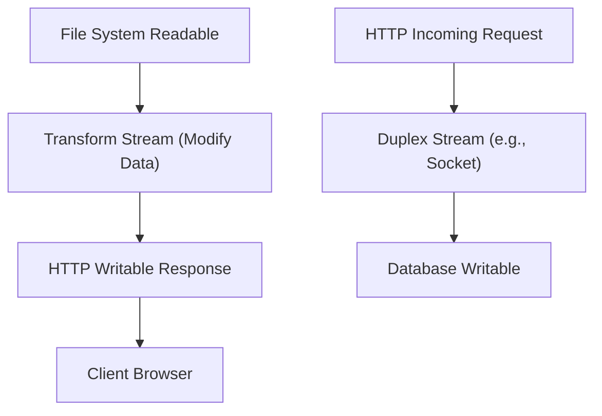

## Streams: Readable, Writable, Duplex, and Transform
### Core Concepts
*   **Streams:** Abstract interfaces for working with streaming data in Node.js. They are instances of `EventEmitter`.
    *   **Purpose:** Efficiently handle large amounts of data or data that arrives in chunks, reducing memory footprint by processing data piece by piece rather than loading it all into memory.
    *   **Backpressure:** A critical mechanism where a slow consumer can signal a fast producer to slow down, preventing memory exhaustion.
*   **Types of Streams:**
    *   **Readable:** Streams from which data can be read (e.g., `fs.createReadStream`, `http.IncomingMessage`, `process.stdin`).
    *   **Writable:** Streams to which data can be written (e.g., `fs.createWriteStream`, `http.ServerResponse`, `process.stdout`).
    *   **Duplex:** Streams that are both `Readable` and `Writable` (e.g., `net.Socket`, `zlib` streams). The readable and writable sides operate independently.
    *   **Transform:** A type of `Duplex` stream where the output is computed based on the input. Data written to the writable side is transformed and then read from the readable side (e.g., `zlib.createGzip`, crypto streams).

### Key Details & Nuances
*   **`pipe()` method:**
    *   Simplifies stream composition: `readable.pipe(writable)`.
    *   **Automatic Backpressure:** Handles flow control automatically by pausing the source `Readable` stream when the destination `Writable` stream's internal buffer is full and resuming it when it drains.
    *   **Error Propagation:** By default, errors in the source stream destroy the destination stream. This can be a pitfall if not handled.
    *   **Event Forwarding:** Forwards `end` and `close` events automatically.
*   **`stream.pipeline()`:**
    *   Recommended for production-grade stream composition, especially when piping multiple streams.
    *   **Robust Error Handling:** Guarantees proper cleanup and destruction of all streams in the pipeline upon error or completion.
    *   **Promise-based:** Returns a `Promise`, allowing for `async/await` usage.
*   **Flowing vs. Paused Mode (Readable Streams):**
    *   **Flowing Mode:** Data is pushed to consumers as quickly as possible. Entered by adding a `data` event listener, calling `resume()`, or piping.
    *   **Paused Mode:** Data must be explicitly requested by calling `read()`. Entered by default or calling `pause()`.
    *   **Best Practice:** Prefer `pipe()` or `pipeline()` as they handle mode switching and backpressure automatically.
*   **Events (Common):**
    *   **Readable:** `data`, `end`, `error`, `close`, `readable`.
    *   **Writable:** `drain`, `finish`, `error`, `close`, `pipe`.
    *   **Duplex/Transform:** All above relevant events.
*   **Object Mode:**
    *   By default, Node.js streams operate on `Buffer` or `string` chunks.
    *   `objectMode: true` allows streams to emit or accept arbitrary JavaScript objects, not just buffers.
    *   **Trade-off:** Higher memory overhead and potentially slower performance due to object allocation/garbage collection compared to binary streams.

### Practical Examples

```typescript
import { createReadStream, createWriteStream } from 'fs';
import { Transform, pipeline } from 'stream';

// 1. Simple file copy with pipe
console.log('--- Simple Pipe Example ---');
const readableStream = createReadStream('input.txt'); // Assume input.txt exists
const writableStream = createWriteStream('output.txt');

readableStream.pipe(writableStream)
  .on('finish', () => console.log('File copy finished successfully (pipe)!'))
  .on('error', (err) => console.error('Pipe Error:', err));

// 2. Custom Transform Stream (e.g., uppercase conversion)
console.log('\n--- Custom Transform Stream Example ---');
class UppercaseTransform extends Transform {
  constructor() {
    super(); // Supports objectMode by default if not specified
  }

  // The _transform method receives a chunk, processes it, and pushes the result.
  _transform(chunk: Buffer, encoding: BufferEncoding, callback: Function) {
    this.push(chunk.toString().toUpperCase()); // Convert chunk to uppercase
    callback(); // Signal that the transformation is complete for this chunk
  }
}

// Using pipeline for robust error handling and cleanup
const sourceStream = createReadStream('input.txt');
const transformStream = new UppercaseTransform();
const destStream = createWriteStream('output_uppercase.txt');

(async () => {
  try {
    await pipeline(sourceStream, transformStream, destStream);
    console.log('Uppercase transformation finished successfully (pipeline)!');
  } catch (err) {
    console.error('Pipeline Error:', err);
  }
})();

// 3. Conceptual Stream Flow
console.log('\n--- Conceptual Stream Flow Diagram ---');
```



### Common Pitfalls & Trade-offs
*   **Not Handling Errors:** Failing to attach error handlers to all streams in a chain (especially with `pipe()`) can lead to unhandled exceptions and resource leaks. `stream.pipeline()` mitigates this by centralizing error handling.
*   **Ignoring Backpressure:** Manually consuming `Readable` streams with `on('data')` without pausing/resuming the source can lead to memory overload if the consumer is slower than the producer. Always prefer `pipe()` or `pipeline()`.
*   **Resource Leaks:** Not properly closing file descriptors, network sockets, etc., if stream operations are interrupted or fail. `stream.pipeline()` helps with automatic cleanup.
*   **Premature Optimization/Over-engineering:** Using streams for very small data amounts (e.g., a few KB) can add unnecessary complexity. Reading the entire data into memory might be simpler and faster for small sizes.
*   **Object Mode Overhead:** While powerful, using `objectMode: true` incurs more overhead due to JavaScript object allocation and garbage collection, potentially impacting performance for high-throughput scenarios compared to `Buffer`-based streams.

### Interview Questions
1.  **Explain backpressure in Node.js streams and how `stream.pipe()` addresses it.**
    *   **Answer:** Backpressure is the mechanism where a consumer signals a producer to slow down if it cannot process data as quickly as it's being produced, preventing buffer overflow and memory exhaustion. `stream.pipe()` automatically handles backpressure: when the destination writable stream's internal buffer fills up, it automatically pauses the source readable stream. Once the writable stream drains (emits a `drain` event), `pipe()` resumes the readable stream.
2.  **When would you choose `stream.pipeline()` over `stream.pipe()`? What are the key advantages of `pipeline`?**
    *   **Answer:** `stream.pipeline()` should be preferred for composing multiple streams in production environments. Its key advantages are:
        *   **Robust Error Handling:** It ensures that all streams in the chain are properly destroyed and resources are cleaned up if any stream encounters an error or finishes. `pipe()`'s default error propagation is less robust and can leave streams hanging.
        *   **Promise-based API:** It returns a Promise, making it easier to use with `async/await` for cleaner asynchronous code and unified error catching.
        *   **Automatic Cleanup:** Guarantees that all streams are closed, preventing resource leaks.
3.  **Describe the difference between 'flowing' and 'paused' modes for Readable streams. When would a stream transition between these modes?**
    *   **Answer:**
        *   **Flowing Mode:** Data is pushed to consumers as soon as it's available. A Readable stream enters flowing mode when an `on('data')` listener is attached, `resume()` is called, or it's piped to a Writable stream.
        *   **Paused Mode:** Data must be explicitly requested by calling the `read()` method. A Readable stream starts in paused mode by default. It transitions back to paused mode if `pause()` is called or if all `data` event listeners are removed.
    *   **Recommendation:** For most applications, piping (`pipe()` or `pipeline()`) is preferred as it manages these modes and backpressure automatically.
4.  **How would you implement a custom Transform stream in Node.js? Provide a high-level explanation of the methods you'd override.**
    *   **Answer:** To implement a custom Transform stream, you extend the `stream.Transform` class. You primarily override the `_transform(chunk, encoding, callback)` method.
        *   `_transform`: This method is called for each chunk of data written to the stream. Inside this method, you process the `chunk` and then call `this.push(transformedChunk)` to send data to the readable side of the stream. Finally, `callback()` must be called to signal that the current chunk has been processed and to request the next one.
        *   You might also override `_flush(callback)` if there's any final data to push after all input has been received (e.g., closing tags for XML).
5.  **What is `objectMode` in streams, and when would you use it? What are its implications?**
    *   **Answer:** By default, Node.js streams handle binary data (Buffers) or strings. `objectMode: true` allows a stream to emit or consume arbitrary JavaScript values/objects instead of just binary data.
    *   **Use Cases:** When you're piping streams of parsed JSON objects, database records, or any non-buffer/string data.
    *   **Implications:**
        *   **Memory Overhead:** Working with JavaScript objects generally consumes more memory than raw buffers due to object structures and garbage collection overhead.
        *   **Performance:** Can be slower than byte streams due to the additional processing needed for object serialization/deserialization and increased GC activity. It's a trade-off between convenience and raw performance.