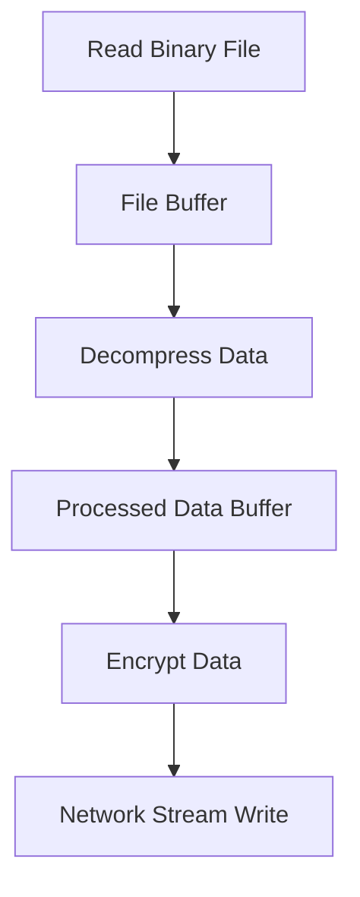

## Buffers for Binary Data Manipulation
### Core Concepts

*   **Definition:** Node.js `Buffer` objects are used to represent raw binary data outside of the V8 JavaScript engine's heap. They are similar to an array of integers, but correspond to raw memory allocations outside of the V8 heap.
*   **Purpose:** Essential for interacting with I/O operations (file system, network streams, cryptography) where data is often in a binary format (e.g., images, audio, network packets, zipped files).
*   **Immutability (conceptual):** Once created, a Buffer's size is fixed. Operations like `slice()` create *new* Buffer instances that share the *same underlying memory* region (but with a new offset and length), not copies, which is a crucial distinction. `copy()` explicitly creates a new memory region.
*   **Relationship to `Uint8Array`:** `Buffer` is a subclass of `Uint8Array` in Node.js, inheriting many of its methods and properties. This means `Buffer` instances can be used wherever a `Uint8Array` is expected, and vice-versa for many operations.

### Key Details & Nuances

*   **Off-Heap Memory:** Buffers allocate a fixed amount of raw memory directly from Node.js's C++ layer (libuv), not from the V8 heap. This makes them highly efficient for binary data manipulation as they avoid V8's garbage collection overhead for the actual data, only the Buffer object itself is garbage collected.
*   **Allocation Methods:**
    *   `Buffer.from(data, [encoding])`: Creates a Buffer from various inputs (strings, arrays, other Buffers).
    *   `Buffer.alloc(size, [fill, encoding])`: Allocates a new Buffer of `size` bytes, *initialized with zeros* or a specified fill value. This is the **safest** method.
    *   `Buffer.allocUnsafe(size)`: Allocates a new Buffer of `size` bytes, but it is **not initialized**. The allocated memory segment may contain old, sensitive data. Use only when you are certain you will overwrite the entire buffer immediately. Faster than `alloc()`.
*   **Encoding & Decoding:** Seamlessly converts between binary data and various string encodings (e.g., `utf8`, `ascii`, `base64`, `hex`).
    *   `buf.toString([encoding], [start], [end])`: Converts Buffer to string.
    *   `Buffer.from(string, encoding)`: Converts string to Buffer.
*   **Slicing and Copying:**
    *   `buf.slice([start], [end])`: Returns a *new Buffer* that references the *same memory* as the original, but with a new start and end offset. Modifying the slice modifies the original buffer's data and vice-versa.
    *   `buf.copy(target, [targetStart], [sourceStart], [sourceEnd])`: Copies data from one Buffer to another. This creates a **distinct copy** in the `target` Buffer's memory.
*   **Concatenation:** `Buffer.concat(list, [totalLength])`: Concatenates a list of Buffer objects into a single new Buffer. Performance-sensitive as it involves creating a new Buffer and copying data.

### Practical Examples

**1. Buffer Creation & Basic Manipulation:**

```typescript
// Create a Buffer from a string using UTF-8 encoding
const buf1 = Buffer.from('Hello, Node.js!', 'utf8');
console.log('buf1 (UTF-8):', buf1.toString()); // Output: Hello, Node.js!

// Create a Buffer from a string using Base64 encoding
const buf2 = Buffer.from('SGVsbG8sIE5vZGUuanMh', 'base64');
console.log('buf2 (Base64 decoded):', buf2.toString('utf8')); // Output: Hello, Node.js!

// Allocate a 10-byte buffer, initialized with zeros
const buf3 = Buffer.alloc(10);
console.log('buf3 (allocated, zero-filled):', buf3); // Output: <Buffer 00 00 00 00 00 00 00 00 00 00>

// Allocate an uninitialized 5-byte buffer (DANGER!)
const buf4 = Buffer.allocUnsafe(5);
console.log('buf4 (allocatedUnsafe, uninitialized):', buf4); // Output: <Buffer xx xx xx xx xx> (random bytes)
buf4.writeUInt8(255, 0); // Always write to uninitialized buffers immediately
console.log('buf4 (after writing):', buf4); // Output: <Buffer ff xx xx xx xx>

// Writing and Reading Bytes
buf3.writeUInt16LE(0xCAFE, 0); // Write a 16-bit unsigned integer (Little Endian) at offset 0
console.log('buf3 (after writing 0xCAFE):', buf3); // Output: <Buffer fe ca 00 00 00 00 00 00 00 00>
console.log('Read 16-bit LE:', buf3.readUInt16LE(0)); // Output: 51966 (0xCAFE)

// Slicing and Copying
const originalBuf = Buffer.from([0x01, 0x02, 0x03, 0x04, 0x05]);
const slicedBuf = originalBuf.slice(1, 4); // Slice from index 1 (inclusive) to 4 (exclusive)
console.log('Original Buffer:', originalBuf); // Output: <Buffer 01 02 03 04 05>
console.log('Sliced Buffer:', slicedBuf);     // Output: <Buffer 02 03 04>
slicedBuf[0] = 0xFF; // Modifying slicedBuf also modifies originalBuf
console.log('Original Buffer after slice modification:', originalBuf); // Output: <Buffer 01 ff 03 04 05>

const copiedBuf = Buffer.alloc(3);
originalBuf.copy(copiedBuf, 0, 1, 4); // Copy from originalBuf[1-4) to copiedBuf[0]
console.log('Copied Buffer:', copiedBuf); // Output: <Buffer ff 03 04>
copiedBuf[0] = 0xAA; // Modifying copiedBuf does NOT modify originalBuf
console.log('Original Buffer after copy modification (unchanged):', originalBuf); // Output: <Buffer 01 ff 03 04 05>
```

**2. Conceptual Data Flow with Buffers:**



### Common Pitfalls & Trade-offs

*   **`Buffer.allocUnsafe()` Misuse:** The biggest pitfall. Using `allocUnsafe()` without immediately overwriting its entire contents can expose sensitive data from previously allocated memory or lead to unpredictable program behavior due to uninitialized bytes. **Always prefer `Buffer.alloc()` unless performance is critically bottlenecked by initialization and you guarantee full overwrite.**
*   **Memory Leaks (Indirect):** While the Buffer object itself is garbage collected, if you `slice()` a small portion from a *very large* Buffer and then only keep the slice reference, the *entire original large buffer's underlying memory* cannot be freed until both the original and all slices are garbage collected. This can lead to unexpected memory retention.
*   **Performance vs. Readability:** Direct byte manipulation using `readUIntN`/`writeUIntN` methods is highly performant but can be less readable than higher-level data structures or libraries for complex binary protocols.
*   **`Buffer.concat()` Performance:** While convenient, `Buffer.concat()` creates a new Buffer and copies all data. For very large or frequent concatenations, especially in streaming scenarios, it can be inefficient. Consider using a utility to manage multiple small buffers more efficiently, or directly writing to a pre-allocated large buffer if the total size is known.

### Interview Questions

1.  **When would you choose to use a Node.js `Buffer` over a standard JavaScript string or `ArrayBuffer`/`TypedArray`?**
    *   **Answer:** You use `Buffer` when dealing with raw binary data directly, particularly in I/O operations like reading/writing files, network communication (TCP/UDP sockets), image manipulation, or cryptography. Unlike JS strings, Buffers efficiently handle arbitrary byte sequences, including those that are not valid Unicode. While `ArrayBuffer`/`TypedArray` are standard JS APIs for binary data, `Buffer` is a Node.js-specific subclass of `Uint8Array` optimized for Node's I/O and offers additional utility methods (e.g., `toString` with various encodings, `copy`, `concat`). It also handles off-heap memory allocation for performance.

2.  **Explain the difference between `Buffer.alloc()` and `Buffer.allocUnsafe()`. When would you use each?**
    *   **Answer:** `Buffer.alloc(size)` allocates a new `Buffer` of `size` bytes and *initializes* all bytes to `0`. This is safe because it prevents exposure of old, potentially sensitive data. `Buffer.allocUnsafe(size)` allocates a new `Buffer` of `size` bytes but *does not initialize* the memory. This means the buffer will contain whatever data was previously in that memory location. You use `Buffer.alloc()` for safety and predictability, which is the default recommendation. You would only use `Buffer.allocUnsafe()` in performance-critical scenarios where you are absolutely certain that you will immediately overwrite *every single byte* of the allocated buffer, making the uninitialized content irrelevant, and profiling shows `alloc()` is a bottleneck.

3.  **How does `buf.slice()` differ from `buf.copy()` in terms of memory usage and mutation effects?**
    *   **Answer:** `buf.slice()` creates a *new Buffer instance* that points to the *same underlying memory* as the original Buffer, but with new `offset` and `length` properties. It does not allocate new memory for the data. Consequently, any modifications to the data in the sliced Buffer will also affect the original Buffer, and vice-versa. `buf.copy()`, on the other hand, copies a specified range of bytes from one Buffer's underlying memory to another Buffer's underlying memory. This operation allocates new memory if the target Buffer wasn't pre-allocated, or overwrites existing memory if it was. Modifications to the copied data do *not* affect the original Buffer. `slice()` is faster as it avoids data copying, but requires careful management of memory retention (the entire original buffer's memory cannot be freed if any slice is still referenced).

4.  **Describe a scenario where `Buffer.concat()` could be a performance bottleneck, and suggest an alternative approach.**
    *   **Answer:** `Buffer.concat()` can become a performance bottleneck when concatenating a large number of small buffers, or repeatedly concatenating in a loop (e.g., in a data streaming scenario where chunks arrive sequentially). Each `concat()` call creates a *new Buffer* and involves copying all data from the source buffers into this new, larger buffer. This leads to redundant memory allocations and data copying, increasing CPU and memory pressure.
    *   **Alternative:** For streaming data, instead of `concat()`, you can pre-allocate a large Buffer if the total expected size is known, and then use `buf.copy()` to write incoming chunks directly into the pre-allocated buffer at calculated offsets. If the total size is unknown, you might collect chunks into an array and only `concat()` once at the very end, or use a more sophisticated streaming library (e.g., Node.js streams) which handles underlying buffer management efficiently.