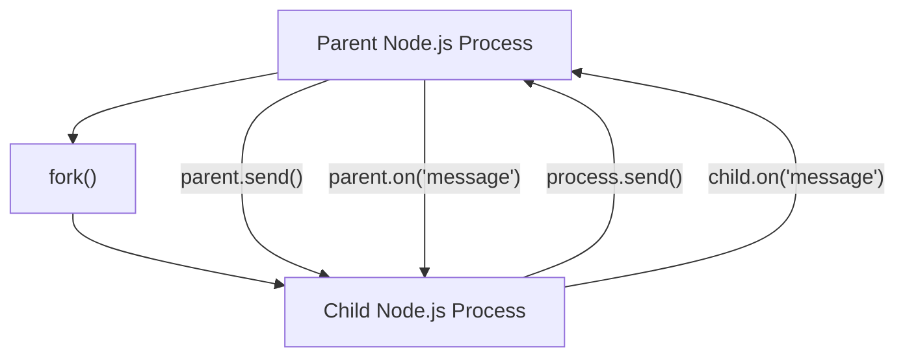

## Child Processes: `spawn`, `exec`, `fork`
### Core Concepts
*   **Child Processes:** Node.js's ability to spawn new processes that run separately from the Node.js event loop. This allows execution of external system commands or other Node.js scripts in separate runtime environments.
*   **Purpose:**
    *   **Offloading CPU-bound tasks:** Prevents blocking the main event loop for heavy computations.
    *   **Executing system commands:** Interacting with the underlying operating system (e.g., `ls`, `git`, custom scripts).
    *   **Utilizing multi-core CPUs:** Though Node.js is single-threaded, child processes can leverage multiple cores.

### Key Details & Nuances
*   **`child_process.spawn(command, [args], [options])`**
    *   **Streams Data:** Returns a `ChildProcess` instance with `stdin`, `stdout`, `stderr` streams. Ideal for commands that produce a large amount of data or are long-running.
    *   **Asynchronous:** Non-blocking.
    *   **No Shell by Default:** Executes the command directly. Safer against shell injection unless `shell: true` option is used.
    *   **Low-level:** Provides fine-grained control over I/O.
*   **`child_process.exec(command, [options], [callback])`**
    *   **Buffers Output:** Buffers `stdout` and `stderr` and passes them to a callback function when the process terminates. Convenient for short commands with limited output.
    *   **Shell Required:** Always spawns a shell (e.g., `/bin/sh` on Unix, `cmd.exe` on Windows) to run the `command`.
    *   **Security Risk:** Prone to shell injection if user input is directly passed into `command`.
    *   **Max Buffer Size:** Has a default `maxBuffer` limit (typically 1MB) for output; exceeding this throws an error.
*   **`child_process.execFile(file, [args], [options], [callback])`**
    *   **Direct Execution:** Similar to `exec`, but executes a specified executable `file` directly without spawning a shell.
    *   **Safer:** Mitigates shell injection risks compared to `exec`.
    *   **Buffers Output:** Also buffers `stdout` and `stderr`.
*   **`child_process.fork(modulePath, [args], [options])`**
    *   **Specialized `spawn`:** Specifically designed to spawn new Node.js processes.
    *   **Inter-Process Communication (IPC):** Establishes an IPC channel (using `process.send()` and `child.on('message')`) between parent and child for sending/receiving messages.
    *   **Node.js Modules Only:** The `modulePath` must be a Node.js module.
*   **Event Handling:** All child processes emit `exit`, `close`, `error` events.
    *   `exit`: Emitted when the child process terminates. Provides `code` (exit code) and `signal` (termination signal).
    *   `close`: Emitted after `exit` and when the `stdio` streams of the child process have been closed.
    *   `error`: Emitted if the process could not be spawned or killed.

### Practical Examples

#### 1. `spawn` for Streaming Output
```typescript
import { spawn } from 'child_process';

const ls = spawn('ls', ['-lh', '/usr']);

ls.stdout.on('data', (data) => {
  console.log(`stdout: ${data}`);
});

ls.stderr.on('data', (data) => {
  console.error(`stderr: ${data}`);
});

ls.on('close', (code) => {
  console.log(`child process exited with code ${code}`);
});

ls.on('error', (err) => {
  console.error('Failed to start child process.', err);
});
```

#### 2. `exec` for Simple Command
```typescript
import { exec } from 'child_process';

exec('find . -type f -name "*.js" | wc -l', (error, stdout, stderr) => {
  if (error) {
    console.error(`exec error: ${error}`);
    return;
  }
  console.log(`Number of JS files: ${stdout.trim()}`);
  if (stderr) {
    console.error(`stderr: ${stderr}`);
  }
});
```

#### 3. `fork` with IPC
**parent.ts**
```typescript
import { fork } from 'child_process';

const child = fork('./child.ts'); // child.ts must be a Node.js module

child.on('message', (message) => {
  console.log(`Parent received message: ${message.data}`);
});

child.send({ data: 'Hello from parent!' });

// Optional: close child after some time
setTimeout(() => {
  child.kill();
}, 2000);
```

**child.ts**
```typescript
// This is a Node.js module, not a regular script.
// It will be executed by Node.js when forked.

process.on('message', (message) => {
  console.log(`Child received message: ${message.data}`);
  // Send a message back to the parent
  process.send({ data: 'Hello from child!' });
});

process.on('exit', (code) => {
  console.log(`Child process exited with code ${code}`);
});
```

#### 4. `fork` IPC Flow


### Common Pitfalls & Trade-offs
*   **`exec` vs. `spawn` Decision:**
    *   **Use `spawn`** for commands that produce continuous or large outputs, or for long-running processes (e.g., streaming logs, running a server).
    *   **Use `exec` or `execFile`** for commands that produce small, finite outputs and are short-lived (e.g., `ls`, `git status`). `execFile` is generally safer.
*   **Security (Shell Injection):** Directly passing user-supplied input to `exec` or `spawn` with `shell: true` can lead to shell injection vulnerabilities. Always prefer `execFile` or `spawn` without `shell: true`, passing arguments in an array.
*   **Resource Management:** Child processes consume system resources (memory, CPU). Spawning too many can degrade performance or crash the system. Implement limits and proper error handling.
*   **Blocking vs. Non-blocking:** Node.js child processes are asynchronous by nature and do not block the event loop while waiting for the child process to complete. However, synchronous versions (`spawnSync`, `execSync`, etc.) *do* block the event loop and should be used with extreme caution (e.g., during startup scripts).
*   **Max Buffer Exceeded:** `exec` and `execFile` can fail if the child process outputs more data than the configured `maxBuffer` size. If this is a risk, switch to `spawn` and stream the output.
*   **Zombie Processes:** If child processes are not properly handled (e.g., parent exits before child, or child doesn't exit correctly), they can become "zombie" processes, consuming system resources without doing useful work. Ensure child processes exit cleanly or are killed by the parent.

### Interview Questions

1.  **Differentiate between `spawn`, `exec`, `fork`, and `execFile` in Node.js, highlighting their primary use cases and key differences.**
    *   **Answer:** `spawn` streams I/O, best for long-running processes or large data. `exec` buffers all output and runs commands in a shell, convenient for simple commands but less secure. `execFile` is like `exec` but executes directly without a shell, making it safer. `fork` is a specialized `spawn` for Node.js modules, enabling built-in IPC for communication between parent and child Node.js processes.

2.  **When would you choose `spawn` over `exec` (or vice versa), and what are the potential pitfalls of making the wrong choice?**
    *   **Answer:** Choose `spawn` for streaming large amounts of data, long-running processes, or when fine-grained control over I/O is needed. Choose `exec` for simple, short-lived commands where the entire output is needed at once and fits within a buffer. The wrong choice can lead to: `exec` running out of `maxBuffer` memory; `spawn` requiring more manual handling of data chunks; and `exec` introducing security vulnerabilities due to shell execution.

3.  **Explain how `fork` enables inter-process communication (IPC) and why it's a critical feature for building scalable Node.js applications.**
    *   **Answer:** `fork` establishes a dedicated IPC channel between the parent and child Node.js processes. The parent uses `child.send(message)` and listens with `child.on('message')`. The child uses `process.send(message)` and listens with `process.on('message')`. This allows processes to exchange structured data (like JSON) without relying on shared memory or disk. It's critical for scalability because it allows offloading CPU-intensive tasks to separate worker processes, preventing the main event loop from blocking and fully utilizing multi-core CPUs.

4.  **What are the main security considerations when using Node.js child processes, especially with user-supplied input? How do you mitigate these risks?**
    *   **Answer:** The primary risk is shell injection, particularly with `exec` or `spawn` when `shell: true` is enabled and user input is directly concatenated into the command string. Malicious input could execute arbitrary shell commands. Mitigation strategies include: always preferring `execFile` or `spawn` with arguments passed as a separate array (`['arg1', 'arg2']`) instead of a single command string; never using `shell: true` with untrusted input; and sanitizing or validating any user-supplied input before using it in child process commands.

5.  **How do Node.js child processes interact with the Node.js event loop? Are they blocking or non-blocking?**
    *   **Answer:** Standard Node.js child process functions (`spawn`, `exec`, `fork`, `execFile`) are fundamentally **non-blocking** (asynchronous). They launch the child process and immediately return control to the Node.js event loop. Node.js then listens for events (like `data` on streams, `close`, `exit`) from the child process in the background. Only the synchronous versions (e.g., `spawnSync`, `execSync`) are blocking, and these should be used very sparingly as they halt the entire event loop until the child process completes.