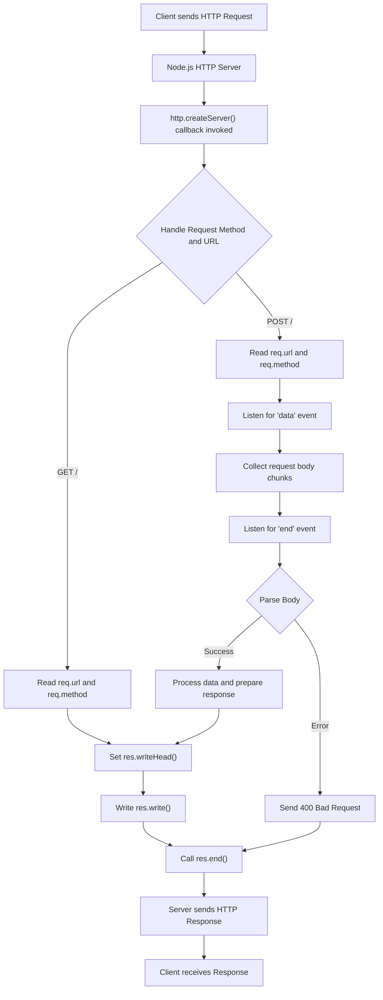

## Building an HTTP Server without Frameworks
### Core Concepts
*   **Event-Driven Architecture**: Node.js `http` module is built upon an event emitter pattern. The server emits a `request` event for each incoming HTTP request, which your handler function processes.
*   **Request/Response Objects**: For every HTTP request, Node.js provides:
    *   `IncomingMessage` (often named `req` or `request`): A readable stream representing the incoming request, containing headers, URL, method, and body.
    *   `ServerResponse` (often named `res` or `response`): A writable stream for sending the HTTP response back to the client, allowing control over status codes, headers, and response body.
*   **Non-Blocking I/O**: Node.js excels at I/O-bound tasks due to its asynchronous, non-blocking nature, making it efficient for handling many concurrent connections.

### Key Details & Nuances
*   **Creating a Server**:
    *   Use `http.createServer([requestListener])`. The `requestListener` is a function `(req, res) => {}` that's invoked for every incoming request.
    *   Call `server.listen(port, [hostname], [callback])` to start the server and bind it to a port.
*   **Request Object (`req`)**:
    *   **`req.method`**: HTTP method (e.g., 'GET', 'POST', 'PUT', 'DELETE').
    *   **`req.url`**: Request URL path, including query string (e.g., `/users?id=123`).
    *   **`req.headers`**: An object containing all request headers.
    *   **Body Handling**: For methods like POST or PUT, the request body arrives as a stream. You must listen for `data` and `end` events on `req` to collect the body chunks.
        ```typescript
        let body = '';
        req.on('data', chunk => {
            body += chunk.toString(); // Collect chunks
        });
        req.on('end', () => {
            // Body is fully received here
            // Parse body if JSON, form data, etc.
        });
        ```
*   **Response Object (`res`)**:
    *   **`res.writeHead(statusCode, [statusMessage], [headers])`**: Sets the HTTP status code and response headers. Must be called before `res.end()` or `res.write()`.
    *   **`res.setHeader(name, value)`**: Sets a single header.
    *   **`res.statusCode`**: Property to set the status code.
    *   **`res.write(chunk)`**: Writes a chunk of the response body. Can be called multiple times.
    *   **`res.end([data], [encoding], [callback])`**: Signals the server that all response headers and body have been sent. Must be called once per request. If `data` is provided, it's treated as the last chunk.
*   **Content-Type**: Crucial for the client to interpret the response body correctly (e.g., `application/json`, `text/html`, `text/plain`). Set via `res.setHeader('Content-Type', '...')` or `res.writeHead()`.
*   **Error Handling**:
    *   Server-level errors (e.g., port in use) are caught by `server.on('error', err => {})`.
    *   Request stream errors can be handled with `req.on('error', err => {})`.
    *   Uncaught exceptions in the request handler will crash the process unless a global `process.on('uncaughtException')` handler is present (though this is often discouraged for recovery).
*   **Routing**: Without a framework, routing is manual, typically using `if/else if` statements or a `switch` statement based on `req.url` and `req.method`.

### Practical Examples

**1. Basic HTTP Server with Request Body Handling:**

```typescript
import * as http from 'http';

const server = http.createServer((req, res) => {
    // Set CORS headers for all responses (important for client-side apps)
    res.setHeader('Access-Control-Allow-Origin', '*');
    res.setHeader('Access-Control-Allow-Methods', 'GET, POST, OPTIONS, PUT, DELETE');
    res.setHeader('Access-Control-Allow-Headers', 'Content-Type, Authorization');

    if (req.method === 'OPTIONS') {
        // Pre-flight request for CORS
        res.writeHead(204); // No Content
        res.end();
        return;
    }

    if (req.url === '/') {
        if (req.method === 'GET') {
            res.writeHead(200, { 'Content-Type': 'text/plain' });
            res.end('Hello from barebones Node.js server!');
        } else if (req.method === 'POST') {
            let body = '';
            req.on('data', chunk => {
                body += chunk.toString();
            });
            req.on('end', () => {
                try {
                    const data = JSON.parse(body);
                    res.writeHead(200, { 'Content-Type': 'application/json' });
                    res.end(JSON.stringify({ message: 'Received POST data', data }));
                } catch (error) {
                    res.writeHead(400, { 'Content-Type': 'text/plain' });
                    res.end('Invalid JSON in request body.');
                }
            });
            req.on('error', err => {
                console.error('Request stream error:', err);
                res.writeHead(500, { 'Content-Type': 'text/plain' });
                res.end('Internal Server Error processing request body.');
            });
        } else {
            res.writeHead(405, { 'Content-Type': 'text/plain' }); // Method Not Allowed
            res.end('Method Not Allowed');
        }
    } else if (req.url === '/health') {
        if (req.method === 'GET') {
            res.writeHead(200, { 'Content-Type': 'application/json' });
            res.end(JSON.stringify({ status: 'ok', uptime: process.uptime() }));
        } else {
            res.writeHead(405, { 'Content-Type': 'text/plain' });
            res.end('Method Not Allowed');
        }
    } else {
        res.writeHead(404, { 'Content-Type': 'text/plain' }); // Not Found
        res.end('404 Not Found');
    }
});

const PORT = 3000;
server.listen(PORT, () => {
    console.log(`Server listening on port ${PORT}`);
});

// Example of server-level error handling
server.on('error', (err: NodeJS.ErrnoException) => {
    if (err.code === 'EADDRINUSE') {
        console.error(`Port ${PORT} is already in use.`);
    } else {
        console.error('Server error:', err);
    }
    process.exit(1);
});
```

**2. HTTP Request/Response Flow:**



### Common Pitfalls & Trade-offs
*   **Manual Routing & Middleware**: Becomes cumbersome quickly for complex applications. Frameworks (Express, Koa) abstract this with robust routing and middleware systems.
*   **Error Handling Complexity**: Proper error handling (especially for streams, parsing, and business logic) requires significant boilerplate code.
*   **Security Vulnerabilities**: Without a framework, you're responsible for implementing common security practices like protection against CSRF, XSS, rate limiting, input validation, and secure header settings (e.g., HSTS).
*   **Performance Optimization**: While barebones is fast, optimizing for large-scale production (e.g., caching, compression, robust logging) requires manual implementation or integration of libraries.
*   **Scalability**: A single Node.js process uses one CPU core. For multi-core machines, you need to implement clustering (using Node's `cluster` module or tools like PM2) to fully utilize resources.
*   **Lack of Abstraction**: Direct `http` module usage means more verbose code for common tasks (parsing JSON, handling cookies, sessions, authentication).
*   **Trade-off**: High control and minimal overhead vs. increased development time, complexity, and maintenance burden.

### Interview Questions

1.  **Why would you choose to build an HTTP server directly with Node.js's `http` module instead of a framework like Express? What are the primary trade-offs?**
    *   **Answer**: You'd choose it for maximum control, minimal overhead, and learning purposes or for highly specialized, lightweight services where every byte and millisecond counts (e.g., a simple proxy, a very specific API gateway, or a low-level network utility). The primary trade-offs are significantly increased development time, more verbose boilerplate code for common tasks (routing, middleware, error handling, parsing), a higher risk of security oversights, and the need to manually implement features that frameworks provide out-of-the-box.

2.  **Explain the streaming nature of `IncomingMessage` (`req`) and `ServerResponse` (`res`). How do you handle a large POST request body, and what are potential issues?**
    *   **Answer**: Both `req` and `res` are Node.js streams. `req` is a Readable stream, emitting `data` events (chunks of the request body) and an `end` event when the entire body has been received. `res` is a Writable stream, where you `write` response data and then `end` the response. To handle a large POST body, you listen for `data` events, append chunks to a buffer (e.g., a string or array of buffers), and process the complete body when the `end` event fires. Potential issues include:
        *   **Memory Exhaustion**: Collecting an extremely large body entirely in memory (`body += chunk`) can lead to out-of-memory errors.
        *   **Timeouts**: Slow clients sending large bodies can cause connection timeouts.
        *   **Denial of Service (DoS)**: Malicious clients sending huge bodies can overwhelm the server.
        *   **Error Handling**: Neglecting `req.on('error')` can lead to unhandled exceptions if the client disconnects prematurely or sends invalid data.

3.  **How would you implement basic routing (e.g., `/users`, `/products`) and different HTTP methods (GET, POST) using the `http` module? Provide a conceptual example.**
    *   **Answer**: Basic routing is implemented by inspecting `req.url` and `req.method` within the `http.createServer` callback. You'd use `if/else if` statements or a `switch` statement to match paths and methods.
        ```typescript
        // Conceptual Example:
        if (req.url === '/users') {
            if (req.method === 'GET') {
                // Fetch users logic
                res.writeHead(200, { 'Content-Type': 'application/json' });
                res.end(JSON.stringify([{ id: 1, name: 'Alice' }]));
            } else if (req.method === 'POST') {
                // Create user logic (read body stream)
                res.writeHead(201, { 'Content-Type': 'text/plain' });
                res.end('User created');
            } else {
                res.writeHead(405); res.end('Method Not Allowed');
            }
        } else if (req.url === '/products' && req.method === 'GET') {
            // Fetch products logic
            res.writeHead(200, { 'Content-Type': 'text/plain' });
            res.end('Products list');
        } else {
            res.writeHead(404); res.end('Not Found');
        }
        ```

4.  **What are some common security concerns and performance considerations when building a barebones Node.js HTTP server without frameworks?**
    *   **Answer**:
        *   **Security Concerns**: Lack of built-in protections against CSRF, XSS (if returning unfiltered user input), SQL injection (if interacting with databases without ORMs/validation), inadequate input validation, missing secure HTTP headers (e.g., HSTS, Content Security Policy), and unhandled errors leaking sensitive information. Implementing all these manually is complex and error-prone.
        *   **Performance Considerations**: Manual implementation of caching, compression (e.g., Gzip), connection pooling (for databases), and efficient streaming of large files. For true scalability, process management (e.g., Node's `cluster` module or PM2) is needed to utilize multi-core CPUs, as a single Node.js process is single-threaded.

5.  **How do you ensure the server continues to run after an unhandled error or crash in a production environment when using the `http` module?**
    *   **Answer**: The `http` module itself doesn't provide process resilience. You need an external process manager to monitor and restart the Node.js application. Common solutions include:
        *   **PM2**: A production process manager for Node.js applications with a built-in load balancer, zero-downtime reloads, and automatic restarts.
        *   **`forever`**: A simpler CLI tool to ensure a given script runs continuously.
        *   **Systemd/Init Systems**: Configuring the operating system's init system (like `systemd` on Linux) to run the Node.js application as a service and restart it on failure.
        *   **Docker/Kubernetes**: Container orchestration platforms are designed for high availability and automatically restart failed containers.
    *   Additionally, implementing robust error handling within the application (e.g., `try-catch` blocks, `process.on('uncaughtException')`, `process.on('unhandledRejection')` for last-resort logging/graceful shutdown) is crucial, though `uncaughtException` should ideally be used for logging and graceful shutdown rather than recovery.