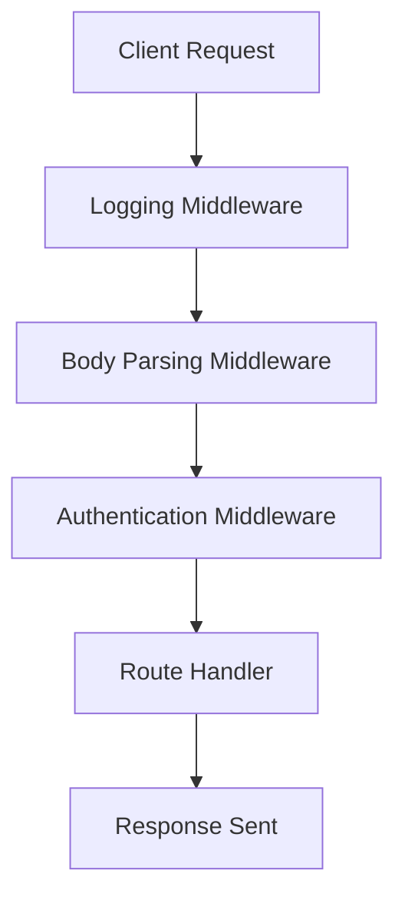

## Middleware Pattern Implementation
### Core Concepts

*   **Definition:** Middleware in Node.js (especially within frameworks like Express.js, Koa.js) refers to functions that have access to the request (`req`), response (`res`) objects, and the `next` function in the application’s request-response cycle.
*   **Purpose:** To intercept, modify, and process requests and responses. They can execute code, make changes to the request/response objects, end the request-response cycle, or call the next middleware in the stack.
*   **Chain of Responsibility:** Middleware functions are executed sequentially in the order they are defined. Each middleware typically performs a specific task and then passes control to the next function in the stack by calling `next()`.

### Key Details & Nuances

*   **`req`, `res`, `next` Arguments:**
    *   `req`: The request object, containing details about the HTTP request (headers, body, query params, etc.).
    *   `res`: The response object, used to send a response back to the client (status, headers, body).
    *   `next`: A function that, when called, invokes the next middleware function in the stack. Crucial for flow control; omitting `next()` will halt the request processing at that middleware.
*   **Error Handling Middleware:**
    *   Unlike regular middleware, error handling middleware functions have four arguments: `(err, req, res, next)`.
    *   They are invoked when `next(err)` is called from any preceding middleware or route handler.
    *   These must be defined *after* all other `app.use()` and route definitions to catch errors properly.
*   **Types of Middleware:**
    *   **Application-level:** Applied to all routes using `app.use()`.
    *   **Router-level:** Applied to specific routes or groups of routes using `router.use()` or as arguments to route handlers (`app.get('/', middleware1, middleware2, handler)`).
    *   **Built-in (e.g., Express):** `express.static`, `express.json`, `express.urlencoded`.
    *   **Third-party (e.g., npm):** `cors`, `helmet`, `morgan`, `body-parser`.
*   **Execution Flow:** Middleware functions execute in the order they are declared. If a middleware doesn't call `next()`, the request processing stops, and no subsequent middleware or route handlers are executed (unless `res.send()` or `res.end()` is called within that middleware).

### Practical Examples

**1. Request Processing Flow (Mermaid Diagram)**



**2. Express.js Middleware Implementation**

```javascript
// app.js
const express = require('express');
const app = express();
const PORT = 3000;

// 1. Logging Middleware (Custom - Application Level)
const requestLogger = (req, res, next) => {
    console.log(`[${new Date().toISOString()}] ${req.method} ${req.url}`);
    next(); // Pass control to the next middleware
};

// 2. Built-in Middleware for JSON body parsing
app.use(express.json());

// 3. Custom Authentication Middleware (Application Level)
const authenticateUser = (req, res, next) => {
    const apiKey = req.headers['x-api-key'];
    if (apiKey === 'SUPER_SECRET_KEY') {
        req.user = { id: 'user123', name: 'Authorized User' }; // Attach user info to req
        next();
    } else {
        res.status(401).json({ message: 'Unauthorized: Invalid API Key' });
        // No next() here, as we are ending the request
    }
};

// Apply global middleware
app.use(requestLogger);
app.use(authenticateUser);

// 4. Route Handler
app.get('/api/data', (req, res) => {
    // This route will only be reached if requestLogger and authenticateUser call next()
    res.status(200).json({
        message: 'Data fetched successfully!',
        data: { value: 42, requestedBy: req.user.name }
    });
});

// 5. Error Handling Middleware (must be defined last)
app.use((err, req, res, next) => {
    console.error(err.stack); // Log the error stack for debugging
    res.status(500).json({ message: 'Something went wrong on the server.' });
});

app.listen(PORT, () => {
    console.log(`Server running on http://localhost:${PORT}`);
});

// To Test (using curl):
// Successful:
// curl -v -H "X-API-KEY: SUPER_SECRET_KEY" http://localhost:3000/api/data

// Unauthorized:
// curl -v http://localhost:3000/api/data

// Example of triggering an error (add this route and test):
// app.get('/api/error', (req, res, next) => {
//     const error = new Error('Intentional error for testing');
//     next(error); // Pass error to the error handling middleware
// });
// curl -v -H "X-API-KEY: SUPER_SECRET_KEY" http://localhost:3000/api/error
```

### Common Pitfalls & Trade-offs

*   **Forgetting `next()`:** A common mistake that causes requests to hang indefinitely, as control is never passed to subsequent middleware or the route handler.
*   **Incorrect Order:** Middleware order matters. Authentication middleware must typically come before routes that require authentication. Error handling middleware must come last.
*   **Blocking Operations:** Avoid CPU-bound or long-running synchronous operations within middleware, as Node.js is single-threaded. This will block the event loop and prevent other requests from being processed. Use asynchronous operations and promises.
*   **Over-Globalizing Middleware:** Applying too many middleware functions globally (`app.use()`) can add unnecessary overhead to every request, even those that don't need certain processing (e.g., authentication for public routes). Use router-level or route-specific middleware where appropriate.
*   **Performance:** While modular and flexible, an excessive number of middleware functions can slightly increase overhead per request due to function calls and context switching. Generally not a major concern unless extremely high throughput is required with complex middleware chains.

### Interview Questions

1.  **What is the middleware pattern in Node.js, and why is it considered fundamental in frameworks like Express.js?**
    *   **Answer:** It's a design pattern where functions intercept and process requests sequentially before they reach a final route handler. It's fundamental because it allows for modular, reusable, and chainable logic (e.g., logging, authentication, data parsing, validation) to be applied to specific or all routes, keeping route handlers focused on business logic.

2.  **Explain the role of `req`, `res`, and especially `next` in a middleware function. What happens if `next()` is not called?**
    *   **Answer:** `req` (request) and `res` (response) objects provide access to incoming request data and outgoing response functionality. `next` is a callback function that passes control to the next middleware in the stack. If `next()` is not called, the request processing stops at that middleware, and no further middleware or route handlers will execute, often leading to a hanging request unless `res.send()` or similar is explicitly called.

3.  **How do you implement error handling using middleware in an Express.js application, and what is its specific signature?**
    *   **Answer:** Error handling is done via a special middleware function that takes four arguments: `(err, req, res, next)`. It must be defined after all other `app.use()` and route handlers. When `next(error)` is called from any route or middleware, Express skips to this error-handling middleware, allowing centralized error processing, logging, and sending appropriate error responses.

4.  **Describe a practical scenario where using middleware significantly simplifies your application logic compared to embedding the logic directly in route handlers.**
    *   **Answer:** Consider a scenario requiring user authentication, input validation, and logging for multiple API endpoints. Without middleware, you'd repeat these checks in every route handler. With middleware, you can implement separate `authenticateUser`, `validateInput`, and `requestLogger` middleware functions and apply them to relevant routes. This centralizes concerns, improves reusability, reduces code duplication, and keeps route handlers clean and focused on their specific business logic.

5.  **What are some potential performance considerations or anti-patterns to be aware of when extensively using middleware in a production Node.js application?**
    *   **Answer:**
        *   **Blocking Operations:** Synchronous, CPU-intensive tasks in middleware block the event loop, impacting overall server responsiveness. Asynchronous operations are preferred.
        *   **Excessive Global Middleware:** Applying unnecessary middleware globally can add overhead to every request, even those that don't need its functionality. Be selective and use router-level or route-specific middleware.
        *   **Memory Leaks:** Improperly managed resources or closures in complex middleware chains can lead to memory leaks, especially if not handled correctly for long-lived applications.
        *   **Over-Chaining:** While flexible, an extremely long chain of many small middleware functions can incur a slight performance cost due to function call overhead. Optimize by combining very simple, related tasks into a single middleware where appropriate, without sacrificing modularity.