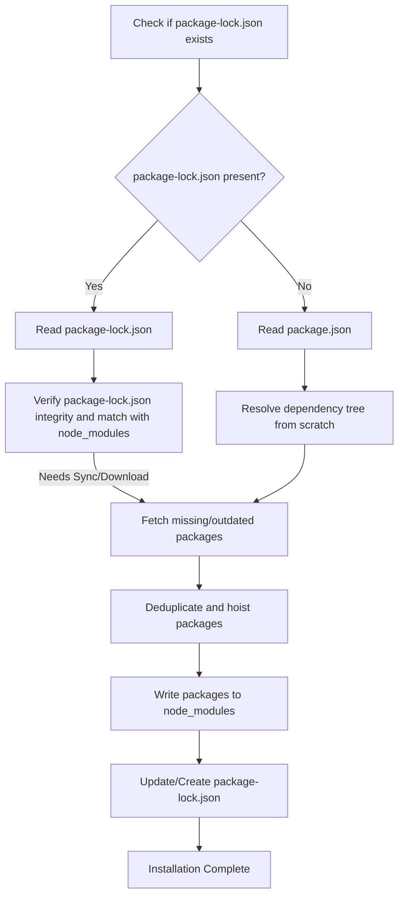

## Package Management & `npm` Internals
### Core Concepts
*   **Package Manager:** `npm` (Node Package Manager) is the default package manager for Node.js. It facilitates sharing, reusing, and managing JavaScript code modules (packages).
*   **Registry:** `npm` interacts with a public or private registry (e.g., `registry.npmjs.org`) to fetch and publish packages.
*   **`package.json`:** The manifest file for a Node.js project. It describes the project, its metadata, dependencies, scripts, and configuration. Essential for `npm` to understand and manage a project.
*   **`node_modules/`:** The directory where `npm` installs project dependencies. Each package is typically a sub-directory within `node_modules/` or a nested `node_modules/` within another package's directory.

### Key Details & Nuances
*   **Semantic Versioning (SemVer):** `npm` adheres to SemVer (`MAJOR.MINOR.PATCH`).
    *   `^` (Caret): Installs the latest minor or patch release (e.g., `^1.2.3` allows `1.2.4`, `1.3.0`, but not `2.0.0`). **Recommended for most dependencies.**
    *   `~` (Tilde): Installs the latest patch release (e.g., `~1.2.3` allows `1.2.4`, but not `1.3.0`).
    *   `*` (Asterisk): Allows any version. **Avoid for production dependencies.**
    *   Exact version: `1.2.3` allows only that specific version.
*   **`package-lock.json`:** Automatically generated by `npm` (v5+).
    *   **Purpose:** Locks down the exact, full dependency tree, including transitive dependencies, at the time of installation.
    *   **Determinism:** Ensures consistent, reproducible builds across different environments and `npm` versions. When `npm install` is run, it prioritizes `package-lock.json` over `package.json` for dependency versions.
    *   **Includes:** Resolved versions, integrity hashes (SRI - Subresource Integrity), and the exact location of each package in `node_modules`.
    *   **Version Control:** **Should always be committed** to version control systems (e.g., Git).
*   **Dependency Types in `package.json`:**
    *   `dependencies`: Required for the application to run in production. (e.g., Express, React).
    *   `devDependencies`: Required only for development and testing. (e.g., Jest, Webpack, ESLint).
    *   `peerDependencies`: Specifies versions of dependencies that a *consumer* of your package must install themselves. Ensures compatibility when multiple packages rely on the same dependency (e.g., a React component library and React itself).
    *   `optionalDependencies`: Dependencies that are optional and will not cause `npm install` to fail if they cannot be found or installed.
*   **`npm install` Lifecycle:**
    1.  **Read `package.json` & `package-lock.json`:** Determines required packages and their exact versions.
    2.  **Resolve & Fetch:** Resolves dependency tree, fetches missing packages from the registry.
    3.  **Deduplicate/Hoist:** `npm` attempts to flatten the dependency tree by "hoisting" common dependencies to the top-level `node_modules` directory to reduce duplication and `node_modules` size. If versions conflict, duplicates are nested.
    4.  **Link/Write:** Writes packages to `node_modules` and updates `package-lock.json`.
*   **`npm scripts`:** Define custom commands in `package.json` under the `"scripts"` field.
    *   Example: `"start": "node dist/index.js"`, `"test": "jest"`. Executed via `npm run <script-name>`. `pre` and `post` hooks are automatically run (e.g., `pretest`, `posttest`).
*   **`npm link`:** Creates a symbolic link between a local package and another project, enabling local development and testing of a package without publishing it to a registry.

### Practical Examples

**Example `package.json` structure:**

```json
{
  "name": "my-node-app",
  "version": "1.0.0",
  "description": "A sample Node.js application",
  "main": "src/index.js",
  "scripts": {
    "start": "node src/index.js",
    "dev": "nodemon src/index.js",
    "test": "jest",
    "lint": "eslint src/",
    "prepublishOnly": "npm run build"
  },
  "keywords": ["node", "express"],
  "author": "Your Name",
  "license": "MIT",
  "dependencies": {
    "express": "^4.17.1",
    "lodash": "~4.17.21"
  },
  "devDependencies": {
    "jest": "^27.5.1",
    "eslint": "^8.12.0",
    "nodemon": "^2.0.15"
  },
  "engines": {
    "node": ">=16.0.0",
    "npm": ">=8.0.0"
  },
  "repository": {
    "type": "git",
    "url": "https://github.com/your/repo.git"
  }
}
```

**`npm install` Simplified Flow:**



### Common Pitfalls & Trade-offs
*   **`package-lock.json` Merge Conflicts:** Can occur in team environments if multiple developers add/update dependencies concurrently. Resolve by running `npm install` after pulling latest changes, then committing the updated `package-lock.json`.
*   **`node_modules` Size (Dependency Bloat):** Large `node_modules` directories can consume significant disk space and impact build/CI times.
    *   **Trade-off:** Ease of use vs. disk space/build time. Tools like `pnpm` address this by using a content-addressable store.
*   **Dependency Hell:** Conflicts between transitive dependencies or conflicting peer dependency requirements can lead to complex resolution issues.
*   **Security Vulnerabilities:** Outdated or malicious packages can introduce security risks. Regularly use `npm audit` or `npm audit fix`.
*   **`npm` vs. `Yarn` vs. `pnpm`:**
    *   **`npm`:** Default, widely adopted.
    *   **`Yarn`:** Historically faster with better lockfile handling (though `npm` has caught up).
    *   **`pnpm`:** Solves the "phantom dependencies" and "doppelganger" issues, creating a truly flat `node_modules` by hard-linking files from a global content-addressable store, significantly reducing disk space.
    *   **Trade-off:** Tooling preference, performance characteristics, and unique features (e.g., `pnpm`'s strictness and disk space efficiency).

### Interview Questions
1.  **What is the primary difference between `dependencies` and `devDependencies` in `package.json`, and why is this distinction important?**
    *   **Answer:** `dependencies` are packages required for the application to run in a production environment (e.g., framework, database driver). `devDependencies` are only needed for development and testing (e.g., testing frameworks, build tools, linters). This distinction is crucial for optimizing production builds (only installing necessary packages with `npm install --production`) and clearly communicating project needs.

2.  **Explain the purpose of `package-lock.json`. Why is it critical to commit this file to version control?**
    *   **Answer:** `package-lock.json` locks down the exact version and full dependency tree (including transitive dependencies) used during `npm install`. It ensures deterministic and reproducible builds across different environments and `npm` versions. Committing it to version control guarantees that all developers and CI/CD systems use the identical dependency resolution, preventing "works on my machine" issues caused by differing dependency versions.

3.  **Describe how `npm` resolves and installs dependencies, specifically mentioning "hoisting" and how it impacts the `node_modules` structure.**
    *   **Answer:** `npm` resolves the full dependency graph by traversing `package.json` and its dependencies recursively. It attempts to "hoist" (deduplicate) packages by installing them at the highest possible level in the `node_modules` directory, typically the root. If multiple packages require the same dependency but with compatible versions, only one copy is installed at the root. If versions conflict or are incompatible, `npm` will install duplicate copies of the conflicting dependency nested within the `node_modules` of the requiring package. This strategy aims to reduce disk space and improve lookup performance.

4.  **How would you handle developing and testing a local Node.js package (e.g., a shared utility library) within another project before publishing it to a registry?**
    *   **Answer:** I would use `npm link`. First, navigate to the local package's directory and run `npm link`. This creates a global symlink for the package. Then, in the project that consumes this package, run `npm link <package-name>`. This creates a symlink from the project's `node_modules` to the global symlink, effectively linking the local package. This allows changes in the local package to be immediately reflected in the consuming project without repeated `npm install` or publishing.

5.  **What are some common security considerations when working with `npm` packages, and how can you mitigate them?**
    *   **Answer:** Common security concerns include using outdated packages with known vulnerabilities, relying on malicious packages (typosquatting, supply chain attacks), or packages with overly broad permissions. Mitigation strategies include:
        *   Regularly running `npm audit` (or `npm audit fix`) to identify and fix known vulnerabilities.
        *   Keeping dependencies updated.
        *   Being cautious about installing packages from unknown or untrusted sources.
        *   Using tools that scan for malicious code or maintain package trust scores.
        *   For critical applications, considering private registries or dependency vetting processes.