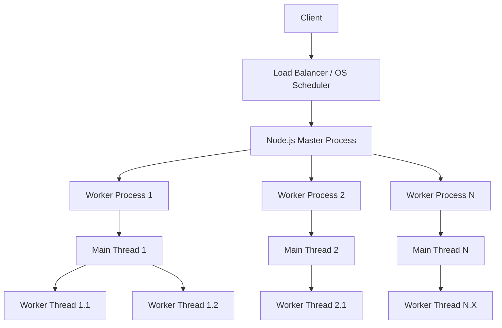

## Concurrency Models: Worker Threads vs. Clustering
### Core Concepts
*   **Node.js Single-Threaded Nature**: Node.js inherently operates on a single event loop, meaning JavaScript execution is single-threaded. This is highly efficient for I/O-bound operations due to its non-blocking asynchronous model.
*   **The Problem**: CPU-intensive (CPU-bound) tasks (e.g., complex calculations, image processing, heavy data transformations) executed on the main thread will block the event loop, causing the application to become unresponsive for all other incoming requests.
*   **Concurrency Models for Node.js**:
    *   **Clustering**: Leverages the `cluster` module to create multiple Node.js *processes* (worker processes) that share the same server port. This is a form of horizontal scaling within a single machine, distributing incoming requests across different processes.
    *   **Worker Threads**: Introduced in Node.js 10.5.0, the `worker_threads` module allows creating actual OS-level *threads* within a single Node.js process. These threads can run isolated JavaScript code and are designed specifically for performing CPU-intensive computations without blocking the main event loop.

### Key Details & Nuances
*   **Clustering (`cluster` module)**
    *   **Architecture**: A master process manages worker processes. The master typically forks new workers and can distribute incoming connections (either round-robin or OS-managed).
    *   **Isolation**: Each worker process has its own isolated V8 instance, event loop, and memory space. This offers high fault tolerance; if one worker crashes, others remain unaffected.
    *   **Communication**: Inter-Process Communication (IPC) is achieved via `process.send()` and `process.on('message')` or by sharing file descriptors. It's generally slower than inter-thread communication due to serialization/deserialization overhead.
    *   **Best for**: **I/O-bound applications** that need to scale across multiple CPU cores on a single machine (e.g., web servers, APIs).
    *   **Drawbacks**: Higher memory consumption (each process has its own V8 instance), IPC overhead, managing shared state across processes is complex.
*   **Worker Threads (`worker_threads` module)**
    *   **Architecture**: A main thread spawns worker threads. Each worker thread has its own V8 isolate and event loop, but they exist within the *same Node.js process*.
    *   **Isolation**: Threads are more tightly coupled than processes. While they have separate V8 isolates, they can share memory via `SharedArrayBuffer` for efficient data transfer, reducing data cloning overhead.
    *   **Communication**: Communication is primarily via `parentPort.postMessage()` and `worker.postMessage()`. Data passed is copied by default (structured cloning algorithm), or shared via `SharedArrayBuffer`.
    *   **Best for**: **CPU-bound tasks** that would otherwise block the main event loop (e.g., cryptographic operations, data compression, heavy calculations).
    *   **Drawbacks**: Resource overhead of thread creation, increased complexity due to shared memory management (if `SharedArrayBuffer` is used), not suitable for I/O-bound scaling.
*   **Choosing Between Them**:
    *   **Clustering**: Use when you need to distribute incoming network requests across multiple CPU cores to handle more concurrent *I/O-bound* operations or for high availability/fault tolerance at the process level.
    *   **Worker Threads**: Use when you have specific, computationally intensive tasks that would otherwise block the main event loop, allowing the main thread to remain responsive for *I/O-bound* operations.

### Practical Examples

**1. Architectural Overview (Mermaid Diagram)**



**2. Clustering Example (HTTP Server)**

```typescript
// app.ts
import cluster from 'cluster';
import http from 'http';
import os from 'os';

const numCPUs = os.cpus().length;

if (cluster.isMaster) {
  console.log(`Master ${process.pid} is running`);

  // Fork workers
  for (let i = 0; i < numCPUs; i++) {
    cluster.fork();
  }

  cluster.on('exit', (worker, code, signal) => {
    console.log(`Worker ${worker.process.pid} died. Forking a new one...`);
    cluster.fork(); // Ensure replacement
  });
} else {
  // Workers can share any TCP connection
  // In this case it is an HTTP server
  http.createServer((req, res) => {
    if (req.url === '/cpu-intensive') {
      // Simulate CPU-intensive task (blocking)
      let sum = 0;
      for (let i = 0; i < 1e9; i++) {
        sum += i;
      }
      res.writeHead(200);
      res.end(`Hello from Worker ${process.pid}! Sum: ${sum}\n`);
    } else {
      res.writeHead(200);
      res.end(`Hello from Worker ${process.pid} (non-CPU intensive)!\n`);
    }
  }).listen(8000);

  console.log(`Worker ${process.pid} started`);
}
```

**3. Worker Threads Example (CPU-bound task)**

```typescript
// main.ts
import { Worker, isMainThread, parentPort, workerData } from 'worker_threads';

if (isMainThread) {
  console.log(`Main Thread ${process.pid} running`);

  function runCpuIntensiveTaskInWorker(iterations: number): Promise<number> {
    return new Promise((resolve, reject) => {
      const worker = new Worker(__filename, {
        workerData: iterations,
      });

      worker.on('message', resolve); // Worker sends message back
      worker.on('error', reject);
      worker.on('exit', (code) => {
        if (code !== 0)
          reject(new Error(`Worker stopped with exit code ${code}`));
      });
    });
  }

  // Simulate a web request or event that triggers a CPU-intensive task
  console.log('Sending CPU intensive task to worker...');
  runCpuIntensiveTaskInWorker(2e9)
    .then((result) => console.log(`Task completed in worker: ${result}`))
    .catch((err) => console.error(`Worker error: ${err.message}`));

  console.log('Main thread continues to run (non-blocked)...');
  // This line demonstrates the main thread is not blocked
  setInterval(() => console.log('Main thread alive!'), 1000).unref();

} else {
  // This code runs in the worker thread
  const iterations = workerData as number;
  let sum = 0;
  for (let i = 0; i < iterations; i++) {
    sum += i;
  }
  parentPort?.postMessage(sum); // Send result back to main thread
}
```

### Common Pitfalls & Trade-offs
*   **Misapplication**: Using Worker Threads for I/O-bound tasks is inefficient and adds unnecessary overhead. Using Clustering for very fine-grained CPU-bound tasks is also inefficient due to high IPC cost.
*   **Shared State Management**: While Clustering provides process isolation (making shared state hard but explicit via external services), Worker Threads with `SharedArrayBuffer` introduce traditional multi-threading challenges like race conditions and synchronization. Careless use can lead to subtle bugs.
*   **Overhead**:
    *   **Clustering**: Each process consumes significant memory (V8 instance, Node.js runtime). IPC is costly due to data serialization.
    *   **Worker Threads**: Thread creation and destruction have overhead. Passing data between threads often involves cloning, which can be expensive for large data sets. `SharedArrayBuffer` reduces this but adds complexity.
*   **Not a Replacement for Horizontal Scaling**: Neither is a substitute for proper distributed system design or using external services (e.g., message queues, databases, caches) for state management and task distribution across multiple physical machines.
*   **Debugging Complexity**: Debugging multi-process/multi-threaded Node.js applications is inherently more complex than single-threaded ones.

### Interview Questions
1.  **Explain the core difference between Worker Threads and Clustering in Node.js, and describe their primary use cases.**
    *   **Answer**: Clustering creates multiple *processes*, each with its own V8 instance, suitable for distributing *I/O-bound* requests across CPU cores for better scalability and fault tolerance. Worker Threads create multiple *threads* within a single process, each with its own V8 isolate, ideal for offloading *CPU-bound* computations without blocking the main event loop.
2.  **When would you choose Worker Threads over Clustering, and vice-versa? Provide concrete examples.**
    *   **Answer**: Choose **Worker Threads** for specific CPU-intensive tasks like image processing, data encryption, or complex calculations that would otherwise block the main thread (e.g., a background data crunching job in a web server). Choose **Clustering** for scaling an I/O-bound application like a web API, where you need to handle many concurrent HTTP requests efficiently by distributing them across multiple Node.js processes on the same machine.
3.  **How do Worker Threads communicate with the main thread, and what are the implications of the default communication mechanism?**
    *   **Answer**: Worker Threads communicate using `postMessage()` and `on('message')`. By default, data passed between threads is *copied* using the structured cloning algorithm. The implication is that for large data sets, this copying can introduce significant overhead. For performance-critical scenarios involving large data, `SharedArrayBuffer` can be used to share memory, but this introduces the complexities of managing shared memory (e.g., race conditions, atomics).
4.  **Describe a scenario where using Worker Threads might introduce more complexity than benefit.**
    *   **Answer**: If your application is primarily I/O-bound and CPU usage is consistently low, introducing Worker Threads adds unnecessary complexity (thread management, communication overhead, potential debugging challenges) without significant performance gains. Another scenario is if the "CPU-bound" task is very short-lived or the overhead of creating and tearing down the worker thread (or even just passing data to it) outweighs the benefit of offloading. They are not a magic bullet for every performance issue.