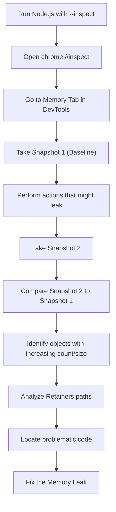

## Memory Management & Debugging Leaks in V8
### Core Concepts
*   **V8 JavaScript Engine & Memory:** V8 manages memory via a garbage collector (GC), primarily using a **generational garbage collection** approach.
    *   **Heap:** Where objects, functions, and closures are stored. Divided into Young and Old generations.
    *   **Stack:** Stores primitive values and function call frames.
    *   **Root Objects:** Objects directly accessible by the JavaScript application (e.g., global objects, active function scopes, C++ references). GC starts tracing from these roots.
*   **Garbage Collection (GC):** Automatic process to reclaim memory occupied by objects that are no longer reachable (referenced) from the root objects.
    *   **Reachability:** An object is "reachable" if there's a path of references from a root object to it. Unreachable objects are candidates for GC.
*   **Memory Leak:** Occurs when objects are no longer needed by the application but are still inadvertently reachable from a root, preventing the GC from reclaiming their memory. This leads to increasing memory consumption over time, potentially causing performance degradation or application crashes (Out Of Memory errors).

### Key Details & Nuances
*   **Generational Hypothesis:** Most objects are either very short-lived or very long-lived. V8 optimizes GC based on this:
    *   **Young Generation (Nursery):** Where new objects are initially allocated.
        *   **Scavenge (Minor GC):** Fast, frequent collection using **Cheney's algorithm**. It copies live objects from one semi-space to another, effectively compacting memory. Objects surviving multiple scavenges are promoted to the Old Generation.
    *   **Old Generation:** Stores objects that have survived multiple minor GC cycles (promoted) or are very large.
        *   **Mark-Sweep-Compact (Major GC):** Slower, less frequent collection.
            *   **Mark:** Identifies all reachable objects by traversing the object graph from roots.
            *   **Sweep:** Iterates through the heap and reclaims memory from unmarked (unreachable) objects.
            *   **Compact:** Moves live objects together to reduce fragmentation, which helps with future allocations and cache efficiency.
*   **Incremental & Concurrent GC:** V8 employs incremental (breaking GC work into smaller chunks) and concurrent (running parts of GC on separate threads) strategies to minimize "stop-the-world" pauses, improving application responsiveness.
*   **Common Causes of Memory Leaks in Node.js:**
    *   **Global Variables/Caches:** Storing object references indefinitely in global arrays, objects, or application-level caches without proper eviction policies.
    *   **Closures:** Functions that "close over" variables from their outer scope. If the closure is retained (e.g., added to a global list), the variables it references will also be retained.
    *   **Event Listeners:** Registering event listeners (e.g., `EventEmitter.on()`) that are never unregistered (`EventEmitter.off()`), especially for custom events or objects that are frequently created and destroyed.
    *   **Timers:** `setInterval` or `setTimeout` that are not cleared (`clearInterval`, `clearTimeout`) and keep references to objects or closures.
    *   **Circular References:** While GC algorithms like Mark-Sweep handle simple circular references between unreachable objects, complex scenarios can still contribute if a part of the cycle is inadvertently rooted.
    *   **Out-of-Scope DOM References (Browser Context):** Less relevant for pure Node.js, but critical in browser environments.

### Practical Examples

**Example 1: Simple Memory Leak via Global Array**

```typescript
// server.ts
import http from 'http';

const leakedObjects: any[] = []; // Global array that will accumulate objects

interface RequestInfo {
    id: number;
    timestamp: number;
    payload: string;
}

let requestCount = 0;

const server = http.createServer((req, res) => {
    if (req.url === '/leak') {
        const info: RequestInfo = {
            id: ++requestCount,
            timestamp: Date.now(),
            payload: `This is a large string payload for request ${requestCount}`.repeat(100)
        };
        leakedObjects.push(info); // This object will never be garbage collected
        res.writeHead(200, { 'Content-Type': 'text/plain' });
        res.end(`Leaked object #${info.id}. Current leaked objects: ${leakedObjects.length}`);
    } else if (req.url === '/status') {
        res.writeHead(200, { 'Content-Type': 'text/plain' });
        res.end(`Leaked objects count: ${leakedObjects.length}`);
    } else {
        res.writeHead(404);
        res.end('Not Found');
    }
});

const PORT = 3000;
server.listen(PORT, () => {
    console.log(`Server running on http://localhost:${PORT}`);
    console.log('Visit http://localhost:3000/leak to simulate a leak.');
    console.log('Visit http://localhost:3000/status to check leaked count.');
});

// To run this:
// 1. Save as `server.ts`
// 2. `npm init -y && npm install typescript @types/node ts-node`
// 3. `npx ts-node server.ts`
// 4. Hit http://localhost:3000/leak multiple times. Observe memory usage increase.
```

**Example 2: Debugging Memory Leaks with Node.js `--inspect`**

The general workflow for debugging a memory leak involves capturing heap snapshots and analyzing them.

```sh
# 1. Start your Node.js application in inspect mode
node --inspect index.js

# Or for TypeScript:
npx ts-node --inspect index.ts
```

Then, open `chrome://inspect` in your Chrome browser, find your Node.js target, and click "inspect". This opens Chrome DevTools. Navigate to the "Memory" tab.

**Debugging Workflow:**



*   **Heap Snapshots:** Capture a point-in-time view of the JavaScript heap.
    *   **Comparison:** Take a baseline snapshot, perform actions you suspect cause the leak, then take another snapshot. Compare the two to see which objects are increasing in count or size.
    *   **Dominators:** Objects that retain the largest amount of memory.
    *   **Retainers:** The reference path from a garbage collection root to a leaking object. Understanding the retainer path is crucial for finding the source of the leak.

### Common Pitfalls & Trade-offs
*   **Misinterpreting Memory Usage:** High memory usage doesn't automatically mean a leak. It could be legitimate (e.g., large cache, long-running operation, temporary peak). A leak implies *continuously growing* memory that *should* be reclaimed.
*   **Premature Optimization:** Over-engineering solutions for potential leaks (e.g., aggressive `WeakMap` usage) without proper profiling can make code harder to read and debug.
*   **Ignoring `Buffer` Allocations:** `Buffer` objects often allocate memory outside the V8 heap (in Node.js's C++ layer). While `Buffer`s themselves are subject to V8 GC, the underlying memory might not be immediately released to the OS until the `Buffer` object is collected. Recent Node.js versions have improved this.
*   **Complex `EventEmitter` Lifecycles:** Forgetting to remove listeners, especially when an object `A` listens to `B`, and `B` outlives `A`. If `A` is meant to be garbage collected, `B` still holding a reference to `A`'s listener callback will prevent `A` (and its closure context) from being collected.
*   **Long-Running Processes:** Server-side applications or long-running CLI tools are more susceptible to memory leaks than short-lived scripts because leaks accumulate over time.

### Interview Questions

1.  **Describe V8's Garbage Collection mechanism. How does it help prevent memory leaks, and what are its limitations regarding leaks?**
    *   **Answer:** V8 uses a generational GC (Young & Old generations). Young Gen uses fast Scavenge (Cheney's algorithm) for frequently created/destroyed objects, promoting survivors. Old Gen uses slower Mark-Sweep-Compact. This system automatically reclaims memory from unreachable objects. Its limitation regarding leaks is that it only collects *unreachable* objects. If an object is no longer needed but is still referenced (e.g., by a global variable, an un-deregistered event listener, or a closure held by a reachable object), GC considers it "reachable" and won't collect it, leading to a leak.

2.  **What are common causes of memory leaks in Node.js applications, and how would you identify them?**
    *   **Answer:** Common causes include forgotten timers (`setInterval` not cleared), un-deregistered event listeners, growing global caches/arrays without eviction, and closures retaining large scope variables unnecessarily. To identify, I'd typically use Node.js's built-in `--inspect` flag, connect via Chrome DevTools (`chrome://inspect`), and analyze **heap snapshots**. I'd take a baseline snapshot, perform actions, then take another, comparing them to pinpoint objects increasing in count/size and investigate their "retainer paths" to find what's holding onto them. Tools like `clinic doctor` can also automate this.

3.  **You suspect a memory leak in a Node.js service running in production. Walk me through the steps you would take to diagnose and fix it.**
    *   **Answer:** First, I'd confirm it's a leak, not just high usage, by monitoring memory metrics over time (e.g., RSS, Heap Used) for continuous growth. If confirmed, I'd attempt to reproduce it in a staging environment.
        1.  **Enable Debugging:** Restart the problematic service instance (or a replica) with `--inspect` enabled.
        2.  **Capture Baselines:** Connect Chrome DevTools and take a heap snapshot.
        3.  **Reproduce/Wait:** Trigger the suspected leak scenario or let the application run for a period to accumulate leaked objects.
        4.  **Capture Second Snapshot:** Take another heap snapshot.
        5.  **Analyze & Compare:** Compare the two snapshots in DevTools, looking for object constructors that show a significant increase in instance count or shallow/retained size.
        6.  **Trace Retainers:** For the leaking objects, analyze their "retainer paths" to understand why they are not being garbage collected (i.e., which active references are holding onto them). This usually points to the specific code causing the leak.
        7.  **Isolate & Fix:** Based on the retainer path, identify the code responsible (e.g., an uncleaned timer, an event listener, a growing cache). Implement the fix (e.g., `clearInterval`, `removeListener`, cache eviction policy, use `WeakMap`).
        8.  **Verify:** Deploy the fix to a testing environment, and repeat the memory profiling to confirm the leak is resolved.

4.  **Explain the purpose of `WeakMap` and `WeakSet` in JavaScript/Node.js. When would you use them to address a memory concern?**
    *   **Answer:** `WeakMap` and `WeakSet` are collections that hold "weak" references to their keys (for `WeakMap`) or elements (for `WeakSet`). This means that if the only reference to an object is within a `WeakMap` or `WeakSet`, that object is eligible for garbage collection. Once collected, it's automatically removed from the weak collection.
    *   **Purpose:** They prevent memory leaks that would occur if strong references were used.
    *   **Use Cases for Memory Concerns:**
        *   **Caching with Object Keys:** When you want to cache data associated with an object, but ensure the cached data is collected once the object itself is no longer referenced elsewhere. E.g., `WeakMap` to store metadata about DOM elements or other complex objects.
        *   **Avoiding "Mark and Sweep" Cycles:** For internal implementation details where an object might implicitly hold a reference to another that should be collected if the first one is collected.
        *   **Tracking instances without preventing GC:** `WeakSet` can track a set of active objects without preventing their collection if they become otherwise unreachable.
    *   **Limitation:** You cannot iterate over `WeakMap` or `WeakSet` directly, nor can you clear them programmatically, precisely because their contents are GC-dependent.