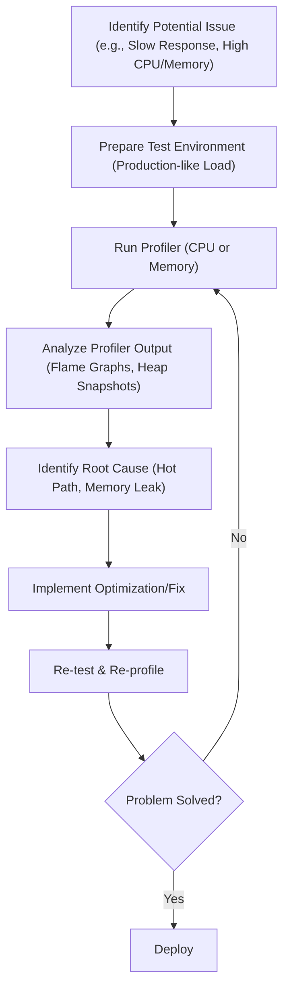

## Performance Profiling (CPU & Memory)
### Core Concepts

*   **CPU Profiling:** The process of analyzing how much CPU time your Node.js application spends executing different parts of its code. The goal is to identify "hot paths" – functions or code blocks that consume a disproportionate amount of CPU, indicating potential bottlenecks.
    *   **Mechanism:** Typically involves sampling the call stack at regular intervals (e.g., every millisecond) to build a statistical representation of where the CPU is busy.
    *   **Output:** Often visualized as flame graphs, which show the call stack hierarchy and time spent in each function.
*   **Memory Profiling:** The process of analyzing memory usage, allocation patterns, and identifying memory leaks within your Node.js application.
    *   **Mechanism:** Involves taking "heap snapshots" which are a snapshot of all objects in the V8 heap at a given moment.
    *   **Output:** Provides details on object types, their sizes (shallow and retained), and their retainers (what's holding onto them), helping track down memory growth and leaks.
*   **Why Profile:** Essential for optimizing application performance, ensuring stability, reducing resource consumption (CPU, RAM), and preventing crashes due to resource exhaustion. Node.js's single-threaded event loop means blocking operations (CPU-bound) can severely degrade responsiveness.

### Key Details & Nuances

*   **V8 Engine's Role:** Node.js runs on V8, Google's open-source high-performance JavaScript engine. V8 manages the call stack, heap memory, and garbage collection (GC). Profiling tools often leverage V8's internal APIs.
*   **CPU Profiling Specifics:**
    *   **Call Stacks:** A sequence of frames representing the active function calls at a given moment.
    *   **Flame Graphs:** A visual representation of call stacks. The x-axis shows total time spent, and the y-axis shows stack depth. Wider "flames" indicate functions consuming more CPU time.
    *   **Identifying Bottlenecks:** Look for wide, flat "flames" indicating long-running synchronous operations, complex algorithms, or extensive loops that block the event loop.
    *   **Tools:**
        *   **Chrome DevTools (via `node --inspect`):** Provides a comprehensive CPU profiler (sampling profiler) with flame graphs, heavy (bottom-up), and tree (top-down) views.
        *   **`0x`:** A command-line tool that generates interactive flame graphs directly from Node.js applications using the V8 profiler.
        *   **`clinic.js` (e.g., `clinic doctor`, `clinic flame`):** A suite of tools that provide high-level analysis and detailed flame graphs, identifying common performance issues.
        *   **`perf_hooks` (Node.js built-in):** Programmatic API for measuring performance events (e.g., `performance.now()`, `performance.mark()`, `performance.measure()`). Useful for micro-benchmarking specific code sections.
*   **Memory Profiling Specifics:**
    *   **Heap Snapshots:** A detailed view of objects in the V8 heap.
    *   **Shallow Size:** The memory directly held by a specific object itself.
    *   **Retained Size:** The total memory that would be freed if an object (and anything it exclusively references) were garbage collected. This is crucial for identifying actual memory leaks.
    *   **Retainers:** Objects that hold references to other objects, preventing them from being garbage collected. Identifying the chain of retainers is key to fixing leaks.
    *   **Garbage Collection (GC):** V8 uses a generational GC.
        *   **New Space (Eden/Survivor):** For newly allocated objects. Frequent, fast "Scavenge" (minor GC) moves live objects to survivor space or old space.
        *   **Old Space:** For objects that have survived multiple Scavenge GCs. Less frequent "Mark-Sweep" and "Mark-Compact" (major GC) cycles.
        *   **Large Object Space:** For very large objects that don't fit in New or Old spaces.
    *   **Common Memory Leaks:** Unclosed closures retaining large scopes, persistent references to large data structures (e.g., caches without eviction policies), unremoved event listeners, global variables, timers (`setInterval`) not cleared.
    *   **Tools:**
        *   **Chrome DevTools (via `node --inspect`):** Provides detailed heap snapshots, allowing comparison between snapshots to identify growing object counts.
        *   **`heapdump` / `v8-profiler-node` (third-party modules):** Can programmatically create heap snapshots for analysis.

### Practical Examples

#### 1. Basic Performance Timing with `perf_hooks`

```typescript
import { performance } from 'perf_hooks';

function fibonacci(n: number): number {
  if (n <= 1) return n;
  return fibonacci(n - 1) + fibonacci(n - 2);
}

const start = performance.now();
fibonacci(40); // A CPU-bound operation for demonstration
const end = performance.now();

console.log(`Fibonacci(40) took ${end - start} milliseconds.`);

// Example for measuring a specific section with marks
performance.mark('start_db_query');
// Assume some async operation here, e.g., a database query
setTimeout(() => {
  performance.mark('end_db_query');
  performance.measure('db_query_time', 'start_db_query', 'end_db_query');

  const measures = performance.getEntriesByType('measure');
  console.log(measures);
}, 100);
```

#### 2. Running a CPU Profiler with `0x`

```sh
# Install 0x globally
npm install -g 0x

# Run your Node.js application with 0x
0x myapp.js

# This will:
# 1. Start your app.
# 2. Collect profiling data.
# 3. Open a browser window with an interactive flame graph.
# You can also specify an output directory or duration:
# 0x --output-dir=./profiles --open=false --stop-on-exit myapp.js
```

#### 3. General Profiling Workflow



### Common Pitfalls & Trade-offs

*   **Profiling Overhead:** Profilers themselves consume CPU and memory, which can alter the very behavior you are trying to measure. Always be aware of this overhead, especially in production.
*   **Unrealistic Workloads:** Profiling without a representative workload (e.g., simulating production traffic) can lead to optimizing the wrong code paths.
*   **Misinterpreting Flame Graphs:** A wide flame doesn't always mean "bad code." It might represent essential work. Focus on functions that are unexpectedly wide or that are children of non-application code (e.g., library calls) which might point to misuse.
*   **Ignoring I/O vs. CPU:** Node.js is primarily I/O-bound. CPU profiles only show time spent *processing* CPU-bound tasks, not time spent *waiting* for I/O. High CPU usage might be fine if it's during actual work; performance issues might stem from slow I/O or excessive asynchronous operations.
*   **Production Profiling:** Risky due to performance overhead and security implications. Often, a staging environment with production-like data and traffic is preferred. If profiling production is necessary, use tools with minimal impact (e.g., `perf_hooks` for specific timing) or sample-based profiling for very short durations.

### Interview Questions

1.  **How would you approach identifying a CPU bottleneck in a Node.js application that is experiencing slow response times?**
    *   **Answer:** I would start by using `node --inspect` to connect Chrome DevTools, then capture a CPU profile during a period of high load or when the slowness is observed. I'd then analyze the flame graph, looking for wide sections (hot paths) indicating synchronous, CPU-intensive operations. Tools like `0x` or `clinic.js flame` are also excellent for generating and analyzing flame graphs from the command line, especially in a server environment. Once identified, I'd focus on optimizing that specific code (e.g., using more efficient algorithms, offloading to worker threads, or using non-blocking alternatives).
2.  **Describe the process of debugging a memory leak in a Node.js application. What tools would you use, and what specifically would you look for?**
    *   **Answer:** I'd typically use Chrome DevTools attached via `node --inspect`. The process involves:
        1.  Taking a baseline heap snapshot when the application starts or is in a stable state.
        2.  Triggering the suspected leak scenario multiple times (e.g., making repeated API calls that are thought to cause the leak).
        3.  Taking subsequent heap snapshots.
        4.  Comparing the snapshots, looking for a consistently increasing count of certain object types.
        5.  For the suspect objects, I'd investigate their "retained size" (not just shallow size) and the "retainers" view to understand what objects are holding references to them, preventing garbage collection. Common culprits include unclosed closures, global variables, event listeners not being de-registered, or growing caches.
3.  **What is the difference between "shallow size" and "retained size" in a V8 heap snapshot, and why is "retained size" more important for finding memory leaks?**
    *   **Answer:** **Shallow size** is the memory consumed by the object itself, excluding the memory of objects it directly references. **Retained size** is the total memory that would be freed if this object (and anything it exclusively references, forming a subtree that becomes unreachable) were garbage collected. Retained size is more important for finding memory leaks because a small object (small shallow size) can be leaking a huge amount of memory by retaining a large, complex object graph. The goal is to find the "root" of the leak that, once released, frees up a large amount of memory.
4.  **When would you prefer using `clinic.js` over Chrome DevTools for profiling a Node.js application, and vice versa?**
    *   **Answer:** I'd prefer **Chrome DevTools** for interactive, deep-dive analysis during development or local debugging, especially when I need to explore call stacks visually or compare heap snapshots interactively. It's great for detailed, step-by-step investigation.
    *   I'd prefer **`clinic.js` (or `0x`)** for automated, high-level analysis or when profiling on a remote server/CI pipeline where a GUI isn't available. `clinic.js` provides excellent summarized reports and can identify common bottleneck types (CPU, I/O, memory) without manual deep diving, making it suitable for routine performance checks or initial triage.
5.  **How does Node.js's single-threaded nature influence performance profiling compared to multi-threaded languages?**
    *   **Answer:** In Node.js, the single-threaded event loop means any CPU-bound operation, even a short one, will block the entire application, preventing it from handling other requests or I/O callbacks until that operation completes. This makes identifying and optimizing synchronous hot paths extremely critical in CPU profiles. In multi-threaded languages, a CPU-bound operation might only impact one thread, potentially leaving others free to handle requests, although it could still lead to overall resource contention. Node.js profiling specifically emphasizes identifying event loop blocking and ensuring non-blocking I/O, whereas multi-threaded profiling often focuses more on thread contention, locking, and synchronization overheads.