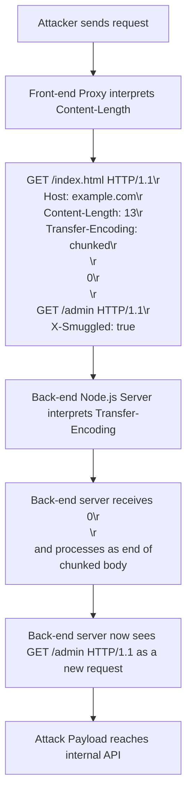

## Node.js Security Vulnerabilities (e.g., prototype pollution, request smuggling)
### Core Concepts

*   **Prototype Pollution**: A vulnerability arising in JavaScript (and thus Node.js) where an attacker can inject or modify properties of the `Object.prototype`. Since `Object.prototype` is at the top of the prototype chain, changes to it affect almost all objects in the application, leading to arbitrary code execution (RCE), denial-of-service (DoS), or privilege escalation.
*   **HTTP Request Smuggling**: A class of vulnerabilities where an attacker sends an ambiguous HTTP request to a chain of proxies/servers (e.g., a reverse proxy followed by a Node.js web server), exploiting discrepancies in how each component parses the request length (e.g., `Content-Length` vs. `Transfer-Encoding: chunked`). This allows the attacker to "smuggle" an additional, hidden request or part of a request, potentially bypassing security controls, accessing internal APIs, or poisoning caches.

### Key Details & Nuances

*   **Prototype Pollution Mechanics**:
    *   Occurs when user-controlled input can modify object properties without proper validation, especially in functions like `_.merge`, `Object.assign`, deep cloning, or query string parsers (e.g., `qs` library prior to certain versions).
    *   The common attack vector involves passing an object like `{"__proto__": {"polluted_prop": "value"}}` or `{"constructor": {"prototype": {"polluted_prop": "value"}}}` to a vulnerable function.
    *   **Impact**: Can lead to:
        *   **DoS**: Overwriting critical application properties (e.g., `process.exit`).
        *   **RCE**: If combined with a gadget chain, e.g., overwriting a template engine's prototype method or a serialization function.
        *   **Bypassing WAFs/Authorization**: Modifying internal flags or user roles.
*   **HTTP Request Smuggling Mechanics**:
    *   Relies on differences in how front-end proxies (e.g., Nginx, Apache, CDN) and back-end servers (e.g., Node.js Express server) interpret HTTP/1.1 headers:
        *   **CL.TE**: Front-end uses `Content-Length`, Back-end uses `Transfer-Encoding`.
        *   **TE.CL**: Front-end uses `Transfer-Encoding`, Back-end uses `Content-Length`.
        *   **TE.TE**: Both use `Transfer-Encoding`, but one can be de-sync'd by obfuscated `Transfer-Encoding` headers (e.g., `Transfer-Encoding: chunked, x`).
    *   The attacker crafts a request where the front-end sees one message boundary and the back-end sees another, causing the back-end to interpret part of the attacker's payload as the start of a new, illicit request.
    *   **Impact**:
        *   **Bypassing Front-end Controls**: Accessing restricted paths or internal APIs by "prefixing" the smuggled request.
        *   **Cache Poisoning**: Forcing the proxy to cache harmful responses under legitimate URLs.
        *   **Session Hijacking**: If combined with other attacks, e.g., capturing sensitive requests from other users.
        *   **Authentication Bypass**: If the smuggled request bypasses proxy authentication.

### Practical Examples

**Prototype Pollution Example (Vulnerable Deep Merge)**

```typescript
// --- Vulnerable merge function ---
function isObject(item: any): boolean {
    return (item && typeof item === 'object' && !Array.isArray(item));
}

function deepMerge(target: any, source: any): any {
    if (isObject(target) && isObject(source)) {
        for (const key in source) {
            if (isObject(source[key])) {
                if (!target[key]) {
                    Object.assign(target, { [key]: {} });
                }
                deepMerge(target[key], source[key]);
            } else {
                Object.assign(target, { [key]: source[key] });
            }
        }
    }
    return target;
}

// --- Exploitation ---
const userConfig = {
    isAdmin: false,
    settings: {
        theme: 'dark'
    }
};

console.log("Before pollution:", userConfig.isAdmin); // false

// Attacker-controlled input mimicking a JSON body or query param
const attackerPayload = JSON.parse('{"__proto__": {"isAdmin": true}}');

// A common scenario where an application merges user input into an object
deepMerge(userConfig, attackerPayload);

// The vulnerability: Object.prototype has been polluted
console.log("After pollution:", userConfig.isAdmin); // still false, but...

// A new object now inherits the polluted property
const newUser = {};
console.log("New object inherits pollution:", newUser.isAdmin); // true

// This can affect global behavior, e.g., if a framework checks a property on any object
// Imagine a framework internally creating objects and checking `obj.isAuthenticated`
```

**HTTP Request Smuggling (CL.TE Scenario)**



### Common Pitfalls & Trade-offs

*   **Prototype Pollution Prevention**:
    *   **Input Validation**: Rigorously validate and sanitize all user-supplied data, especially when it's used to construct or modify objects. Avoid dynamic property access where keys come directly from user input without a whitelist.
    *   **Schema Validation**: Use libraries like Joi, Zod, or JSON Schema to define strict data structures and reject unexpected properties.
    *   **Safe Deep Merge**: Use battle-tested libraries (e.g., `lodash.merge` with specific security fixes or `fast-copy`) that mitigate prototype pollution by default or provide options to disable prototype chain access. Better yet, avoid generic deep merge functions for untrusted input.
    *   **`Object.freeze(Object.prototype)`**: A drastic measure that can prevent pollution, but might break legitimate third-party libraries relying on prototype modifications. Test thoroughly.
    *   **Deserialization**: Be cautious with deserializing untrusted data (e.g., from `JSON.parse` if not combined with strict schema validation, or more complex formats).
*   **HTTP Request Smuggling Prevention**:
    *   **Consistent Parsing**: Ensure all components (load balancers, WAFs, proxies, application servers) in the request chain parse `Content-Length` and `Transfer-Encoding` headers identically and robustly. This is the primary defense.
    *   **HTTP/2 Adoption**: HTTP/2 uses a different framing mechanism, which is inherently less susceptible to smuggling. However, the conversion from HTTP/1.1 at the edge still needs to be secure.
    *   **Disable Unnecessary Features**: Configure proxies to disallow `Transfer-Encoding` if not explicitly required, or to always normalize it.
    *   **WAFs**: Web Application Firewalls can help, but they are not a silver bullet and can be bypassed by sophisticated smuggling attempts.
    *   **Regular Updates**: Keep all server and proxy software updated to patch known smuggling vulnerabilities.
    *   **No Obfuscation**: Do not allow or generate obfuscated or duplicate HTTP headers.

### Interview Questions

1.  **Question**: Explain how Prototype Pollution works in Node.js and provide an example of a common scenario leading to this vulnerability.
    *   **Answer**: Prototype Pollution allows an attacker to inject or modify properties of `Object.prototype`. Since most JavaScript objects inherit from `Object.prototype`, this change propagates across the application. A common scenario is when a Node.js application uses a recursive merge function (e.g., for configuration or user preferences) that doesn't sanitize keys. An attacker could send input like `{"__proto__": {"isAdmin": true}}` or `{"constructor": {"prototype": {"admin": true}}}`. If this input is merged into a base object, it pollutes `Object.prototype`, causing any newly created or existing objects (unless explicitly overridden) to inherit `isAdmin: true`, potentially leading to privilege escalation or RCE if chained with gadget properties.

2.  **Question**: Describe the mechanism of HTTP Request Smuggling. What are its primary impacts, and why is it particularly insidious?
    *   **Answer**: HTTP Request Smuggling occurs when a proxy (front-end) and the application server (back-end) interpret the length of an HTTP request differently, usually due to conflicting `Content-Length` and `Transfer-Encoding: chunked` headers. The front-end might honor `Content-Length`, forwarding a partial request body, while the back-end honors `Transfer-Encoding`, waiting for `0\r\n\r\n` to signify the end, thus interpreting the remaining bytes as a new, "smuggled" request. Its primary impacts include bypassing WAFs, accessing internal APIs, cache poisoning, and authentication bypass. It's insidious because it exploits architectural weaknesses rather than application code flaws directly, often operating at the network layer and being hard to detect through traditional application logging.

3.  **Question**: What practical steps can a developer take to prevent Prototype Pollution in a Node.js application, both at the code level and architecturally?
    *   **Answer**: At the code level, always validate and sanitize user input before using it to dynamically create or modify object properties. For functions that deep-merge objects, use battle-tested libraries that have built-in defenses against prototype pollution or specifically disallow `__proto__` or `constructor.prototype` keys. Consider using strict schema validation (e.g., Joi, Zod) for all incoming data to ensure properties conform to expected types and structures. Architecturally, minimize the use of dynamic property assignment based on untrusted input. For highly sensitive applications, `Object.freeze(Object.prototype)` can be considered, but requires rigorous testing.

4.  **Question**: How can an organization mitigate the risk of HTTP Request Smuggling across their Node.js services and surrounding infrastructure?
    *   **Answer**: Mitigation primarily involves ensuring consistent and unambiguous parsing of HTTP request headers across all components in the chain. This means configuring front-end proxies (Nginx, HAProxy) and back-end Node.js servers to handle `Content-Length` and `Transfer-Encoding` identically, preferably by having proxies normalize or strip ambiguous headers. Upgrading to HTTP/2 where possible is a strong defense as its framing mechanism is less prone to this issue. Regular patching of all infrastructure components is crucial. Disabling `Transfer-Encoding` if not necessary and using WAFs configured to detect common smuggling patterns can also help, though WAFs are not foolproof.

5.  **Question**: Compare and contrast Prototype Pollution and HTTP Request Smuggling, focusing on their attack vectors, the layer of the stack they exploit, and the typical impact on a Node.js application.
    *   **Answer**:
        *   **Attack Vector**: Prototype Pollution involves manipulating user input that gets processed by vulnerable JavaScript functions (e.g., deep merge, query parsers) to modify `Object.prototype`. Request Smuggling involves crafting malformed HTTP requests that exploit parsing discrepancies between network components (proxies, servers).
        *   **Layer of Exploitation**: Prototype Pollution operates at the application logic layer within the JavaScript runtime. Request Smuggling operates primarily at the network/protocol layer (HTTP/1.1 header parsing) and often involves multiple components.
        *   **Typical Impact**: Prototype Pollution can lead to arbitrary code execution, denial-of-service, or privilege escalation within the application's runtime. Request Smuggling typically leads to bypassing security controls (WAFs, authentication), accessing internal APIs, or cache poisoning, often affecting the entire ecosystem behind the proxy. While both can lead to severe consequences, Prototype Pollution directly compromises the application's internal state, whereas Smuggling manipulates how requests are routed and interpreted externally.