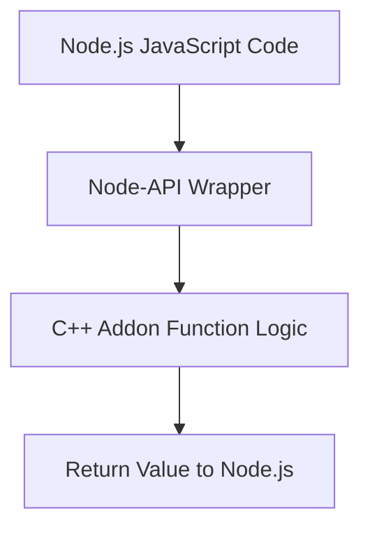

## Extending Node.js with C++ Addons (Node-API)
### Core Concepts
*   **C++ Addons:** Shared libraries (e.g., `.node` files) written in C++ that can be loaded and used directly from Node.js JavaScript code. They allow Node.js applications to interact with low-level system functionalities, existing C/C++ libraries, or perform CPU-intensive tasks where JavaScript might be too slow.
*   **Node-API (N-API):** A stable Application Binary Interface (ABI) for building native addons. It provides a set of C functions that add-on developers can use to interact with the Node.js runtime, regardless of the underlying V8 engine version or specific Node.js release.
*   **Purpose:**
    *   **Performance:** Offload CPU-bound tasks (e.g., heavy computations, image processing, cryptography) to highly optimized C++ code, leveraging native performance.
    *   **Native Capabilities:** Access OS-specific APIs, hardware interfaces, or existing C/C++ libraries that are not directly exposed by Node.js.
    *   **Resource Management:** Potentially better control over memory and threads for specific use cases.

### Key Details & Nuances
*   **ABI Stability:** Node-API ensures that addons compiled with one Node.js version remain compatible with future Node.js versions without recompilation. This significantly reduces maintenance overhead compared to older native addon approaches (like direct V8 API access).
*   **V8 Independence:** Node-API abstracts away the underlying V8 JavaScript engine details, making addons more resilient to V8 internal changes.
*   **Event Loop Interaction:**
    *   **Synchronous Addons:** Direct calls block the Node.js event loop until the C++ function returns. **Avoid for long-running operations.**
    *   **Asynchronous Addons:** For CPU-bound or I/O-bound tasks, use Node-API's asynchronous functions or `libuv` worker threads. The C++ work is performed in a separate thread, and a callback is invoked on the main event loop when complete, preventing blocking.
*   **Memory Management:** C++ addons must carefully manage memory allocated on the native side. Node-API provides functions to create JavaScript values from C++ data and manage object lifetimes (e.g., `napi_create_reference` for persistent references). Proper handling is crucial to prevent memory leaks or crashes.
*   **Error Handling:** Use Node-API functions like `napi_throw_error` or `napi_throw_type_error` to propagate C++ errors back to JavaScript as exceptions.
*   **Thread Safety:** When using worker threads, ensure all interactions with Node-API calls are made on the main thread (e.g., when invoking callbacks), or use thread-safe Node-API features.

### Practical Examples

**1. Basic Addon Structure (C++ and JavaScript)**

```cpp
// my_addon.cc
#include <napi.h>

Napi::String Method(const Napi::CallbackInfo& info) {
  Napi::Env env = info.Env();
  std::string message = info[0].As<Napi::String>().Utf8Value();
  return Napi::String::New(env, "Hello from C++: " + message);
}

Napi::Object Init(Napi::Env env, Napi::Object exports) {
  exports.Set(Napi::String::New(env, "greet"), Napi::Function::New(env, Method));
  return exports;
}

NODE_API_MODULE(NODE_GYP_MODULE_NAME, Init)
```

```json
// binding.gyp (for node-gyp build tool)
{
  "targets": [
    {
      "target_name": "my_addon",
      "sources": [ "my_addon.cc" ]
    }
  ]
}
```

```javascript
// app.js (JavaScript usage)
const addon = require('./build/Release/my_addon.node'); // Adjust path based on build
console.log(addon.greet('Node.js!')); // Output: Hello from C++: Node.js!
```

```sh
# Build steps (requires Node.js, npm, and appropriate C++ toolchain)
npm install -g node-gyp
node-gyp configure
node-gyp build
```

**2. Node.js to C++ Addon Interaction Flow**



### Common Pitfalls & Trade-offs
*   **Blocking the Event Loop:** The most critical pitfall. Synchronous C++ operations, even short ones, can block the main thread and degrade application responsiveness. Use asynchronous patterns for any non-trivial work.
*   **Memory Leaks/Crashes:** Improper C++ memory management (e.g., forgetting `delete`, incorrect reference counting) can lead to leaks, segmentation faults, or undefined behavior, crashing the Node.js process.
*   **Deployment Complexity:** Addons require compilation on the target system (or pre-compilation for various platforms/architectures), which adds complexity to CI/CD and deployment compared to pure JavaScript applications.
*   **Debugging Challenges:** Debugging native C++ code alongside JavaScript can be significantly more complex, requiring specialized tools and knowledge.
*   **Overuse/Premature Optimization:** Don't use addons unless absolutely necessary. The overhead of crossing the JS/C++ boundary can negate performance gains for small tasks. Profile first, optimize later.
*   **Security Implications:** C++ addons run with native system permissions. A bug or vulnerability in an addon can expose your application to serious security risks (e.g., arbitrary code execution).

### Interview Questions
1.  **When would you consider writing a C++ addon for a Node.js application instead of implementing the functionality purely in JavaScript?**
    *   **Answer:** Primarily for performance-critical, CPU-bound tasks (e.g., heavy computations, cryptographic operations, complex data parsing/serialization) where JavaScript's execution speed is a bottleneck. Also, when needing to interface directly with existing C/C++ libraries or low-level system/hardware APIs that Node.js doesn't expose natively.
2.  **Explain the role and significance of Node-API (N-API) in the context of Node.js C++ addons. What problem does it solve?**
    *   **Answer:** Node-API provides a stable Application Binary Interface (ABI) for native addons. It solves the problem of addon incompatibility across different Node.js versions. Previously, addons directly interacted with V8's internal APIs, meaning they often broke with every new Node.js release that updated V8, requiring recompilation. Node-API abstracts V8 details, ensuring an addon compiled against one Node-API compatible Node.js version will work with future compatible versions without recompilation, significantly improving maintainability.
3.  **How do you ensure that a C++ addon doesn't block the Node.js event loop, especially when performing long-running operations?**
    *   **Answer:** For long-running operations, the C++ addon must operate asynchronously. This is typically achieved by offloading the heavy work to a `libuv` worker thread (or another thread pool) from within the C++ addon. Node-API provides mechanisms to facilitate this, allowing the C++ code to initiate an asynchronous operation, return control to the JavaScript event loop immediately, and then queue a callback to be invoked on the main thread once the C++ work in the background thread is complete.
4.  **What are the main downsides or challenges associated with using C++ addons in a Node.js project?**
    *   **Answer:** Key challenges include increased complexity in development, debugging, and deployment (requires C++ toolchain and compilation). There's a higher risk of memory leaks or process crashes due to manual memory management in C++. It also reduces portability compared to pure JavaScript solutions, as the addon must be compiled for each target platform/architecture. Overuse can also lead to performance overhead from frequent JS/C++ boundary crossings.