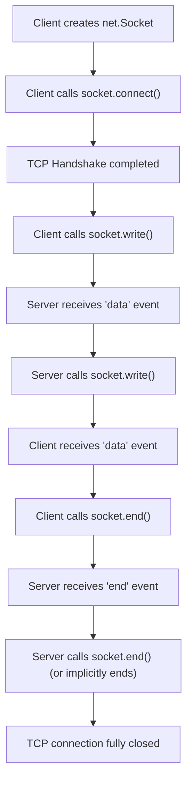

## Networking with TCP (`net`) & UDP (`dgram`)
### Core Concepts

*   **`net` Module (TCP - Transmission Control Protocol):**
    *   **Connection-Oriented:** Establishes a persistent, dedicated connection between client and server before data transfer.
    *   **Stream-Based:** Data is treated as a continuous stream of bytes, not discrete messages. Node.js `Socket` objects implement `Duplex` streams.
    *   **Reliable:** Guarantees delivery, order, and integrity of data through mechanisms like sequence numbers, acknowledgements (ACKs), retransmissions, and checksums.
    *   **Flow Control & Congestion Control:** Manages data transmission rates to prevent sender from overwhelming receiver or network.
    *   **Use Cases:** Web servers (HTTP/HTTPS), SSH, FTP, database connections, long-lived chat applications, any scenario requiring guaranteed delivery.

*   **`dgram` Module (UDP - User Datagram Protocol):**
    *   **Connectionless:** Sends independent packets (datagrams) without establishing a prior connection. Each datagram is an independent unit.
    *   **Datagram-Based:** Data is sent as discrete packets. No concept of a continuous stream.
    *   **Unreliable:** Does *not* guarantee delivery, order, or duplication. Packets can be lost, reordered, or duplicated.
    *   **Minimal Overhead:** Faster due to lack of connection setup, acknowledgements, and flow control.
    *   **Use Cases:** Real-time applications (VoIP, online gaming), DNS lookups, streaming video, network discovery (multicast/broadcast), where speed and low latency are prioritized over guaranteed delivery.

### Key Details & Nuances

*   **`net` Socket Abstraction:**
    *   A `net.Socket` instance is an `EventEmitter` and a `Duplex` stream, allowing data to be both read from and written to.
    *   Key events: `data` (when data is received), `end` (remote end sends FIN packet), `close` (socket fully closed), `error`.
    *   `socket.end()`: Initiates a graceful shutdown, sending a FIN packet. The socket remains writable until the remote end also closes or sends its own FIN.
    *   `socket.destroy()`: Forcefully closes the socket, useful for error handling or resource cleanup.

*   **`dgram` Socket Abstraction:**
    *   A `dgram.Socket` instance is an `EventEmitter`. It's not a stream.
    *   Key events: `message` (when a datagram is received), `listening` (when the socket is ready to receive messages), `error`, `close`.
    *   `socket.send(buffer, offset, length, port, address, [callback])`: Sends a UDP datagram. `offset` and `length` specify the part of the buffer to send.
    *   `socket.bind(port, [address], [callback])`: Listens for datagrams on a specific port.

*   **Non-blocking I/O & Event Loop:** Both `net` and `dgram` operations in Node.js are non-blocking. Network events (new connections, data arrival) are queued to the event loop, processed when the main thread is free, ensuring high concurrency without explicit threading.

### Practical Examples

#### TCP Server & Client (`net`)

```typescript
// server.ts
import * as net from 'net';

const server = net.createServer((socket) => {
  console.log('Client connected:', socket.remoteAddress, socket.remotePort);

  socket.on('data', (data) => {
    const message = data.toString().trim();
    console.log(`Received from client: ${message}`);
    socket.write(`Echo: ${message}\n`); // Echo back
  });

  socket.on('end', () => {
    console.log('Client disconnected.');
  });

  socket.on('error', (err) => {
    console.error('Socket error:', err.message);
  });
});

const PORT = 3000;
server.listen(PORT, () => {
  console.log(`TCP Server listening on port ${PORT}`);
});

// client.ts
import * as net from 'net';

const client = net.createConnection({ port: 3000 }, () => {
  console.log('Connected to TCP server!');
  client.write('Hello Server!\n');
});

client.on('data', (data) => {
  console.log(`Received from server: ${data.toString().trim()}`);
  client.end(); // Close the connection after receiving echo
});

client.on('end', () => {
  console.log('Disconnected from server.');
});

client.on('error', (err) => {
  console.error('Client error:', err.message);
});
```

#### UDP Server & Client (`dgram`)

```typescript
// server.ts
import * as dgram from 'dgram';

const server = dgram.createSocket('udp4');

server.on('message', (msg, rinfo) => {
  console.log(`Server got: ${msg} from ${rinfo.address}:${rinfo.port}`);
  server.send(`Echo: ${msg}`, rinfo.port, rinfo.address); // Echo back
});

server.on('listening', () => {
  const address = server.address();
  console.log(`UDP Server listening on ${address.address}:${address.port}`);
});

server.bind(4000);

// client.ts
import * as dgram from 'dgram';

const client = dgram.createSocket('udp4');
const message = Buffer.from('Hello UDP Server!');

client.send(message, 4000, 'localhost', (err) => {
  if (err) client.close();
});

client.on('message', (msg, rinfo) => {
  console.log(`Client got: ${msg} from ${rinfo.address}:${rinfo.port}`);
  client.close();
});

client.on('error', (err) => {
  console.error('Client error:', err.message);
  client.close();
});
```

#### TCP Data Flow Example



### Common Pitfalls & Trade-offs

*   **TCP (`net`) Pitfalls:**
    *   **Nagle's Algorithm:** Can introduce small delays by buffering small writes to send larger segments. Disable with `socket.setNoDelay(true)` for low-latency, high-frequency writes (e.g., real-time games), but be aware of increased network overhead.
    *   **Buffer Management:** When receiving data, `socket.on('data')` might receive partial messages or multiple messages in one chunk. Application-level framing (e.g., length-prefixed messages, delimiters) is crucial.
    *   **Connection Leaks:** Forgetting to `socket.end()` or `socket.destroy()` can lead to open connections, consuming resources on both ends.
    *   **Half-Open Connections:** A connection can be half-open if one side closes its writing end (`socket.end()`) but the other side can still write. Handling `end` vs. `close` events properly is key.

*   **UDP (`dgram`) Pitfalls & Trade-offs:**
    *   **Reliability:** The biggest challenge. If reliable delivery is needed, it must be implemented at the application layer (e.g., ACKs, retranstransmissions, sequence numbers), significantly increasing complexity.
    *   **Packet Size:** UDP datagrams have practical size limits (around 65507 bytes, but smaller for typical network MTUs ~1500 bytes). Sending larger data requires application-level fragmentation and reassembly.
    *   **Order & Duplicates:** Application must handle out-of-order packets and potential duplicates, usually with sequence numbers and de-duplication logic.
    *   **Firewalls:** UDP traffic can be more aggressively filtered by firewalls than TCP, especially for ephemeral ports.

### Interview Questions

1.  **When would you choose TCP (`net`) over UDP (`dgram`) in Node.js, and vice versa? Provide concrete examples for each.**
    *   **TCP (Choose for):** When reliability, ordered delivery, and connection persistence are paramount.
        *   *Examples:* Building a robust REST API, a file transfer service, a persistent chat application (like IRC), database interactions, SSH.
    *   **UDP (Choose for):** When speed, low latency, and minimal overhead are critical, and occasional data loss is acceptable or can be handled at the application layer.
        *   *Examples:* Real-time multi-player games (where older positions are quickly superseded), VoIP/video streaming, DNS queries, network device discovery (e.g., SSDP).

2.  **Explain the 'stream' concept in Node.js's `net` module. How does it relate to the underlying TCP protocol?**
    *   **Stream Concept:** In Node.js, a `net.Socket` is a `Duplex` stream. This means it implements the readable and writable stream interfaces. Data received from the network is pushed into the readable stream, and data written to the writable stream is sent over the network. This allows leveraging Node.js's stream pipeline and backpressure mechanisms.
    *   **Relation to TCP:** TCP itself is a byte-stream protocol; it doesn't preserve message boundaries. Node.js's `net.Socket` mirrors this: `data` events might contain partial messages or multiple concatenated messages if not explicitly framed by the application. The stream abstraction provides a convenient, asynchronous way to interact with this continuous flow of bytes.

3.  **Discuss how Node.js's event loop handles concurrent TCP connections efficiently without requiring multithreading.**
    *   Node.js uses a single-threaded event loop model for JavaScript execution. Network I/O, including TCP connections, is handled by libuv (a C++ library) in the background. When a new connection arrives or data is received on an existing socket, libuv performs the I/O asynchronously. Once the I/O operation completes (e.g., data is fully read into a buffer), it queues a callback (like `socket.on('data')`) to the Node.js event loop. The event loop then picks up this callback and executes it in the main JavaScript thread when it's free. This non-blocking, event-driven architecture allows a single Node.js process to manage thousands of concurrent connections efficiently without the overhead of thread creation, context switching, or locking mechanisms.

4.  **How would you handle unreliable delivery or out-of-order packets if building a real-time game on UDP using `dgram`?**
    *   **Unreliable Delivery:** Implement application-level acknowledgements (ACKs) and retransmissions for critical game state updates (e.g., player health, inventory). For less critical, rapidly changing data (e.g., player position), simply send updates frequently, as newer data supersedes older lost/out-of-order packets ("fire and forget").
    *   **Out-of-Order Packets:** Use monotonically increasing sequence numbers in each packet. On the receiver, buffer incoming packets and reorder them based on sequence numbers before processing. Discard packets with sequence numbers lower than the last processed packet (assuming newer data is always preferred).
    *   **Duplicate Packets:** Use sequence numbers and a cache of recently processed packets to detect and discard duplicates.
    *   **Latency Compensation:** Client-side prediction, server-side reconciliation, and interpolation/extrapolation techniques are also crucial for a smooth user experience given network latency and potential packet loss.