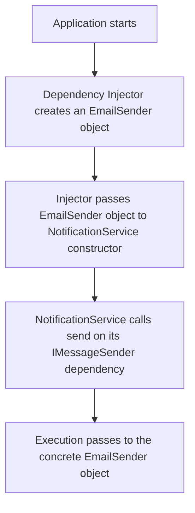

## SOLID Principles
### Core Concepts

SOLID is a mnemonic acronym for five design principles intended to make software designs more understandable, flexible, and maintainable. They are guidelines for managing dependencies and structuring code in Object-Oriented Programming.

*   **S - Single Responsibility Principle (SRP):**
    *   A class should have only one reason to change.
    *   This "reason" is often tied to a single actor or business concern. It's not about having only one method.
*   **O - Open/Closed Principle (OCP):**
    *   Software entities (classes, modules, functions) should be open for extension but closed for modification.
    *   Achieved by using abstractions (interfaces, abstract classes) and polymorphism. New functionality is added via new classes that implement the abstraction, not by changing existing, tested code.
*   **L - Liskov Substitution Principle (LSP):**
    *   Objects of a superclass should be replaceable with objects of a subclass without affecting the correctness of the program.
    *   A subclass must honor the "contract" of its superclass (e.g., method signatures, expected behavior, invariants).
*   **I - Interface Segregation Principle (ISP):**
    *   No client should be forced to depend on methods it does not use.
    *   Promotes creating smaller, specific "role interfaces" over one large, general-purpose interface.
*   **D - Dependency Inversion Principle (DIP):**
    *   High-level modules should not depend on low-level modules. Both should depend on abstractions (e.g., interfaces).
    *   Abstractions should not depend on details. Details (concrete implementations) should depend on abstractions. This "inverts" the traditional dependency flow.

### Key Details & Nuances

*   **SRP is about cohesion:** All responsibilities within a class should be highly related and focused on a single primary purpose. A class like `UserManager` should handle user authentication and profile data, but not also email notifications and logging (those are separate concerns).
*   **OCP is not absolute:** Applying OCP everywhere leads to over-engineering. Apply it to areas of the codebase that are likely to change or have new variations in the future. The Strategy or Decorator patterns are common implementations of OCP.
*   **LSP violations are subtle:** A common violation is a subclass method that does less than the superclass method (e.g., an empty implementation) or throws an unexpected exception. Code that checks `if (obj instanceof SubClass)` is a strong indicator that LSP is being violated.
*   **ISP vs. SRP:**
    *   **SRP** focuses on the *reasons a class might change* (cohesion of implementation).
    *   **ISP** focuses on the *dependencies of clients* (cohesion of interfaces). A class can conform to SRP but still have a "fat" interface that violates ISP.
*   **DIP vs. Dependency Injection (DI):**
    *   **DIP** is the *principle* that you should depend on abstractions, not concretions.
    *   **DI** is a *design pattern* and a common *technique* to achieve DIP. It's the mechanism by which a concrete dependency (the low-level detail) is supplied to a high-level module from an external source.

### Practical Examples

#### Dependency Inversion Principle (DIP) - Runtime Flow

This diagram shows the runtime flow of control when using Dependency Injection to satisfy the Dependency Inversion Principle. The high-level module (`NotificationService`) is not aware of the concrete low-level module (`EmailSender`) at compile time; it only knows about the `IMessageSender` abstraction.



#### Open/Closed Principle - Code Example

Here, the `OrderProcessor` is closed for modification. To add a new payment method like Stripe, we simply add a new class `StripePayment` that implements the `IPaymentGateway` interface. The `OrderProcessor` code doesn't change.

```typescript
// Abstraction (The "Open for Extension" part)
interface IPaymentGateway {
  processPayment(amount: number): boolean;
}

// Concrete Implementations (The "Extensions")
class PayPalGateway implements IPaymentGateway {
  processPayment(amount: number): boolean {
    console.log(`Processing ${amount} via PayPal...`);
    // PayPal-specific logic
    return true;
  }
}

class StripeGateway implements IPaymentGateway {
  processPayment(amount: number): boolean {
    console.log(`Processing ${amount} via Stripe...`);
    // Stripe-specific logic
    return true;
  }
}

// High-level module (The "Closed for Modification" part)
class OrderProcessor {
  // Depends on the abstraction, not the concrete implementation
  constructor(private paymentGateway: IPaymentGateway) {}

  processOrder(amount: number): void {
    console.log("Processing order...");
    if (this.paymentGateway.processPayment(amount)) {
      console.log("Order processed successfully.");
    } else {
      console.log("Payment failed.");
    }
  }
}

// Usage
const paypalProcessor = new OrderProcessor(new PayPalGateway());
paypalProcessor.processOrder(100);

const stripeProcessor = new OrderProcessor(new StripeGateway());
stripeProcessor.processOrder(200);
```

### Common Pitfalls & Trade-offs

*   **Over-Engineering:** Applying SOLID principles dogmatically can lead to excessive abstractions and unnecessary complexity, especially in simple applications or areas with low volatility.
*   **SRP Misinterpretation:** Developers sometimes create tiny, fragmented classes for every single method, which can harm readability and maintainability. The "reason to change" should be a meaningful business or architectural concern.
*   **LSP - The Square/Rectangle Problem:** A classic pitfall is having a `Square` class inherit from a `Rectangle` class. If the `Rectangle` has `setWidth` and `setHeight` methods, a `Square` subclass would have to override them to keep width and height equal. This changes the expected behavior of the `Rectangle` superclass, violating LSP. A client expecting to set width and height independently on a `Rectangle` object will break if given a `Square` object.
*   **Performance:** While usually negligible, the indirection introduced by interfaces and dynamic dispatch (as in DIP and OCP) can have a minor performance overhead compared to direct static calls. This is rarely a concern in most business applications but can be relevant in high-performance computing.

### Interview Questions

**1. What is the difference between Dependency Inversion and Dependency Injection?**

*   **Dependency Inversion Principle (DIP)** is a high-level design guideline. It states that high-level modules should not depend on low-level modules; both should depend on abstractions. It's about the *direction* of dependencies in your source code.
*   **Dependency Injection (DI)** is a design *pattern* used to implement this principle. It's the *mechanism* for providing a class with its dependencies from an external source (the "injector") rather than having the class create them itself. DI is the "how," while DIP is the "why."

**2. The Liskov Substitution Principle is often considered the most academic. Can you explain a practical scenario where violating it causes real-world problems?**

A classic example is a billing system. Imagine a base `BillingPlan` class with a `calculateBill(usage)` method. You have subclasses like `StandardPlan` and `DataSaverPlan`.

Now, a new requirement comes in for a `FreeTrialPlan`. A developer might create this subclass but have its `calculateBill` method throw a `NotSupportedException` because free trials don't generate bills.

This violates LSP. A high-level module that iterates over a list of `BillingPlan` objects and calls `calculateBill` on each will now crash when it encounters the `FreeTrialPlan`. The `FreeTrialPlan` object is not a valid substitute for its parent. The fix would be to reconsider the hierarchy, perhaps by adding a `canBeBilled()` method to the contract or using a different abstraction for non-billable plans.

**3. How do SOLID principles, particularly SRP and DIP, influence modern microservices architecture?**

*   **Single Responsibility Principle (SRP):** This is the foundational principle for defining microservice boundaries. Each microservice should own a single, well-defined business capability or domain (e.g., `UserService`, `OrderService`, `PaymentService`). This aligns directly with SRP's goal of having a single "reason to change," making services independently deployable and maintainable.
*   **Dependency Inversion Principle (DIP):** Microservices should not have direct, hard-coded knowledge of each other (e.g., calling another service's internal database). Instead, they should depend on abstractions: well-defined, versioned APIs (like REST or gRPC) or events on a message bus. The concrete implementation of the `PaymentService` can change completely, but as long as it adheres to its API contract (the abstraction), the `OrderService` that depends on it is unaffected. This "inverts" the dependency from a concrete service to its abstract API contract.