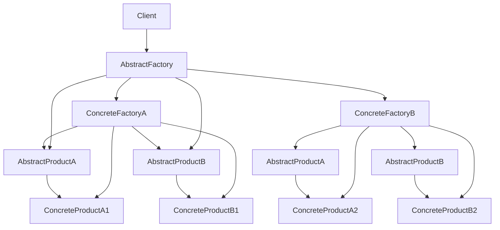

## Abstract Factory Pattern
### Core Concepts

*   **Purpose:** To provide an interface for creating families of related or dependent objects without specifying their concrete classes.
*   **"Factory of Factories":** It abstracts the creation process of related objects. Instead of creating concrete products directly, clients interact with an abstract factory, which in turn creates concrete products.
*   **Enforces Consistency:** Ensures that the products created by a factory are compatible with each other.

### Key Details & Nuances

*   **Abstract Factory Interface:** Declares a set of operations for creating abstract products.
*   **Concrete Factories:** Implement the operations defined by the Abstract Factory interface to create concrete products. Each concrete factory creates a specific *family* of products.
*   **Abstract Products:** Declares interfaces for a type of abstract product.
*   **Concrete Products:** Define the concrete products to be created by the corresponding concrete factory. They implement the Abstract Product interfaces.
*   **Client:** Uses only interfaces declared by Abstract Factory and Abstract Product classes. This decouples the client from concrete factory and concrete product implementations.
*   **Intent:** "Specify families of related or dependent objects to create without exposing their concrete classes." (Gang of Four)

### Practical Examples

Consider a UI toolkit that needs to support different operating system themes (e.g., Windows, macOS).

```typescript
// Abstract Products
interface Button {
  render(): void;
}

interface Window {
  render(): void;
}

// Concrete Products (Windows)
class WindowsButton implements Button {
  render(): void {
    console.log("Rendering Windows Button");
  }
}

class WindowsWindow implements Window {
  render(): void {
    console.log("Rendering Windows Window");
  }
}

// Concrete Products (macOS)
class MacButton implements Button {
  render(): void {
    console.log("Rendering macOS Button");
  }
}

class MacWindow implements Window {
  render(): void {
    console.log("Rendering macOS Window");
  }
}

// Abstract Factory
interface GUIFactory {
  createButton(): Button;
  createWindow(): Window;
}

// Concrete Factories
class WindowsFactory implements GUIFactory {
  createButton(): Button {
    return new WindowsButton();
  }

  createWindow(): Window {
    return new WindowsWindow();
  }
}

class MacFactory implements GUIFactory {
  createButton(): Button {
    return new MacButton();
  }

  createWindow(): Window {
    return new MacWindow();
  }
}

// Client Code
function createUI(factory: GUIFactory) {
  const button = factory.createButton();
  const window = factory.createWindow();

  button.render();
  window.render();
}

// Usage
console.log("--- Using Windows Factory ---");
const windowsFactory = new WindowsFactory();
createUI(windowsFactory);

console.log("\n--- Using macOS Factory ---");
const macFactory = new MacFactory();
createUI(macFactory);
```



### Common Pitfalls & Trade-offs

*   **Complexity:** Can introduce many new classes and interfaces, making the codebase more complex.
*   **Adding New Product Types:** If you need to add a new product *type* (e.g., a `Checkbox`), you need to add it to *every* existing Concrete Factory and the Abstract Factory interface. This violates the Open/Closed Principle.
*   **When to Use:** When a system should be independent of how its products are created, composed, and represented, and when a family of related product objects must be used together.

### Interview Questions

1.  **When would you choose the Abstract Factory pattern over the Factory Method pattern?**
    *   **Answer:** Factory Method is for creating a single type of product, delegating creation to subclasses. Abstract Factory is for creating *families* of related products, where the interaction between products within a family is crucial. Abstract Factory provides a higher level of abstraction for creating sets of products.

2.  **What are the main advantages of using the Abstract Factory pattern?**
    *   **Answer:** It decouples the client from concrete product implementations, enforces compatibility between products within a family, and allows for easier swapping of product families by simply changing the concrete factory used.

3.  **What is the primary drawback of the Abstract Factory pattern, especially when it comes to adding new product types?**
    *   **Answer:** Adding a new product type requires modifying the Abstract Factory interface and all Concrete Factory implementations, violating the Open/Closed Principle for product types.

4.  **How does the Abstract Factory pattern relate to the Open/Closed Principle?**
    *   **Answer:** It adheres to the Open/Closed Principle concerning *clients* and *concrete factories* (they can be added without affecting existing code). However, it violates it concerning *new product types*, which necessitate changes to the abstract factory and all concrete factories.