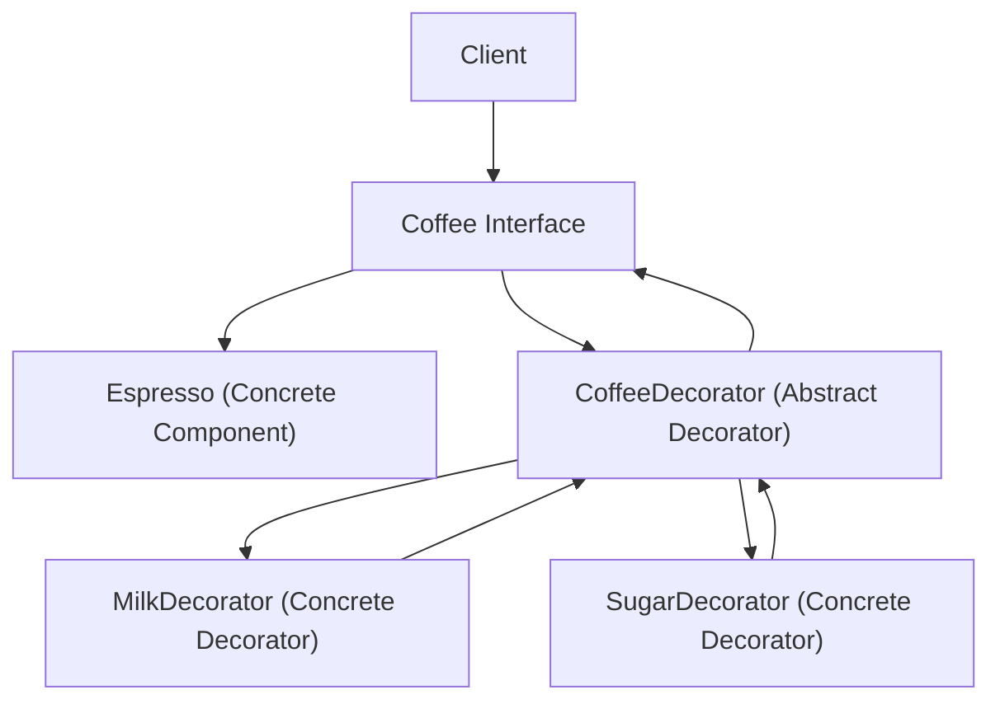

## Decorator Pattern
### Core Concepts

*   **Intent:** Attach additional responsibilities to an object dynamically. Decorators provide a flexible alternative to subclassing for extending functionality.
*   **Structural Pattern:** Focuses on object composition and relationships.
*   **Wrapper:** Acts as a wrapper around another object (the "component") that conforms to the same interface.

### Key Details & Nuances

*   **Open/Closed Principle:** Supports extending functionality without modifying existing code.
*   **Composition over Inheritance:** Favors building functionality by combining objects rather than inheriting from classes.
*   **Single Responsibility Principle:** Each decorator can be responsible for a single piece of functionality.
*   **Decorator (`CondimentDecorator`):**
    *   Has a reference to a `Component` object.
    *   Implements the `Component` interface.
    *   Delegates calls to its contained `Component` object and adds its own behavior before or after the delegation.
*   **Concrete Component (`Espresso`, `HouseBlend`):** The base object to which responsibilities are added.
*   **Concrete Decorator (`Milk`, `Sugar`, `Whip`):** Adds specific functionality.
*   **Dynamic Addition:** Responsibilities can be added at runtime. Multiple decorators can be "stacked."

### Practical Examples

#### Coffee Shop Example (TypeScript)

```typescript
// Component Interface
interface Coffee {
    getCost(): number;
    getDescription(): string;
}

// Concrete Component
class Espresso implements Coffee {
    getCost(): number {
        return 1.0;
    }
    getDescription(): string {
        return "Espresso";
    }
}

// Base Decorator (Abstract)
abstract class CoffeeDecorator implements Coffee {
    protected decoratedCoffee: Coffee;

    constructor(coffee: Coffee) {
        this.decoratedCoffee = coffee;
    }

    // Default implementation delegates to the wrapped component
    getCost(): number {
        return this.decoratedCoffee.getCost();
    }

    getDescription(): string {
        return this.decoratedCoffee.getDescription();
    }
}

// Concrete Decorators
class MilkDecorator extends CoffeeDecorator {
    constructor(coffee: Coffee) {
        super(coffee);
    }

    getCost(): number {
        return super.getCost() + 0.5;
    }

    getDescription(): string {
        return super.getDescription() + ", Milk";
    }
}

class SugarDecorator extends CoffeeDecorator {
    constructor(coffee: Coffee) {
        super(coffee);
    }

    getCost(): number {
        return super.getCost() + 0.2;
    }

    getDescription(): string {
        return super.getDescription() + ", Sugar";
    }
}

// Usage
let myCoffee: Coffee = new Espresso();
console.log(`${myCoffee.getDescription()} $${myCoffee.getCost()}`); // Espresso $1

myCoffee = new MilkDecorator(myCoffee);
console.log(`${myCoffee.getDescription()} $${myCoffee.getCost()}`); // Espresso, Milk $1.5

myCoffee = new SugarDecorator(myCoffee);
console.log(`${myCoffee.getDescription()} $${myCoffee.getCost()}`); // Espresso, Milk, Sugar $1.7
```

#### Mermaid Diagram



### Common Pitfalls & Trade-offs

*   **Deeply Nested Decorators:** Can lead to complex code and harder debugging. Consider if a more direct class hierarchy might be clearer for many added features.
*   **Interface Consistency:** All decorators and the component must adhere to the same interface for seamless composition.
*   **Performance:** Each decorator adds an extra layer of indirection, which can have a minor performance overhead compared to direct method calls or subclassing. This is rarely a practical concern unless in extreme performance-critical loops.
*   **Object Identity:** Decorators often break object identity. `new MilkDecorator(new Espresso()) === new Espresso()` will be false.

### Interview Questions

1.  **When would you prefer the Decorator pattern over subclassing to add functionality?**
    *   **Answer:** Prefer Decorator when you need to add responsibilities to objects dynamically, or when subclassing would lead to a combinatorial explosion of classes (e.g., for combinations of features). It also adheres better to the Open/Closed Principle and Single Responsibility Principle.

2.  **Describe the relationship between the Decorator and the Component it decorates.**
    *   **Answer:** The Decorator holds a reference to an instance of the Component (or another Decorator) that implements the same interface. It delegates calls to this wrapped object and adds its own behavior before or after the delegation.

3.  **Can you give an example of when the Decorator pattern might be overkill?**
    *   **Answer:** If the functionality to be added is static, always present, and unlikely to change or be combined in many ways, subclassing might be simpler and more direct. For example, if a `Car` always has an `Engine` and you're just adding a specific type of engine, inheritance might be clearer than decorating.

4.  **How does the Decorator pattern help with the Open/Closed Principle?**
    *   **Answer:** It allows you to extend the behavior of an object without modifying its existing code. New functionalities are added by creating new decorator classes that wrap the original component, keeping the original code unchanged and open for extension.