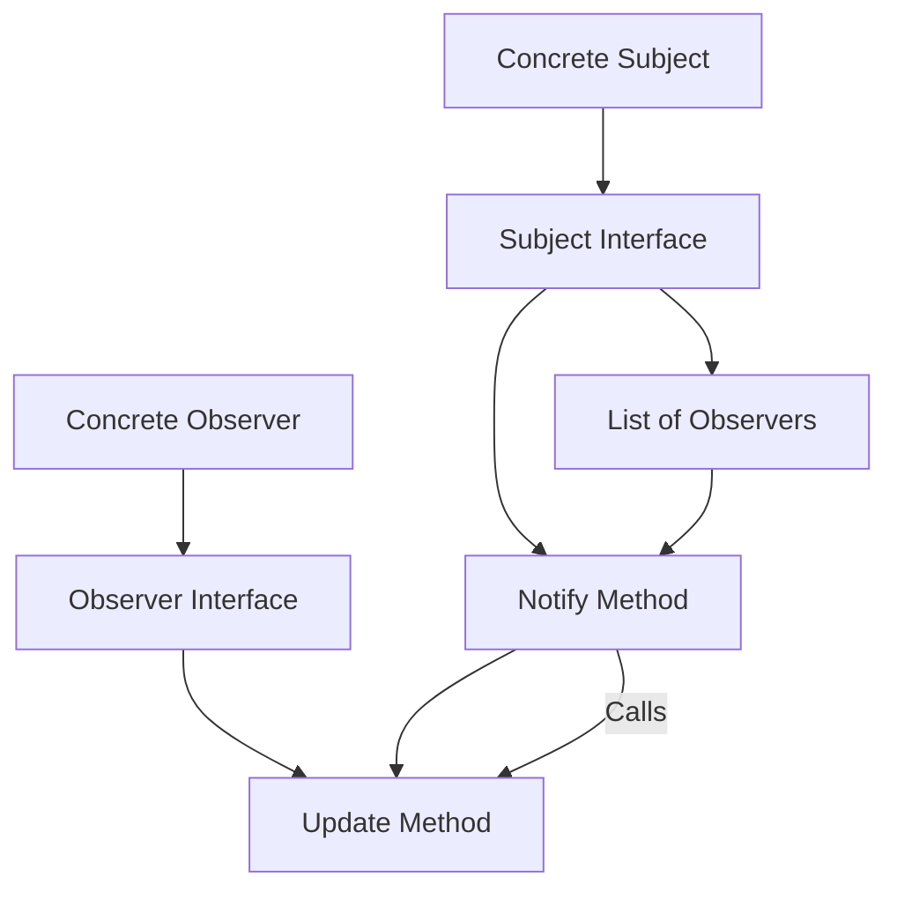

## Observer Pattern
### Core Concepts

*   **Decoupling:** Observer pattern allows objects (observers) to subscribe to changes in another object (subject). The subject notifies subscribed observers without needing to know their concrete types.
*   **One-to-Many Dependency:** Establishes a clear one-to-many dependency where a change in the subject state triggers an update in all dependent observers.
*   **Event-Driven Architecture:** Forms a foundational element in event-driven systems, where actions trigger reactions across different parts of an application.

### Key Details & Nuances

*   **Subject (Observable):**
    *   Maintains a list of observers.
    *   Provides methods to attach (`subscribe`) and detach (`unsubscribe`) observers.
    *   Has a `notify` method that iterates through its observers and calls their update methods.
*   **Observer (Subscriber):**
    *   Defines an update interface (e.g., `update()` method).
    *   When notified by the subject, it performs an action, often pulling the latest data from the subject.
*   **Push vs. Pull:**
    *   **Push:** Subject sends specific data with the notification. Simpler for observers but can lead to unnecessary data transfer if observers don't need it all.
    *   **Pull:** Subject notifies observers with a generic message, and observers then query the subject for the data they need. More efficient data transfer, but observers need knowledge of subject's data structure.
*   **Concrete Implementations:**
    *   **Concrete Subject:** Implements the Subject interface. Manages its own state and calls `notify()` when the state changes.
    *   **Concrete Observer:** Implements the Observer interface. Responds to notifications and performs specific actions based on the subject's state.
*   **Notification Order:** The order in which observers are notified is typically not guaranteed unless explicitly managed. This can be a critical detail in some scenarios.
*   **Self-Registration:** Observers can register themselves with the subject.

### Practical Examples

```typescript
// Subject Interface
interface Subject {
  subscribe(observer: Observer): void;
  unsubscribe(observer: Observer): void;
  notify(): void;
}

// Observer Interface
interface Observer {
  update(): void;
}

// Concrete Subject
class WeatherStation implements Subject {
  private observers: Observer[] = [];
  private temperature: number = 0;

  subscribe(observer: Observer): void {
    this.observers.push(observer);
  }

  unsubscribe(observer: Observer): void {
    this.observers = this.observers.filter(obs => obs !== observer);
  }

  notify(): void {
    for (const observer of this.observers) {
      observer.update();
    }
  }

  setTemperature(newTemperature: number): void {
    console.log(`WeatherStation: Temperature set to ${newTemperature}°C`);
    this.temperature = newTemperature;
    this.notify();
  }

  getTemperature(): number {
    return this.temperature;
  }
}

// Concrete Observer
class CurrentConditionsDisplay implements Observer {
  private temperature: number = 0;
  private subject: WeatherStation;

  constructor(subject: WeatherStation) {
    this.subject = subject;
    this.subject.subscribe(this);
  }

  update(): void {
    // Pull the data from the subject
    this.temperature = this.subject.getTemperature();
    this.display();
  }

  display(): void {
    console.log(`CurrentConditionsDisplay: Temperature is ${this.temperature}°C`);
  }
}

// Usage
const weatherStation = new WeatherStation();
const currentDisplay = new CurrentConditionsDisplay(weatherStation);

weatherStation.setTemperature(25);
// Output:
// WeatherStation: Temperature set to 25°C
// CurrentConditionsDisplay: Temperature is 25°C

weatherStation.setTemperature(30);
// Output:
// WeatherStation: Temperature set to 30°C
// CurrentConditionsDisplay: Temperature is 30°C
```



### Common Pitfalls & Trade-offs

*   **Memory Leaks:** Observers must be unsubscribed when they are no longer needed to prevent the subject from holding references to dead objects.
*   **Cascading Updates:** If an observer's update logic causes another subject to notify its observers, it can lead to complex, hard-to-debug cascading notification chains.
*   **Performance with Many Observers:** If a subject has a very large number of observers, the `notify()` operation can become a bottleneck.
*   **Tight Coupling (Accidental):** While the pattern aims for decoupling, if observers rely too heavily on the specific implementation details or the "push" data format of the subject, tight coupling can re-emerge.
*   **Order of Notification:** Lack of guaranteed order can be an issue if observers depend on each other's actions in a specific sequence.

### Interview Questions

1.  **What is the primary benefit of the Observer pattern?**
    *   **Answer:** It promotes loose coupling between objects. The subject doesn't need to know anything about its observers, other than that they implement the observer interface. This allows for greater flexibility and maintainability, as observers can be added or removed dynamically without modifying the subject.

2.  **Explain the difference between the "push" and "pull" models in the Observer pattern.**
    *   **Answer:** In the **push** model, the subject sends specific data relevant to the change along with the notification. In the **pull** model, the subject sends a generic notification, and the observer then queries the subject to retrieve the data it needs. Push is simpler for observers but can be inefficient if observers don't need all the data. Pull is more efficient in data transfer but requires observers to have knowledge of how to get the data from the subject.

3.  **How can you prevent memory leaks when using the Observer pattern?**
    *   **Answer:** Ensure that observers are explicitly unsubscribed from the subject when they are no longer needed. This typically involves adding an `unsubscribe` method to the subject and calling it when an observer's lifecycle ends or when it is disposed of. Failing to unsubscribe can leave dangling references, preventing garbage collection.

4.  **Describe a scenario where the order of observer notification might matter.**
    *   **Answer:** Consider a system where a user action triggers multiple updates: first, a UI element needs to be rendered, and second, some background data needs to be persisted. If the persistence happens first, and it asynchronously updates some state that the UI rendering depends on, a specific notification order (UI update then persistence update) might be crucial for correctness. Without guaranteed order, the UI might render with stale data.