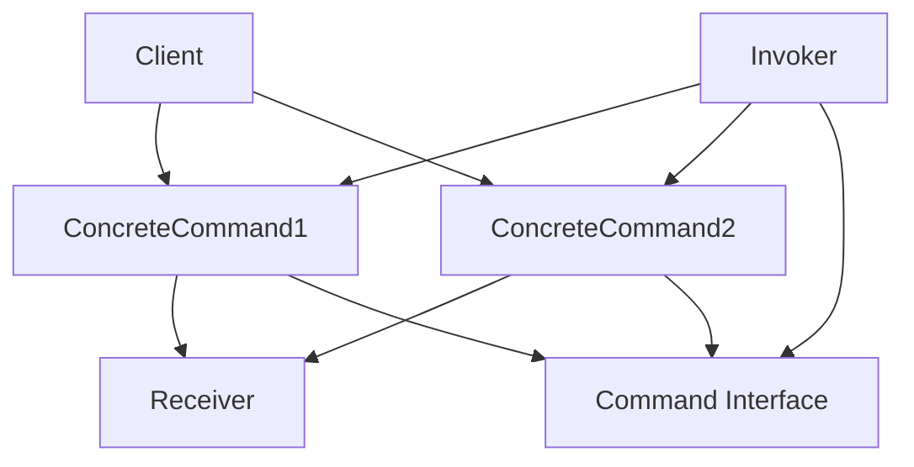

## Command Pattern
### Core Concepts

*   **Purpose:** Encapsulates a request as an object, thereby letting you parameterize clients with different requests, queue or log requests, and support undoable operations.
*   **Key Components:**
    *   **Command:** Declares an interface for executing an operation.
    *   **ConcreteCommand:** Implements the Command interface and defines the receiver to invoke the operation on.
    *   **Receiver:** Knows how to perform the operations associated with carrying out a request. Any class can be a receiver.
    *   **Invoker:** Asks the command to carry out the request. The invoker typically holds a reference to a command object.
    *   **Client:** Creates a ConcreteCommand object and sets its receiver.

### Key Details & Nuances

*   **Decoupling:** The invoker is decoupled from the receiver. The invoker doesn't need to know *how* the operation is performed, only that it can be invoked via the Command interface.
*   **Parameterization:** Requests are turned into objects, allowing them to be treated as data. This enables actions to be passed around, stored, or queued.
*   **Undo/Redo:** Commands can implement undo logic. Typically, the `execute()` method stores state needed for `undo()`.
*   **Macro Commands:** A composite command that groups multiple commands into a single command.
*   **State Management:** The receiver often holds the state. Commands might also hold state if they need to maintain context for undo/redo or delayed execution.

### Practical Examples

**Scenario: A light switch controller**

```typescript
// Receiver: Knows how to perform actions
class Light {
    turnOn(): void {
        console.log("Light is ON");
    }
    turnOff(): void {
        console.log("Light is OFF");
    }
}

// Command Interface
interface Command {
    execute(): void;
    undo(): void; // For undoable operations
}

// Concrete Command for Turning On
class LightOnCommand implements Command {
    private light: Light;
    constructor(light: Light) {
        this.light = light;
    }
    execute(): void {
        this.light.turnOn();
    }
    undo(): void {
        this.light.turnOff(); // Undo by turning off
    }
}

// Concrete Command for Turning Off
class LightOffCommand implements Command {
    private light: Light;
    constructor(light: Light) {
        this.light = light;
    }
    execute(): void {
        this.light.turnOff();
    }
    undo(): void {
        this.light.turnOn(); // Undo by turning on
    }
}

// Invoker: Holds a command and executes it
class Switch {
    private command: Command | null = null;

    setCommand(command: Command): void {
        this.command = command;
    }

    pressButton(): void {
        if (this.command) {
            this.command.execute();
        } else {
            console.log("No command set.");
        }
    }

    pressUndoButton(): void {
        if (this.command) {
            this.command.undo();
        } else {
            console.log("No command to undo.");
        }
    }
}

// Client: Creates commands and sets them on the invoker
const light = new Light();
const switchControl = new Switch();

const onCommand = new LightOnCommand(light);
const offCommand = new LightOffCommand(light);

switchControl.setCommand(onCommand);
switchControl.pressButton(); // Output: Light is ON

switchControl.setCommand(offCommand);
switchControl.pressButton(); // Output: Light is OFF

switchControl.setCommand(onCommand);
switchControl.pressButton(); // Output: Light is ON
switchControl.pressUndoButton(); // Output: Light is OFF
```

**Mermaid Diagram:**



### Common Pitfalls & Trade-offs

*   **Overhead:** For very simple operations, the Command pattern can introduce unnecessary complexity and boilerplate code.
*   **Number of Classes:** Can lead to a proliferation of small command classes if not managed carefully.
*   **State Persistence:** If the receiver's state is complex or needs to be persisted, undo logic can become intricate.

### Interview Questions

1.  **When would you choose the Command pattern over a simple method call?**
    *   **Answer:** When you need to parameterize objects by an action, queue or log actions, support undo/redo, or decouple the invoker from the receiver's implementation details. It's useful when actions need to be treated as first-class objects.

2.  **How does the Command pattern facilitate undo/redo functionality?**
    *   **Answer:** Each ConcreteCommand stores the necessary state to reverse its operation (often the receiver itself and any parameters changed). The `undo()` method on the Command interface is implemented to revert the receiver to its previous state. The Invoker can maintain a history of executed commands for multi-level undo/redo.

3.  **What are the trade-offs of using the Command pattern?**
    *   **Answer:** Trade-offs include increased complexity due to the number of classes involved (Command, ConcreteCommand, Receiver, Invoker) and potential boilerplate code for simple actions. However, it offers significant benefits in flexibility, decoupling, and extensibility for complex command-driven systems.

4.  **Can you give an example of a situation where the Command pattern is particularly useful?**
    *   **Answer:** GUI applications (e.g., menu items, toolbar buttons), text editors (undo/redo, macros), task schedulers, or any system where operations need to be queued, logged, or reversed. For instance, a graphics editor could use commands for drawing shapes, filling colors, or transforming objects.