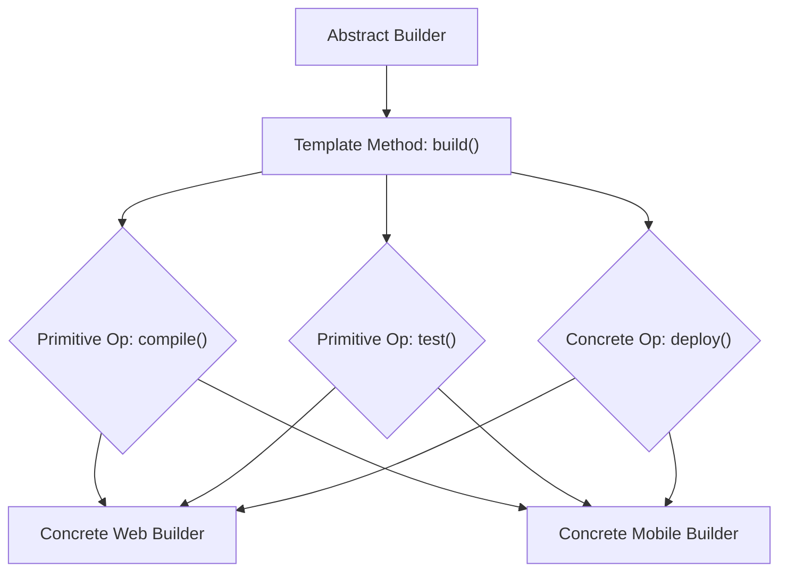

## Template Method Pattern
### Core Concepts

*   **Intent:** Defines the skeleton of an algorithm in an operation, deferring some steps to subclasses.
*   **Mechanism:** Allows subclasses to redefine certain steps of an algorithm without changing the algorithm's structure.
*   **Core Components:**
    *   **Abstract Class/Base Class:** Contains the template method and abstract primitive operations.
    *   **Template Method:** Defines the algorithm's skeleton, calling primitive operations.
    *   **Primitive Operations:** Abstract or concrete methods that subclasses implement to customize algorithm steps.
    *   **Concrete Classes:** Subclasses that implement the primitive operations to provide specific algorithm variations.

### Key Details & Nuances

*   **Inversion of Control:** The template method controls the algorithm's flow, calling subclass methods at specific points.
*   **Hook Methods:**
    *   **Abstract Primitive Operations:** Must be implemented by subclasses (e.g., `abstract void step1();`).
    *   **Concrete Primitive Operations:** Can be overridden by subclasses if needed, but have default behavior (e.g., `void hookMethod() {}`).
    *   **Default Behavior:** Hooks allow for optional customization without forcing subclasses to implement every step.
*   **Hierarchy:** Enforces a consistent algorithm structure across related classes.
*   **Single Responsibility Principle (SRP):** The base class handles the algorithm's core structure, while subclasses handle specific variations of steps.
*   **Open/Closed Principle (OCP):** The algorithm structure (in the base class) is closed for modification, but new variations can be added by creating new subclasses (open for extension).

### Practical Examples

*   **Algorithm Structure:** Imagine a build process for an application.

```typescript
abstract class Builder {
    // The template method defining the algorithm's skeleton
    build(): void {
        this.compile();
        this.test();
        this.deploy();
    }

    // Primitive operations that subclasses must implement
    protected abstract compile(): void;
    protected abstract test(): void;

    // Concrete operation with default behavior (can be overridden)
    protected deploy(): void {
        console.log("Deploying to staging...");
    }
}

class WebBuilder extends Builder {
    protected compile(): void {
        console.log("Compiling web assets...");
    }

    protected test(): void {
        console.log("Running web tests...");
    }
}

class MobileBuilder extends Builder {
    protected compile(): void {
        console.log("Compiling mobile app...");
    }

    protected test(): void {
        console.log("Running mobile tests...");
    }

    protected deploy(): void {
        console.log("Deploying to app store...");
    }
}

const webApp = new WebBuilder();
webApp.build();
// Output:
// Compiling web assets...
// Running web tests...
// Deploying to staging...

const mobileApp = new MobileBuilder();
mobileApp.build();
// Output:
// Compiling mobile app...
// Running mobile tests...
// Deploying to app store...
```

*   **Mermaid Diagram:**



### Common Pitfalls & Trade-offs

*   **Complexity:** Can lead to a large number of small methods if not managed carefully.
*   **Subclass Explosion:** For very different variations, it might become unwieldy. Consider Strategy Pattern if behavior varies drastically.
*   **Tight Coupling:** Subclasses are tightly coupled to the base class's algorithm structure.
*   **Overuse:** Applying it where simple polymorphism or composition would suffice.
*   **"Vertical" Reuse:** Primarily facilitates code reuse within a class hierarchy.

### Interview Questions

1.  **What is the Template Method pattern and what problem does it solve?**
    *   **Answer:** It's a behavioral design pattern that defines a skeleton of an algorithm in a base class, allowing subclasses to override specific steps without altering the algorithm's overall structure. It solves the problem of having a common algorithm with variations in specific steps, promoting code reuse and adhering to OCP.

2.  **When would you choose the Template Method pattern over the Strategy pattern?**
    *   **Answer:** Use Template Method when the algorithm's structure is fixed but specific *steps* vary. It's about *how* an algorithm is executed. Use Strategy when entire algorithms can be swapped out interchangeably, often varying the *core behavior* itself. Template Method implies a strong "is-a" relationship within a hierarchy, while Strategy often uses composition and has a weaker coupling.

3.  **Explain the role of "hook" methods in the Template Method pattern.**
    *   **Answer:** Hook methods are optional primitive operations in the abstract class. They can either be abstract (requiring subclass implementation) or concrete with a default behavior. They allow subclasses to participate in the algorithm's execution at predefined points, providing customization without forcing subclasses to implement every single step.

4.  **What are the advantages and disadvantages of the Template Method pattern?**
    *   **Answer:**
        *   **Advantages:** Promotes code reuse, enforces algorithm structure, supports OCP and SRP, reduces boilerplate.
        *   **Disadvantages:** Can increase class hierarchy complexity, subclasses are tightly coupled to the base class, potential for "vertical" coupling if not carefully designed.