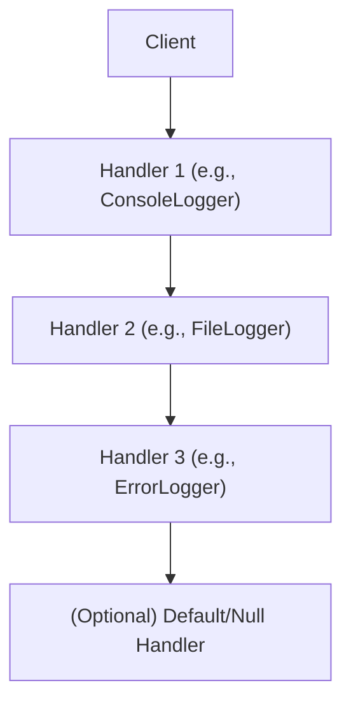

## Chain of Responsibility Pattern
### Core Concepts

*   **Purpose:** Decouples the sender of a request from its receivers. A request can be processed by one of many handlers.
*   **Mechanism:** Each handler has a reference to the next handler in the chain. If a handler cannot process the request, it passes it to the next handler.
*   **Goal:** Avoid binding the sender of a request to the receiver. Allows multiple objects a chance to handle the request without the sender needing to know which object will handle it.

### Key Details & Nuances

*   **Handler Interface/Abstract Class:** Defines a method for handling requests and a method to set the next handler.
*   **Concrete Handlers:** Implement the handler logic. They decide whether to process the request or pass it along.
*   **Request Flow:** The client initiates the request by sending it to the *first* handler in the chain.
*   **Termination:** The chain can be terminated by a handler that *consumes* the request, or by a default handler at the end if no other handler processes it.
*   **Flexibility:** The chain can be dynamically configured at runtime.
*   **vs. Observer Pattern:** Chain of Responsibility is for passing a command through a chain of potential processors; Observer is for notifying multiple interested parties about an event.

### Practical Examples

Consider a logging system where messages can have different levels (DEBUG, INFO, WARNING, ERROR).

```typescript
// Handler Interface
interface Logger {
    setNext(handler: Logger): Logger;
    handle(request: string, level: string): void;
}

// Concrete Handler: ConsoleLogger
class ConsoleLogger implements Logger {
    private nextHandler: Logger | null = null;

    setNext(handler: Logger): Logger {
        this.nextHandler = handler;
        return handler;
    }

    handle(request: string, level: string): void {
        if (level === 'DEBUG') {
            console.log(`[DEBUG] ${request}`);
        } else if (this.nextHandler) {
            this.nextHandler.handle(request, level);
        }
    }
}

// Concrete Handler: FileLogger
class FileLogger implements Logger {
    private nextHandler: Logger | null = null;

    setNext(handler: Logger): Logger {
        this.nextHandler = handler;
        return handler;
    }

    handle(request: string, level: string): void {
        if (level === 'INFO' || level === 'WARNING') {
            console.log(`[${level.toUpperCase()}] Logging to file: ${request}`);
        } else if (this.nextHandler) {
            this.nextHandler.handle(request, level);
        }
    }
}

// Concrete Handler: ErrorLogger
class ErrorLogger implements Logger {
    private nextHandler: Logger | null = null;

    setNext(handler: Logger): Logger {
        this.nextHandler = handler;
        return handler;
    }

    handle(request: string, level: string): void {
        if (level === 'ERROR') {
            console.error(`[ERROR] Critical error recorded: ${request}`);
        } else if (this.nextHandler) {
            this.nextHandler.handle(request, level);
        }
    }
}

// Client Code
const consoleLogger = new ConsoleLogger();
const fileLogger = new FileLogger();
const errorLogger = new ErrorLogger();

consoleLogger.setNext(fileLogger).setNext(errorLogger);

consoleLogger.handle("System starting...", "DEBUG");
// Output: [DEBUG] System starting...

consoleLogger.handle("User logged in.", "INFO");
// Output: [INFO] Logging to file: User logged in.

consoleLogger.handle("Disk space low.", "WARNING");
// Output: [WARNING] Logging to file: Disk space low.

consoleLogger.handle("Database connection failed.", "ERROR");
// Output: [ERROR] Critical error recorded: Database connection failed.

consoleLogger.handle("Some unknown message", "VERBOSE");
// No output as no handler matches
```

**Mermaid Diagram:**



### Common Pitfalls & Trade-offs

*   **No Handler:** If no handler in the chain can process the request, it might be silently ignored (unless a default handler is implemented).
*   **Performance:** For very long chains, there can be performance overhead due to multiple method calls.
*   **Complexity:** Managing the chain configuration can become complex if not done carefully.
*   **Debugging:** Tracing a request through a long chain can be difficult.

### Interview Questions

1.  **When would you choose the Chain of Responsibility pattern over a simple if-else or switch statement?**
    *   **Answer:** Use Chain of Responsibility when you have a significant number of conditional checks that are likely to grow or change, or when you want to decouple the request sender from the specific handler. It improves maintainability and extensibility by making it easy to add new handlers or reorder existing ones without modifying the client code or other handlers. If the logic is static and simple, if-else is sufficient.

2.  **What are the potential drawbacks of the Chain of Responsibility pattern?**
    *   **Answer:** Potential drawbacks include the possibility that a request might go unhandled if no handler in the chain can process it. Performance can be a concern with very long chains due to the overhead of multiple method calls. Debugging can also be more complex, as you need to trace the request through the entire chain.

3.  **How does the Chain of Responsibility pattern promote loose coupling?**
    *   **Answer:** It promotes loose coupling by ensuring that the sender of a request has no direct knowledge of the receiver. The client only needs to know about the first handler in the chain. Handlers themselves only need to know about their immediate successor, not the entire chain or the ultimate handler of the request. This allows handlers to be added, removed, or reordered without affecting the client or other handlers.