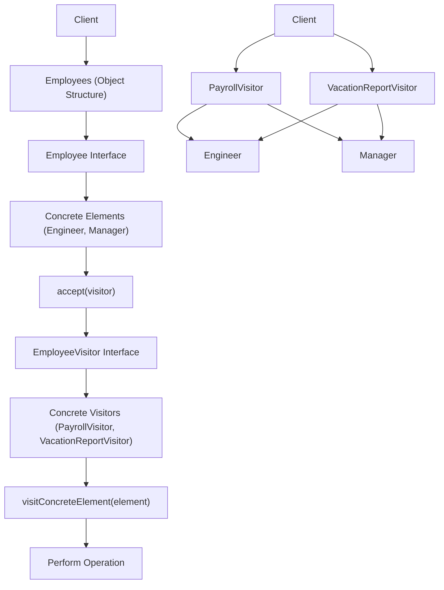

## Visitor Pattern
### Core Concepts

*   **Purpose:** Decouples an algorithm from the object structure on which it operates.
*   **Mechanism:** Allows adding new operations to existing object structures without modifying those structures.
*   **Structure:**
    *   **Visitor Interface:** Declares a `visit()` method for each concrete element type in the object structure.
    *   **Concrete Visitors:** Implement the `Visitor` interface to provide the actual operations. Each `visit()` method handles a specific concrete element type.
    *   **Element Interface:** Declares an `accept()` method that takes a `Visitor` as an argument.
    *   **Concrete Elements:** Implement the `Element` interface. Their `accept()` method typically calls the visitor's `visit()` method, passing `this` (the element instance) as an argument.
    *   **Object Structure:** A collection of `Element` objects that the visitor can traverse.

### Key Details & Nuances

*   **Open/Closed Principle:** Primarily addresses the "open for extension" part. New operations can be added by creating new visitors without changing existing `Element` classes.
*   **Double Dispatch:** The operation executed depends on two types: the type of the visitor and the type of the element being visited. The `accept` method in the element invokes the appropriate `visit` method on the visitor, which then dispatches based on the element's concrete type.
*   **Element Modification:** Adding new *element* types requires modifying the `Visitor` interface and all `ConcreteVisitor` implementations. This is a significant trade-off.
*   **State Management:** Visitors can maintain state as they traverse the object structure.
*   **Use Cases:**
    *   When an operation needs to be performed on many different types of objects, and these operations are unrelated.
    *   When you want to avoid cluttering element classes with operations that are only relevant in specific contexts.
    *   For tasks like serialization, pretty-printing, type checking, and complex calculations on hierarchical data structures.

### Practical Examples

Consider a system representing different types of employees in a company, and we want to perform operations like calculating payroll or generating reports.

```typescript
// Element Interface
interface Employee {
  accept(visitor: EmployeeVisitor): void;
  getSalary(): number;
  getVacationDays(): number;
}

// Concrete Elements
class Engineer implements Employee {
  private salary: number;
  private vacationDays: number;
  public projectId: string;

  constructor(salary: number, vacationDays: number, projectId: string) {
    this.salary = salary;
    this.vacationDays = vacationDays;
    this.projectId = projectId;
  }

  accept(visitor: EmployeeVisitor): void {
    visitor.visitEngineer(this);
  }

  getSalary(): number {
    return this.salary;
  }

  getVacationDays(): number {
    return this.vacationDays;
  }
}

class Manager implements Employee {
  private salary: number;
  private vacationDays: number;
  public directReportsCount: number;

  constructor(salary: number, vacationDays: number, directReportsCount: number) {
    this.salary = salary;
    this.vacationDays = vacationDays;
    this.directReportsCount = directReportsCount;
  }

  accept(visitor: EmployeeVisitor): void {
    visitor.visitManager(this);
  }

  getSalary(): number {
    return this.salary;
  }

  getVacationDays(): number {
    return this.vacationDays;
  }
}

// Visitor Interface
interface EmployeeVisitor {
  visitEngineer(engineer: Engineer): void;
  visitManager(manager: Manager): void;
}

// Concrete Visitors
class PayrollVisitor implements EmployeeVisitor {
  private totalPayroll: number = 0;

  visitEngineer(engineer: Engineer): void {
    this.totalPayroll += engineer.getSalary();
  }

  visitManager(manager: Manager): void {
    this.totalPayroll += manager.getSalary();
  }

  getTotalPayroll(): number {
    return this.totalPayroll;
  }
}

class VacationReportVisitor implements EmployeeVisitor {
  private totalVacationDays: number = 0;

  visitEngineer(engineer: Engineer): void {
    this.totalVacationDays += engineer.getVacationDays();
  }

  visitManager(manager: Manager): void {
    this.totalVacationDays += manager.getVacationDays();
  }

  getTotalVacationDays(): number {
    return this.totalVacationDays;
  }
}

// Object Structure
const employees: Employee[] = [
  new Engineer(75000, 20, "ProjectA"),
  new Manager(120000, 25, 5),
  new Engineer(80000, 22, "ProjectB"),
];

// Usage
const payrollVisitor = new PayrollVisitor();
employees.forEach(employee => employee.accept(payrollVisitor));
console.log("Total Payroll:", payrollVisitor.getTotalPayroll()); // Output: Total Payroll: 275000

const vacationVisitor = new VacationReportVisitor();
employees.forEach(employee => employee.accept(vacationVisitor));
console.log("Total Vacation Days:", vacationVisitor.getTotalVacationDays()); // Output: Total Vacation Days: 67
```



### Common Pitfalls & Trade-offs

*   **Adding New Elements:** The biggest drawback. If you need to add a new `ConcreteElement` (e.g., `SalesPerson`), you must update the `Visitor` interface and *all* concrete visitor implementations. This violates the Open/Closed principle for adding new elements.
*   **Complexity:** Can introduce complexity due to the additional interfaces and classes.
*   **Tight Coupling:** While it decouples algorithms from elements, visitors can become tightly coupled to the concrete element classes they visit.
*   **Element Visibility:** Visitors often need access to the internal state of elements, potentially breaking encapsulation if not designed carefully. The `getters` in the example are a way to manage this.
*   **Performance:** For simple operations or small object structures, the overhead of the pattern might not be justified.

### Interview Questions

1.  **When would you choose the Visitor pattern over other behavioral patterns like Strategy or Chain of Responsibility?**
    *   **Answer:** Use Visitor when you have a diverse and potentially growing set of operations that need to be performed on a stable object structure. It excels at adding new operations without modifying the element classes themselves. Strategy is for varying algorithms within a single object's context. Chain of Responsibility is for passing requests along a chain of handlers. Visitor is for operations that depend on the concrete types of objects in a composite structure.

2.  **What is the main disadvantage of the Visitor pattern, and how can it be mitigated?**
    *   **Answer:** The primary disadvantage is that adding new *element* types requires modifying the `Visitor` interface and all `ConcreteVisitor` implementations, violating the Open/Closed Principle for elements. Mitigation is difficult; often, the pattern is chosen when the element structure is expected to be relatively stable, or the benefits of easily adding new operations outweigh this drawback. If new elements are frequent, other patterns might be more suitable.

3.  **Explain how the Visitor pattern achieves double dispatch.**
    *   **Answer:** Double dispatch means the method called depends on two types: the visitor's type and the element's type. First, the client calls `element.accept(visitor)`. The `accept` method (implemented in the concrete element) then calls back to the visitor, passing itself: `visitor.visitConcreteElement(this)`. This second call (the "dispatch") on the visitor selects the correct `visit` method based on the element's concrete type.

4.  **Describe a scenario where the Visitor pattern might be an anti-pattern.**
    *   **Answer:** If the object structure (the set of `ConcreteElement` classes) is very dynamic and frequently changes by adding new types, Visitor becomes cumbersome. In such cases, if operations are tightly coupled to new element types, adding new methods to the element classes directly or using a different approach like overloading (in languages that support it for specific cases) might be simpler. Also, if the operations are very simple and don't justify the extra layers of abstraction, it can be an anti-pattern.