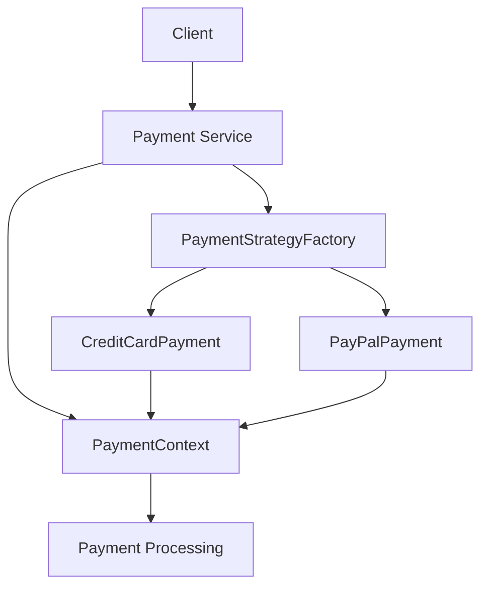

## Combining Patterns
### Core Concepts

*   **Object-Oriented Programming (OOP):** A programming paradigm based on the concept of "objects", which can contain data in the form of fields (often known as attributes or properties) and code in the form of procedures (often known as methods). Key principles:
    *   **Encapsulation:** Bundling data (attributes) and methods that operate on the data within a single unit (object). Hides internal state and requires interaction through public interfaces.
    *   **Abstraction:** Hiding complex implementation details and exposing only essential features. Focuses on "what" an object does, not "how" it does it.
    *   **Inheritance:** Mechanism where a new class (child/derived) derives properties and behaviors from an existing class (parent/base). Promotes code reuse.
    *   **Polymorphism:** The ability of an object to take on many forms. Allows methods to be called on objects of different types, where each type may implement the method differently.
*   **System Design:** The process of defining the architecture, modules, interfaces, and data for a system to satisfy specified requirements. Involves making high-level design choices and creating a roadmap for implementation.
*   **Design Patterns:** Reusable solutions to commonly occurring problems within a given context in software design. They are not finished designs that can be directly turned into code but rather descriptions or templates for how to solve a problem that can be used in many different situations.
*   **Anti-Patterns:** Common responses to recurring problems that are usually ineffective and risk-introducing. They are "bad" patterns.
*   **Combining Patterns:** Using multiple design patterns together to solve complex problems, often leading to more robust, flexible, and maintainable systems. This involves understanding how patterns interact and complement each other.

### Key Details & Nuances

*   **OOP in System Design:**
    *   **Modularity:** OOP naturally supports modularity, breaking down a system into self-contained objects.
    *   **Reusability:** Inheritance and composition facilitate code reuse.
    *   **Maintainability:** Encapsulation and abstraction make systems easier to understand and modify.
    *   **Scalability:** Well-designed OOP systems can often be scaled by distributing objects or services.
*   **System Design Considerations influenced by OOP:**
    *   **High-level architecture:** How will components (objects/services) interact? What are the boundaries? (e.g., Microservices vs. Monolith).
    *   **Data flow:** How does data move between objects and services?
    *   **State management:** How is state maintained and accessed?
    *   **Concurrency:** How are concurrent operations handled across objects/services?
*   **Combining Patterns - Synergies:**
    *   **Strategy + Factory:** Use Factory to create Strategy objects, allowing runtime selection of algorithms.
    *   **Observer + Singleton:** A Singleton can manage a list of observers or act as a subject that observers subscribe to.
    *   **Decorator + Factory:** Factory can create decorated objects, allowing flexible addition of responsibilities.
    *   **Adapter + Facade:** Adapter can be used to make incompatible interfaces work together, and Facade can provide a simplified interface to a subsystem built using Adapters.
*   **Anti-Patterns in OOP & System Design:**
    *   **God Object/Class:** A single object that knows or does too much, violating the Single Responsibility Principle.
    *   **Golden Hammer:** Using a familiar pattern/technology for everything, even when it's not the best fit.
    *   **Boat Anchor:** Keeping useless or obsolete code/components.
    *   **Blob:** A large, unwieldy, difficult-to-understand object or module.
    *   **Spaghetti Code:** Code with a complex and tangled control structure, especially one lacking structure.
    *   **Misuse of Inheritance:** Using inheritance for code reuse when composition is more appropriate (e.g., "is-a" vs. "has-a" relationship). Leads to tight coupling.
    *   **Over-Abstraction:** Creating too many layers of abstraction that complicate rather than simplify.

### Practical Examples

**Example: Combining Strategy Pattern with Factory Pattern for Payment Processing**

**Problem:** A system needs to support multiple payment methods (Credit Card, PayPal, Bank Transfer), and the specific payment logic can change or be extended.

**Solution:** Use the Strategy pattern for payment algorithms and the Factory pattern to create the appropriate Strategy object.

```typescript
// --- Strategy Pattern ---

// Strategy Interface
interface PaymentStrategy {
    pay(amount: number): void;
}

// Concrete Strategies
class CreditCardPayment implements PaymentStrategy {
    private cardNumber: string;

    constructor(cardNumber: string) {
        this.cardNumber = cardNumber;
    }

    pay(amount: number): void {
        console.log(`Paid ${amount} using Credit Card ${this.cardNumber}`);
    }
}

class PayPalPayment implements PaymentStrategy {
    private email: string;

    constructor(email: string) {
        this.email = email;
    }

    pay(amount: number): void {
        console.log(`Paid ${amount} using PayPal account ${this.email}`);
    }
}

// --- Factory Pattern ---

// Payment Strategy Factory
class PaymentStrategyFactory {
    static createPaymentStrategy(type: 'creditCard' | 'paypal', details: any): PaymentStrategy {
        switch (type) {
            case 'creditCard':
                if (!details || !details.cardNumber) {
                    throw new Error("Credit card number is required");
                }
                return new CreditCardPayment(details.cardNumber);
            case 'paypal':
                if (!details || !details.email) {
                    throw new Error("PayPal email is required");
                }
                return new PayPalPayment(details.email);
            default:
                throw new Error(`Unsupported payment type: ${type}`);
        }
    }
}

// --- Usage ---

const amount = 100;

// Using the Factory to get the correct Strategy
const creditCardStrategy = PaymentStrategyFactory.createPaymentStrategy('creditCard', { cardNumber: '1234-5678-9012-3456' });
creditCardStrategy.pay(amount); // Output: Paid 100 using Credit Card 1234-5678-9012-3456

const payPalStrategy = PaymentStrategyFactory.createPaymentStrategy('paypal', { email: 'user@example.com' });
payPalStrategy.pay(amount); // Output: Paid 100 using PayPal account user@example.com

// System can easily add new payment methods by creating a new concrete strategy
// and updating the factory.
```

**Mermaid Diagram: System Design with Combined Patterns (Simplified)**



### Common Pitfalls & Trade-offs

*   **Over-reliance on Inheritance:** Can lead to rigid class hierarchies and "diamond problem" issues. Composition is often preferred for flexibility ("has-a" relationship).
*   **Tight Coupling:** Poorly designed object interactions can create dependencies that make the system hard to change.
*   **Performance Overhead:** Some patterns (like excessive indirection or virtualization) can introduce performance costs. It's crucial to understand the performance implications of chosen patterns.
*   **Complexity Creep:** Combining too many patterns without clear purpose can make the system overly complex and difficult to understand.
*   **Ignoring Context:** Applying patterns without understanding the specific problem or system requirements can be counterproductive.
*   **Anti-Pattern: "Shotgun Surgery":** Making a single conceptual change requires making many small edits in many different classes. Often a result of poor encapsulation or incorrect decomposition.

### Interview Questions

1.  **Question:** Explain how you would use OOP principles to design a scalable e-commerce platform. What specific design patterns would be most beneficial, and why?
    **Answer:** I'd leverage **Encapsulation** to create modules like `User`, `Product`, `Order`, and `Payment`, hiding their internal complexities. **Abstraction** would define interfaces for services like `PaymentGateway` or `InventoryService`, allowing for different implementations (e.g., Stripe vs. PayPal) without affecting the core `Order` logic. **Inheritance** could be used for product variations (e.g., `Book` inherits from `Product`). **Polymorphism** is key for handling different product types or payment methods uniformly.
    Crucially, patterns like **Strategy** (for payment methods, shipping options), **Factory** (to create different `Product` types or `PaymentStrategy` objects), **Observer** (for order status updates), and **Repository** (to abstract data access) would be vital for modularity, flexibility, and testability. **Composition** would be preferred over inheritance for most relationships to avoid tight coupling.

2.  **Question:** Describe a scenario where applying the Strategy pattern would be beneficial in a system design. What anti-patterns might you be trying to avoid by using it?
    **Answer:** A common scenario is handling different algorithms for a task, such as data compression, sorting, or payment processing. For example, in a file processing service, one might need to support GZIP, ZIP, and RAR compression.
    Using the **Strategy pattern** allows us to encapsulate each algorithm into a separate class implementing a common interface (e.g., `CompressionStrategy`). The client code (e.g., a `FileProcessor` class) can then hold a reference to a `CompressionStrategy` object and delegate the compression task to it. This avoids large conditional statements (`if/else if/else` or `switch`) in the client class, which is a form of **"Conditional Complexity"** or **"God Object"** anti-pattern, where a single class tries to handle too many variations. It also promotes the **Open/Closed Principle**, allowing new compression algorithms to be added without modifying existing client code.

3.  **Question:** You've identified a need to simplify the interface to a complex subsystem. Which design pattern would you consider, and how might it interact with other patterns like Adapter?
    **Answer:** The **Facade pattern** is ideal for simplifying the interface to a complex subsystem. It provides a unified, higher-level interface that makes the subsystem easier to use. A Facade hides the complexities of the subsystem by delegating client requests to the appropriate objects within the subsystem.
    It often works in conjunction with **Adapter**. For instance, if the subsystem contains many classes with incompatible interfaces, you might use the **Adapter pattern** to wrap these classes so they present a consistent interface *to the subsystem itself*. The **Facade** then uses these adapted interfaces to provide its simplified view to the external client. In essence, Adapters make components within the subsystem work together, and the Facade provides a simpler entry point to the now-unified subsystem.

4.  **Question:** What are the dangers of overusing inheritance in system design, and how can composition be a better alternative in many cases?
    **Answer:** Dangers of overusing inheritance include:
    *   **Tight Coupling:** Child classes are tightly bound to their parent's implementation details. Changes in the parent can break child classes.
    *   **Fragile Base Class Problem:** Modifying a base class can have unintended consequences on all derived classes.
    *   **Limited Flexibility:** A class can only inherit from one base class (in most languages), limiting reuse options.
    *   **"Is-a" vs. "Has-a":** Misinterpreting relationships (e.g., using inheritance when a "has-a" relationship via composition is more appropriate) leads to semantic errors and design flaws.
    **Composition** is often a better alternative because:
    *   **Flexibility:** Objects hold references to other objects, allowing behavior to be changed at runtime by swapping out components.
    *   **Loose Coupling:** Objects interact through well-defined interfaces, reducing dependencies.
    *   **Reusability:** Components can be composed in many different ways, promoting code reuse without the rigidity of inheritance hierarchies.
    *   **Maintainability:** It's generally easier to modify or replace individual components than to refactor deeply nested inheritance trees.
    This principle is often summarized by the saying: "Favor Composition Over Inheritance."