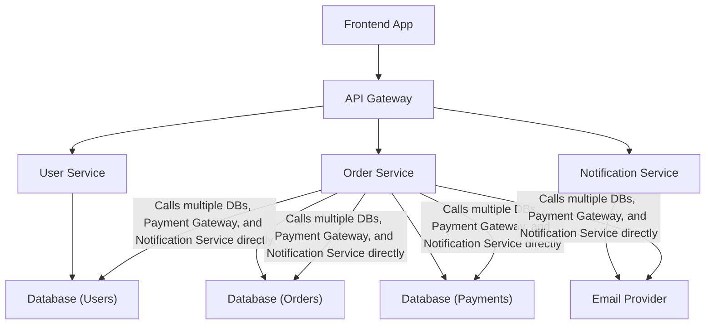

## Common Anti-Patterns
### Core Concepts

*   **Object-Oriented Programming (OOP):** A programming paradigm based on the concept of "objects", which can contain data (fields or attributes) and code (procedures or methods). Key principles include **Encapsulation**, **Abstraction**, **Inheritance**, and **Polymorphism**.
*   **System Design:** The process of defining the architecture, modules, interfaces, and data for a system to satisfy specified requirements. It involves breaking down a system into smaller, manageable parts.
*   **Anti-Patterns:** Common responses to recurring problems that are usually ineffective and risk being counterproductive. They represent poor design choices or implementation strategies.

### Key Details & Nuances

*   **Relationship between OOP and System Design:** OOP principles often guide how we structure components and their interactions within a larger system design. Well-designed classes with clear responsibilities (encapsulation, abstraction) contribute to modular and maintainable systems. Inheritance and polymorphism can be used to model relationships and behaviors, influencing how components can be extended or swapped.
*   **System Design & Anti-Patterns Focus:** In system design interviews, identifying and avoiding anti-patterns is crucial for building scalable, maintainable, and performant systems. Recognizing these patterns allows for conscious decision-making about trade-offs.

### Common Anti-Patterns in System Design (with OOP implications)

*   **The God Object (or God Class):**
    *   **Description:** A single class that knows or does too much. It centralizes all functionality, violating the Single Responsibility Principle (SRP) from OOP.
    *   **Impact:** High coupling, low cohesion, difficult to test, maintain, and extend. Changes to one part of the system likely affect this monolithic class.
    *   **Example:** A `UserManager` class that handles authentication, user profile management, notification sending, and database interactions.

*   **The Blob (or Lava Flow):**
    *   **Description:** Similar to the God Object, but often manifests as a large, complex subsystem or module that is hard to understand or modify. It's a tangled mess of interdependencies.
    *   **Impact:** Extremely difficult to refactor or replace. High risk of introducing bugs when making changes. Inhibits parallel development.

*   **Boat Anchor:**
    *   **Description:** A component or piece of code that is no longer used but is kept around "just in case." It adds complexity without providing value.
    *   **Impact:** Increases codebase size, confusion, and maintenance overhead. Can mislead developers about system functionality.

*   **Golden Hammer:**
    *   **Description:** The tendency to overuse a familiar tool, pattern, or technology for every problem, even when it's not the best fit.
    *   **Impact:** Suboptimal solutions, performance issues, increased complexity. For example, using a heavyweight framework for a simple task.

*   **Feature Envy:**
    *   **Description:** A method that is more interested in the data of another object than the data of its own object. Violates encapsulation by accessing another object's internal state excessively.
    *   **Impact:** High coupling between objects. Suggests that the method might be in the wrong class.

*   **Spaghetti Code:**
    *   **Description:** Code with a complex and tangled control flow structure, often characterized by excessive use of `goto` statements (less common now), deeply nested conditionals, and lack of clear modularity.
    *   **Impact:** Extremely hard to read, understand, debug, and maintain.

*   **Magic Numbers/Strings:**
    *   **Description:** Using literal values (numbers or strings) directly in the code without explanation or definition.
    *   **Impact:** Reduces readability and maintainability. If the value needs to change, it must be found and replaced everywhere it's used.
    *   **Example:** `if (status == 3)` instead of `if (status == OrderStatus.PROCESSING)`.

### Practical Examples

*   **Illustrating "The Blob" anti-pattern:**


*   **Illustrating "Magic Numbers" anti-pattern:**

```typescript
// Anti-pattern
function calculateDiscount(price: number, userType: number): number {
    if (userType === 1) { // 1 for standard user
        return price * 0.95;
    } else if (userType === 2) { // 2 for premium user
        return price * 0.90;
    }
    return price;
}

// Improved version
enum UserType {
    STANDARD = 1,
    PREMIUM = 2,
}

function calculateDiscountImproved(price: number, userType: UserType): number {
    const STANDARD_DISCOUNT_RATE = 0.05;
    const PREMIUM_DISCOUNT_RATE = 0.10;

    if (userType === UserType.STANDARD) {
        return price * (1 - STANDARD_DISCOUNT_RATE);
    } else if (userType === UserType.PREMIUM) {
        return price * (1 - PREMIUM_DISCOUNT_RATE);
    }
    return price;
}
```

### Interview Questions

1.  **Question:** Describe a system you've worked on that suffered from an anti-pattern. How did you identify it, and what steps did you take to mitigate or resolve it?
    **Answer:** In a previous project, our core `OrderProcessor` class became a "God Object." It handled order validation, payment processing, inventory updates, and sending notifications. We identified this through the difficulty in adding new features, the long compilation times, and the high number of unit tests that failed whenever a minor change was made to one responsibility. To mitigate, we broke down `OrderProcessor` into smaller, single-responsibility classes like `OrderValidator`, `PaymentGateway`, `InventoryManager`, and `NotificationSender`. We then introduced a facade or orchestrator class to manage the interactions between these new components, improving modularity and testability.

2.  **Question:** How can Object-Oriented Programming principles help in *avoiding* system design anti-patterns? Provide an example.
    **Answer:** OOP principles like **Encapsulation** and **Single Responsibility Principle (SRP)** are fundamental in preventing anti-patterns. Encapsulation hides an object's internal state and requires all interaction to be performed through its public methods, which naturally limits the scope of what a single component can do, discouraging "God Objects." SRP dictates that a class should have only one reason to change. Adhering to SRP leads to smaller, more focused classes that are easier to manage and less likely to become "Blobs." For example, if we consider the "Golden Hammer" anti-pattern where a developer might overuse a complex ORM for simple data access, adhering to SRP might encourage breaking down data access logic into smaller repository classes, allowing for the selection of the most appropriate data access strategy for each specific need, rather than forcing a single, heavy-handed solution.

3.  **Question:** You're designing a large e-commerce platform. What are some common anti-patterns you'd actively try to avoid in the initial system design, and why?
    **Answer:** I would actively avoid:
    *   **The God Object/Blob:** Centralizing too much logic in services like `ProductCatalogService` or `UserService` would lead to unmaintainability. Instead, I'd break these down into smaller, focused services (e.g., `ProductService`, `InventoryService`, `UserService`, `UserProfileService`).
    *   **Magic Numbers/Strings:** Using status codes directly (e.g., `0` for pending, `1` for processing) instead of enums or constants within appropriate modules would make the system hard to understand and prone to errors.
    *   **Feature Envy:** Methods in one service (e.g., `OrderService`) excessively accessing data of another (e.g., `UserService`'s internal user details) indicates a design flaw. Such logic should ideally reside within the `UserService` itself or be mediated through well-defined service contracts.
    *   **Boat Anchors:** Avoiding the inclusion of unused libraries or prematurely implemented complex features that aren't required by current business needs prevents unnecessary complexity and maintenance burden.

4.  **Question:** How does the "Golden Hammer" anti-pattern manifest in distributed systems, and what's a good strategy to combat it?
    **Answer:** In distributed systems, the "Golden Hammer" often appears as using a single technology for all communication or data storage problems. For example, relying solely on REST APIs for all inter-service communication, even for asynchronous event-driven scenarios, or using a relational database for every type of data, including time-series or document storage. A good strategy to combat this is **polyglot persistence** and **polyglot communication**. This involves evaluating the specific needs of each component or interaction (e.g., high throughput messaging might use Kafka, simple request/response might use gRPC or REST, complex queries might use a relational DB, and flexible schema data might use a NoSQL document store) and selecting the most appropriate tool for each job, rather than applying a single "hammer" to all nails. This requires a strong understanding of various technologies and their trade-offs.