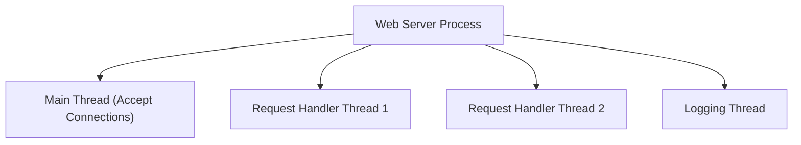

## Processes vs. Threads
### Core Concepts

*   **Process**:
    *   An independent execution unit that represents an instance of a running program.
    *   Each process has its own isolated memory space (address space), including code, data, heap, and stack.
    *   Owns its own system resources like file handles, sockets, and security credentials.
    *   Highly isolated from other processes, providing robustness and security.
*   **Thread**:
    *   A unit of execution within a process.
    *   Multiple threads within the same process share the process's memory space and resources (code, data, heap, open files).
    *   Each thread has its own private stack, program counter (PC), and set of registers.
    *   Lighter-weight than processes, enabling more efficient concurrency within a single application.

### Key Details & Nuances

*   **Resource Sharing & Isolation**:
    *   **Processes**: Do not share memory. Communication requires explicit Inter-Process Communication (IPC) mechanisms (pipes, message queues, shared memory, sockets). This isolation provides fault tolerance (a crash in one process typically doesn't affect others).
    *   **Threads**: Share the entire process memory space. Communication is direct via shared memory, but requires careful synchronization to prevent data corruption. A crash in one thread can bring down the entire process.
*   **Context Switching Cost**:
    *   **Process Context Switch**: High overhead. Involves saving and restoring the full state of the process, including its memory map, registers, program counter, and kernel resources.
    *   **Thread Context Switch**: Lower overhead. Only involves saving and restoring thread-specific states (registers, program counter, stack pointer) within the same memory space. Much faster.
*   **Concurrency vs. Parallelism**:
    *   Both processes and threads can achieve **concurrency** (dealing with multiple things at once) through time-slicing on a single CPU.
    *   Both can achieve true **parallelism** (doing multiple things simultaneously) on multi-core processors.
*   **User-level vs. Kernel-level Threads (Advanced)**:
    *   **User-level Threads (ULT)**: Managed by a user-level library; kernel is unaware. Faster to create/switch as no kernel intervention. If one ULT blocks, all ULTs in that process block.
    *   **Kernel-level Threads (KLT)**: Managed by the OS kernel. Each KLT has its own scheduling entity. If one KLT blocks, others can still run. Slower to create/switch due to kernel calls. Most modern OS use KLTs or a hybrid model.

### Practical Examples

A typical process often contains multiple threads to handle different tasks concurrently. For example, a web server process might have a main thread for listening for connections and separate threads to handle each incoming client request.

### Common Pitfalls & Trade-offs

*   **Multi-threading Complexity**:
    *   **Race Conditions**: Multiple threads accessing shared resources simultaneously, leading to unpredictable results. Requires careful synchronization (mutexes, semaphores, locks).
    *   **Deadlocks**: Two or more threads are blocked indefinitely, waiting for each other to release a resource.
    *   **Livelocks/Starvation**: Threads repeatedly attempt an action but fail due to constant contention or unfair scheduling.
    *   **Debugging**: Non-deterministic behavior makes multi-threaded bugs notoriously difficult to reproduce and debug.
*   **Process Overhead**:
    *   Higher memory footprint due to isolated address spaces.
    *   Slower startup and teardown times.
    *   IPC is generally slower and more complex than direct memory access used for inter-thread communication.
*   **Choosing Between Them**:
    *   **Processes**: Choose for isolation, security, and robustness (e.g., web browser tabs, microservices, separate server applications). When tasks are independent and don't need to share significant amounts of data.
    *   **Threads**: Choose for performance, fine-grained concurrency within a single application, and when tasks need to share large amounts of data efficiently (e.g., game engines, complex computations, UI applications with background tasks).

### Interview Questions

1.  **When would you choose processes over threads, and vice versa?**
    *   **Processes**: When maximum isolation, robustness, and security are paramount (e.g., separate server applications, web browser tabs, microservices). If tasks are completely independent and fault isolation is critical.
    *   **Threads**: When tasks need to share significant data, performance is critical due to lower context switching overhead, and fine-grained concurrency within a single application is desired (e.g., UI responsiveness, multi-core computation, game engines).
2.  **Explain the concept of context switching and its implications for processes vs. threads.**
    *   **Context Switching**: The operating system's mechanism to switch the CPU from one running process/thread to another. It involves saving the state of the current execution unit and loading the state of the next one.
    *   **Process Implications**: High overhead because the entire address space, registers, and kernel resources must be saved and restored. Frequent process switching can severely impact performance.
    *   **Thread Implications**: Lower overhead because only thread-specific states (registers, program counter, stack pointer) need to be saved/restored, as they share the same memory space. This makes thread switching much faster than process switching.
3.  **What are the main challenges when working with multi-threaded applications?**
    *   **Synchronization Issues**: Preventing race conditions, deadlocks, and livelocks, which require careful use of locks, mutexes, semaphores, and other synchronization primitives.
    *   **Debugging Complexity**: Multi-threaded bugs are often non-deterministic, making them hard to reproduce, isolate, and fix.
    *   **Overhead of Synchronization**: While threads offer performance benefits, excessive or poorly implemented synchronization can introduce contention and negate those benefits.
    *   **Scalability**: Ensuring the application scales effectively with more cores, avoiding bottlenecks due to shared resources.
4.  **Differentiate between concurrency and parallelism in the context of processes/threads.**
    *   **Concurrency**: Deals with *many things at once*. It is about structuring an application so that it can handle multiple tasks seemingly simultaneously. On a single-core CPU, this is achieved by interleaving (time-slicing) tasks. Both processes and threads enable concurrency.
    *   **Parallelism**: Is about *doing many things at once*. It involves tasks genuinely executing simultaneously on multiple processing units (CPU cores). Parallelism is a form of concurrency that requires hardware support (multiple cores). Both processes and threads can achieve parallelism on multi-core systems.