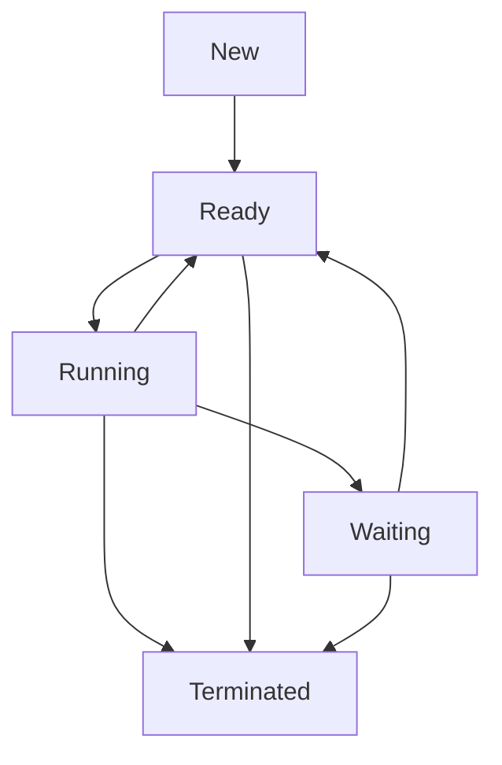

## Process State Model (New, Ready, Running, etc.)
### Core Concepts
*   **Process:** An instance of a computer program being executed. It's the unit of resource allocation and protection in an operating system.
*   **Process State Model:** A conceptual model illustrating the different stages a process goes through during its lifecycle within an operating system. These states represent the current activity or status of a process.
*   **Common States:**
    *   **New:** The process is being created. Resources are being prepared.
    *   **Ready:** The process is loaded into main memory and is awaiting execution by the CPU. It is ready to run when the CPU becomes available.
    *   **Running:** The process is actively executing instructions on the CPU.
    *   **Waiting (or Blocked):** The process is temporarily suspended from execution, usually because it's waiting for some event to occur (e.g., I/O completion, a resource to become available, a signal).
    *   **Terminated (or Exit):** The process has finished execution, either normally or due to an error. Its resources are being deallocated.

### Key Details & Nuances
*   **State Transitions:** Understanding the triggers for state changes is crucial.
    *   `New` → `Ready`: Admitted by the OS (scheduler).
    *   `Ready` → `Running`: Process selected by the CPU scheduler for execution (dispatch).
    *   `Running` → `Ready`:
        *   **Time Slice Expiry (Preemption):** The process's allocated CPU time runs out.
        *   **Higher Priority Process:** A higher priority process becomes ready.
    *   `Running` → `Waiting`:
        *   **I/O Request:** Process requests an I/O operation (e.g., reading from disk, network).
        *   **Resource Wait:** Process requests a resource (e.g., lock, mutex) that is currently unavailable.
        *   **`sleep()`/`yield()` Call:** Process voluntarily gives up CPU.
    *   `Waiting` → `Ready`: The event the process was waiting for has occurred (e.g., I/O completion interrupt, resource released).
    *   `Running` → `Terminated`:
        *   **Normal Completion:** Process finishes its last instruction.
        *   **Error:** Process encounters an unrecoverable error.
        *   **Termination by OS/Parent:** Killed explicitly.
    *   `Ready`/`Waiting` → `Terminated`: Process can be terminated by the OS or a parent process even if not running (e.g., `kill -9`).
*   **Process Control Block (PCB):** A data structure maintained by the OS for each process, storing its current state, program counter, CPU registers, memory management information, I/O status, and more. This is vital for context switching.
*   **Scheduler's Role:** The CPU scheduler is responsible for selecting processes from the `Ready` queue and allocating the CPU to them, managing the `Ready` ↔ `Running` transitions.
*   **Context Switching:** The mechanism by which the OS saves the state of the currently `Running` process (into its PCB) and loads the state of another process from its PCB to execute it. This involves CPU cycles and can incur performance overhead (e.g., cache invalidation).
*   **Difference: Process vs. Thread States:** While processes have distinct address spaces and PCBs, threads within the same process share the address space. However, each thread typically has its own stack and registers, meaning threads also have their own `Ready`, `Running`, and `Waiting` states, managed by a thread scheduler. A process is `Running` if *any* of its threads are `Running`.

### Practical Examples
The lifecycle of a process involves dynamic transitions between these states, managed by the operating system's scheduler.

*   **New to Ready:** A user executes `node myApp.js`. The OS creates a new process, allocates initial resources, and places it in the `Ready` queue.
*   **Ready to Running:** The scheduler picks `myApp.js` from the `Ready` queue and dispatches it to a CPU.
*   **Running to Waiting:** Inside `myApp.js`, a line `fs.readFile('data.txt', callback)` is executed. This initiates an I/O operation, and the process moves to `Waiting` state until the file read completes.
*   **Waiting to Ready:** The disk controller finishes reading `data.txt` and generates an interrupt. The OS handles the interrupt, and `myApp.js` is moved back to the `Ready` queue.
*   **Running to Ready (Preemption):** `myApp.js` has been running for its allotted time slice. The OS's timer interrupt fires, and the scheduler moves `myApp.js` back to `Ready` to allow another process to run.
*   **Running to Terminated:** `myApp.js` finishes its execution (`process.exit(0)` is called implicitly or explicitly). The OS deallocates its resources.

### Common Pitfalls & Trade-offs
*   **Starvation:** A process remaining in the `Ready` or `Waiting` state indefinitely, never getting the CPU or the resource it needs. This can be a risk with certain scheduling algorithms (e.g., strict priority scheduling).
*   **High Context Switching Overhead:** If processes switch too frequently (e.g., very short time slices, many I/O-bound processes), the overhead of saving/restoring context can significantly reduce overall system throughput.
*   **Deadlock:** While not strictly a state, processes in the `Waiting` state due to resource contention can enter a deadlock, where two or more processes are waiting indefinitely for resources held by each other. This requires specific prevention, avoidance, or detection/recovery strategies.
*   **Thrashing:** Occurs in virtual memory systems when processes spend more time paging (swapping pages between RAM and disk) than executing instructions, leading to a high proportion of time in the `Waiting` state for I/O (disk access). This is often due to too many processes competing for limited physical memory.

### Interview Questions
1.  **Describe the typical process state model and explain the transitions between these states.**
    *   **Answer:** Outline the five core states (New, Ready, Running, Waiting, Terminated). For each transition (e.g., Running to Ready, Running to Waiting), explain the primary event or reason (e.g., time slice expiry, I/O request, resource unavailability).
2.  **What is the primary role of the operating system's scheduler in managing process states?**
    *   **Answer:** The scheduler's primary role is to manage the `Ready` ↔ `Running` transitions. It selects processes from the `Ready` queue to run on the CPU (dispatching) and is responsible for preempting `Running` processes (e.g., due to time slice expiry) back to the `Ready` queue to ensure fairness and maximize CPU utilization.
3.  **How does a process transition from 'Running' to 'Waiting', and what causes it to move back to 'Ready'?**
    *   **Answer:** A process transitions from `Running` to `Waiting` when it performs an operation that requires waiting for an external event, such as initiating an I/O request (e.g., reading from disk, network communication), acquiring a locked resource that is unavailable, or explicitly calling a `sleep()` function. It moves back to `Ready` once the event it was waiting for completes (e.g., I/O completion interrupt, resource becoming available) and it is notified by the OS.
4.  **Explain the concept of context switching. What are its implications for system performance?**
    *   **Answer:** Context switching is the mechanism by which the OS saves the current state of a `Running` process (in its PCB) and loads the state of another process from its PCB, enabling the CPU to switch execution. It involves CPU overhead (saving/restoring registers, flushing caches/TLB) and can impact performance: frequent context switches (due to many short-lived processes or very short time slices) can reduce overall system throughput by consuming CPU cycles on overhead rather than productive work.
5.  **In a multi-threaded application, how do thread states relate to process states?**
    *   **Answer:** While a process itself has a state (e.g., the process is `Running` if any of its threads are `Running`), each individual thread within a process also has its own `Ready`, `Running`, and `Waiting` states. Threads share the process's memory space and resources, but each thread has its own program counter, stack, and register set, allowing the thread scheduler to manage their independent execution flow. When all threads of a process are in the `Waiting` state, the entire process will be considered `Waiting`.