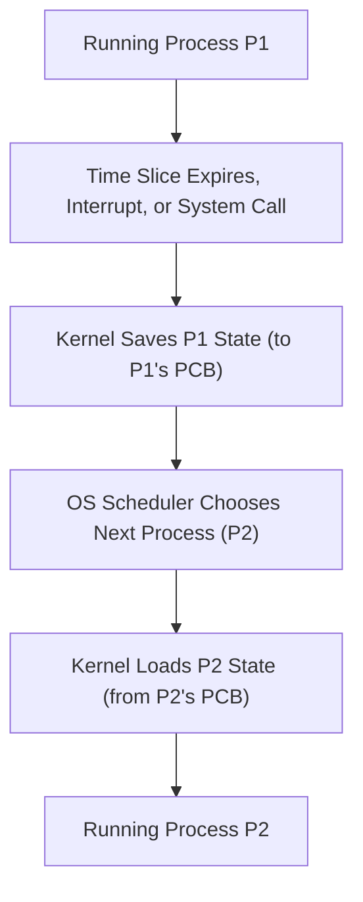

## Context Switching
### Core Concepts
*   **Definition**: The process of saving the state of one process or thread so that it can be reloaded later, and then loading the state of another process or thread, allowing the CPU to resume execution from a different point.
*   **Purpose**: Enables the operating system (OS) to perform multitasking, giving the illusion that multiple processes/threads are running concurrently on a single CPU core.
*   **Kernel Involvement**: Context switching is primarily managed by the OS kernel, requiring a switch from user mode to kernel mode.

### Key Details & Nuances
*   **Saved State (Process Control Block - PCB)**:
    *   **CPU Registers**: Program Counter (PC), Stack Pointer (SP), general-purpose registers, condition codes.
    *   **Process State**: Running, Ready, Blocked, etc.
    *   **Memory Management Information**: Page tables or segment tables.
    *   **I/O Status Information**: List of open files, I/O devices used.
    *   **Accounting Information**: CPU usage, time limits.
*   **Triggers for Context Switch**:
    *   **Time Slice Expiration**: A process exceeds its allotted CPU time quantum (preemptive multitasking).
    *   **System Calls**: A process requests an OS service (e.g., I/O operation like `read()`, `write()`), often leading to the process blocking and the OS scheduling another.
    *   **Interrupts**: Hardware interrupts (e.g., I/O completion, timer interrupt) or software interrupts.
    *   **Process Termination/Waiting**: A process finishes or explicitly waits for another process.
*   **Process vs. Thread Context Switch**:
    *   **Process Context Switch**: Involves changing the entire virtual address space, requiring a flush of the Translation Lookaside Buffer (TLB), which is expensive. More overhead.
    *   **Thread Context Switch**: Occurs within the same process. Threads share the same virtual address space, so TLB flush is often not required, making it significantly faster.
*   **Steps (High-Level)**:
    1.  **Save State**: The current process's CPU state (registers, PC, SP) and other relevant data are saved into its PCB.
    2.  **Scheduler Invocation**: The OS scheduler selects the next process/thread to run based on scheduling algorithms.
    3.  **Load State**: The selected process's state is loaded from its PCB into the CPU's registers.
    4.  **Resume Execution**: The CPU begins executing the new process/thread from where it last left off.

### Practical Examples

### Common Pitfalls & Trade-offs
*   **Overhead**: Context switching is not free. It consumes CPU cycles and increases latency due to:
    *   **CPU Time**: The actual saving and loading of register states.
    *   **Cache Invalidation**: Switching processes often invalidates the CPU's instruction and data caches, leading to "cold" caches for the newly scheduled process, causing more cache misses and slower initial execution.
    *   **TLB Flush**: For process context switches, the Translation Lookaside Buffer (TLB) often needs to be flushed or partially invalidated, which is a significant performance cost as memory translations become slower until the TLB warms up.
*   **Performance Impact**: Frequent context switching (e.g., due to very small time slices or excessive blocking) can lead to high overhead, reducing overall system throughput and increasing response times. This is often called "thrashing."
*   **Design Trade-off**: Balancing responsiveness (more frequent context switches, smaller time slices) with throughput (fewer context switches, larger time slices).
*   **Synchronization Primitives**: Understanding how mutexes and semaphores can cause context switches when a process blocks, versus spinlocks which avoid context switches by busy-waiting (trading CPU cycles for avoiding context switch overhead).

### Interview Questions
1.  **Question**: Explain what happens during a context switch. What information is saved and where?
    **Answer**: A context switch involves saving the current CPU state (registers, program counter, stack pointer, etc.) of the running process/thread into its Process Control Block (PCB) or Thread Control Block (TCB) in kernel memory. Then, the OS scheduler selects another ready process/thread, loads its saved state from its PCB/TCB into the CPU, and resumes its execution.
2.  **Question**: How does context switching impact system performance? Mention specific hardware components affected.
    **Answer**: Context switching introduces overhead. It consumes CPU cycles for saving/loading states and has significant performance implications due to cache invalidation and TLB (Translation Lookaside Buffer) flushes. When a new process runs, its data is unlikely to be in the CPU's L1/L2/L3 caches, leading to more cache misses. For process switches, the TLB, which caches virtual-to-physical address translations, often needs to be flushed, resulting in slower memory access until it repopulates.
3.  **Question**: Differentiate between a process context switch and a thread context switch. Which one is typically faster and why?
    **Answer**: A process context switch involves changing the entire virtual address space, requiring a TLB flush, which is costly. A thread context switch, however, occurs within the same process; threads share the same virtual address space, open files, and global data. Therefore, a TLB flush is often not required for thread switches, making them significantly faster and less expensive.
4.  **Question**: When does a context switch typically occur? Provide at least three distinct scenarios.
    **Answer**:
    1.  **Time Slice Expiration**: When a process has used up its allotted CPU time quantum.
    2.  **System Calls**: When a process makes a system call that requires it to wait (e.g., I/O operations like `read()` from disk, `sleep()`).
    3.  **Interrupts**: Hardware interrupts (e.g., I/O completion, timer interrupts) or software interrupts.
    4.  **Process Termination/Waiting**: When a process terminates or explicitly waits for another process to complete using functions like `wait()`.
5.  **Question**: In the context of concurrency, why might you prefer a mutex over a spinlock, considering context switching?
    **Answer**: A mutex typically puts a waiting thread to sleep (blocks it), causing a context switch and allowing the CPU to execute another thread. This is efficient if the wait time is long, as the CPU isn't wasted busy-waiting. A spinlock, conversely, causes a thread to continuously check for the lock's release without yielding the CPU. While this avoids context switch overhead, it wastes CPU cycles if the lock is held for a significant duration, making mutexes generally preferable unless the critical section is extremely short and contention is low.