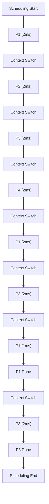

## CPU Scheduling Algorithms (FCFS, SJF, Round Robin)
### Core Concepts
*   **CPU Scheduling:** The process of determining which process gets the CPU when multiple processes are ready to run. Aims to optimize resource utilization, minimize response time, and ensure fairness.
*   **Process State:** Processes typically cycle through states: New, Ready, Running, Waiting, Terminated. Scheduling primarily deals with moving processes from Ready to Running.
*   **Preemptive vs. Non-Preemptive:**
    *   **Non-Preemptive:** Once a process gets the CPU, it holds it until it completes its CPU burst or voluntarily yields (e.g., waits for I/O).
    *   **Preemptive:** The CPU can be taken away from a running process and given to another (e.g., a higher-priority process, or after a time slice expires).

### Key Details & Nuances

*   **First-Come, First-Served (FCFS):**
    *   **Principle:** Processes are executed in the order they arrive in the ready queue. Simple queue (FIFO).
    *   **Type:** Non-preemptive.
    *   **Pros:** Easy to understand and implement.
    *   **Cons:**
        *   **Convoy Effect:** A long-running process at the front of the queue can delay all subsequent processes, leading to poor average waiting time and CPU utilization for short processes. Not suitable for interactive systems.
        *   Can lead to high average waiting and turnaround times.

*   **Shortest Job First (SJF):**
    *   **Principle:** The process with the smallest estimated next CPU burst time is executed next.
    *   **Type:** Can be non-preemptive or preemptive.
        *   **Non-Preemptive SJF:** Once a short job starts, it runs to completion.
        *   **Preemptive SJF (Shortest Remaining Time First - SRTF):** If a new process arrives with a shorter remaining burst time than the currently running process, the current process is preempted.
    *   **Pros:** Provably optimal for minimizing average waiting time for a given set of processes.
    *   **Cons:**
        *   **Impracticality:** Requires knowing the future CPU burst time of a process, which is generally impossible to predict accurately in advance. Often estimated using exponential averaging of past burst times.
        *   **Starvation (Non-Preemptive SJF):** Long processes might never get to run if there's a continuous stream of shorter processes arriving.

*   **Round Robin (RR):**
    *   **Principle:** Each process is given a small unit of CPU time, called a **time quantum** (or time slice). When the quantum expires, the process is preempted and added to the end of the ready queue.
    *   **Type:** Preemptive.
    *   **Pros:**
        *   **Fairness:** Ensures that all processes get a turn, preventing starvation.
        *   **Responsiveness:** Good for interactive systems as it provides quick response times.
    *   **Cons:**
        *   **Context Switching Overhead:** Frequent preemption leads to frequent context switches, which incur overhead (saving/loading CPU state, cache invalidation).
        *   **Quantum Size:**
            *   **Too large:** RR approaches FCFS (less responsive, higher average waiting time).
            *   **Too small:** Excessive context switching overhead, CPU spends more time switching than executing.
            *   Optimal quantum is system-dependent, typically 10-100 milliseconds.

### Practical Examples

**Round Robin Scheduling Flow**

Let's consider processes P1 (burst 5ms), P2 (burst 3ms), P3 (burst 6ms), P4 (burst 2ms) with a time quantum of 2ms.

*Note: P2 and P4 complete within their first quantum and don't re-enter the ready queue.*

### Common Pitfalls & Trade-offs

*   **FCFS:** Prone to the "convoy effect," leading to poor utilization if short tasks are stuck behind long ones. Not suitable for systems requiring low latency.
*   **SJF:** Theoretical optimality vs. practical implementability. The core challenge is predicting future CPU burst times. Using past averages might not reflect true future needs. Starvation is a real concern in non-preemptive versions.
*   **Round Robin:** Balancing the time quantum: a small quantum increases context switch overhead, while a large quantum reduces responsiveness and fairness, making it behave more like FCFS.
*   **General:** Preemption improves responsiveness but introduces context switching overhead. Non-preemptive avoids this overhead but can lead to long wait times and unresponsiveness.

### Interview Questions

1.  **Compare and contrast FCFS, SJF, and Round Robin in terms of their core principles, advantages, disadvantages, and typical use cases.**
    *   **Answer:** FCFS is simple, non-preemptive, suffers from convoy effect, best for batch systems where fairness isn't critical. SJF (preemptive/non-preemptive) minimizes average waiting time, but requires predicting burst times and can cause starvation (non-preemptive). RR is preemptive, fair, good for interactive systems, but incurs context switching overhead, and quantum size is critical.

2.  **Explain the 'convoy effect' in FCFS. How do other algorithms mitigate or avoid it?**
    *   **Answer:** The convoy effect occurs when a long-running process monopolizes the CPU in FCFS, causing all subsequent processes (even short ones) to wait for an extended period. SJF mitigates it by prioritizing shorter jobs. Round Robin avoids it by preempting processes after a fixed time slice, ensuring all processes get regular turns and preventing any single process from hogging the CPU.

3.  **How does the choice of time quantum affect the performance of Round Robin? What are the trade-offs?**
    *   **Answer:** A very small time quantum leads to high context switching overhead, wasting CPU cycles on task switching rather than execution, reducing throughput. A very large quantum makes Round Robin behave more like FCFS, increasing average waiting times and reducing responsiveness. The trade-off is between responsiveness (smaller quantum) and efficiency/throughput (larger quantum with less overhead). An optimal quantum should be large enough to allow a typical CPU burst to complete, but small enough to ensure good interactivity.

4.  **What are the primary challenges in implementing SJF in a real operating system? How are these challenges typically addressed?**
    *   **Answer:** The primary challenge is the inability to accurately predict the exact next CPU burst time of a process. OSes cannot know the future. This is typically addressed by using **prediction mechanisms**, most commonly **exponential averaging**. This technique uses the weighted average of past CPU burst times to estimate the next one, giving more weight to recent history. This is an estimation, not a perfect prediction.

5.  **What is the role of context switching in preemptive scheduling, and what are its overheads?**
    *   **Answer:** Context switching is the mechanism by which the OS saves the state (CPU registers, program counter, stack pointer, etc.) of the currently running process and loads the saved state of the process selected to run next. In preemptive scheduling, it's essential for allowing the OS to take the CPU away from one process and give it to another. Overheads include:
        *   **CPU Cycles:** Time spent saving/loading registers and state.
        *   **Memory Operations:** Accessing Process Control Blocks (PCBs) and related data structures.
        *   **Cache Invalidation:** The new process often uses different data, invalidating the CPU cache of the previous process, leading to performance degradation until the cache warms up again.