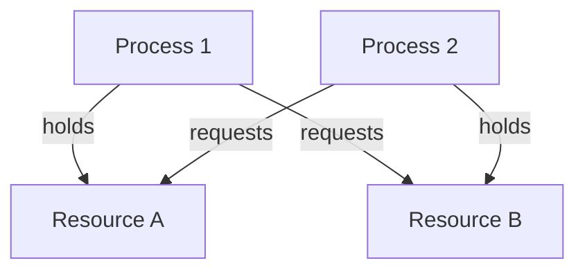

## Concurrency Issues: Race Conditions, Deadlock, Starvation
### Core Concepts

*   **Concurrency Issues Overview:** Problems arising when multiple threads or processes execute concurrently and interact with shared resources, leading to incorrect or unpredictable program behavior.
*   **Race Condition:**
    *   Occurs when multiple threads access and modify shared data concurrently, and the final outcome depends on the non-deterministic interleaving of their operations.
    *   The "race" is among threads to reach and modify the shared data first.
    *   Can lead to data corruption, inconsistent state, or logical errors.
*   **Deadlock:**
    *   A situation where two or more processes or threads are blocked indefinitely, each waiting for the other to release a resource that it needs.
    *   Results in a permanent halt of progress for the involved entities.
*   **Starvation:**
    *   A situation where a process or thread is perpetually denied access to a resource or CPU time, even though the resource/time becomes available.
    *   Often due to unfair scheduling policies (e.g., strict priority-based scheduling) or specific resource management strategies.

### Key Details & Nuances

*   **Race Condition Prevention:**
    *   **Synchronization Primitives:** Use locks (mutexes), semaphores, condition variables to ensure only one thread accesses a critical section at a time.
    *   **Atomic Operations:** Utilize hardware-supported atomic operations (e.g., compare-and-swap) for simple updates.
    *   **Immutability:** Make shared data immutable to eliminate modification races.
    *   **Thread-Local Storage:** Use data that is specific to each thread, avoiding shared state.
*   **Deadlock Conditions (Coffman Conditions - all four must hold for deadlock to occur):**
    1.  **Mutual Exclusion:** At least one resource must be held in a non-sharable mode (only one process can use it at a time).
    2.  **Hold and Wait:** A process holding at least one resource is waiting to acquire additional resources held by other processes.
    3.  **No Preemption:** A resource cannot be forcibly taken from a process holding it; it must be voluntarily released.
    4.  **Circular Wait:** A set of processes {P0, P1, ..., Pn} exists such that P0 is waiting for a resource held by P1, P1 is waiting for a resource held by P2, ..., Pn is waiting for a resource held by P0.
*   **Deadlock Strategies:**
    *   **Prevention:** Design the system to negate one of the four Coffman conditions (e.g., acquire all resources at once, impose resource ordering).
    *   **Avoidance:** Dynamically analyze resource allocation state to ensure a safe state (e.g., Banker's Algorithm).
    *   **Detection & Recovery:** Allow deadlock to occur, detect it (e.g., resource allocation graphs), and then recover (e.g., process termination, resource preemption, rollback).
*   **Starvation Prevention:**
    *   **Fair Scheduling:** Implement fair CPU scheduling algorithms (e.g., Round Robin) or resource access policies (e.g., FIFO queues for locks).
    *   **Aging:** Gradually increase the priority of long-waiting processes to ensure they eventually get a chance to run.
    *   **Bounded Waiting:** Design synchronization primitives such that there's a limit to how many times other processes can enter a critical section while another is waiting.

### Practical Examples

#### Race Condition Example (TypeScript)

```typescript
let sharedCounter: number = 0;

function incrementCounter() {
  // Simulate some work before incrementing
  for (let i = 0; i < 1000; i++) {} // Artificial delay

  sharedCounter++;
}

// In a real multi-threaded environment (e.g., Node.js worker_threads),
// multiple threads would call incrementCounter.
// If not synchronized, final sharedCounter could be less than expected.

// Example of problematic asynchronous execution (simulated for clarity):
async function runRace() {
  sharedCounter = 0; // Reset for demo
  const promises = [];
  for (let i = 0; i < 5; i++) {
    // In a real scenario, these would be separate threads/processes
    promises.push(new Promise(resolve => {
      setTimeout(() => { // Simulate asynchronous task
        incrementCounter();
        resolve(null);
      }, Math.random() * 10); // Variable delay to expose race
    }));
  }
  await Promise.all(promises);
  console.log(`Final counter (expected 5, actual: ${sharedCounter})`);
}

// To prevent this, a lock would be needed around sharedCounter++.
// E.g., using a simple lock concept (not built-in JS):
// async function incrementCounterSafe() {
//   await acquireLock('counterLock');
//   sharedCounter++;
//   releaseLock('counterLock');
// }

// runRace(); // Uncomment to see potential race behavior
```

#### Deadlock Example (Conceptual Resource Graph)


*   **Scenario:** Process 1 holds Resource A and requests Resource B. Process 2 holds Resource B and requests Resource A. Both are blocked indefinitely, waiting for the other to release the resource they need. This illustrates the Circular Wait condition.

### Common Pitfalls & Trade-offs

*   **Over-synchronization (Coarse-Grained Locks):**
    *   **Pitfall:** Can lead to reduced parallelism and poor performance by unnecessarily serializing large portions of code.
    *   **Trade-off:** Simpler to implement and reason about, reduces likelihood of race conditions.
*   **Under-synchronization (Fine-Grained Locks):**
    *   **Pitfall:** Increases complexity, harder to debug, higher risk of deadlocks (due to multiple locks) and subtle race conditions if not perfectly applied.
    *   **Trade-off:** Maximizes parallelism and performance by allowing concurrent access to different parts of a shared data structure.
*   **Liveness vs. Safety:**
    *   **Liveness:** The property that a program continues to make progress (e.g., no deadlock, no starvation).
    *   **Safety:** The property that a program always produces correct results (e.g., no data corruption due to race conditions).
    *   Often, stronger safety guarantees (more locks) can negatively impact liveness (more deadlocks/starvation potential), and vice-versa. Designing concurrent systems involves balancing these.
*   **Debugging Complexity:** Concurrency bugs are notoriously hard to reproduce and debug due to their non-deterministic nature and dependence on execution timing.

### Interview Questions

1.  **Explain the four necessary conditions for deadlock. How can you prevent a deadlock by negating each of these conditions?**
    *   **Answer:** The four conditions are Mutual Exclusion, Hold and Wait, No Preemption, and Circular Wait.
        *   **Mutual Exclusion:** Not always preventable for inherently non-sharable resources. Can be mitigated by making resources sharable if possible (e.g., read-only data).
        *   **Hold and Wait:** Prevent by requiring processes to request all necessary resources at once, or release all held resources before requesting more. This can lead to lower resource utilization.
        *   **No Preemption:** Prevent by allowing resources to be preempted. If a process holding a resource requests another that's unavailable, it must release its held resources. Costly if state needs to be saved/restored.
        *   **Circular Wait:** Prevent by imposing a total ordering of resource types and requiring processes to request resources in increasing order of enumeration. This simplifies resource acquisition logic but might not be natural for all applications.

2.  **Differentiate between a race condition, deadlock, and starvation, providing a simple analogy for each.**
    *   **Answer:**
        *   **Race Condition:** Multiple people simultaneously writing on the same whiteboard. The final message depends on who writes last or how their writing overlaps. (Safety issue: incorrect state).
        *   **Deadlock:** Two cars facing each other on a single-lane bridge, both unwilling to back up. Neither can move forward. (Liveness issue: no progress).
        *   **Starvation:** A busy cashier always serving the highest-priority (e.g., express lane) customers, while a regular customer waits indefinitely, even if no high-priority customers are currently present. (Liveness issue: indefinite postponement).

3.  **How would you approach debugging a suspected race condition in a multithreaded application?**
    *   **Answer:** Start by using logging/tracing with timestamps to understand execution order, focusing on critical sections. Use tools like sanitizers (e.g., ThreadSanitizer) that detect data races by instrumenting memory accesses. Reproduce the bug consistently if possible (e.g., by adding artificial delays or running specific test cases). Finally, employ proper synchronization primitives (locks, atomic operations) around shared mutable state to resolve.

4.  **Discuss the trade-offs between using fine-grained versus coarse-grained locks in a concurrent system.**
    *   **Answer:**
        *   **Coarse-Grained Locks:** A single lock protects a large data structure or multiple resources.
            *   **Pros:** Simpler to implement and reason about, less prone to complex deadlock scenarios.
            *   **Cons:** Limits concurrency, potentially creating performance bottlenecks by serializing too much code. Higher contention.
        *   **Fine-Grained Locks:** Multiple locks, each protecting a smaller, independent part of a data structure or individual resources.
            *   **Pros:** Maximizes parallelism, allowing more concurrent operations. Lower contention.
            *   **Cons:** Significantly increases complexity, higher risk of deadlocks (due to multiple locks needing to be acquired in specific orders), harder to verify correctness. More overhead for lock management.

5.  **Is it always possible to avoid race conditions? If so, at what cost?**
    *   **Answer:** Yes, it is always *possible* to avoid race conditions by ensuring mutual exclusion for all accesses to shared mutable state. However, this comes at a cost:
        *   **Performance Overhead:** Synchronization primitives (locks, mutexes) introduce overhead due to context switching, cache invalidations, and CPU cycles spent acquiring/releasing locks.
        *   **Reduced Parallelism:** By serializing access to critical sections, you limit the degree of true parallelism, potentially negating the benefits of concurrency.
        *   **Increased Complexity:** Identifying all shared mutable state and applying correct synchronization can be complex and error-prone, potentially leading to deadlocks or other concurrency issues.
        *   **Design Constraints:** Sometimes requires re-architecting data structures or algorithms to be thread-safe, which might not be the most intuitive or performant design for a single-threaded context.