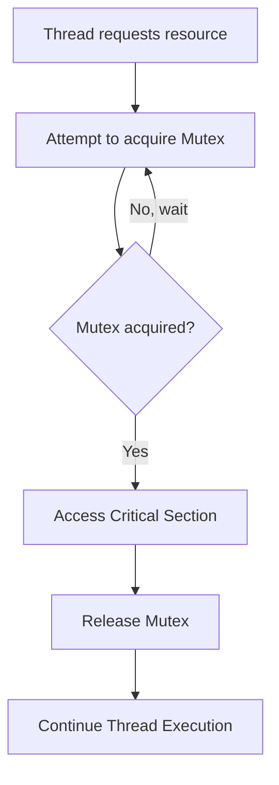

## Synchronization Primitives (Mutexes, Semaphores)
### Core Concepts

*   **Synchronization Primitives:** Mechanisms used in concurrent programming to control access to shared resources and prevent race conditions, ensuring data consistency and correctness.
    *   Enable coordination between multiple threads or processes.
    *   Primary goal: Guarantee atomicity for critical sections and manage resource contention.

*   **Mutex (Mutual Exclusion Lock):**
    *   A binary flag that provides exclusive access to a shared resource.
    *   Only one thread can acquire (lock) a mutex at a time.
    *   If a thread tries to acquire an already locked mutex, it blocks until the mutex is released.
    *   Used for *mutual exclusion* – protecting critical sections of code.

*   **Semaphore:**
    *   A signaling mechanism that maintains a count (integer value).
    *   Used to control access to a pool of resources or to signal between threads.
    *   **`wait()` (P or `acquire`):** Decrements the semaphore count. If count becomes negative, the thread blocks until count is positive.
    *   **`signal()` (V or `release`):** Increments the semaphore count. If there are waiting threads, one is unblocked.
    *   **Counting Semaphore:** Allows `N` threads/processes to access a resource concurrently. Initialized with `N`.
    *   **Binary Semaphore:** A special case initialized to 0 or 1. Can be used for mutual exclusion (like a mutex, but typically without ownership semantics).

### Key Details & Nuances

*   **Mutex Nuances:**
    *   **Ownership:** A mutex is typically *owned* by the thread that acquired it. Only the owner can release it.
    *   **Re-entrant (Recursive) Mutex:** Allows the same thread to acquire the mutex multiple times without deadlocking itself. Each acquire must be matched by a release. Not always default, can introduce complexity.
    *   **Guard/RAII Pattern:** In languages like C++, `std::lock_guard` or `std::unique_lock` use RAII (Resource Acquisition Is Initialization) to automatically release the mutex when the scope exits, preventing forgotten releases.
    *   **Priority Inversion:** A low-priority thread holding a mutex can block a high-priority thread, potentially leading to system instability.

*   **Semaphore Nuances:**
    *   **No Ownership:** Semaphores are typically *not* owned by specific threads. Any thread can `signal()` a semaphore, regardless of which thread called `wait()`. This is a key difference from mutexes.
    *   **Signaling:** Ideal for signaling events or managing resource availability (e.g., in producer-consumer scenarios).
    *   **Initialization Value:** Critical for its purpose.
        *   `N` for N concurrent resources.
        *   `1` for binary semaphore (mutual exclusion).
        *   `0` for signaling (e.g., `signal` first, then `wait`).

*   **Mutex vs. Semaphore (When to Use):**
    *   **Mutex:** Best for protecting a single shared resource (e.g., a critical section of code) where only one thread can access it at a time. Emphasizes *mutual exclusion*.
    *   **Semaphore:** Best for controlling access to a pool of identical resources, or for signaling between threads (e.g., "resource X is available", "task Y is complete"). Emphasizes *signaling* and *resource counting*.
    *   A binary semaphore can act like a mutex, but mutexes usually offer more features like ownership, error handling, and priority inversion avoidance mechanisms.

### Practical Examples

#### Mutex for Critical Section

```typescript
class Mutex {
    private locked: boolean = false;
    private waiters: (() => void)[] = [];

    async acquire(): Promise<void> {
        if (!this.locked) {
            this.locked = true;
            return Promise.resolve();
        }

        return new Promise(resolve => {
            this.waiters.push(resolve);
        });
    }

    release(): void {
        if (!this.locked) {
            console.warn("Attempted to release an unlocked mutex.");
            return;
        }

        if (this.waiters.length > 0) {
            const nextWaiter = this.waiters.shift();
            if (nextWaiter) {
                nextWaiter(); // Allow next waiting thread to acquire
            }
        } else {
            this.locked = false; // No waiters, fully unlock
        }
    }
}

// Example Usage
const sharedCounter = { value: 0 };
const counterMutex = new Mutex();

async function incrementCounter(id: number) {
    await counterMutex.acquire(); // Acquire lock
    try {
        // Critical Section
        const temp = sharedCounter.value;
        await new Promise(resolve => setTimeout(resolve, Math.random() * 10)); // Simulate work
        sharedCounter.value = temp + 1;
        console.log(`Thread ${id}: Counter = ${sharedCounter.value}`);
    } finally {
        counterMutex.release(); // Ensure release even if errors occur
    }
}

async function runThreads() {
    const threads = Array.from({ length: 5 }, (_, i) => incrementCounter(i + 1));
    await Promise.all(threads);
    console.log(`Final Counter Value: ${sharedCounter.value}`); // Should be 5
}

runThreads();
```

#### Semaphore for Limited Resource Pool

```typescript
class Semaphore {
    private count: number;
    private waiters: (() => void)[] = [];

    constructor(initialCount: number) {
        if (initialCount < 0) {
            throw new Error("Semaphore initial count cannot be negative.");
        }
        this.count = initialCount;
    }

    async wait(): Promise<void> { // Corresponds to P() or acquire()
        if (this.count > 0) {
            this.count--;
            return Promise.resolve();
        }

        return new Promise(resolve => {
            this.waiters.push(resolve);
        });
    }

    signal(): void { // Corresponds to V() or release()
        this.count++;
        if (this.waiters.length > 0) {
            const nextWaiter = this.waiters.shift();
            if (nextWaiter) {
                nextWaiter(); // Unblock one waiting thread
            }
        }
    }
}

// Example: Limiting concurrent database connections
const MAX_CONCURRENT_CONNECTIONS = 3;
const dbConnectionSemaphore = new Semaphore(MAX_CONCURRENT_CONNECTIONS);

async function performDbOperation(operationId: number) {
    console.log(`Operation ${operationId}: Waiting for DB connection...`);
    await dbConnectionSemaphore.wait(); // Acquire a connection slot

    try {
        console.log(`Operation ${operationId}: Acquired DB connection. Performing work...`);
        await new Promise(resolve => setTimeout(resolve, 2000)); // Simulate DB work
        console.log(`Operation ${operationId}: DB work complete.`);
    } finally {
        dbConnectionSemaphore.signal(); // Release the connection slot
        console.log(`Operation ${operationId}: Released DB connection.`);
    }
}

async function startDbOperations() {
    const operations = Array.from({ length: 7 }, (_, i) => performDbOperation(i + 1));
    await Promise.all(operations);
    console.log("All DB operations completed.");
}

startDbOperations();
```

#### Mermaid Diagram: Mutex Flow



### Common Pitfalls & Trade-offs

*   **Deadlocks:**
    *   Occur when two or more threads are blocked indefinitely, each waiting for the other to release a resource.
    *   **Conditions (Coffman conditions):** Mutual exclusion, Hold and Wait, No Preemption, Circular Wait.
    *   **Mitigation:** Resource ordering, deadlock detection/recovery, timeout-based acquisition.

*   **Livelocks:**
    *   Threads are not blocked but are continuously changing state in response to each other without making progress (e.g., repeatedly trying and failing to acquire resources).
    *   Less common than deadlocks.

*   **Starvation:**
    *   A thread is repeatedly denied access to a shared resource, even though it becomes available.
    *   Can happen with unfair scheduling policies or when other threads always get priority.

*   **Performance Overhead:**
    *   Locking and unlocking operations incur CPU cycles.
    *   Context switching when threads block and unblock is expensive.
    *   Excessive locking can sequentialize a concurrent program, negating benefits of concurrency.

*   **Granularity of Locking:**
    *   **Coarse-grained locking:** A single lock protects a large section of code or a large data structure. Simple, but reduces concurrency.
    *   **Fine-grained locking:** Multiple locks protect smaller, independent parts of a data structure. Increases concurrency, but adds complexity and potential for more deadlocks.
    *   **Trade-off:** Simplicity vs. Performance/Concurrency.

*   **Busy-Waiting vs. Blocking:**
    *   **Busy-waiting (Spinlock):** A thread repeatedly checks a condition in a tight loop until it becomes true. Wastes CPU cycles if waiting for long periods.
    *   **Blocking:** A thread yields the CPU and is put to sleep until the resource becomes available. Efficient for long waits, but involves context switching overhead.
    *   **Choice:** Busy-waiting might be efficient for very short expected waits (e.g., few CPU cycles), otherwise blocking is preferred.

### Interview Questions

1.  **Differentiate between a mutex and a semaphore. When would you use each in a real-world scenario?**
    *   **Answer:** A mutex is a binary lock for mutual exclusion, ensuring only one thread accesses a critical section at a time, and is typically *owned* by the acquiring thread. A semaphore is a signaling mechanism with a counter, used to control access to a pool of resources (counting semaphore) or for inter-thread signaling (binary semaphore), and lacks ownership. Use a mutex to protect a shared data structure (e.g., a linked list) from concurrent modification. Use a semaphore to limit concurrent connections to a database (counting) or to signal completion of a task between producer and consumer threads (binary).

2.  **Explain common concurrency problems like deadlocks, livelocks, and starvation. How can synchronization primitives help prevent them, and what are their limitations?**
    *   **Answer:**
        *   **Deadlock:** Threads indefinitely wait for resources held by others. Primitives cause this if not carefully managed (e.g., circular wait due to mutex acquisition order).
        *   **Livelock:** Threads repeatedly change state but make no progress (e.g., two threads yielding and retrying without a definitive winner). Can arise from overly aggressive retry logic.
        *   **Starvation:** A thread consistently loses contention for a resource, never getting access. Can happen with unfair lock acquisition or priority issues.
        *   Primitives *cause* contention, but their correct application helps *manage* it. For deadlocks, establish resource acquisition order. For starvation, ensure fair scheduling or use constructs like fair semaphores/mutexes. Limitations are that primitives alone don't prevent these; correct design and usage are crucial, often requiring higher-level patterns.

3.  **Describe the Producer-Consumer problem and how semaphores (or other primitives) can solve it.**
    *   **Answer:** The Producer-Consumer problem involves producers adding items to a shared buffer and consumers removing them.
        *   **Solution with Semaphores:**
            *   One semaphore (`empty`): Initialized to buffer capacity, counts empty slots. Producers `wait` on `empty` before adding, then `signal` on `full`.
            *   One semaphore (`full`): Initialized to 0, counts filled slots. Consumers `wait` on `full` before removing, then `signal` on `empty`.
            *   One mutex (`mutex` or binary semaphore): Initialized to 1, for mutual exclusion when accessing the shared buffer itself, protecting `add` and `remove` operations.
        *   This ensures producers don't add to a full buffer, consumers don't remove from an empty buffer, and buffer access is mutually exclusive.

4.  **What are the implications of using fine-grained vs. coarse-grained locking in a multithreaded application?**
    *   **Answer:**
        *   **Coarse-grained:** A single lock protects a large component or data structure. **Implications:** Simpler to implement and reason about, less overhead from many lock operations. However, it reduces concurrency as only one thread can access any part of the protected data at a time, leading to potential performance bottlenecks if contention is high.
        *   **Fine-grained:** Multiple locks protect smaller, independent parts of a component or data structure. **Implications:** Increases concurrency as different threads can access different parts simultaneously. However, it's significantly more complex to design, implement, and debug (higher risk of deadlocks, livelocks, and forgotten locks), and incurs higher overhead due to more lock/unlock operations. The choice depends on the specific contention patterns and performance requirements.