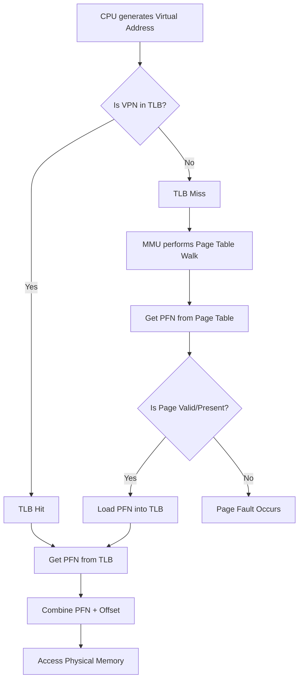

## Virtual Memory, Paging, and Page Tables
### Core Concepts
*   **Virtual Memory (VM):**
    *   An abstraction that provides each process with a large, contiguous, private address space, independent of physical memory availability or fragmentation.
    *   Decouples memory addresses used by a program (virtual addresses) from actual physical memory addresses.
    *   Enables processes to use more memory than physically available by storing parts on disk (swapping).
    *   Provides memory protection and isolation between processes.
*   **Paging:**
    *   The primary mechanism for implementing virtual memory.
    *   Divides the virtual address space into fixed-size blocks called **pages**.
    *   Divides the physical memory into fixed-size blocks called **frames** (or page frames), of the same size as pages.
    *   Maps virtual pages to physical frames, allowing non-contiguous physical memory to appear contiguous to a process.
*   **Page Tables:**
    *   A data structure (typically an array or tree) maintained by the OS for each process.
    *   Translates virtual page numbers (VPNs) to physical frame numbers (PFNs).
    *   Each entry in a page table (PTE - Page Table Entry) contains the PFN and various control bits (e.g., valid, dirty, access permissions).

### Key Details & Nuances
*   **Virtual-to-Physical Address Translation:**
    *   A virtual address is split into two parts: **Virtual Page Number (VPN)** and **Offset (Page Offset)**.
    *   The VPN is used as an index into the process's page table to find the corresponding **Physical Frame Number (PFN)**.
    *   The PFN is then combined with the original **Offset** to form the **Physical Address**.
*   **Page Table Entry (PTE) Bits:**
    *   **Valid/Present Bit:** Indicates if the page is currently in physical memory. If not, a page fault occurs.
    *   **Dirty Bit:** Set when a page has been modified; used during page replacement to determine if a page needs to be written back to disk.
    *   **Accessed/Reference Bit:** Set when a page is accessed; used by page replacement algorithms (e.g., LRU approximation).
    *   **Read/Write/Execute (Protection Bits):** Define access permissions for the page, enforcing memory protection.
*   **Translation Lookaside Buffer (TLB):**
    *   A small, fast, hardware cache that stores recent virtual-to-physical address translations.
    *   When an address translation is requested, the MMU (Memory Management Unit) first checks the TLB.
    *   **TLB Hit:** Translation found in TLB, very fast (avoids main memory lookup).
    *   **TLB Miss:** Translation not in TLB; the MMU performs a page table walk in main memory, loads the translation into the TLB, then completes the address translation.
    *   **TLB Flush:** Occurs on context switches to prevent a new process from using stale translations from the previous process.
*   **Multi-Level Page Tables (Hierarchical Page Tables):**
    *   Used to reduce the memory overhead of large page tables, especially for sparse address spaces.
    *   Instead of one monolithic page table, the address is broken into multiple VPN parts (e.g., Page Directory Index, Page Table Index).
    *   Each level points to the next level's table or the final page table. Only necessary tables are allocated.
*   **Page Faults:**
    *   An interrupt generated by the MMU when a process tries to access a page that is not currently in physical memory (Valid/Present bit is 0).
    *   The OS (page fault handler) steps in:
        1.  Identifies the virtual address causing the fault.
        2.  Finds the page on disk (e.g., swap space, executable file).
        3.  Selects a victim page in physical memory using a page replacement algorithm (e.g., LRU, FIFO, Clock).
        4.  If the victim page is "dirty," writes it back to disk.
        5.  Loads the required page from disk into the freed physical frame.
        6.  Updates the page table entry for the newly loaded page and potentially invalidates the TLB entry.
        7.  Restarts the instruction that caused the fault.
*   **Copy-on-Write (CoW):**
    *   An optimization used during `fork()` system calls.
    *   Instead of immediately duplicating all parent process pages, child and parent initially share pages, marked as read-only.
    *   Only when one process attempts to write to a shared page is a private copy made, leading to fewer page copies and faster `fork()`.

### Practical Examples

**Virtual-to-Physical Address Translation Flow**

### Common Pitfalls & Trade-offs

*   **Page Table Overhead:**
    *   **Pitfall:** Large page tables consume significant physical memory, especially for 32-bit (4GB) or 64-bit (16EB) address spaces if a single, flat page table is used.
    *   **Trade-off:** Multi-level page tables mitigate this by only allocating segments of the table that are actively used, but they introduce overhead in page table walks (more memory accesses).
*   **TLB Thrashing:**
    *   **Pitfall:** Frequent TLB misses when a program repeatedly accesses memory not currently cached in the TLB, leading to constant page table walks.
    *   **Trade-off:** Larger TLBs reduce misses but are more expensive and slower to access. Smaller page sizes can exacerbate TLB pressure.
*   **Thrashing (System-wide):**
    *   **Pitfall:** Occurs when the total working set of active processes exceeds available physical memory, leading to excessive page faults, constant swapping to/from disk, and very low CPU utilization.
    *   **Trade-off:** More physical RAM or careful process scheduling can alleviate this, but it highlights the balance between memory utilization and performance.
*   **Internal Fragmentation:**
    *   **Pitfall:** The last page allocated to a process might not be entirely filled, leading to wasted space within that page.
    *   **Trade-off:** Smaller page sizes reduce internal fragmentation but increase the number of pages, leading to larger page tables and potentially more TLB misses.
*   **Page Size Selection:**
    *   **Trade-off:**
        *   **Small Page Size:** Less internal fragmentation, better memory utilization, but larger page tables, more TLB misses, more page faults, and increased I/O overhead for swapping.
        *   **Large Page Size:** Reduced page table size, fewer TLB misses, potentially fewer page faults, but higher internal fragmentation and potentially more wasted memory. Operating systems often support "huge pages" for performance-critical applications.

### Interview Questions

1.  **Explain the core purpose of virtual memory. What problems does it solve for the operating system and applications?**
    *   **Answer:** Virtual memory serves three main purposes:
        1.  **Memory Abstraction:** Provides each process with a large, private, contiguous address space, simplifying programming by shielding applications from physical memory constraints (e.g., fragmentation, limited size).
        2.  **Memory Protection:** Isolates processes from each other, preventing one process from corrupting another's memory or the OS's memory. This is enforced through page table permissions.
        3.  **Memory Sharing:** Enables efficient sharing of code (e.g., shared libraries) and data between processes without requiring explicit physical address management. It also allows memory-mapped files.

2.  **Describe the process of virtual-to-physical address translation. Include the role of the MMU and TLB.**
    *   **Answer:** When the CPU generates a virtual address, the MMU (Memory Management Unit) performs the translation.
        1.  The virtual address is split into a Virtual Page Number (VPN) and an Offset.
        2.  The MMU first checks its Translation Lookaside Buffer (TLB), a hardware cache, to see if the VPN-to-Physical Frame Number (PFN) mapping is already cached.
        3.  **TLB Hit:** If found, the PFN is retrieved directly from the TLB, combined with the offset, and the physical address is formed. This is very fast.
        4.  **TLB Miss:** If not found, the MMU performs a "page table walk" by accessing the process's page table(s) in main memory, using the VPN to locate the correct PTE (Page Table Entry) and extract the PFN.
        5.  The new mapping is then loaded into the TLB for future use.
        6.  Once the PFN is obtained (either from TLB or page table walk), it's concatenated with the original Offset to form the final Physical Address, which is then sent to the memory controller.

3.  **What is a page fault, and how does the operating system handle it?**
    *   **Answer:** A page fault is an exception (interrupt) triggered by the MMU when a process attempts to access a virtual page whose "present/valid bit" in its page table entry is cleared, meaning the page is not currently in physical memory.
    *   The OS's page fault handler then:
        1.  Identifies the faulted virtual address.
        2.  Determines if it's a valid but swapped-out page (e.g., from swap space or executable) or an invalid access (e.g., accessing non-existent memory), leading to a segmentation fault.
        3.  If valid but swapped out, the OS finds a free physical frame. If none, it selects a victim page using a page replacement algorithm (e.g., LRU). If the victim page is "dirty," it's written back to disk.
        4.  The required page is then loaded from disk into the chosen physical frame.
        5.  The process's page table entry for that page is updated with the new PFN and the present bit is set. Any corresponding TLB entry is invalidated.
        6.  Finally, the instruction that caused the page fault is restarted, now able to access the page successfully.

4.  **Why are multi-level page tables used, and what are their primary advantages and disadvantages?**
    *   **Answer:** Multi-level page tables (e.g., two-level, three-level) are used primarily to **reduce the memory overhead** of storing page tables themselves, especially for large (e.g., 64-bit) and sparsely populated virtual address spaces. Instead of one large, flat table for the entire address space, the virtual address is broken into multiple parts, each indexing into a smaller table at a different level.
    *   **Advantages:**
        *   **Reduced Memory Consumption:** Only parts of the page table that correspond to actively used virtual memory regions are allocated, saving significant physical memory compared to a flat table for sparse address spaces.
        *   **Scalability:** Better handles very large virtual address spaces without requiring impractically huge contiguous blocks for page tables.
    *   **Disadvantages:**
        *   **Increased Access Time (Page Table Walk):** Each address translation now requires multiple memory accesses (one per level) to traverse the page table hierarchy if the TLB misses. This is the primary performance drawback.
        *   **Complexity:** More complex to implement and manage for the OS.

5.  **How does virtual memory facilitate both memory protection and memory sharing?**
    *   **Answer:**
        *   **Memory Protection:** Each process has its own independent page table, mapping its virtual addresses to physical frames. This means a process cannot directly access physical memory locations belonging to another process or the OS kernel, as its page table doesn't contain those mappings. Additionally, Page Table Entries (PTEs) include permission bits (read, write, execute), which the MMU checks during every memory access. Any violation (e.g., writing to a read-only page) triggers a protection fault.
        *   **Memory Sharing:** Virtual memory allows multiple processes to share the same physical memory frames by having their respective page tables point to the *same* physical frame number for a particular virtual page. This is commonly used for shared libraries (e.g., `libc.so`), inter-process communication (shared memory segments), and Copy-on-Write (CoW) semantics where pages are shared until one process modifies them.