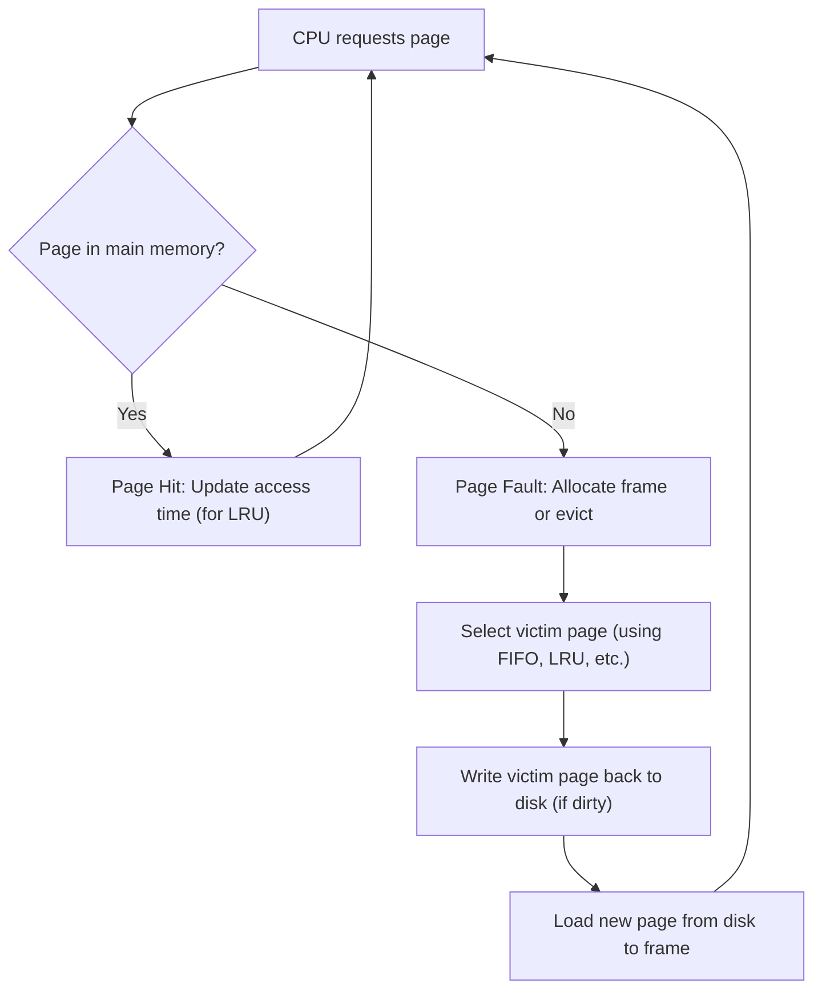

## Page Replacement Algorithms (FIFO, LRU, Optimal)
### Core Concepts

*   **Page Replacement Algorithms:** Strategies used by an operating system's memory management unit to decide which memory page to swap out (evict) when a new page needs to be loaded into a full physical memory (RAM) frame, following a page fault.
*   **Purpose:** To minimize page faults and optimize memory utilization in virtual memory systems by ensuring frequently used pages remain in RAM.
*   **Context:** Applies when the number of available physical memory frames is less than the number of pages required by active processes.
*   **Key Algorithms:**
    *   **FIFO (First-In, First-Out):** Evicts the page that has been in memory the longest.
    *   **LRU (Least Recently Used):** Evicts the page that has not been accessed for the longest period of time.
    *   **Optimal (OPT/MIN):** Evicts the page that will not be used for the longest period of time in the future. (Theoretical, not practical).

### Key Details & Nuances

*   **FIFO (First-In, First-Out):**
    *   **Mechanism:** Implemented using a queue. New pages are added to the tail; the page at the head is evicted.
    *   **Pros:** Simple to implement.
    *   **Cons:** Ignores locality of reference. A frequently used page might be evicted just because it was loaded early. Suffers from **Belady's Anomaly** (increasing frame count can increase page faults).
*   **LRU (Least Recently Used):**
    *   **Mechanism:** Maintains a list of pages in memory, ordered by their last access time. The page at the "least recently used" end is evicted.
    *   **Pros:** Generally performs very well, leveraging the principle of locality (past behavior predicts future). Does **not** suffer from Belady's Anomaly.
    *   **Cons:** Complex and expensive to implement accurately. Requires hardware support (e.g., access bits, time-stamps) or software overhead (e.g., maintaining a linked list or hash map for every memory access).
*   **Optimal (OPT / MIN):**
    *   **Mechanism:** Oracle-based. Requires knowledge of the future page reference string. Evicts the page that will be used furthest in the future.
    *   **Pros:** Provides the lowest possible page fault rate; serves as a benchmark to evaluate other algorithms.
    *   **Cons:** Impossible to implement in a real-time operating system as future page accesses cannot be known.

### Practical Examples

**General Page Replacement Process Flow:**



**Page Fault Trace Example (Frames = 3)**

*   **Page Reference String:** `7, 0, 1, 2, 0, 3, 0, 4, 2, 3, 0, 3, 2, 1, 2, 0, 1, 7, 0, 1`
*   **Frames:** 3

```
--- FIFO Trace ---
Ref | Memory Frames       | Page Fault
----|---------------------|------------
7   | [7, _, _]           | Y
0   | [7, 0, _]           | Y
1   | [7, 0, 1]           | Y
2   | [0, 1, 2] (7 evicted)| Y
0   | [0, 1, 2]           | N
3   | [1, 2, 3] (0 evicted)| Y
0   | [2, 3, 0] (1 evicted)| Y
4   | [3, 0, 4] (2 evicted)| Y
2   | [0, 4, 2] (3 evicted)| Y
3   | [4, 2, 3] (0 evicted)| Y
... (and so on)
Total Faults (for full string): 15

--- LRU Trace ---
Ref | Memory Frames       | Page Fault
----|---------------------|------------
7   | [7, _, _]           | Y
0   | [7, 0, _]           | Y
1   | [7, 0, 1]           | Y
2   | [7, 0, 2] (1 evicted, 1 was LRU)| Y
0   | [7, 0, 2]           | N (0 becomes MRU)
3   | [0, 2, 3] (7 evicted, 7 was LRU)| Y
0   | [0, 2, 3]           | N (0 becomes MRU)
4   | [0, 3, 4] (2 evicted, 2 was LRU)| Y
2   | [0, 4, 2] (3 evicted, 3 was LRU)| Y
3   | [0, 2, 3] (4 evicted, 4 was LRU)| Y
... (and so on)
Total Faults (for full string): 12

--- Optimal Trace ---
Ref | Memory Frames       | Page Fault
----|---------------------|------------
7   | [7, _, _]           | Y
0   | [7, 0, _]           | Y
1   | [7, 0, 1]           | Y
2   | [7, 0, 2] (1 evicted, 1 is used furthest in future among {1,7,0})| Y
0   | [7, 0, 2]           | N
3   | [0, 2, 3] (7 evicted, 7 is used furthest in future among {7,0,2})| Y
0   | [0, 2, 3]           | N
4   | [0, 3, 4] (2 evicted, 2 is used furthest in future among {0,2,3})| Y
2   | [0, 3, 2] (4 evicted, 4 is used furthest in future among {0,3,4})| Y
3   | [0, 2, 3] (No eviction needed, 3 is present)| N
... (and so on)
Total Faults (for full string): 9
```

### Common Pitfalls & Trade-offs

*   **Belady's Anomaly:** A critical pitfall specific to FIFO. Increasing the number of available memory frames can, counter-intuitively, lead to *more* page faults. This demonstrates FIFO's weakness in not considering usage patterns.
*   **LRU Implementation Complexity:**
    *   **Accurate LRU:** Requires hardware support (e.g., a counter or timestamp per page, updated on every memory access) or significant software overhead. Maintaining a perfectly ordered list for large numbers of pages on every access is computationally expensive.
    *   **Approximate LRU:** Many systems use approximations (e.g., using "reference bits" or clock algorithms) to reduce overhead while still achieving good performance.
*   **Thrashing:** If page replacement algorithms are invoked too frequently (due to insufficient memory or poor locality), the system spends most of its time swapping pages in and out, rather than executing useful work. This is known as thrashing.
*   **Cold Start Problem:** All algorithms perform poorly when the cache is initially empty or when a new process starts and rapidly accesses many distinct pages.
*   **Trade-offs:**
    *   **Performance vs. Overhead:** LRU offers better performance (fewer faults) but higher implementation and runtime overhead than FIFO. Optimal is ideal but impossible.
    *   **Fairness vs. Efficiency:** Some page replacement policies (not discussed here, e.g., working set) try to ensure fairness among processes, potentially at the cost of overall system efficiency.

### Interview Questions

1.  **"Compare and contrast FIFO, LRU, and Optimal page replacement algorithms. Discuss their pros, cons, and when each might be considered."**
    *   **Answer:** FIFO is simple but often inefficient due to Belady's Anomaly and ignoring locality. LRU is generally efficient by leveraging locality, but its precise implementation is complex and costly. Optimal is the benchmark for lowest faults, but is theoretical as it requires future knowledge. FIFO might be considered for very simple, low-resource systems where high performance isn't critical. LRU (or its approximations) is the most common choice in modern OSes for general-purpose computing. Optimal is for research/evaluation only.

2.  **"Describe how you would implement LRU in a software system. What data structures would you use, and what are the time complexities of its operations?"**
    *   **Answer:** A common software implementation uses a **doubly linked list** in conjunction with a **hash map (or dictionary)**.
        *   The linked list maintains pages in order of recent access (MRU at head, LRU at tail).
        *   The hash map stores page IDs and pointers to their corresponding nodes in the linked list.
        *   **On page access (hit):** Use the hash map to find the node, move it to the head of the linked list (O(1)).
        *   **On page fault (miss):** If cache is full, remove the tail node from the linked list (O(1)) and its entry from the hash map (O(1)). Create a new node for the requested page, add it to the head of the list (O(1)), and add its entry to the hash map (O(1)).
        *   Overall, access, insertion, and deletion are all **O(1)** on average.

3.  **"Explain Belady's Anomaly. Which common page replacement algorithm exhibits it, and why?"**
    *   **Answer:** Belady's Anomaly is a phenomenon where increasing the number of available memory frames (physical memory) for a process actually *increases* the number of page faults. It's exhibited by the **FIFO** page replacement algorithm. This occurs because FIFO's eviction policy is based solely on load time, not usage frequency. A page that was loaded early and is frequently used might be evicted only to be brought back in immediately, whereas with fewer frames, it might have stayed in if a different page was evicted.

4.  **"Beyond the basic LRU, what are some practical challenges or approximations used in real operating systems to manage page replacement for large memory systems?"**
    *   **Answer:** Implementing a true LRU (perfect ordering of pages by access time) is too expensive for large systems due to the overhead of updating timestamps/counters on every memory access. Practical systems use approximations:
        *   **Clock (Second Chance) Algorithm:** Uses a "reference bit" per page. On eviction, it checks the bit; if 1, sets to 0 and gives a "second chance" (moves to end of circular list); if 0, evicts. Simpler and efficient.
        *   **Nth Chance Algorithm:** An extension of Clock.
        *   **Working Set Model:** Tries to keep the "working set" (pages actively used by a process) in memory, but this is more complex and involves estimating the working set size.
        *   **Aging Algorithm:** Uses reference bits shifted over time to approximate recency without precise timestamps.
    These methods offer a good balance between performance and implementation complexity.