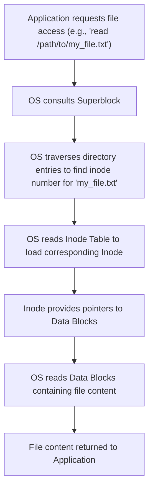

## File System Internals (Inodes, Blocks, Superblock)
### Core Concepts
*   **File System Internals:** The underlying structure and mechanisms by which an operating system stores, organizes, and retrieves files on a storage device (e.g., HDD, SSD). It abstracts the physical hardware into a logical view of files and directories.
*   **Inode (Index Node):** A data structure that stores metadata about a file or directory. Each file/directory on a file system has exactly one inode, identified by a unique inode number. Crucially, an inode **does not** store the file's actual content.
*   **Data Blocks:** Fixed-size chunks of storage space on the disk where the actual file content (data) is stored. Inodes contain pointers to these data blocks.
*   **Superblock:** A critical data structure located at a well-known position (often multiple redundant copies) on the file system. It contains global information about the entire file system, essential for its management and integrity.

### Key Details & Nuances
*   **Inode Details:**
    *   **Metadata Stored:** File type (regular file, directory, symlink, device), permissions (read, write, execute for owner, group, others), ownership (user ID, group ID), file size, timestamps (creation, last modification, last access), link count (number of hard links pointing to this inode), and pointers to data blocks.
    *   **Data Block Pointers:** To support files of varying sizes efficiently, inodes typically use a combination of direct and indirect pointers:
        *   **Direct Pointers:** Point directly to the first few data blocks.
        *   **Single Indirect Pointer:** Points to a data block that contains a list of more data block pointers.
        *   **Double Indirect Pointer:** Points to a data block that contains a list of single indirect pointers.
        *   **Triple Indirect Pointer:** Points to a data block that contains a list of double indirect pointers. This hierarchical structure allows for very large files.
*   **Data Block Allocation:**
    *   File systems allocate blocks to store data. The block size is a fundamental design parameter (e.g., 4KB).
    *   **Fragmentation:** As files are created and deleted, free blocks can become scattered, leading to fragmented files (data blocks are not contiguous). This can negatively impact read/write performance.
    *   **Block Groups (or Cylinder Groups):** Many modern file systems (e.g., ext4, ZFS) group blocks and inodes into larger units for better data locality, reducing seek times.
*   **Superblock Details:**
    *   **Critical Information:** Total number of blocks, number of free blocks, total number of inodes, number of free inodes, block size, inode size, file system state (clean/dirty), and pointers to other key structures like the inode table and block bitmaps.
    *   **Redundancy:** Due to its critical nature, file systems often store multiple copies of the superblock across different locations on the disk. Corruption of the superblock can render the entire file system unusable, requiring recovery tools (`fsck`, `chkdsk`).

### Practical Examples

Let's illustrate the simplified process of reading a file using these concepts.

### Common Pitfalls & Trade-offs
*   **Inode Exhaustion:** A common issue where a file system runs out of available inodes even if there's plenty of free data block space. This typically occurs when a large number of very small files are created (e.g., caching, temporary files in `npm install`, email queues), as each file consumes one inode regardless of its size.
*   **Block Size Trade-offs:**
    *   **Small Block Size (e.g., 512 bytes):**
        *   **Pros:** Less internal fragmentation (wasted space within a block if a file doesn't fill it). Better for many small files.
        *   **Cons:** More blocks needed for large files, requiring more pointers in the inode (potentially leading to more indirect blocks), higher I/O overhead (more distinct I/O operations), larger inode table.
    *   **Large Block Size (e.g., 4KB, 8KB):**
        *   **Pros:** Fewer blocks needed for large files, fewer pointers in the inode, better I/O throughput for large sequential reads/writes.
        *   **Cons:** More internal fragmentation (wasted space) for small files.
*   **Superblock Corruption:** A single point of failure. If the superblock (and its backups) becomes corrupted, the file system cannot be mounted or accessed, requiring specialized recovery tools.
*   **Hard Links vs. Soft Links:**
    *   **Hard Link:** A new directory entry pointing to an *existing inode*. It increases the inode's link count. Deleting a hard link only removes the directory entry; the file data and inode persist until the link count drops to zero.
    *   **Soft Link (Symbolic Link):** A special file that contains the path to another file or directory. It has its *own inode*. Deleting the original file breaks the soft link.

### Interview Questions
1.  **Q: Explain the role of inodes, data blocks, and the superblock in a typical Unix-like file system.**
    *   **A:** The **superblock** holds global file system metadata (size, free space, block/inode counts). **Inodes** store metadata for individual files/directories (permissions, ownership, size, timestamps, type, link count) and pointers to their data. **Data blocks** store the actual file content. The superblock points to the inode table, and inodes point to data blocks, providing the complete file organization.
2.  **Q: How does a file system efficiently manage files that range from very small to extremely large, given the fixed size of data blocks?**
    *   **A:** File systems use a hierarchical pointer scheme within inodes. Small files use **direct pointers** to their data blocks. Larger files leverage **indirect pointers**: a single indirect pointer points to a block containing a list of data block pointers; a double indirect pointer points to a block containing single indirect pointers; and a triple indirect pointer points to a block containing double indirect pointers. This allows a vast addressable space for large files without needing a massive inode.
3.  **Q: Describe what happens at a low level when a file is deleted. What are the implications for data recovery?**
    *   **A:** When a file is deleted, its entry is removed from the parent directory. The inode's **link count** is decremented. If the link count reaches zero, the inode is marked as free, and its associated data blocks are marked as free in the file system's block bitmap. The actual file data in the data blocks is **not immediately overwritten**; it remains until the blocks are reallocated and new data is written. This is why data recovery tools can sometimes retrieve deleted files.
4.  **Q: What are the trade-offs of choosing a smaller versus a larger block size when designing a file system?**
    *   **A:** A **smaller block size** (e.g., 512B) minimizes **internal fragmentation** (wasted space within partially filled blocks), which is efficient for many small files. However, it requires more blocks for large files, increasing the number of inode pointers needed and potentially leading to higher I/O overhead due to more fragmented reads/writes. A **larger block size** (e.g., 4KB) reduces the number of blocks needed for large files, improving sequential I/O performance and requiring fewer inode pointers. But it increases internal fragmentation, wasting more space if files are not multiples of the block size.
5.  **Q: What is "inode exhaustion," and under what circumstances might it occur?**
    *   **A:** Inode exhaustion occurs when a file system runs out of available inodes, even though there might be significant free data block space remaining on the disk. This typically happens in scenarios involving a vast number of very small files, such as web server caches, email spools, or build system temporary directories (e.g., `node_modules` with millions of tiny files). Since each file, regardless of size, requires exactly one inode, creating too many small files can deplete the inode pool before the disk space is fully utilized.