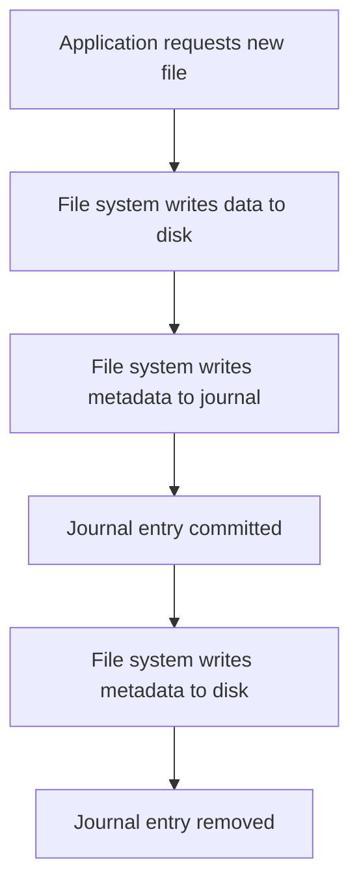

## Journaling File Systems
### Core Concepts
*   **Purpose:** Journaling file systems enhance data integrity and consistency, especially after system crashes or power failures, by maintaining a log (journal) of changes before they are applied to the main file system structure.
*   **Atomicity:** Treats file system operations (e.g., creating a file, modifying metadata) as atomic transactions. Either all changes related to a transaction are applied, or none are.
*   **Recovery:** Upon reboot after a crash, the file system can consult the journal to replay incomplete transactions, ensuring consistency without needing a full, time-consuming file system check (`fsck`).

### Key Details & Nuances
*   **The Journal:** A circular log region on disk where file system modifications are first recorded.
*   **Phases of a Journaled Operation:**
    1.  **Logging:** Intended changes (metadata and/or data) are written to the journal.
    2.  **Commit:** A special "commit record" is written to the journal, signifying the transaction is complete and valid.
    3.  **Checkpointing/Applying:** The changes are written from the journal to their final locations on the main file system.
    4.  **Trimming:** Once changes are durably written to the main file system, the corresponding journal entries are marked as free or removed.
*   **Journaling Modes (Trade-offs: Performance vs. Data Integrity):**
    *   **Writeback (Metadata Journaling):** Only metadata changes are written to the journal. Data blocks are written directly to their final locations on disk.
        *   **Pros:** Highest performance.
        *   **Cons:** Least safe. Data blocks might be written *after* metadata, leading to potential data corruption (e.g., a file exists but contains old or garbage data) if a crash occurs between the two writes. Known as "torn writes."
    *   **Ordered (Metadata & Data Ordering):** Metadata changes are journaled, but data blocks are written directly to disk *before* their corresponding metadata is committed to the journal.
        *   **Pros:** Good balance of performance and integrity. Prevents torn writes where old data is confused with new data.
        *   **Cons:** A crash could result in a "new" file (metadata exists) pointing to "old" or garbage data if the data write failed before metadata was committed. Data blocks themselves are not recovered via journal.
    *   **Data (Full Journaling):** Both metadata and actual file data are written to the journal before being applied to the main file system.
        *   **Pros:** Highest integrity guarantee. Every change is recoverable.
        *   **Cons:** Lowest performance due to "double writing" (data written once to journal, then again to main file system) and increased I/O.

### Practical Examples
**File Creation Process (Simplified Journaling Flow - Ordered Mode Assumption):**



**Ensuring Data Durability (`fsync`):**
In many applications, writing data to a file doesn't immediately guarantee it's on persistent storage, even with journaling. The OS might buffer writes. `fsync` (or `fdatasync`) forces all buffered data and/or metadata associated with a file to be written to the underlying storage device and committed to the journal.

```typescript
import * as fs from 'fs';

function writeAndSyncFile(filePath: string, content: string): Promise<void> {
    return new Promise((resolve, reject) => {
        // Step 1: Write content to the file
        fs.writeFile(filePath, content, (err) => {
            if (err) {
                return reject(err);
            }
            // Step 2: Open the file to get a file descriptor for fsync
            fs.open(filePath, 'r+', (err, fd) => {
                if (err) {
                    return reject(err);
                }
                // Step 3: Call fsync to force write buffered data and metadata to disk
                fs.fsync(fd, (err) => {
                    if (err) {
                        fs.close(fd, () => reject(err)); // Close and then reject
                        return;
                    }
                    // Step 4: Close the file descriptor
                    fs.close(fd, (closeErr) => {
                        if (closeErr) {
                            return reject(closeErr);
                        }
                        resolve();
                    });
                });
            });
        });
    });
}

// Example usage:
writeAndSyncFile('my_important_log.txt', 'Application startup successful.\n')
    .then(() => console.log('File written and synced successfully!'))
    .catch((err) => console.error('Error:', err));
```

### Common Pitfalls & Trade-offs
*   **Performance Overhead:** Journaling inherently adds overhead due to extra writes (especially full data journaling). This is a trade-off for increased reliability.
*   **Still Not Invincible:** Journaling protects against file system corruption due to power loss or crashes, but it does *not* protect against:
    *   Hardware failures (e.g., disk drive death).
    *   Application bugs that write incorrect data.
    *   User errors (e.g., accidental deletion).
    *   It's not a substitute for proper backup strategies.
*   **Journal Size:** A larger journal can absorb more pending writes, reducing latency spikes, but consumes more disk space and can increase recovery time if it contains many uncheckpointed transactions.

### Interview Questions
1.  **What problem do journaling file systems solve, and how do they achieve it?**
    *   **Answer:** They solve the problem of file system inconsistency and potential data loss after system crashes or power failures. They achieve this by logging intended changes (metadata and/or data) to a separate journal area before applying them to the main file system. Upon recovery, the journal is replayed to ensure all committed transactions are fully applied or incomplete ones are discarded, bringing the file system to a consistent state.
2.  **Compare and contrast the three main journaling modes: writeback, ordered, and data. Discuss their respective performance and data integrity characteristics.**
    *   **Answer:**
        *   **Writeback:** Journals metadata only. Highest performance, lowest integrity (data can be corrupted if crash occurs between data write and metadata commit).
        *   **Ordered:** Journals metadata; ensures data is written to disk *before* metadata is committed to the journal. Good performance/integrity balance. Prevents data loss for *new* data, but old data might be pointed to by new metadata if a crash occurs.
        *   **Data:** Journals both metadata and actual file data. Lowest performance (due to double writing), highest integrity (full recovery of all committed data).
3.  **How does `fsync` relate to file system durability in the context of journaling?**
    *   **Answer:** While journaling protects the file system structure, `fsync` (or `fdatasync`) is crucial for application-level data durability. It forces the operating system to flush all buffered data and metadata associated with a file to the underlying storage device and ensures that the corresponding journal entries are committed. Without `fsync`, data might still reside in volatile OS caches, making it vulnerable to loss even on a journaling file system during a crash.
4.  **What are the primary performance implications of using a journaling file system, especially when considering different journaling modes?**
    *   **Answer:** Journaling generally introduces performance overhead due to the additional disk writes for the journal. This overhead is minimal for writeback mode (metadata only), moderate for ordered mode (metadata + ordered data writes), and most significant for full data journaling (double writing both data and metadata), which can roughly double the I/O for file modifications. The performance impact also depends on the workload (read-heavy vs. write-heavy) and the underlying storage speed.