## I/O Management (Polling, Interrupts, DMA)
### Core Concepts
*   **I/O Management:** The process by which the Operating System (OS) handles input and output operations between the CPU/memory and peripheral devices (e.g., disk, network card, keyboard).
*   **Polling:** A method where the CPU continuously checks the status of an I/O device to see if it's ready for data transfer or if an operation has completed.
*   **Interrupts:** A mechanism where an I/O device, upon completing an operation or requiring service, sends a signal (an interrupt) to the CPU, causing it to temporarily suspend its current task and handle the device's request.
*   **Direct Memory Access (DMA):** A hardware feature that allows I/O devices to transfer data directly to and from main memory without involving the CPU, significantly reducing CPU overhead for large data transfers.

### Key Details & Nuances
*   **Polling:**
    *   **Mechanism:** CPU executes a loop, repeatedly reading a status register on the device.
    *   **Pros:** Simple to implement, low latency for very fast/frequent I/O operations if the device is often ready, no context switch overhead.
    *   **Cons:** Wastes CPU cycles (busy-waiting) if the device is slow or rarely ready, inefficient for irregular I/O.
*   **Interrupts:**
    *   **Mechanism:** Device asserts an interrupt line; Interrupt Controller notifies CPU; CPU saves context, jumps to Interrupt Service Routine (ISR); ISR handles request; CPU restores context.
    *   **Pros:** Efficient CPU utilization (CPU can do other work while waiting), suitable for irregular or infrequent I/O events.
    *   **Cons:** Higher overhead per operation (context switch, ISR execution), potential for "interrupt storms" if devices are too chatty, introduces latency.
*   **Direct Memory Access (DMA):**
    *   **Mechanism:** CPU programs the DMA controller (source address, destination address, size, direction); DMA controller manages data transfer directly between device and memory; DMA controller raises an interrupt upon completion.
    *   **Pros:** Offloads CPU from data transfer, high throughput for large data blocks, ideal for high-speed devices (disk, network).
    *   **Cons:** Requires dedicated hardware (DMA controller), more complex setup, potential for cache coherence issues (data in cache might be stale after DMA transfer to memory).
    *   **Common Use:** Modern OS typically uses DMA for most high-volume I/O, combined with interrupts for completion notification.

### Practical Examples

```mermaid
graph TD;
    subgraph Polling Flow
        P1["CPU initiates I/O"] --> P2["CPU loops checking device status"];
        P2 -- "Device not ready" --> P2;
        P2 -- "Device ready" --> P3["CPU transfers data"];
        P3 --> P4["I/O complete"];
    end

    subgraph Interrupt Flow
        I1["CPU initiates I/O"] --> I2["CPU does other work"];
        I2 --> I3["Device completes operation"];
        I3 --> I4["Device sends interrupt to CPU"];
        I4 --> I5["CPU saves context"];
        I5 --> I6["CPU executes ISR"];
        I6 --> I7["CPU restores context"];
        I7 --> I8["I/O complete"];
    end

    subgraph DMA Flow
        D1["CPU programs DMA controller"] --> D2["CPU does other work"];
        D2 --> D3["DMA controller handles data transfer"];
        D3 --> D4["DMA controller sends interrupt to CPU"];
        D4 --> D5["CPU saves context"];
        D5 --> D6["CPU executes ISR"];
        D6 --> D7["CPU restores context"];
        D7 --> D8["I/O complete"];
    end
```

### Common Pitfalls & Trade-offs
*   **Choosing the right method:**
    *   **Polling:** Use for very simple, low-speed devices where CPU overhead is acceptable (e.g., microcontrollers, very specific hardware registers), or for critical real-time systems where predictable, low-latency access is paramount and busy-waiting is tolerable.
    *   **Interrupts:** General-purpose, efficient for most I/O scenarios where data transfer is infrequent or unpredictable. Forms the backbone of most OS I/O.
    *   **DMA:** Essential for high-performance I/O (e.g., disk, network cards, GPUs) to avoid CPU bottlenecks when transferring large data blocks.
*   **Interrupt Latency:** Excessive interrupts can lead to high CPU utilization in ISRs and context switching, degrading overall system performance (interrupt storm).
*   **DMA and Cache Coherence:** If the CPU and DMA access the same memory region, there's a risk of stale data in the CPU cache. The OS or hardware (e.g., IOMMU) must ensure cache coherence (e.g., by flushing cache lines before DMA write, or invalidating after DMA read). This is a critical senior-level consideration.
*   **Security:** DMA devices can directly access memory, which can be a security vulnerability if not properly managed (e.g., through IOMMUs – Input/Output Memory Management Units – that provide memory protection for DMA).

### Interview Questions
1.  **Compare and contrast polling and interrupt-driven I/O. When would you choose one over the other for a specific device?**
    *   **Answer:** Polling involves the CPU constantly checking device status, leading to CPU waste but lower latency for very rapid, small I/O. Interrupts allow the CPU to do other work and are notified by the device when ready, saving CPU cycles but incurring context switch overhead. Choose polling for very simple, fast, or dedicated systems where predictable latency is key and CPU idle time is acceptable. Choose interrupts for general-purpose OSes and devices with unpredictable or infrequent I/O, to maximize CPU utilization.
2.  **Explain the role of Direct Memory Access (DMA) in modern operating systems. What specific problems does it solve, and what are its potential drawbacks?**
    *   **Answer:** DMA allows I/O devices to transfer data directly to/from main memory without CPU intervention. It solves the problem of high CPU overhead during large data transfers, improving system throughput and freeing the CPU for other tasks. Drawbacks include increased hardware complexity (requiring a DMA controller), potential cache coherence issues (data in cache might be stale if modified by DMA), and security concerns if not properly managed (e.g., through IOMMU).
3.  **Describe the "cost" associated with handling an interrupt. How do modern OSes minimize this cost?**
    *   **Answer:** The cost includes saving the current CPU context (registers, program counter), jumping to the Interrupt Service Routine (ISR), executing the ISR, and then restoring the CPU context. This involves multiple memory accesses and CPU cycles. Modern OSes minimize this by keeping ISRs as short and fast as possible, deferring non-critical work to "bottom halves" (like DPCs in Windows or tasklets/workqueues in Linux) that run later in a process context, and using efficient context switching mechanisms.
4.  **Imagine a high-speed network card receiving large volumes of data. Describe how I/O management (polling, interrupts, DMA) would likely be leveraged together to handle this efficiently.**
    *   **Answer:** For a high-speed network card, **DMA** is essential for transferring large incoming/outgoing packets directly to/from memory, offloading the CPU. The network card would typically raise an **interrupt** to signal the CPU when a batch of packets has been transferred by DMA or when an error occurs. To further optimize, some high-performance network drivers might employ **polling** in specific scenarios (e.g., "NAPI" in Linux, or Rx/Tx rings) for a short period *after* an interrupt to process subsequent ready packets without raising new interrupts, thus amortizing interrupt overhead. This hybrid approach balances responsiveness with throughput.