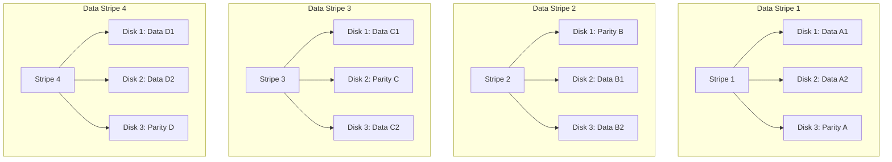

## RAID Levels Explained (0, 1, 5, 10)
### Core Concepts
*   **RAID (Redundant Array of Independent/Inexpensive Disks):** A data storage virtualization technology that combines multiple physical disk drive components into one or more logical units for the purposes of data redundancy, performance improvement, or both.
*   **Key Principles:**
    *   **Striping (RAID 0):** Data is split into fixed-size blocks (stripes) and written across multiple disks simultaneously. Improves performance but offers no redundancy.
    *   **Mirroring (RAID 1):** Data is duplicated identically on two or more disks. Provides high redundancy but sacrifices usable capacity.
    *   **Parity:** A calculated checksum used to reconstruct lost data from a failed disk. Distributed parity (e.g., RAID 5) stores parity information across all disks in the array, avoiding a single point of failure for parity.

### Key Details & Nuances
*   **RAID 0 (Striping)**
    *   **Mechanism:** Data is interleaved sector-by-sector or block-by-block across all disks.
    *   **Pros:** Highest read/write performance among all levels; 100% capacity utilization.
    *   **Cons:** No data redundancy; failure of any single disk leads to complete data loss for the entire array.
    *   **Use Cases:** Non-critical data, scratch disks, temporary files, video editing where raw speed is paramount and data can be easily regenerated.
*   **RAID 1 (Mirroring)**
    *   **Mechanism:** Exact copies (mirrors) of data are maintained on two or more disks.
    *   **Pros:** High data redundancy; excellent read performance (reads can be served from either disk); simple recovery.
    *   **Cons:** Lowest capacity utilization (50% for two disks); higher cost per usable GB.
    *   **Use Cases:** Critical data, operating system drives, applications requiring high availability and low latency, e.g., database logs.
*   **RAID 5 (Striping with Distributed Parity)**
    *   **Mechanism:** Data is striped across N-1 disks, and parity is distributed across all N disks. Requires at least 3 disks.
    *   **Pros:** Good balance of performance, redundancy (tolerates single disk failure), and capacity utilization (N-1/N).
    *   **Cons:**
        *   **Write Penalty:** Each write operation requires reading data, reading old parity, computing new parity, and writing both new data and new parity (Read-Modify-Write cycle). This can degrade write performance, especially with many small random writes.
        *   **Rebuild Time/Risk:** Rebuilding a failed drive is computationally intensive and slow, especially for large arrays, increasing the window for a second drive failure, leading to total data loss.
    *   **Use Cases:** File servers, application servers, web servers – where read performance is more critical than write performance, and single disk failure tolerance is required.
*   **RAID 10 (RAID 1+0 - Striping of Mirrors)**
    *   **Mechanism:** Combines mirroring and striping. Data is mirrored (RAID 1) into pairs, and then these mirrored pairs are striped (RAID 0). Requires at least 4 disks (2 mirrored pairs).
    *   **Pros:** High performance (due to striping) and high redundancy (due to mirroring). Can tolerate multiple disk failures as long as they are not within the same mirrored pair. Excellent read and good write performance.
    *   **Cons:** High cost per usable GB (50% capacity utilization).
    *   **Use Cases:** High-performance database servers, virtual machine hosts, applications requiring both high availability and speed.
*   **Hardware vs. Software RAID:**
    *   **Hardware RAID:** Managed by a dedicated controller card (or motherboard chip). Offloads CPU from RAID calculations, typically offers better performance, hot-swapping, and battery-backed write cache.
    *   **Software RAID:** Managed by the operating system (e.g., Linux `mdadm`, Windows Storage Spaces). Uses host CPU, generally lower cost and more flexible, but can impact system performance.

### Practical Examples

**RAID 5 Data and Parity Distribution (3 Disks)**

*Explanation:* Data blocks (e.g., A1, A2) are striped across disks, and a parity block (e.g., Parity A) is distributed among the disks for each stripe. The parity block's location rotates to avoid a single bottleneck and spread load. If any single disk fails, its data can be reconstructed using the remaining data and parity blocks.

### Common Pitfalls & Trade-offs
*   **RAID Is Not a Backup:** RAID provides fault tolerance against disk failure, not protection against accidental deletion, file corruption, virus attacks, or natural disaster. A robust backup strategy is still essential.
*   **Rebuild Performance Degradation:** During a disk rebuild (after a failure), the array operates in a degraded state, and performance (especially write performance) can be significantly impacted.
*   **Increased Risk During Rebuilds:** The longer a rebuild takes, the higher the chance of a second disk failure in the array, which would lead to complete data loss for RAID 5 (and some other levels).
*   **Write Hole (RAID 5/6):** If power is lost during a write operation, and some data blocks are written but the corresponding parity is not, the parity can become inconsistent, leading to corrupted data when a drive fails and is rebuilt. Hardware RAID controllers with battery-backed write caches mitigate this.
*   **Cost vs. Performance vs. Redundancy:** Choosing a RAID level is a trade-off. RAID 0 is cheap and fast but no redundancy. RAID 1 is redundant but expensive per usable GB. RAID 5 balances, but has write penalties. RAID 10 offers both, but is the most expensive.

### Interview Questions
1.  **"Explain the core differences between RAID 0, RAID 1, and RAID 5. When would you choose one over the others?"**
    *   **Answer:** RAID 0 (striping) offers speed but no redundancy; choose for temporary data or where performance is paramount and data loss is acceptable. RAID 1 (mirroring) provides high redundancy with good read performance but half capacity; ideal for critical OS drives or high-availability low-latency data. RAID 5 (striping with distributed parity) balances performance, redundancy (single disk failure), and capacity; suitable for general-purpose file/application servers where reads are more frequent than writes, but be mindful of its write penalty and rebuild times.
2.  **"What is the 'write penalty' in RAID 5, and how does it impact system performance? How does RAID 10 address this?"**
    *   **Answer:** The RAID 5 write penalty refers to the overhead for each write operation: it requires reading the old data, reading the old parity, computing the new parity, and then writing both the new data block and the new parity block. This Read-Modify-Write cycle makes small, random writes particularly slow. RAID 10 mitigates this because it mirrors data first, then stripes. A write operation simply involves writing to the two mirrored disks in a pair, which is faster and doesn't require complex parity calculations across multiple disks for each write.
3.  **"Why is it commonly said that 'RAID is not a backup'? Provide scenarios where RAID would not protect your data."**
    *   **Answer:** RAID provides fault tolerance against *hardware failure* of disks within the array, not comprehensive data protection. It doesn't protect against:
        *   **Accidental deletion or human error:** Deleting a file from a RAID array deletes it from all disks.
        *   **Logical corruption:** A corrupted file written to RAID is mirrored or protected by parity in its corrupted state.
        *   **Malware/Ransomware:** Encrypts data on the array.
        *   **Physical disaster:** Fire, flood, theft affecting the entire server.
    *   A separate backup strategy (e.g., 3-2-1 rule) is essential for true data recovery.