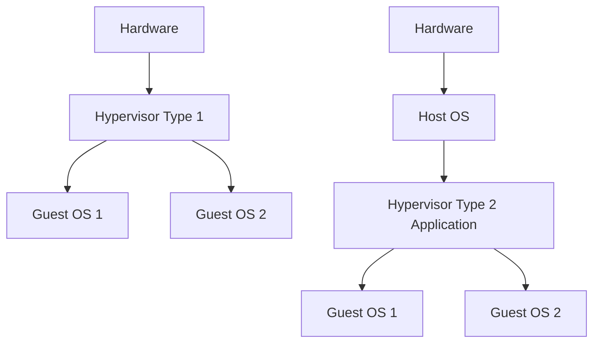

## Virtualization and Hypervisors (Type 1 vs. Type 2)
### Core Concepts

*   **Virtualization:** The creation of a virtual (rather than actual) version of something, such as an operating system, server, storage device, or network resources. It abstracts hardware resources, allowing multiple isolated "guest" environments (virtual machines) to run concurrently on a single "host" physical machine.
*   **Hypervisor (Virtual Machine Monitor - VMM):** A software layer that enables virtualization by creating and running virtual machines (VMs). It manages and allocates the host's hardware resources (CPU, memory, storage, network) among multiple VMs, ensuring their isolation and efficient operation.

### Key Details & Nuances

**1. Type 1 Hypervisor (Bare-Metal / Native Hypervisor)**
*   **Architecture:** Runs directly on the host's hardware, without an underlying host operating system. It acts as the OS for the hardware, directly managing resources and presenting them to guest VMs.
*   **Characteristics:**
    *   **High Performance:** Direct access to hardware minimizes overhead.
    *   **Enhanced Security:** Smaller attack surface compared to Type 2, as there's no general-purpose host OS to compromise.
    *   **Strong Isolation:** VMs are highly isolated from each other.
    *   **Scalability:** Well-suited for large-scale data centers and server virtualization.
*   **Use Cases:** Enterprise data centers, cloud computing (e.g., AWS EC2, Azure VMs often run on Type 1 hypervisors).
*   **Examples:** VMware ESXi, Microsoft Hyper-V (when installed as the core OS), KVM (Kernel-based Virtual Machine, integrated into Linux kernel).

**2. Type 2 Hypervisor (Hosted Hypervisor)**
*   **Architecture:** Runs as an application *on top of* a conventional host operating system (e.g., Windows, macOS, Linux). The host OS manages the hardware, and the hypervisor then virtualizes resources for guest VMs.
*   **Characteristics:**
    *   **Ease of Setup:** Simple to install and use on existing desktops/laptops.
    *   **Flexibility:** Can leverage existing host OS features and drivers.
    *   **Performance Overhead:** Performance is generally lower than Type 1 due to the additional layer of the host OS and its resource management.
    *   **Security Dependency:** Security relies on the underlying host OS. A compromise of the host OS can affect all VMs.
*   **Use Cases:** Software development and testing environments, running different OSes on a single desktop, personal use.
*   **Examples:** Oracle VirtualBox, VMware Workstation/Fusion, Parallels Desktop.

**Key Differences & Comparison Points:**

| Feature         | Type 1 Hypervisor                                  | Type 2 Hypervisor                                     |
| :-------------- | :------------------------------------------------- | :---------------------------------------------------- |
| **Location**    | Directly on hardware (bare-metal)                  | As an application on a host OS                        |
| **Performance** | High (near-native)                                 | Lower (overhead from host OS)                         |
| **Resource Mgmt**| Direct hardware access, efficient scheduling       | Relies on host OS for hardware access                 |
| **Isolation**   | Stronger, minimal attack surface                   | Dependent on host OS security, larger attack surface  |
| **Complexity**  | More complex to set up/manage initially, dedicated | Easier to install and use                             |
| **Use Cases**   | Servers, data centers, cloud infrastructure        | Development, testing, personal use, desktop           |

### Practical Examples

The diagrams below illustrate the architectural differences between Type 1 and Type 2 hypervisors:

### Common Pitfalls & Trade-offs

*   **Performance vs. Convenience:** Choosing Type 2 for production environments sacrifices performance and reliability for ease of setup. This is a common mistake for those unfamiliar with enterprise-grade virtualization.
*   **Security Overhead:** Type 2 hypervisors inherit vulnerabilities from the host OS. A compromised host OS means compromised VMs. Type 1 offers a significantly smaller trusted computing base.
*   **Resource Contention:** In Type 2 environments, both the host OS and the hypervisor (plus its VMs) compete for hardware resources, leading to potential bottlenecks if not properly managed.
*   **Nested Virtualization (VM on VM):** While possible (e.g., running Type 2 inside a Type 1 VM), it adds significant performance overhead and complexity, typically used for specific testing/development scenarios.

### Interview Questions

1.  **Question:** Explain the fundamental difference between a Type 1 and a Type 2 hypervisor, and provide a scenario where each would be the preferred choice.
    **Answer:** A Type 1 hypervisor runs directly on the hardware (bare-metal) with no underlying OS, offering better performance and security. It's preferred for production servers, data centers, and cloud infrastructure (e.g., VMware ESXi, KVM). A Type 2 hypervisor runs as an application on a host OS, offering easier setup but with performance overhead. It's preferred for development, testing, or personal desktop use (e.g., VirtualBox, VMware Workstation).

2.  **Question:** Discuss the performance implications and security considerations for both Type 1 and Type 2 hypervisors.
    **Answer:** Type 1 offers near-native performance due to direct hardware access and minimal overhead; its smaller attack surface also provides superior security. Type 2 incurs performance overhead due to the host OS layer and is less secure as its security is dependent on the host OS's integrity, presenting a larger attack surface.

3.  **Question:** When might KVM be considered a Type 1 hypervisor, even though it's part of the Linux kernel?
    **Answer:** KVM (Kernel-based Virtual Machine) is considered a Type 1 hypervisor because once enabled and running, it directly manages the guest VMs and allocates hardware resources without relying on the broader Linux user-space utilities for core virtualization functions. The Linux kernel effectively *becomes* the bare-metal layer for the VMs, similar to how ESXi or Hyper-V function.

4.  **Question:** A developer is setting up a new machine and needs to run multiple different operating systems for testing legacy applications, but also wants to use the machine for daily work. Which type of hypervisor would you recommend and why?
    **Answer:** I would recommend a Type 2 hypervisor (e.g., VirtualBox or VMware Workstation). The primary reasons are ease of installation and configuration on an existing desktop OS, and the flexibility to seamlessly switch between the host OS for daily work and various guest VMs for testing. While there's a performance overhead compared to Type 1, for a development and testing environment on a single machine, the convenience and lower setup complexity outweigh the marginal performance loss.