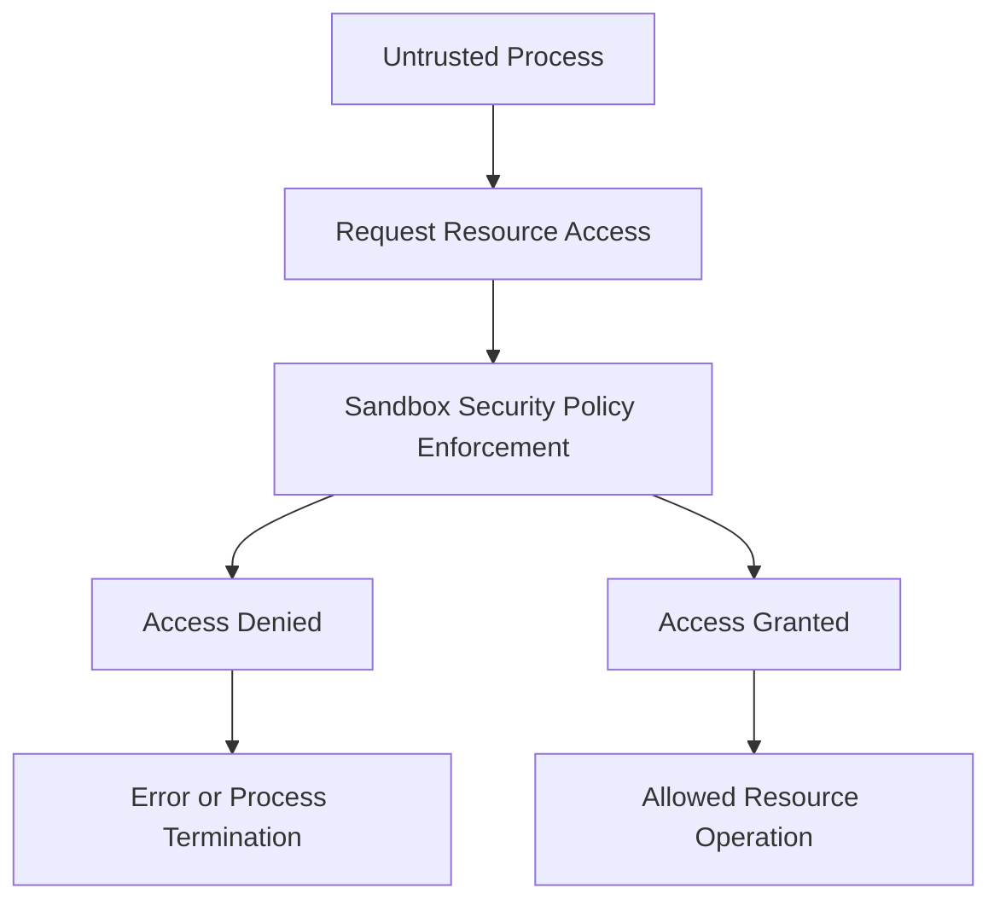

## OS Security: Access Control and Sandboxing
### Core Concepts

*   **Access Control:** The process of granting or denying specific permissions to users or processes to interact with resources (e.g., files, directories, network sockets, memory).
    *   **Goal:** Enforce authorization policies, ensuring only authorized entities can perform authorized actions.
*   **Sandboxing:** A security mechanism for running untrusted or potentially malicious code in an isolated environment, restricting its access to system resources.
    *   **Goal:** Limit the potential damage an application or process can cause, protecting the host system and other applications from vulnerabilities within the sandboxed code.

### Key Details & Nuances

*   **Access Control Models:**
    *   **Discretionary Access Control (DAC):**
        *   **Mechanism:** Resource owner (or authorized user) grants/revokes permissions.
        *   **Example:** UNIX file permissions (`rwx` bits, owner, group, others).
        *   **Nuance:** Can be difficult to manage at scale; owner error can lead to over-permissioning.
    *   **Mandatory Access Control (MAC):**
        *   **Mechanism:** System-wide policy (security administrator) defines access rules, often based on security labels (e.g., Sensitivity Levels, Categories). Users/processes cannot override.
        *   **Example:** SELinux, AppArmor.
        *   **Nuance:** Stronger security guarantees, but complex to configure and manage.
    *   **Role-Based Access Control (RBAC):**
        *   **Mechanism:** Permissions are assigned to roles, and users are assigned to roles.
        *   **Example:** Common in enterprise applications (e.g., "Admin" role, "User" role).
        *   **Nuance:** Simplifies management in large systems, maps well to organizational structures.
*   **Access Control Mechanisms:**
    *   **Access Control Lists (ACLs):** Fine-grained permissions for specific users/groups on a resource, complementing traditional UNIX permissions.
    *   **Capabilities:** Granular partitioning of root privileges. Instead of "all or nothing" root, processes can be granted specific capabilities (e.g., `CAP_NET_BIND_SERVICE` for binding to low ports).
*   **Security Principles Applied:**
    *   **Principle of Least Privilege:** A user, program, or process should be given only the minimum necessary permissions to perform its function. Reduces attack surface.
    *   **Separation of Duties:** No single individual or entity should have all the necessary permissions to complete a critical task. Requires multiple parties for sensitive operations.
*   **Sandboxing Techniques:**
    *   **`chroot` (Change Root):** Changes the apparent root directory for a process and its children. Basic isolation, but not a full security boundary (can be escaped).
    *   **Linux Namespaces:** Isolates system resources (PID, network, mount, user, UTS, cgroup) for a group of processes. Foundation for containers.
    *   **cgroups (Control Groups):** Limits, accounts for, and isolates resource usage (CPU, memory, I/O, network) for collections of processes. Works with namespaces for containerization.
    *   **`seccomp` (Secure Computing mode):** Filters system calls that a process can make to the kernel. Used to prevent malicious processes from executing dangerous operations.
    *   **Virtual Machines (VMs):** Hardware-level virtualization, providing the strongest isolation by running entire guest OS instances on a hypervisor.
    *   **Web Sandboxes:** `iframe` elements, WebAssembly (Wasm) modules, Service Workers. Browsers provide process-level isolation and strict API access controls.

### Practical Examples

**1. Access Control (UNIX File Permissions)**

Setting restrictive permissions on a sensitive configuration file, allowing only the owner to read/write:

```sh
# Create a dummy sensitive file
touch my_sensitive_config.conf

# Grant read/write to owner, no access to group or others
chmod 600 my_sensitive_config.conf

# Verify permissions (rwx: 421)
# -rw------- (600) means owner can read (4) and write (2), group has no access (0), others have no access (0)
ls -l my_sensitive_config.conf
```

**2. Sandboxing (Conceptual Flow)**



### Common Pitfalls & Trade-offs

*   **Over-permissioning:** Granting more permissions than necessary (violates least privilege). Common due to convenience or lack of understanding. Leads to a larger attack surface.
*   **Complexity vs. Security:** More granular access control and stronger sandboxing techniques often increase configuration complexity, making them harder to implement correctly and maintain.
*   **Performance Overhead:** Sandboxing introduces overhead due to the isolation layers (e.g., context switching, system call filtering, virtualization). Balancing security and performance is key.
*   **Incomplete Sandboxes (Escape Vulnerabilities):** No sandbox is foolproof. Attackers constantly look for ways to "escape" the sandbox and gain access to the host system (e.g., `chroot` escapes, container breakout vulnerabilities, VM escapes).
*   **Ignoring User Context:** Policies that don't consider actual user roles or application needs can lead to usability issues or workarounds that undermine security.

### Interview Questions

1.  **Differentiate between DAC, MAC, and RBAC. When would you typically use each model in a real-world system design?**
    *   **Answer:**
        *   **DAC:** User/owner-centric, highly flexible but less centrally enforceable. Used in personal systems, collaborative file sharing where owners manage permissions (e.g., UNIX file systems).
        *   **MAC:** System-centric, strict, based on labels/policies. Used in high-security environments, government systems, military, or for confining sensitive applications (e.g., SELinux for web servers, databases).
        *   **RBAC:** Role-centric, simplifies management by grouping permissions. Used in enterprise applications, large-scale systems where users belong to defined roles (e.g., HR systems, CRM, cloud IAM policies).
        *   **Use Cases:** DAC for individual flexibility; MAC for high-assurance, controlled environments; RBAC for scalable, structured organizational access.

2.  **Explain the core Linux kernel mechanisms that enable containerization (like Docker) and how they contribute to process isolation and resource management.**
    *   **Answer:** Linux containers leverage two primary kernel features:
        *   **Namespaces:** Provide process isolation by giving a process its own "view" of system resources (e.g., `pid` namespace for process IDs, `net` namespace for network interfaces, `mnt` namespace for file systems). This creates the illusion of a standalone system.
        *   **cgroups (Control Groups):** Manage and limit resource allocation (CPU, memory, I/O, network bandwidth) to groups of processes. This prevents a misbehaving container from consuming all host resources.
        Together, namespaces isolate what a container *sees*, and cgroups limit what it *can use*.

3.  **How does `seccomp` contribute to sandboxing, and what are its limitations when securing an application?**
    *   **Answer:** `seccomp` allows a process to restrict the system calls it can make to the kernel. It's a powerful sandboxing tool because it can prevent an application from performing dangerous operations even if it's compromised (e.g., preventing a web server from making `exec` calls).
    *   **Contributions:** Reduces the attack surface by whitelisting or blacklisting specific syscalls, mitigating exploits that rely on unexpected syscalls.
    *   **Limitations:**
        *   **Complexity:** Defining an effective syscall whitelist can be complex and error-prone; too restrictive breaks functionality, too permissive reduces security.
        *   **Not a full sandbox:** `seccomp` only limits syscalls, not other attack vectors like side-channel attacks or kernel vulnerabilities. It's best used as one layer in a multi-layered defense (e.g., combined with namespaces, user ID isolation).

4.  **Discuss the principle of least privilege in the context of file system access. Provide a practical example of how violating this principle can lead to security vulnerabilities.**
    *   **Answer:** The principle of least privilege dictates that an entity (user, process, program) should only be granted the minimum necessary permissions to perform its function. For file system access, this means only giving read, write, or execute permissions where absolutely required.
    *   **Violation Example:** If a web server process (which typically runs as a low-privilege user) is given write access to its own configuration files or the entire web root directory. If an attacker finds a vulnerability in the web server application (e.g., a file upload flaw), they could exploit this excessive permission to:
        1.  Modify the server's configuration (e.g., redirect traffic).
        2.  Upload a malicious script (e.g., a web shell) into the web root, which the server then executes, giving the attacker remote code execution capabilities on the host.
    *   The principle would suggest the web server should only have read access to config files and write access only to specific upload directories, never the entire root.

5.  **Compare and contrast using a `chroot` environment versus a full Virtual Machine (VM) for sandboxing an untrusted application. What are the key trade-offs?**
    *   **Answer:**
        *   **`chroot`:** Changes the root directory for a process, basic file system isolation.
            *   **Pros:** Low overhead, simple to set up.
            *   **Cons:** Not a strong security boundary (can be escaped), no resource isolation (CPU, memory), still shares the host kernel.
            *   **Use Case:** Simple application confinement where strong security is not the primary concern, or as a very basic first layer.
        *   **Virtual Machine (VM):** Runs an entire guest operating system on top of a hypervisor, virtualizing hardware.
            *   **Pros:** Strongest isolation (hardware-level), complete separation from host OS, can run different OSes, excellent resource control.
            *   **Cons:** High overhead (CPU, memory, storage), slower startup times, more complex management.
            *   **Use Case:** Running highly untrusted code, legacy applications, or multi-tenant environments where strong security and guaranteed resource isolation are paramount.
        *   **Key Trade-offs:** Security strength and isolation (`VM` >> `chroot`) vs. performance and resource overhead (`chroot` << `VM`). VMs offer true kernel isolation, while `chroot` does not.