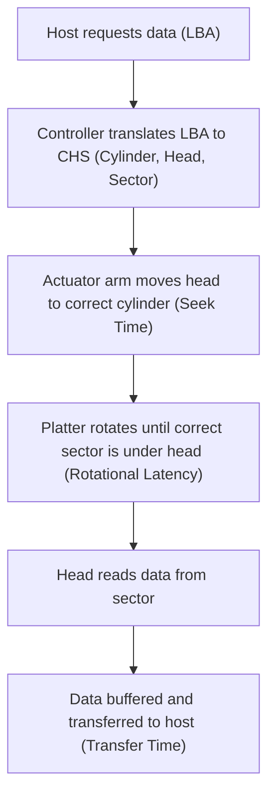

## HDD , How it works
### Core Concepts

*   **HDD (Hard Disk Drive):** A non-volatile storage device that uses magnetic storage to store and retrieve digital data. It consists of rotating platters coated with magnetic material and read/write heads that move across the surface of the platters.
*   **Mechanical Nature:** Unlike SSDs, HDDs are mechanical devices, involving physical movement of parts. This introduces latency and susceptibility to shock.

### Key Details & Nuances

*   **Components:**
    *   **Platters:** Circular disks coated with a magnetic material, where data is stored. Multiple platters are stacked on a spindle.
    *   **Spindle:** A motor that rotates the platters at a constant speed (RPM - Revolutions Per Minute). Common speeds: 5400 RPM, 7200 RPM, 10000 RPM, 15000 RPM.
    *   **Read/Write Heads:** Tiny electromagnetic devices mounted on an actuator arm. Each platter surface (top and bottom, except the very first and last) has a dedicated head.
    *   **Actuator Arm:** Moves the read/write heads radially across the platters.
    *   **Controller/Logic Board:** Manages the operations of the drive, including data transfer and communication with the host system.
*   **Data Organization:**
    *   **Tracks:** Concentric circles on each platter surface.
    *   **Sectors:** Small divisions of a track, typically 512 bytes or 4KB. The smallest unit of data transfer.
    *   **Cylinders:** A set of tracks at the same radial position across all platters.
*   **Operation (Read/Write):**
    1.  **Seek Time:** The time it takes for the actuator arm to move the read/write head to the correct track. This is a significant contributor to HDD latency.
    2.  **Rotational Latency:** The time it takes for the desired sector on the track to rotate under the read/write head. On average, this is half the time of one full rotation.
    3.  **Transfer Time:** The time it takes to transfer the data from the sector(s) to the controller and then to the host system. This depends on the data size and the drive's transfer rate.
*   **Interface Standards:**
    *   **SATA (Serial ATA):** Most common for consumer and enterprise drives.
    *   **SAS (Serial Attached SCSI):** Primarily used in enterprise environments, offering higher performance, reliability, and more advanced features.
*   **Performance Metrics:**
    *   **Latency:** Total time to access a piece of data (seek + rotational + transfer).
    *   **IOPS (Input/Output Operations Per Second):** Measures how many read/write operations a drive can perform per second. Crucial for transaction-heavy workloads. HDDs have significantly lower IOPS than SSDs.
    *   **Throughput (MB/s):** Measures the rate of data transfer.

### Practical Examples

*   **HDD Read Operation Flow:**

### Common Pitfalls & Trade-offs

*   **Latency is King:** Seek time and rotational latency are the primary performance bottlenecks for HDDs. Any operation that requires random access (small, scattered reads/writes) is significantly slower than sequential access.
*   **Fragmentation:** Over time, files can become fragmented (parts of a file stored in non-contiguous sectors). This increases seek operations and degrades performance. Regular defragmentation can help.
*   **Wear and Tear:** Mechanical parts are subject to wear and can fail over time, especially under heavy usage or physical stress.
*   **Cost per Gigabyte:** HDDs still offer a much lower cost per gigabyte compared to SSDs, making them suitable for bulk storage, backups, and archival.
*   **Shock Sensitivity:** Mechanical components make HDDs vulnerable to physical shock, which can cause data loss or drive failure.

### Interview Questions

1.  **Explain the components of an HDD and how data is accessed.**
    *   **Answer:** An HDD comprises platters, a spindle motor, read/write heads on an actuator arm, and a controller. Data is organized into tracks and sectors. Accessing data involves seeking to the correct track, waiting for the desired sector to rotate under the head (rotational latency), and then transferring the data. Seek time and rotational latency are the primary performance bottlenecks due to their mechanical nature.

2.  **What is the difference between sequential and random I/O on an HDD? Why is one much faster than the other?**
    *   **Answer:** Sequential I/O involves reading/writing data in contiguous blocks, minimizing head movement and rotational waiting. Random I/O involves accessing data scattered across the disk, requiring frequent seeks and rotations for each access. This makes random I/O significantly slower because seek time and rotational latency dominate the operation duration.

3.  **How does fragmentation affect HDD performance, and what is a common solution?**
    *   **Answer:** Fragmentation occurs when parts of a file are stored in non-contiguous sectors on the disk. This forces the HDD's read/write heads to move more frequently (seek operations) and wait for different sectors to rotate into position for each fragment, thus increasing access time and reducing overall performance. A common solution is **defragmentation**, a process that reorganizes file fragments into contiguous blocks on the disk.

4.  **Compare and contrast HDDs with SSDs in terms of performance characteristics and typical use cases.**
    *   **Answer:** HDDs are mechanical, offering high capacity at a lower cost per GB, but suffer from significant latency due to seek and rotational delays. They are best for bulk storage, backups, and archival. SSDs use flash memory, have no moving parts, offering near-instantaneous access times, high IOPS, and better shock resistance, but are more expensive per GB. They are ideal for operating systems, applications, and performance-critical workloads.