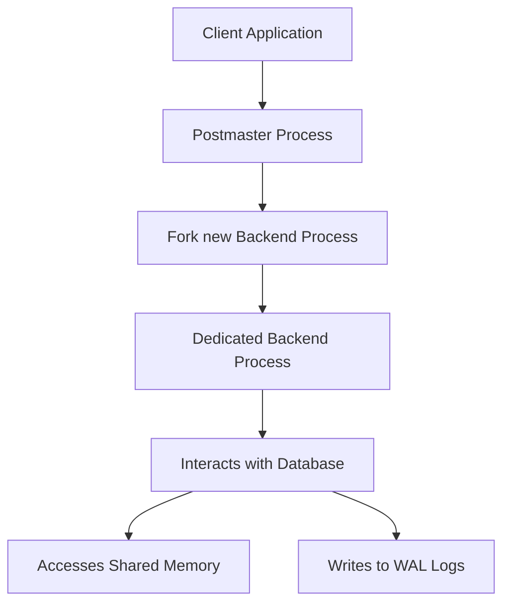

## Process Architecture (Client/Server Model)
### Core Concepts
*   **Client-Server Model:** Postgres operates as a classic client-server system. Client applications (e.g., `psql`, custom applications, ORMs) connect to the Postgres database server to send queries and receive results.
*   **Process-Per-Connection:** For each client connection, the Postgres server typically forks a dedicated backend process (often referred to simply as a "postgres process" or "server process"). This process handles all interactions for that specific client session.
*   **Postmaster (Master Process):** A single master process, `postmaster`, listens for incoming client connection requests. Upon receiving a request, `postmaster` authenticates the client and then forks a new dedicated backend `postgres` process to handle that connection.
*   **Background Processes:** In addition to client-specific backend processes, Postgres runs several other background processes (e.g., WAL writer, background writer, autovacuum launcher, stats collector) that perform essential tasks for database maintenance, consistency, and performance.

### Key Details & Nuances
*   **Process Isolation:** Each client connection operates in its own dedicated backend process. This provides strong isolation, meaning issues in one client's session (e.g., a crash) generally do not affect other connected clients or the server's stability.
*   **Shared Memory:** While processes are isolated, they communicate and share data through shared memory segments (e.g., shared buffers, WAL buffers, lock tables). This allows efficient access to common resources and data pages.
*   **Inter-Process Communication (IPC):** Processes coordinate via IPC mechanisms (e.g., semaphores, message queues) to ensure data consistency, enforce locking, and manage concurrent access to shared resources.
*   **Scalability Consideration:** The process-per-connection model provides excellent isolation and simplicity but can lead to significant resource consumption (memory, CPU context switching) when handling a very large number of concurrent connections (thousands).

### Practical Examples
**1. Client Connection Flow (Mermaid Diagram)**



**2. Viewing Postgres Processes**

When a client connects, you can observe the `postmaster` and a new `postgres` process handling the connection.

```sh
# On a Linux system, with Postgres running and a client connected (e.g., psql)
ps aux | grep postgres

# Example Output Snippet:
# postgres  1234  0.0  0.1 250000 10000 ?        S    Dec01   0:05 /usr/lib/postgresql/14/bin/postmaster -D /var/lib/postgresql/14/main
# postgres  1235  0.0  0.2 250000 20000 ?        S    Dec01   0:01 postgres: 14/main: user app_user ::1(51000) idle
# postgres  1236  0.0  0.1 250000 15000 ?        S    Dec01   0:00 postgres: 14/main: writer
# postgres  1237  0.0  0.1 250000 12000 ?        S    Dec01   0:00 postgres: 14/main: wal writer
# ... (other background processes)
```
*   `1234` is the `postmaster` process.
*   `1235` is a backend process handling a client connection (`app_user`).
*   `1236`, `1237` are background processes.

### Common Pitfalls & Trade-offs
*   **Resource Overhead per Connection:** Each backend process consumes memory (work_mem, maintenance_work_mem, etc.) and CPU. High connection counts without pooling can exhaust system resources, leading to slow performance or crashes.
*   **Connection Limits (`max_connections`):** Misconfiguring `max_connections` can prevent new clients from connecting (if set too low) or lead to resource exhaustion (if set too high without sufficient hardware).
*   **Connection Sprawl:** Applications that frequently open and close connections instead of reusing them incur high overhead due to repeated process forks, authentication, and teardowns.
*   **Solution: Connection Pooling:** For web applications or microservices, using a connection pool (e.g., PgBouncer, application-level pooling) is crucial. A pool maintains a set of open connections, reusing them across client requests, thus mitigating the overhead of the process-per-connection model.

### Interview Questions
1.  **Describe the core components of Postgres's process architecture and how they interact to serve client requests.**
    *   **Answer:** Postgres uses a client-server model. The `postmaster` process is the master, listening for connections. For each new client connection, `postmaster` forks a dedicated `postgres` backend process. This backend process handles all queries and interactions for that specific client session, utilizing shared memory for efficient data access and coordinating with other backend and background processes via IPC.
2.  **How does Postgres handle concurrent client connections? What are the implications of this approach for system resources?**
    *   **Answer:** Postgres handles concurrency by dedicating a separate backend process to each client connection. This offers strong isolation but means each connection consumes system resources (memory, CPU). For a very high number of concurrent connections, this can lead to significant resource overhead. This is why connection pooling is critical in highly concurrent applications.
3.  **What is the primary role of the `postmaster` process in PostgreSQL?**
    *   **Answer:** The `postmaster` process is the main orchestrator of a Postgres instance. Its primary roles include: listening for incoming client connection requests, authenticating clients, forking new backend `postgres` processes to handle validated connections, performing initial recovery (if needed) at startup, and managing essential background processes. If `postmaster` dies, the entire Postgres instance shuts down.
4.  **Why is connection pooling commonly recommended for applications interacting with PostgreSQL, especially in high-traffic environments?**
    *   **Answer:** Connection pooling is recommended to mitigate the overhead of Postgres's process-per-connection model. Without pooling, each new client request would trigger a new process fork, authentication, and resource allocation, leading to significant latency and resource consumption. A connection pool reuses a fixed set of connections, drastically reducing this overhead, improving performance, and allowing the database to handle many more client requests efficiently.