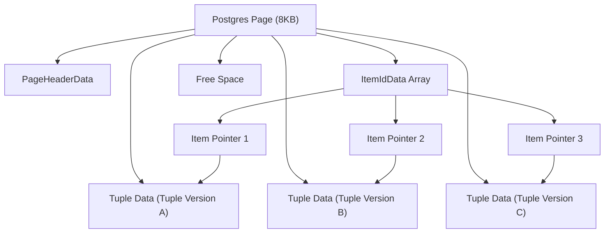

## Data Storage: Pages, Tuples, and Heap
### Core Concepts

*   **Page:** The fundamental unit of storage and I/O in PostgreSQL, defaulting to **8KB**. Each table and index is stored as a collection of pages. A page contains a header, an array of item pointers, and the actual tuple data, along with free space.
*   **Tuple (Row Version):** A logical row of data within a table. In PostgreSQL, tuples are immutable; an `UPDATE` operation creates a *new* tuple version and marks the old one as invalid, rather than modifying the existing tuple in place.
*   **Heap:** The primary storage structure for table data (tuples). It's an unordered collection of pages. New tuples are typically appended to the end of the last page, or placed in available free space on existing pages.

### Key Details & Nuances

*   **Page Structure (`PageHeaderData`):**
    *   Contains metadata like checksums, pointers to free space, and the lower/upper bounds of the item pointer array and tuple data areas.
    *   Item pointers grow downwards from the start of the page, while tuple data grows upwards from the end of the page. Free space is between them.
*   **Tuple Structure (`HeapTupleHeaderData`):**
    *   Each tuple has a fixed-size header (23 bytes on 64-bit systems) followed by an optional null bitmap and the actual user data.
    *   **MVCC Fields:** Critical for Multi-Version Concurrency Control (MVCC):
        *   `xmin`: Transaction ID (XID) that inserted this tuple version.
        *   `xmax`: Transaction ID (XID) that "deleted" or updated this tuple version (marked it obsolete).
        *   Other flags/fields relate to transaction commit status, `OID` (if enabled), and command ID within a transaction.
*   **Item Pointers (`ItemIdData`):**
    *   Small (4-byte) entries in the page's item pointer array. Each entry points to the exact byte offset within the page where a tuple's data begins.
    *   This indirection allows tuples to be placed non-contiguously within a page and enables efficient deletion by simply invalidating the item pointer without moving data.
*   **MVCC and Tuples:** MVCC relies heavily on tuple immutability and the `xmin`/`xmax` fields. When a transaction reads data, it only sees tuple versions visible to its own `xmin` and not marked by `xmax` of a committed transaction.
*   **TOAST (The Oversized-Attribute Storage Technique):** For large column values (e.g., `text`, `bytea`, `JSONB`) exceeding a certain threshold (typically ~2KB), PostgreSQL automatically compresses and/or moves the data out-of-line to a separate TOAST table, storing only a small pointer in the main table's tuple.

### Practical Examples

The relationship between a Page, Item Pointers, and Tuple Data:



Consider an `UPDATE` operation on a row:

```sql
-- Initial state: A row exists with id=1, name='Alice'
-- This row is represented by Tuple_1 on Page_X. xmin for Tuple_1 = Txn1.

UPDATE users SET name = 'Alicia' WHERE id = 1;
```

When the `UPDATE` above executes:

1.  PostgreSQL marks `Tuple_1` on `Page_X` as "dead" by setting its `xmax` to the current transaction ID (e.g., `Txn2`).
2.  A *new* tuple version, `Tuple_2`, containing `id=1, name='Alicia'`, is created. It will have its `xmin` set to `Txn2`. This `Tuple_2` is usually placed on the same page if there's space, or on a new page if not.
3.  The index (if any) is updated to point to `Tuple_2`.

### Common Pitfalls & Trade-offs

*   **Tuple Bloat:** Due to MVCC, `UPDATE` and `DELETE` operations don't immediately free disk space. Old, "dead" tuple versions accumulate, leading to:
    *   Increased disk usage.
    *   More I/O for scans (reading unnecessary data).
    *   Larger, less efficient indexes (as indexes still reference dead tuples until `VACUUM` is run).
*   **Importance of `VACUUM`:** `VACUUM` (especially `AUTOVACUUM`) is crucial for:
    *   Reclaiming space occupied by dead tuples, making it available for new tuples.
    *   Updating the `visibility map` and `free space map`, which helps the query planner and `AUTOVACUUM` process efficiently.
    *   Preventing Transaction ID Wraparound (a critical maintenance task).
    *   **Trade-off:** Running `VACUUM` (especially `VACUUM FULL`) can be I/O intensive and block writes or reads, depending on the type.
*   **Heap Fragmentation:** While `VACUUM` reclaims space, it doesn't defragment pages or reorder tuples to improve locality for sequential scans. `VACUUM FULL` or `CLUSTER` can rewrite tables to reclaim space and reorder, but they are expensive, blocking operations.
*   **`FILLFACTOR`:** A storage parameter that dictates how full a page can be when new data is initially loaded.
    *   **Lower `FILLFACTOR` (e.g., 70):** Leaves more free space on pages, potentially reducing page splits and `UPDATE`-induced bloat *on that page* as new tuple versions can often stay on the same page. Good for heavily updated tables.
    *   **Higher `FILLFACTOR` (e.g., 100):** Maximizes data density on pages. Good for mostly static tables or those with only `INSERT`s, as it reduces the number of pages needed for scans.
    *   **Trade-off:** Lower `FILLFACTOR` means more pages for the same amount of data, increasing initial storage footprint and potentially sequential scan costs.

### Interview Questions

1.  **Describe the fundamental units of data storage in Postgres (pages, tuples, heap) and their relationship.**
    *   **Answer:** Pages (default 8KB) are the I/O unit containing an array of item pointers and the actual tuple data. Tuples are immutable row versions, addressed by item pointers within a page. The heap is the primary, unordered collection of these pages where table data resides.
2.  **How does Postgres's approach to data storage (specifically immutable tuples and MVCC) lead to 'tuple bloat'? What are the performance implications, and how is it mitigated?**
    *   **Answer:** `UPDATE` and `DELETE` operations create new tuple versions or mark old ones as dead, rather than overwriting. The old versions remain on disk, causing 'bloat' (unnecessary disk space). This leads to increased I/O for scans, larger disk footprint, and less efficient indexes. It's mitigated by `VACUUM` (especially `AUTOVACUUM`), which reclaims space from dead tuples and updates visibility maps.
3.  **When an `UPDATE` operation occurs on a row, what physically happens to the data on disk, considering pages and tuples?**
    *   **Answer:** The original tuple's header is updated to mark it as obsolete (its `xmax` is set to the current transaction ID). A completely new tuple version, with the updated data and its `xmin` set to the current transaction ID, is then written to the page (if space is available) or a new page. Indexes are also updated to point to the new tuple version.
4.  **Explain the significance of `VACUUM` in the context of Postgres's heap storage. What does it do, and why is it crucial?**
    *   **Answer:** `VACUUM` scans tables to identify and mark dead tuples' space as reusable. It doesn't immediately shrink the table file but allows new tuples to reuse that space. It's crucial for preventing tuple bloat, maintaining efficient disk usage, updating visibility maps (aiding `AUTOVACUUM` and index-only scans), and preventing Transaction ID Wraparound, which can lead to data loss.
5.  **Beyond the heap, where else might a very large piece of data (e.g., a large JSONB document) from a row be stored in Postgres?**
    *   **Answer:** Very large column values are handled by TOAST (The Oversized-Attribute Storage Technique). If a tuple's size exceeds a threshold, PostgreSQL automatically compresses and/or moves the large attribute's data to a separate TOAST table, leaving only a small TOAST pointer in the main table's heap tuple. This keeps main table pages compact and I/O efficient.