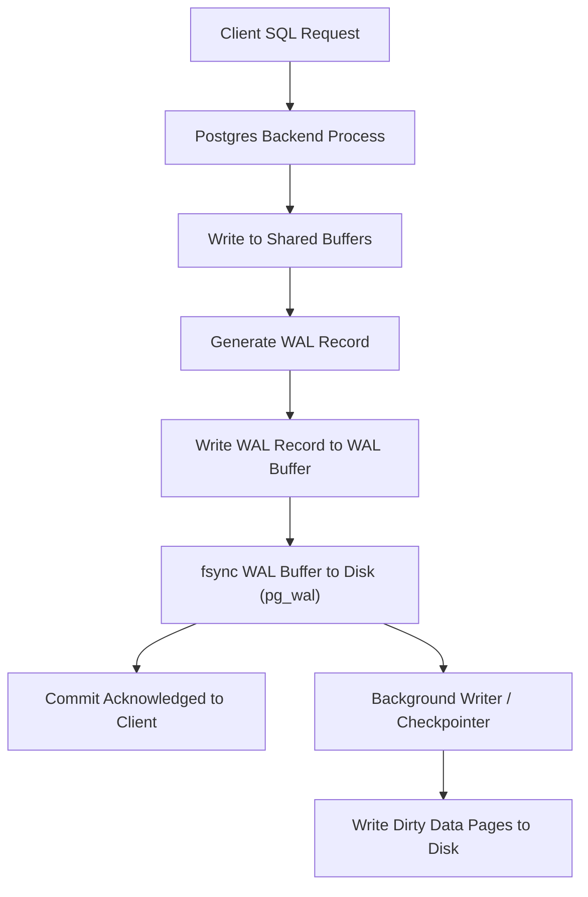

## Write-Ahead Logging (WAL)
### Core Concepts
*   **Definition**: Write-Ahead Logging (WAL) is a standard method for ensuring data integrity and durability in relational databases, including PostgreSQL. All changes to data files (tables, indexes) are first recorded in a log file (WAL) before being applied to the actual data pages on disk.
*   **Primary Purpose**:
    *   **Durability (ACID)**: Guarantees that committed transactions persist even in case of a system crash, power failure, or operating system error.
    *   **Crash Recovery**: Allows the database to be restored to a consistent state by replaying WAL records from the last successful checkpoint.
    *   **Replication & Point-in-Time Recovery (PITR)**: Enables streaming replication (sending WAL records to standby servers) and logical backups/PITR by providing a continuous stream of changes.

### Key Details & Nuances
*   **Mechanism**:
    1.  When a transaction modifies data (e.g., `UPDATE`, `INSERT`), the changes are first written to **shared buffers** (in-memory cache).
    2.  Concurrently, a record describing the change (**WAL record**) is written to the **WAL buffer** (in-memory).
    3.  Before a transaction commits, the WAL buffer is flushed to **WAL segments** (physical files) on disk using `fsync()` to ensure durability. This is the "write-ahead" principle.
    4.  Only *after* the WAL record is safely on disk is the commit acknowledged to the client. The dirty data pages in shared buffers are written to data files on disk asynchronously by background processes (e.g., Background Writer, Checkpointer).
*   **Log Sequence Number (LSN)**: A unique, monotonically increasing identifier for each point in the WAL stream. It marks the position of a WAL record and is used to track progress for recovery, replication, and checkpoints.
*   **Checkpoints**:
    *   A checkpoint is a point in time when all dirty data pages up to a certain LSN are guaranteed to have been written to disk.
    *   It minimizes recovery time after a crash by establishing a "known good" state, reducing the amount of WAL that needs to be replayed.
    *   Triggered periodically (e.g., `checkpoint_timeout`, `max_wal_size`, `max_wal_segments`, or manual `CHECKPOINT` command).
*   **WAL Segments**: WAL records are stored in fixed-size files (default 16MB in newer Postgres versions) within the `pg_wal` directory. These are rotated and reused/archived.
*   **`fsync()`**: A critical system call that forces all buffered data for a file to be written to permanent storage. Essential for WAL durability. Setting `fsync=off` is extremely dangerous and can lead to data loss.
*   **`wal_level`**: Configuration parameter controlling the amount of information written to WAL:
    *   `minimal`: Sufficient for crash recovery. No logical decoding or base backups.
    *   `replica`: Includes information for standby servers (streaming replication, archiving). Default for many setups.
    *   `logical`: Includes information for logical decoding (e.g., CDC tools, `pg_decode_logical`). Highest overhead.

### Practical Examples

The following diagram illustrates the core WAL commit process:

### Common Pitfalls & Trade-offs
*   **`fsync=off`**: **NEVER** use this in production. While it can improve write performance significantly, it completely compromises data durability and atomicity, leading to irrecoverable data corruption on crashes. Only for benchmarking or specific non-critical test environments.
*   **`pg_wal` Location**: Placing the `pg_wal` directory on a slow disk or sharing it with other high-I/O applications can bottleneck write performance, as every transaction commit depends on its write speed.
*   **WAL Size/Retention**:
    *   Too small (`wal_segments`, `max_wal_size`): Frequent checkpoints, increasing I/O load, and potentially interrupting replication if standby falls behind.
    *   Too large: Consumes more disk space, potentially extends recovery time in extreme cases (though less common due to checkpoints).
*   **`wal_level` Overhead**: Setting `wal_level` to `logical` incurs higher overhead due to the extra information written to WAL. Only enable if truly needed for logical replication or decoding.

### Interview Questions
1.  **What is Write-Ahead Logging (WAL) and why is it considered fundamental for a robust relational database like PostgreSQL?**
    *   **Answer**: WAL is a mechanism where all data modifications are first recorded in a sequential log before being applied to the actual data files. It's fundamental because it guarantees **ACID Durability** (committed transactions persist through crashes) and enables **crash recovery** (replaying logs to restore consistency) and **replication/PITR** (providing a continuous stream of changes).

2.  **Explain the role of `fsync()` in the WAL process and the implications of disabling it (`fsync=off`).**
    *   **Answer**: `fsync()` forces the operating system to write buffered data for a file directly to the physical disk. In WAL, it's crucial to ensure that WAL records are durably written to `pg_wal` files *before* a transaction is committed. Disabling `fsync` (`fsync=off`) makes commits non-durable; if a crash occurs after a commit but before the OS flushes the WAL buffer to disk, the "committed" data will be lost, leading to data corruption. It's a severe risk, only suitable for non-critical testing.

3.  **Describe the purpose of checkpoints in PostgreSQL's WAL mechanism. How do they affect crash recovery and performance?**
    *   **Answer**: A checkpoint is a point in time where all data changes up to a certain LSN are guaranteed to have been written from shared buffers to the data files on disk. Its purpose is to limit the amount of WAL that needs to be replayed during crash recovery, thereby reducing recovery time. Frequent checkpoints increase background I/O (flushing dirty pages) and can cause temporary performance spikes. Infrequent checkpoints reduce this I/O but increase crash recovery time.

4.  **How does WAL facilitate features like Point-in-Time Recovery (PITR) and streaming replication in PostgreSQL?**
    *   **Answer**: For **PITR**, WAL records are continuously archived (`archive_command`) to a separate storage location. To recover to a specific point, a base backup is restored, and then archived WAL segments are replayed up to the desired LSN. For **streaming replication**, the primary server continuously streams its WAL records to standby servers. Standbys apply these records, keeping their data synchronized, thus providing a hot standby for high availability and load balancing.

5.  **What's the difference between `wal_level=replica` and `wal_level=logical`? When would you choose one over the other?**
    *   **Answer**: `wal_level` controls the amount of detail written to WAL. `replica` (the default for most production setups) includes sufficient information for crash recovery, archiving, and streaming replication to a physical standby. `logical` includes all information from `replica` plus additional details required for logical decoding (e.g., for change data capture (CDC) tools like Debezium, or logical replication). You'd choose `replica` for standard HA setups. You'd only choose `logical` if you specifically need logical decoding, as it incurs higher overhead due to the extra information written.