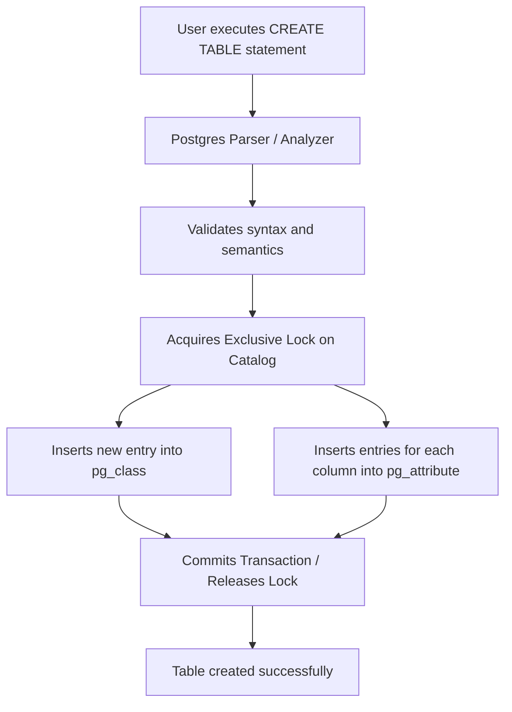

## System Catalogs (e.g., pg_class, pg_attribute)
### Core Concepts
*   **Definition:** Postgres System Catalogs (or `pg_catalog` schema) are a collection of special tables that store metadata about the database's structure, objects, and configurations. Essentially, they are the database's "self-description."
*   **Self-Describing Nature:** Postgres is a self-describing system because it stores all schema information (tables, columns, indexes, functions, users, types, etc.) within itself, accessible via standard SQL queries.
*   **Key Catalogs:**
    *   `pg_class`: Stores information about tables, indexes, views, sequences, materialized views, and TOAST tables. It contains entries for every relation in the database.
    *   `pg_attribute`: Stores information about columns of tables, views, and other relations. Each row describes a single column's name, type, and properties.
    *   `pg_namespace`: Stores information about schemas.
    *   `pg_type`: Stores information about data types.
    *   `pg_constraint`: Stores information about table constraints (PRIMARY KEY, FOREIGN KEY, UNIQUE, CHECK).
*   **Purpose:** The query planner, optimizer, and DDL/DML operations heavily rely on catalog information to understand the database structure, validate queries, and determine execution plans.

### Key Details & Nuances
*   **Transactional Consistency:** Modifications to system catalogs (e.g., via `CREATE TABLE`, `ALTER TABLE`) are transactional. If a DDL operation fails, the catalog changes are rolled back, ensuring the database remains in a consistent state.
*   **Access Methods:** System catalogs reside in the `pg_catalog` schema. While you can query them directly using `SELECT`, direct `INSERT`, `UPDATE`, or `DELETE` operations on them are *strictly prohibited* and will likely corrupt your database. All modifications must be done via DDL commands.
*   **Query Planner's Use:** When you execute a query, the Postgres parser and planner consult `pg_catalog` tables to:
    *   Validate table and column names.
    *   Determine data types for type checking and coercion.
    *   Identify available indexes (`pg_class` for index relations, `pg_index` for index properties) for query optimization.
    *   Understand constraints (`pg_constraint`) for validation and optimization.
*   **Performance:** While querying system catalogs incurs overhead, this is usually negligible for application-level metadata retrieval. For internal database operations (parsing queries, planning), their efficient access is critical. Postgres caches frequently accessed catalog information to improve performance.
*   **Object Identifiers (OIDs):** Many catalog tables use OIDs (`oid` type) as primary keys or foreign keys to reference other objects. These are internal system-wide unique identifiers. Functions like `to_regclass()` or casting (e.g., `'my_table'::regclass`) can convert object names to their OIDs for easier querying.

### Practical Examples

**1. Listing User-Defined Tables using `pg_class`**

```sql
SELECT
    relname AS table_name,
    reltuples AS estimated_rows,
    relpages AS estimated_disk_pages
FROM
    pg_class
WHERE
    relkind = 'r' -- 'r' for regular tables
    AND relnamespace = (SELECT oid FROM pg_namespace WHERE nspname = 'public') -- Or your specific schema
ORDER BY
    table_name;
```

**2. Inspecting Columns of a Specific Table using `pg_attribute` and `pg_class`**

```sql
SELECT
    a.attname AS column_name,
    format_type(a.atttypid, a.atttypmod) AS data_type,
    a.attnotnull AS not_null,
    ad.adsrc AS default_value
FROM
    pg_attribute a
JOIN
    pg_class c ON a.attrelid = c.oid
LEFT JOIN
    pg_attrdef ad ON a.attrelid = ad.adrelid AND a.attnum = ad.adnum
WHERE
    c.relname = 'users' -- Replace with your table name
    AND a.attnum > 0 -- Exclude system columns like ctid, xmax, etc.
ORDER BY
    a.attnum;
```

**3. DDL Interaction with System Catalogs**



### Common Pitfalls & Trade-offs
*   **Direct Modification:** The absolute biggest pitfall is attempting to `INSERT`, `UPDATE`, or `DELETE` rows directly in `pg_catalog` tables. This will bypass necessary checks, leave the database in an inconsistent state, and almost certainly lead to corruption, requiring a restore from backup. Always use DDL statements (`CREATE`, `ALTER`, `DROP`).
*   **Misinterpreting OIDs:** While OIDs are unique within a database, they are not guaranteed to be consistent across database restores or dumps/reloads if the same objects are created in a different order. Rely on object names for application logic; OIDs are primarily for internal linking.
*   **Locking during DDL:** DDL operations on objects typically acquire exclusive locks on the relevant catalog entries, which can briefly block other operations (especially DDL) on the same objects. This is a necessary trade-off for transactional consistency.
*   **Catalog Bloat:** Like regular tables, system catalogs can experience bloat (dead tuples after updates/deletes from DDL operations). Postgres automatically `VACUUM`s and `ANALYZE`s system catalogs, but very heavy DDL workloads could theoretically lead to performance issues if auto-vacuum struggles to keep up.

### Interview Questions

1.  **What are Postgres system catalogs and why are they fundamental to how Postgres operates?**
    *   **Answer:** System catalogs are a set of special tables (residing in the `pg_catalog` schema) that store all metadata about the database's structure, objects (tables, columns, indexes, users, functions, etc.), and configuration. They are fundamental because Postgres is a self-describing system; it uses these catalogs for all internal operations like parsing queries, planning execution, validating DDL, and ensuring data consistency. Without them, Postgres wouldn't know what tables exist, what columns they have, or how to execute any SQL command.

2.  **Describe the specific roles of `pg_class` and `pg_attribute` in managing database schema.**
    *   **Answer:** `pg_class` is the master catalog for "relations." It stores high-level metadata for all table-like objects (tables, indexes, views, sequences, materialized views, TOAST tables), including their names (`relname`), types (`relkind`), OIDs, and estimated row/page counts. `pg_attribute`, on the other hand, describes the columns of these relations. Each row in `pg_attribute` represents a single column, storing its name (`attname`), data type (`atttypid`), position (`attnum`), nullability (`attnotnull`), and other properties. Together, they provide a complete definition of the database's relational schema.

3.  **How does Postgres ensure the consistency of system catalog information during DDL operations, and what are the implications of this mechanism?**
    *   **Answer:** Postgres ensures consistency by making DDL operations fully transactional. When a DDL command (like `CREATE TABLE` or `ALTER TABLE`) is executed, it modifies the system catalogs within a transaction. If the DDL succeeds, the catalog changes are committed. If it fails (e.g., due to an error, or explicit rollback), all changes to the catalogs are rolled back, leaving the database schema in its previous consistent state. The implication is that DDL operations are atomic and durable, but they also often acquire exclusive locks on the affected catalog entries, which can briefly block other DDL or certain DML operations on the same objects until the transaction commits.

4.  **Can you directly modify system catalog tables using `INSERT`, `UPDATE`, or `DELETE` statements? Why or why not?**
    *   **Answer:** No, you absolutely cannot directly modify system catalog tables using `INSERT`, `UPDATE`, or `DELETE` statements. Doing so bypasses all the internal checks, validations, and consistency mechanisms that Postgres relies upon. This will inevitably lead to database corruption, making the database unusable and potentially unrecoverable without restoring from a backup. All modifications to the database schema must be performed through standard DDL commands (`CREATE`, `ALTER`, `DROP`), which correctly interact with and update the system catalogs in a safe, transactional, and consistent manner.