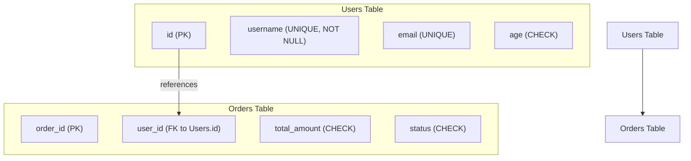

## Primary Keys, Foreign Keys, and Constraints (UNIQUE, NOT NULL, CHECK)
### Core Concepts

*   **Primary Key (PK):**
    *   Uniquely identifies each row in a table.
    *   Enforces both `UNIQUE` and `NOT NULL` constraints implicitly on the designated column(s).
    *   A table can have only one Primary Key.
*   **Foreign Key (FK):**
    *   Establishes a link between two tables, enforcing referential integrity.
    *   A column (or set of columns) in one table that refers to the Primary Key or a `UNIQUE` column in another table.
    *   Ensures that values in the foreign key column(s) exist in the referenced primary/unique column(s).
*   **UNIQUE Constraint:**
    *   Ensures that all values in a column (or a group of columns) are distinct.
    *   Can be applied to nullable columns, allowing multiple `NULL` values in Postgres (as `NULL` is not equal to `NULL`).
*   **NOT NULL Constraint:**
    *   Ensures that a column cannot store `NULL` values.
    *   Guarantees that a value is always present for that column in every row.
*   **CHECK Constraint:**
    *   Defines a boolean expression that must be true for every row in the table.
    *   Used for custom data validation (e.g., ensuring a number is positive, or a string matches a pattern).

### Key Details & Nuances

*   **Indexing:**
    *   **Primary Keys & UNIQUE Constraints:** Postgres automatically creates a unique B-tree index on the column(s) defined as `PRIMARY KEY` or `UNIQUE`. This is crucial for fast lookups and efficient constraint enforcement.
    *   **Foreign Keys:** Postgres *does not* automatically create an index on the foreign key column(s). While the FK constraint ensures data integrity, adding an index manually on the FK column(s) is highly recommended for performance, especially for:
        *   Faster `JOIN` operations involving the FK.
        *   Improved performance of `DELETE` or `UPDATE` operations on the *parent* table, as it requires checking dependent rows in the child table.
    *   **NOT NULL & CHECK:** These constraints do not typically imply or create indexes directly.
*   **Referential Integrity (`FOREIGN KEY` actions):**
    *   **`ON DELETE` / `ON UPDATE` actions:** Define behavior when a referenced (parent) row is deleted or updated.
        *   `NO ACTION` (default): Prevents deletion/update if dependent rows exist.
        *   `RESTRICT`: Similar to `NO ACTION` but checks immediately.
        *   `CASCADE`: Deletes/updates dependent rows in the child table. Use with caution!
        *   `SET NULL`: Sets foreign key columns in dependent rows to `NULL`. Requires FK columns to be nullable.
        *   `SET DEFAULT`: Sets foreign key columns in dependent rows to their default value. Requires a default value to be defined.
*   **`NULL` Behavior with `UNIQUE`:**
    *   In Postgres, `UNIQUE` constraints allow multiple `NULL` values in a single column (e.g., if a `username` column has a `UNIQUE` constraint but is nullable, you can have multiple rows where `username` is `NULL`). This is because `NULL` is not considered equal to `NULL`.
    *   However, if a `UNIQUE` constraint spans multiple columns, and all those columns are `NULL` for two different rows, only one such row is allowed.
*   **Constraint Enforcement:**
    *   All constraints are enforced at the time of `INSERT` or `UPDATE` operations, ensuring data validity at the database level.
    *   `CHECK` constraints run the specified expression for every row modification.

### Practical Examples

```sql
-- Create a table with a Primary Key and NOT NULL constraints
CREATE TABLE Users (
    id SERIAL PRIMARY KEY, -- id is PK (implies UNIQUE and NOT NULL)
    username VARCHAR(50) UNIQUE NOT NULL, -- username must be unique and not null
    email VARCHAR(100) UNIQUE, -- email must be unique, but can be NULL
    age INT CHECK (age >= 0), -- age must be non-negative
    registration_date TIMESTAMP DEFAULT NOW() NOT NULL
);

-- Create another table with a Foreign Key and other constraints
CREATE TABLE Orders (
    order_id SERIAL PRIMARY KEY,
    user_id INT NOT NULL, -- FK column, must be present
    order_date TIMESTAMP DEFAULT NOW() NOT NULL,
    total_amount DECIMAL(10, 2) CHECK (total_amount > 0),
    status VARCHAR(20) CHECK (status IN ('pending', 'completed', 'cancelled')) DEFAULT 'pending',

    -- Define Foreign Key constraint
    FOREIGN KEY (user_id) REFERENCES Users(id)
        ON DELETE CASCADE -- If a user is deleted, their orders are also deleted
        ON UPDATE CASCADE -- If a user's ID changes, orders' user_id also updates
);

-- Recommended: Add index on FK for performance (Postgres does not do this automatically)
CREATE INDEX idx_orders_user_id ON Orders(user_id);
```



### Common Pitfalls & Trade-offs

*   **Over-constraining:** While helpful, too many complex `CHECK` constraints can add overhead to every `INSERT` and `UPDATE`. Balance database-level enforcement with application-level validation for complex business rules.
*   **Lack of FK Indexes:** Forgetting to create an index on Foreign Key columns is a common performance bottleneck, leading to slow `JOIN` operations and inefficient cascading actions/checks.
*   **Inappropriate `ON DELETE`/`ON UPDATE` actions:**
    *   `CASCADE` can lead to unintended mass data deletion. Use with extreme caution and ensure business requirements align.
    *   `SET NULL` might break queries if the FK column is used in `NOT NULL` contexts elsewhere or if `NULL` has specific meaning.
*   **Misunderstanding `UNIQUE` with `NULL`s:** If a column should truly be unique across all values, including the absence of a value, it must be `NOT NULL UNIQUE`. Relying solely on `UNIQUE` will allow multiple `NULL`s.
*   **Performance vs. Integrity:** Constraints add overhead to write operations (inserts, updates, deletes) because the database must validate data against the rules. This is a trade-off for ensuring data integrity and consistency, which is often paramount.

### Interview Questions

1.  **What's the primary difference between a `PRIMARY KEY` and a `UNIQUE` constraint in PostgreSQL, especially regarding `NULL` values and indexing?**
    *   **Answer:** A `PRIMARY KEY` implies both `UNIQUE` and `NOT NULL` and there can only be one per table. It always creates a unique index. A `UNIQUE` constraint ensures distinct values but allows multiple `NULL` values in the column(s) it applies to (as `NULL` is not equal to `NULL` in Postgres), unless explicitly combined with `NOT NULL`. `UNIQUE` also creates a unique index.
2.  **Explain the concept of referential integrity and how `FOREIGN KEY` constraints, particularly `ON DELETE` actions, contribute to it.**
    *   **Answer:** Referential integrity ensures that relationships between tables remain consistent. `FOREIGN KEY` constraints enforce this by ensuring that values in a child table's FK column(s) always correspond to valid values in the parent table's PK/UNIQUE column(s). `ON DELETE` actions (e.g., `CASCADE`, `RESTRICT`, `SET NULL`) define the database's behavior when a row in the parent table is deleted, ensuring dependent data in the child table is handled correctly (e.g., deleted, restricted, or set to null) to maintain integrity.
3.  **When would you choose to use a `CHECK` constraint over validating data in your application code, and what are the trade-offs?**
    *   **Answer:** Use `CHECK` constraints when data validity is a fundamental, invariant rule that should be enforced universally at the database level, regardless of the application accessing it (e.g., a quantity must be positive, an enum value must be one of a few defined states). The trade-off is increased database write overhead (inserts/updates) due to the validation process, and less flexibility if the rule needs to change frequently without a schema migration. Application-level validation is better for complex business logic, user experience feedback, or rules that are volatile.
4.  **Does PostgreSQL automatically create an index on a foreign key column? Why is this behavior significant for performance?**
    *   **Answer:** No, PostgreSQL does not automatically create an index on a foreign key column. This is significant because without an index, queries involving `JOIN` operations on the foreign key column can be slow, as the database may need to perform full table scans. Similarly, `DELETE` or `UPDATE` operations on the parent table can be inefficient, as the database needs to scan the child table to verify referential integrity. Manually creating an index on the FK column is crucial for performance.
5.  **You have a `users` table with a `username` column, and you want to ensure no two users have the same username. However, you also want to allow users to not have a username assigned initially (i.e., `NULL`). How would you set up this constraint in Postgres, and what's a common pitfall to be aware of?**
    *   **Answer:** You would apply a `UNIQUE` constraint to the `username` column, but without a `NOT NULL` constraint. Example: `username VARCHAR(50) UNIQUE;`. The common pitfall is that in Postgres (unlike some other databases), a `UNIQUE` constraint on a nullable column allows multiple `NULL` values. So, while no two *non-null* usernames can be the same, you *can* have multiple users whose `username` is `NULL`. If the intention was to allow only *one* `NULL` value or enforce uniqueness even among `NULL`s, a different approach (like a unique index with a `WHERE` clause or a `NOT NULL` constraint) would be needed, but for the stated requirement, `UNIQUE` alone suffices.