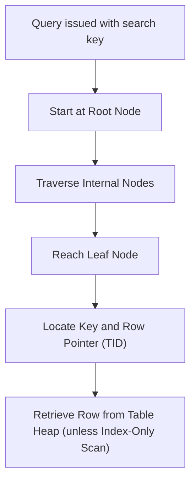

## B-Tree Indexing: When and why it's the default
### Core Concepts
*   **What it is:** A self-balancing tree data structure that maintains sorted data and allows searches, sequential access, insertions, and deletions in logarithmic time. It's optimized for disk-based storage, minimizing disk I/O.
*   **Fundamental Principle:** B-Trees store data in nodes that can hold multiple keys and child pointers, making them "bushy" and shallow. This reduces the number of disk reads required to find a record.
*   **Default Index:** Postgres (and most relational databases) uses B-Tree as the default index type because of its versatility and efficiency across a wide range of common query patterns.

### Key Details & Nuances
*   **Structure:**
    *   **Root Node:** Top-most node.
    *   **Internal Nodes:** Connects to other internal nodes or leaf nodes. Contains keys and pointers to child nodes.
    *   **Leaf Nodes:** Bottom-most nodes. Contain the indexed keys and pointers (TIDs/RowIDs) to the actual table rows. All leaf nodes are at the same depth. They are typically linked together to allow for efficient range scans.
*   **Time Complexity:** `O(logN)` for search, insert, and delete operations, where N is the number of keys. This efficiency comes from the tree's balanced nature and high fan-out (many children per node).
*   **Query Optimization:**
    *   **Equality Queries (`=`):** Direct lookup.
    *   **Range Queries (`<`, `>`, `<=`, `>=`, `BETWEEN`):** Traverse to the start of the range, then scan horizontally across leaf nodes.
    *   **`ORDER BY` / `DISTINCT`:** Can avoid sorting operations if the index provides the requested order.
    *   **`LIKE 'prefix%'`:** Can use the index for left-anchored wildcard searches. `'%suffix'` or `'%substring%'` cannot.
*   **Multi-Column B-Trees:**
    *   Order of columns in a multi-column index matters (e.g., `(col_A, col_B)` is different from `(col_B, col_A)`).
    *   **Leftmost Prefix Rule:** An index on `(col_A, col_B, col_C)` can be used for queries on `col_A`, `(col_A, col_B)`, or `(col_A, col_B, col_C)`. It generally won't be used for queries only on `col_B` or `col_C` (unless combined with `col_A`).
*   **Index-Only Scans (Postgres Specific):**
    *   When *all* columns requested by a query are present within the index itself, Postgres can retrieve the data solely from the index, avoiding a trip to the table.
    *   Requires visibility checks (via a "visibility map") to ensure the row version is visible to the current transaction.
    *   Highly beneficial for read performance, especially when combined with HOT (Heap Only Tuples) updates, which reduce index updates.

### Practical Examples

**1. Creating a B-Tree Index:**

```sql
-- Implicitly B-Tree by default
CREATE INDEX idx_users_email ON users (email);

-- Explicitly specifying B-Tree
CREATE INDEX idx_products_price_category ON products USING btree (price, category_id);
```

**2. Query benefitting from a Multi-Column Index:**

```sql
-- Index: CREATE INDEX idx_orders_customer_date ON orders (customer_id, order_date);

-- This query uses the index for filtering and sorting
SELECT order_id, total_amount
FROM orders
WHERE customer_id = 123
AND order_date >= '2023-01-01'
ORDER BY order_date DESC;

-- EXPLAIN ANALYZE output (simplified) might show:
-- Index Scan using idx_orders_customer_date on orders (...)
```

**3. B-Tree Index Lookup Process:**



### Common Pitfalls & Trade-offs
*   **Over-Indexing:**
    *   Each index adds overhead to `INSERT`, `UPDATE`, and `DELETE` operations (more structures to maintain).
    *   Increases disk space usage.
    *   Can increase memory footprint and cache contention.
*   **Low Cardinality Columns:** B-tree indexes are less effective on columns with few unique values (e.g., a boolean `is_active` column). The database might prefer a full table scan as it could be faster than navigating the index and then fetching many rows.
*   **`LIKE '%suffix'` or `LIKE '%substring%'`:** B-tree indexes cannot be used efficiently for patterns that don't start with a fixed string because the tree is ordered by the start of the string. Consider `pg_trgm` (GIN index) for these cases.
*   **`NULL` Values:** By default, B-tree indexes store `NULL` values. However, `WHERE column IS NULL` or `IS NOT NULL` queries might not use the index optimally without specific handling (e.g., `WHERE column IS NOT NULL` is often faster than `WHERE column IS NULL`). A partial index can be used for `IS NULL` queries.
*   **Index Bloat:** In MVCC databases like Postgres, `UPDATE` and `DELETE` operations mark rows (and index entries) as dead rather than immediately removing them. This can lead to index bloat over time, requiring `VACUUM` or `REINDEX` to reclaim space.

### Interview Questions

1.  **Why is B-Tree the default index type in most relational databases?**
    *   **Answer:** B-Trees are highly versatile, offering efficient `O(logN)` performance for a broad range of common query types: equality, range, prefix matching, and `ORDER BY`/`DISTINCT`. Their balanced structure minimizes disk I/O, which is crucial for performance. They provide a good balance between read and write performance, making them a suitable general-purpose choice.

2.  **Describe the internal structure of a B-Tree. How does it ensure `O(logN)` performance?**
    *   **Answer:** A B-Tree consists of a root node, internal nodes, and leaf nodes. Each node can contain multiple keys and child pointers, creating a "bushy" structure. All leaf nodes are at the same depth, ensuring the tree is always balanced. `O(logN)` performance is achieved because each step down the tree allows skipping a large portion of the data, effectively narrowing the search space by a factor proportional to the tree's fan-out (number of children per node).

3.  **When would a B-Tree index *not* be the best choice, and what alternatives exist in Postgres?**
    *   **Answer:** B-Trees are not ideal for:
        *   **Full-text search or `LIKE '%substring%'`:** Use GIN (Generalized Inverted Index) or GiST (Generalized Search Tree) with extensions like `pg_trgm` or specific full-text types.
        *   **Geospatial data:** Use GiST.
        *   **Very specific equality-only lookups on hashable data:** A Hash index *might* be slightly faster for pure equality but lacks range query capabilities and crash recovery guarantees in Postgres (making it rarely used in practice).
        *   **Extremely low cardinality columns:** The cost of index lookup might outweigh a full table scan.
    *   Alternatives in Postgres include GIN, GiST, BRIN (Block Range Index), and Hash indexes.

4.  **Explain the concept of an "index-only scan" in Postgres. What conditions must be met for it to occur?**
    *   **Answer:** An index-only scan is an optimization where Postgres can fulfill a query's data requirements entirely from the index without needing to access the main table heap. This significantly reduces disk I/O.
    *   **Conditions:**
        1.  All columns referenced in the `SELECT` list, `WHERE` clause, `ORDER BY`, etc., must be present in the index.
        2.  All index pages must be marked "all visible" in the visibility map, or the row version found in the index must be confirmed as visible to the current transaction without requiring a trip to the heap. `VACUUM` helps maintain the visibility map.

5.  **You have a multi-column B-tree index on `(col_A, col_B, col_C)`. Which of the following queries would benefit from this index and why: `WHERE col_A = 1`, `WHERE col_B = 2`, `WHERE col_A = 1 AND col_C = 3`, `ORDER BY col_B`?**
    *   **Answer:**
        *   `WHERE col_A = 1`: **Benefits.** Uses the leading column (`col_A`) of the index (leftmost prefix rule).
        *   `WHERE col_B = 2`: **Does not benefit (typically).** The index cannot be used to efficiently search on `col_B` alone because `col_A` is the leading column. It would require a full index scan.
        *   `WHERE col_A = 1 AND col_C = 3`: **Partially benefits.** The index can be used to filter on `col_A = 1`, but `col_C` is not contiguous with `col_A` in the index, so `col_C` will be filtered after scanning `col_A` values. It won't be as efficient as if `col_C` were second (`(col_A, col_C, col_B)`).
        *   `ORDER BY col_B`: **Does not benefit (typically).** The index is ordered first by `col_A`, then `col_B`, then `col_C`. It cannot provide an ordered result set purely on `col_B` efficiently without first filtering or sorting on `col_A`.