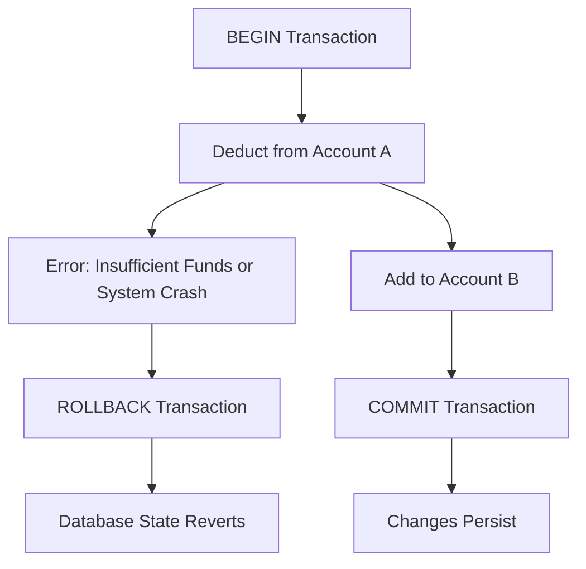

## ACID Properties
### Core Concepts

*   **ACID Properties:** Fundamental principles ensuring data validity during transactions in a database system.
    *   **Atomicity:** "All or nothing." A transaction is treated as a single, indivisible unit of work. Either all operations within it succeed and are committed, or if any part fails, the entire transaction is rolled back, leaving the database in its state *before* the transaction began.
    *   **Consistency:** A transaction brings the database from one valid state to another. It ensures that all data integrity constraints (e.g., primary keys, foreign keys, unique constraints, check constraints, custom business rules via triggers) are met at the end of the transaction.
    *   **Isolation:** Concurrent transactions execute without interfering with each other. From the perspective of each transaction, it appears as if it is the only transaction running on the system. This prevents problems like dirty reads, non-repeatable reads, and phantom reads.
    *   **Durability:** Once a transaction has been committed, its changes are permanent and survive system failures (e.g., power outages, crashes). Committed data is written to stable storage.

### Key Details & Nuances

*   **Postgres Implementation:**
    *   **Atomicity & Durability:** Primarily achieved through **Write-Ahead Logging (WAL)**. Before any change is applied to the main data files, a record of the change is written to the WAL. This ensures that in case of a crash, the database can be recovered to a consistent state by replaying or undoing operations from the WAL. `fsync()` calls ensure WAL records are flushed to disk.
    *   **Consistency:** Enforced by database schema constraints (e.g., `NOT NULL`, `UNIQUE`, `FOREIGN KEY`), check constraints, and triggers. Transactions rollback if a constraint is violated.
    *   **Isolation:** Postgres uses **Multi-Version Concurrency Control (MVCC)**.
        *   MVCC allows readers and writers to operate concurrently without blocking each other. Each transaction sees a "snapshot" of the database consistent with the moment the transaction began (or the statement began, depending on isolation level).
        *   When a row is updated, a new version of the row is created, and the old version remains visible to concurrent transactions that started before the update.
        *   **Isolation Levels (Postgres supports):**
            *   **Read Committed (Default):** A statement only sees rows committed before that statement began. Prevents "dirty reads" (reading uncommitted data). Allows "non-repeatable reads" (reading the same row twice might yield different results if another transaction commits an update to that row between reads) and "phantom reads" (new rows matching a query's `WHERE` clause can appear if another transaction commits insertions).
            *   **Repeatable Read:** A transaction sees a snapshot of the database as it was at the *start* of the transaction. Prevents dirty reads and non-repeatable reads. Still susceptible to "phantom reads" in some edge cases (though less common than Read Committed). Write conflicts will cause the later transaction to wait or fail.
            *   **Serializable:** Provides the strongest guarantee. Guarantees that concurrent transactions produce the same result as if they had executed serially. Prevents dirty reads, non-repeatable reads, and phantom reads. Achieved in Postgres by monitoring for serialization anomalies and aborting transactions that would cause them (`ERROR: could not serialize access due to concurrent update`). Requires application-level retry logic.

### Practical Examples

**1. Basic Transaction (SQL)**

```sql
-- Begin a transaction
BEGIN;

-- Perform operations
UPDATE accounts SET balance = balance - 100 WHERE id = 1;
UPDATE accounts SET balance = balance + 100 WHERE id = 2;

-- Check for errors or business logic violations before committing
-- SELECT balance FROM accounts WHERE id = 1; -- (optional check)

-- If all operations are successful, commit the transaction
COMMIT;

-- If an error occurs or business logic dictates, rollback the transaction
-- ROLLBACK;
```

**2. Atomicity with Rollback (Conceptual Flow)**



### Common Pitfalls & Trade-offs

*   **Relaxing Isolation for Performance:** Lower isolation levels (e.g., Read Committed) offer higher concurrency and lower overhead but introduce concurrency anomalies (non-repeatable reads, phantom reads). Choosing an isolation level is a critical performance vs. consistency trade-off.
*   **Serializable Isolation Overhead:** While providing the highest data integrity, `SERIALIZABLE` isolation can lead to frequent `could not serialize access` errors under high contention. Applications must be designed with retry logic for such errors, increasing complexity.
*   **Misunderstanding MVCC:** MVCC prevents readers from blocking writers and vice-versa, but it doesn't eliminate all concurrency issues. Write-write conflicts still occur, and Postgres uses lightweight locks for these, which can cause contention or deadlocks if not managed properly.
*   **Durability vs. Performance (`synchronous_commit`):** Postgres's `synchronous_commit` parameter can be set to `off` for higher commit throughput. This means a commit is acknowledged before WAL records are guaranteed to be flushed to disk, posing a small risk of data loss on immediate system crash after commit. Default is `on` for maximum durability.
*   **Long-Running Transactions:** Holding transactions open for extended periods consumes resources (locks, MVCC snapshots, undo information) and can block `VACUUM` operations, leading to table bloat and performance degradation.

### Interview Questions

1.  **Explain ACID properties and why each is crucial for a relational database like Postgres.**
    *   **Answer:** ACID ensures data integrity and reliability. Atomicity guarantees transaction completion or full rollback. Consistency ensures data adheres to defined rules. Isolation makes concurrent transactions appear sequential. Durability guarantees committed data persists through failures. These are fundamental for dependable data management, especially in financial or mission-critical systems.

2.  **How does Postgres achieve Isolation? Discuss MVCC and different isolation levels, including their trade-offs.**
    *   **Answer:** Postgres uses MVCC, where each transaction sees a consistent "snapshot" of the database. Updates create new row versions, allowing readers to see old versions without blocking writers. Isolation levels dictate which snapshot is seen: `Read Committed` (default) shows committed changes before each statement, prone to non-repeatable/phantom reads. `Repeatable Read` shows a snapshot from transaction start, preventing non-repeatable reads. `Serializable` ensures full serializability by detecting and aborting transactions that violate it, preventing all anomalies but potentially requiring retries. Trade-offs involve consistency vs. concurrency and performance.

3.  **Describe a scenario where relaxing a specific ACID property (e.g., Isolation) might be acceptable or even necessary, and what the potential risks are.**
    *   **Answer:** Relaxing Isolation to `Read Committed` is common for read-heavy OLTP systems (e.g., e-commerce product catalog search). It increases concurrency and throughput by reducing locking. The risk is accepting non-repeatable reads (e.g., product stock count changing mid-query) or phantom reads (new products appearing mid-query). This is acceptable if the application logic can handle eventual consistency or if absolute real-time consistency isn't critical for specific operations.

4.  **What mechanisms ensure Durability in Postgres?**
    *   **Answer:** Durability in Postgres is primarily ensured by **Write-Ahead Logging (WAL)**. All changes are first written to the WAL disk files before being applied to the actual data files. In case of a crash, the database can recover by replaying the WAL. Additionally, `fsync()` calls ensure that WAL records and committed data blocks are flushed from memory caches to persistent storage. The `synchronous_commit` setting (default `on`) ensures that a commit is not acknowledged until its WAL record is safely on disk.

5.  **A transaction fails during execution (e.g., due to a constraint violation or application error). How does Atomicity ensure data integrity? Provide an example.**
    *   **Answer:** Atomicity ensures that if a transaction fails at any point, all changes made within that transaction are completely undone (rolled back), returning the database to its state *before* the transaction began. This prevents partial updates and maintains data integrity. For example, in a money transfer from Account A to Account B, if deducting from A succeeds but adding to B fails (e.g., due to an invalid account ID), Atomicity guarantees that the deduction from Account A will also be rolled back, preventing money from being lost or duplicated in the system.