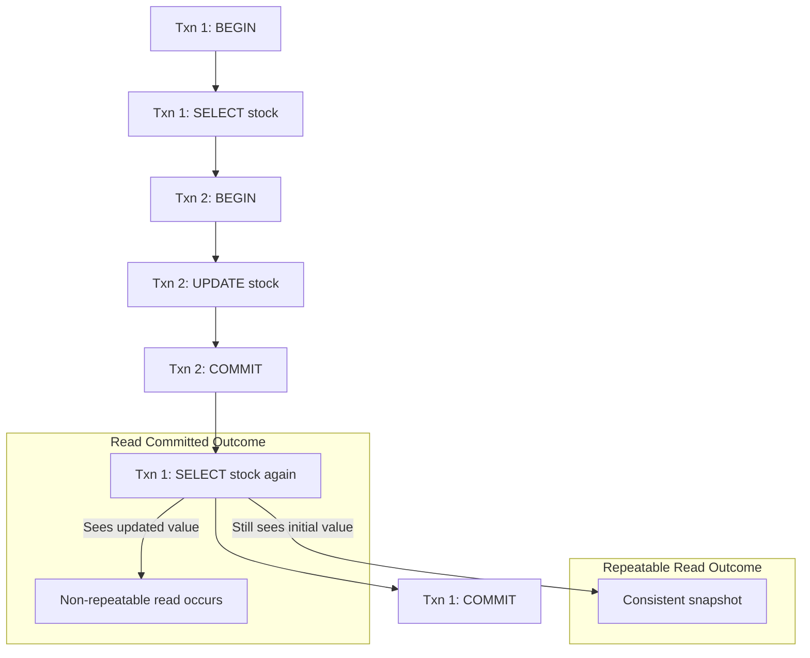

## Transaction Isolation Levels (Read Committed vs. Repeatable Read vs. Serializable)
Postgres's transaction isolation levels define how concurrent transactions interact with each other, specifically addressing issues like visibility of changes made by other transactions and potential data inconsistencies. Choosing the right level is a critical design decision with significant performance and correctness implications.

### Core Concepts

*   **ACID Properties:** Isolation ('I' in ACID) ensures that concurrent transactions appear to execute serially, preventing them from interfering with each other's data views.
*   **Transaction Isolation Levels (SQL Standard):** Defines what phenomena (anomalies) are prevented. Higher levels offer stronger guarantees but incur more overhead. Postgres offers `READ COMMITTED`, `REPEATABLE READ`, and `SERIALIZABLE`. `READ UNCOMMITTED` is not supported (effectively `READ COMMITTED` due to MVCC).
*   **MVCC (Multi-Version Concurrency Control):** Postgres's core mechanism for concurrency. It allows multiple versions of a row to exist concurrently, enabling reads to proceed without blocking writes, and vice-versa. This fundamentally prevents "dirty reads" at all isolation levels.
*   **Anomalies:**
    *   **Dirty Read:** Reading uncommitted changes made by another transaction. (Prevented by MVCC in Postgres at all levels).
    *   **Non-Repeatable Read:** A transaction reads the same row multiple times but gets different values because another transaction modified and committed changes to that row in between the reads.
    *   **Phantom Read:** A transaction re-executes a query (e.g., `SELECT COUNT(*) WHERE ...`) and finds rows that were not there (or are missing) during an earlier execution of the same query, due to inserts/deletes by another committed transaction.
    *   **Serialization Anomaly:** A set of concurrent transactions execute in such a way that the final outcome is inconsistent with *any* possible serial execution of those transactions. This is the strongest form of anomaly.

### Key Details & Nuances

*   **`READ COMMITTED` (Default):**
    *   **Behavior:** Each statement within the transaction sees only data that was committed *before* that statement began.
    *   **Prevents:** Dirty reads (due to MVCC).
    *   **Allows:** Non-repeatable reads and phantom reads.
    *   **Use Case:** Most common and performant. Sufficient for many applications where individual statement consistency is enough, and the application logic can tolerate seeing recent committed changes.
*   **`REPEATABLE READ`:**
    *   **Behavior:** All statements within the transaction see a snapshot of the database as it was at the start of the *first statement* of the transaction. The transaction operates on this fixed snapshot.
    *   **Prevents:** Dirty reads, non-repeatable reads, and phantom reads.
    *   **Allows:** Serialization anomalies (though less likely than `READ COMMITTED`).
    *   **Use Case:** When a transaction needs to make multiple queries that must see a consistent view of the data, preventing mid-transaction changes from other transactions.
*   **`SERIALIZABLE`:**
    *   **Behavior:** Provides the strongest isolation. Guarantees that the concurrent execution of a set of transactions produces the same result as if those transactions were executed one after another in some serial order. Achieved in Postgres using Serializable Snapshot Isolation (SSI).
    *   **Prevents:** All anomalies: dirty reads, non-repeatable reads, phantom reads, and serialization anomalies.
    *   **Mechanism:** Uses predicate locks and tracks read/write dependencies between concurrent transactions. If a dependency indicates a potential serialization anomaly, one of the involved transactions will be aborted with a `serialization_failure` error.
    *   **Use Case:** Critical applications requiring absolute data consistency, e.g., financial transactions, inventory systems, where even subtle logical anomalies cannot be tolerated. Requires application-level retry logic for aborted transactions.

### Practical Examples

Consider two concurrent transactions, T1 and T2, interacting with a `products` table where `stock = 100`.

```sql
-- Transaction 1
BEGIN ISOLATION LEVEL READ COMMITTED;
-- SELECT 1: Sees stock = 100
SELECT stock FROM products WHERE id = 1;

-- Concurrently, Transaction 2 runs and commits:
-- BEGIN;
-- UPDATE products SET stock = 50 WHERE id = 1;
-- COMMIT;

-- In Transaction 1:
-- SELECT 2: Sees stock = 50 (non-repeatable read)
SELECT stock FROM products WHERE id = 1;
COMMIT;
```

```sql
-- Transaction 1
BEGIN ISOLATION LEVEL REPEATABLE READ;
-- SELECT 1: Sees stock = 100
SELECT stock FROM products WHERE id = 1;

-- Concurrently, Transaction 2 runs and commits:
-- BEGIN;
-- UPDATE products SET stock = 50 WHERE id = 1;
-- COMMIT;

-- In Transaction 1:
-- SELECT 2: Still sees stock = 100 (consistent snapshot)
SELECT stock FROM products WHERE id = 1;
COMMIT;
```



### Common Pitfalls & Trade-offs

*   **Performance Overhead:** Higher isolation levels come with increased overhead. `READ COMMITTED` is the fastest, `SERIALIZABLE` is the slowest due to the additional checks and potential for transaction retries. Only increase isolation when truly necessary for correctness.
*   **Application Complexity for `SERIALIZABLE`:** Using `SERIALIZABLE` requires the application to handle `serialization_failure` errors gracefully by retrying the entire transaction. This adds significant complexity to the application logic.
*   **`READ COMMITTED` is often sufficient:** For many web applications, `READ COMMITTED` is fine because users typically interact with small, isolated pieces of data, and occasional non-repeatable reads might be acceptable or handled by application logic (e.g., refreshing a UI).
*   **"Lost Update" (not a standard anomaly, but common issue):** While not a direct isolation level anomaly in the academic sense, it's a practical problem. If two transactions read the same value, modify it, and write it back, one update can "lose" the other's change. Higher isolation levels (especially `SERIALIZABLE`) can help prevent this, or explicit locking (`SELECT FOR UPDATE`).

### Interview Questions

1.  **Explain the core difference between Postgres's `READ COMMITTED` and `REPEATABLE READ` isolation levels. Provide a scenario where this difference is critical.**
    *   **Answer:** `READ COMMITTED` ensures each statement sees data committed *before* that statement. `REPEATABLE READ` ensures the entire transaction sees a consistent snapshot of the data as it was at the *start of the transaction's first statement*. The critical difference is that `REPEATABLE READ` prevents non-repeatable reads and phantom reads, whereas `READ COMMITTED` allows them.
    *   **Scenario:** A reporting transaction that calculates aggregates based on multiple complex queries. Under `READ COMMITTED`, the aggregates might be inconsistent if data changes between queries. Under `REPEATABLE READ`, all queries see the same dataset, ensuring consistent aggregates.

2.  **When would you choose `SERIALIZABLE` isolation in Postgres, and what are the main implications for application development?**
    *   **Answer:** Choose `SERIALIZABLE` when absolute logical consistency is paramount and the application cannot tolerate any serialization anomalies. This is typical for financial systems, inventory management, or complex business logic where the order of operations between transactions is critical.
    *   **Implications:**
        1.  **Performance:** Higher overhead due to increased checks for conflicts.
        2.  **Retries:** Transactions can be aborted with `serialization_failure` errors. The application *must* implement retry logic for the entire transaction.
        3.  **Complexity:** Requires careful design to handle retries and potential deadlocks more robustly.

3.  **Does Postgres prevent dirty reads at its default `READ COMMITTED` isolation level? Explain why.**
    *   **Answer:** Yes, Postgres prevents dirty reads (reading uncommitted changes from another transaction) at all isolation levels, including `READ COMMITTED`. This is a fundamental guarantee provided by Postgres's Multi-Version Concurrency Control (MVCC) architecture. Each transaction operates on its own snapshot of committed data, never seeing the uncommitted changes of other transactions.

4.  **Describe a "phantom read" anomaly. Does `REPEATABLE READ` prevent it in Postgres?**
    *   **Answer:** A phantom read occurs when a transaction re-executes a query (especially a range query or aggregation) and sees rows that were not there (or are missing) during an earlier execution of the same query, because another transaction concurrently inserted or deleted rows within that range and committed.
    *   Yes, in Postgres, `REPEATABLE READ` *does* prevent phantom reads. Since `REPEATABLE READ` provides a consistent snapshot of the database as of the transaction's start, any subsequent queries within that transaction, even range queries, will only see data (including inserts/deletes) that existed when the snapshot was taken.

5.  **You've decided to use `SERIALIZABLE` isolation for a critical part of your application. What kind of error might you encounter, and how would you handle it programmatically (e.g., in Node.js/TypeScript)?**
    *   **Answer:** You might encounter a `serialization_failure` error (SQLSTATE code '40001'). This error indicates that the transaction could not be serialized relative to other concurrent transactions, meaning its execution led to a result inconsistent with a serial execution.
    *   **Handling:** The standard approach is to catch this specific error and retry the entire transaction from the beginning.
    ```typescript
    async function performSerializableOperation() {
        const MAX_RETRIES = 3;
        for (let attempt = 0; attempt < MAX_RETRIES; attempt++) {
            const client = await pool.connect(); // Using a connection pool
            try {
                await client.query('BEGIN ISOLATION LEVEL SERIALIZABLE');
                // Your critical SQL operations here
                // Example:
                // await client.query('UPDATE accounts SET balance = balance - 100 WHERE id = 1');
                // await client.query('UPDATE accounts SET balance = balance + 100 WHERE id = 2');

                await client.query('COMMIT');
                return "Operation successful"; // Exit on success
            } catch (error: any) {
                await client.query('ROLLBACK'); // Always rollback on error

                // Check for serialization_failure (SQLSTATE '40001')
                if (error.code === '40001' && attempt < MAX_RETRIES - 1) {
                    console.warn(`Serialization failure, retrying (attempt ${attempt + 1})...`);
                    // Optional: Add a small delay before retrying
                    await new Promise(resolve => setTimeout(resolve, 100 * (attempt + 1)));
                    continue; // Retry the loop
                } else {
                    console.error('Transaction failed after retries or for other reason:', error);
                    throw error; // Re-throw if not a serialization error or out of retries
                }
            } finally {
                client.release(); // Release the client back to the pool
            }
        }
        throw new Error('Operation failed after multiple retries.');
    }
    ```