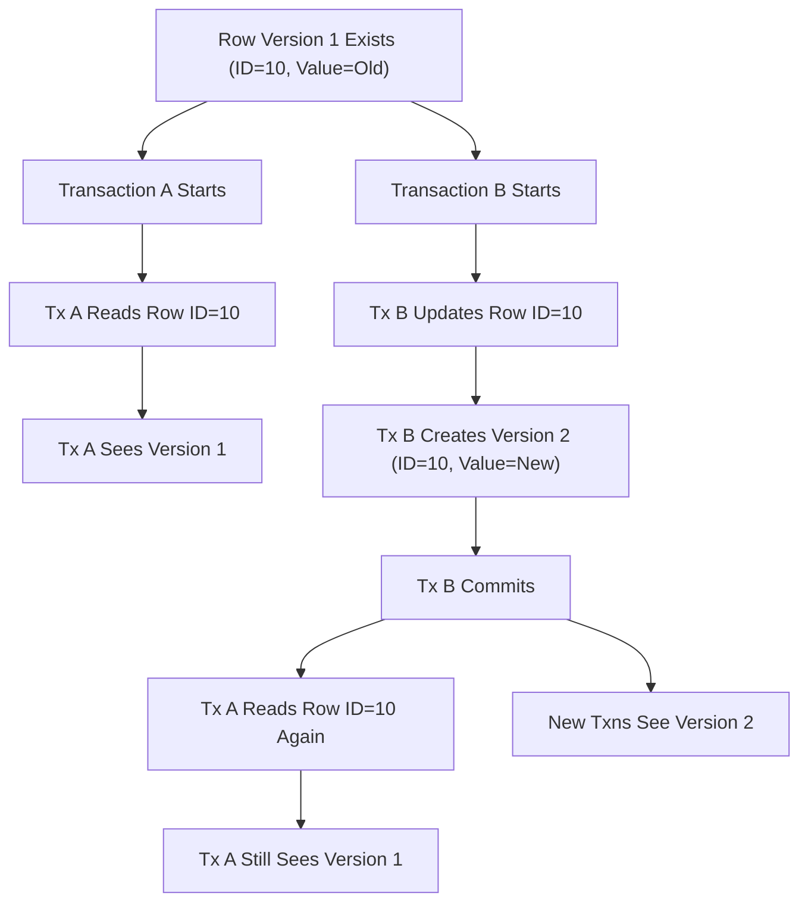

## Multi-Version Concurrency Control (MVCC)
### Core Concepts

*   **Definition:** Multi-Version Concurrency Control (MVCC) is a database concurrency control method that provides concurrent access to the database without locking readers or writers. Instead of waiting for locks, transactions operate on their own consistent snapshot of the data.
*   **Problem Solved:** Addresses the "reader-writer" problem where a read operation would block a write, or vice-versa, ensuring high concurrency and throughput.
*   **Mechanism:** When a row is modified (UPDATE or DELETE), instead of overwriting the original data, a *new version* of the row is created. The old version remains accessible for transactions that started before the modification.
*   **Snapshot Isolation:** Each transaction sees a consistent snapshot of the data as it existed when the transaction started. This ensures that a transaction's view of the data does not change during its execution, even if other transactions commit changes to that data.

### Key Details & Nuances

*   **Tuple Visibility:** PostgreSQL uses transaction IDs (TXIDs) to manage visibility. Every row (tuple) has `xmin` (the TXID that created it) and `xmax` (the TXID that deleted it or invalidated it, or 0 if active/not deleted).
    *   A tuple is visible to a transaction if:
        *   `xmin` is committed AND `xmin` is older than the current transaction's snapshot OR `xmin` is the current transaction's ID.
        *   `xmax` is null/0 OR `xmax` is aborted OR `xmax` is older than the current transaction's snapshot.
    *   This logic ensures that a transaction only sees data that was committed before its snapshot was taken and that was not deleted by a transaction that committed before its snapshot was taken.
*   **No Read Locks for SELECTs:** Reads (SELECT statements) generally do not acquire locks on rows, making them highly concurrent with write operations.
*   **Physical Storage:** Old versions of rows are not immediately deleted. They remain on disk until they are no longer needed by any active transaction.
*   **Transaction Isolation Levels:** MVCC is the foundation for PostgreSQL's transaction isolation levels.
    *   **Read Committed (Default):** Each statement within a transaction sees a snapshot of the database at the beginning of *that statement's* execution. If a `SELECT` statement runs twice, and another transaction commits changes between the two `SELECT`s, the second `SELECT` might see the new changes.
    *   **Repeatable Read:** All statements within a transaction see a snapshot of the database at the beginning of *the transaction's* first data-modifying statement (or `SELECT`). This prevents non-repeatable reads and phantom reads.
    *   **Serializable:** Provides the strongest isolation, ensuring that concurrent transactions produce the same results as if they were executed sequentially. Achieved by detecting serialization anomalies (conflicts) and rolling back one of the conflicting transactions.

### Practical Examples

The following diagram illustrates how MVCC allows concurrent operations without blocking, showing how different transactions can see different versions of the same row.

### Common Pitfalls & Trade-offs

*   **Tuple Bloat:** As new versions of rows are created and old ones persist, the table can accumulate "dead tuples" (old, invisible row versions). This increases storage usage and can degrade read/write performance by requiring more disk I/O and increasing the size of indexes.
*   **VACUUM Necessity:** PostgreSQL's `VACUUM` process (and `autovacuum` daemon) is crucial for MVCC. It reclaims storage occupied by dead tuples, updates visibility maps, and prevents transaction ID wraparound. Without regular `VACUUM`ing, performance will degrade significantly, and the database can eventually halt due to TXID wraparound.
*   **Performance Overhead:** While MVCC improves concurrency, it comes with some overhead:
    *   **Increased Storage:** Multiple versions of rows take up more space.
    *   **Increased CPU:** For `VACUUM` processing and for the runtime logic of checking tuple visibility (`xmin`/`xmax`).
    *   **Index Updates:** Updates often require inserting new index entries for the new tuple version and marking old ones as dead.
*   **Choosing Isolation Level:** Selecting the appropriate isolation level is a trade-off between consistency guarantees and concurrency/performance. Higher isolation levels (Repeatable Read, Serializable) offer stronger guarantees but might lead to more transaction retries (serialization errors) or resource contention.

### Interview Questions

1.  **Explain MVCC and why it's crucial for database concurrency.**
    *   **Answer:** MVCC allows multiple transactions to access the same data concurrently without blocking each other. It does this by giving each transaction a consistent "snapshot" of the data, meaning writes create new versions of rows instead of overwriting existing ones. This is crucial for high-throughput systems because readers don't block writers, and writers don't block readers, significantly improving concurrency and reducing lock contention compared to traditional locking mechanisms.

2.  **How does PostgreSQL's MVCC prevent readers from blocking writers?**
    *   **Answer:** PostgreSQL achieves this by never acquiring read locks for `SELECT` statements. Instead, it uses `xmin` and `xmax` transaction IDs associated with each row version. A reading transaction checks these IDs against its own snapshot to determine which version of a row is visible to it. If a writer modifies a row, it creates a new version, and the reading transaction continues to see the *old* version from its snapshot, without ever being blocked by the write operation.

3.  **What is 'tuple bloat' in Postgres and how is it related to MVCC?**
    *   **Answer:** Tuple bloat refers to the accumulation of "dead tuples" (old, outdated versions of rows) within a table or index. In an MVCC system like PostgreSQL, when a row is updated or deleted, the old version isn't immediately removed; it's just marked as invisible. These dead tuples consume disk space and can degrade performance (e.g., more I/O, larger indexes). It's a direct consequence of MVCC's non-blocking design, as old versions must remain until no active transaction needs them.

4.  **Describe the role of VACUUM in a database using MVCC.**
    *   **Answer:** `VACUUM` is essential in an MVCC database. Its primary role is to reclaim the disk space occupied by dead tuples. It identifies these dead tuples and makes their space available for reuse. It also updates visibility maps, which optimize queries, and prevents transaction ID wraparound, which could otherwise halt the database. The `autovacuum` daemon automates this process to maintain database health and performance.

5.  **How do different transaction isolation levels (e.g., Read Committed vs. Repeatable Read) leverage MVCC in PostgreSQL?**
    *   **Answer:** Both `Read Committed` and `Repeatable Read` rely on MVCC's snapshotting mechanism.
        *   **Read Committed:** For each *statement*, PostgreSQL takes a new snapshot. This means if another transaction commits changes between two `SELECT` statements in the same `Read Committed` transaction, the second `SELECT` might see the newly committed data (preventing dirty reads but allowing non-repeatable reads and phantom reads).
        *   **Repeatable Read:** PostgreSQL takes *one* snapshot at the beginning of the *transaction's first data-modifying statement (or `SELECT`)*. All subsequent statements within that transaction will consistently see the data as it was at the time of that initial snapshot. This prevents non-repeatable reads and phantom reads by ensuring a truly consistent view throughout the transaction's lifetime.