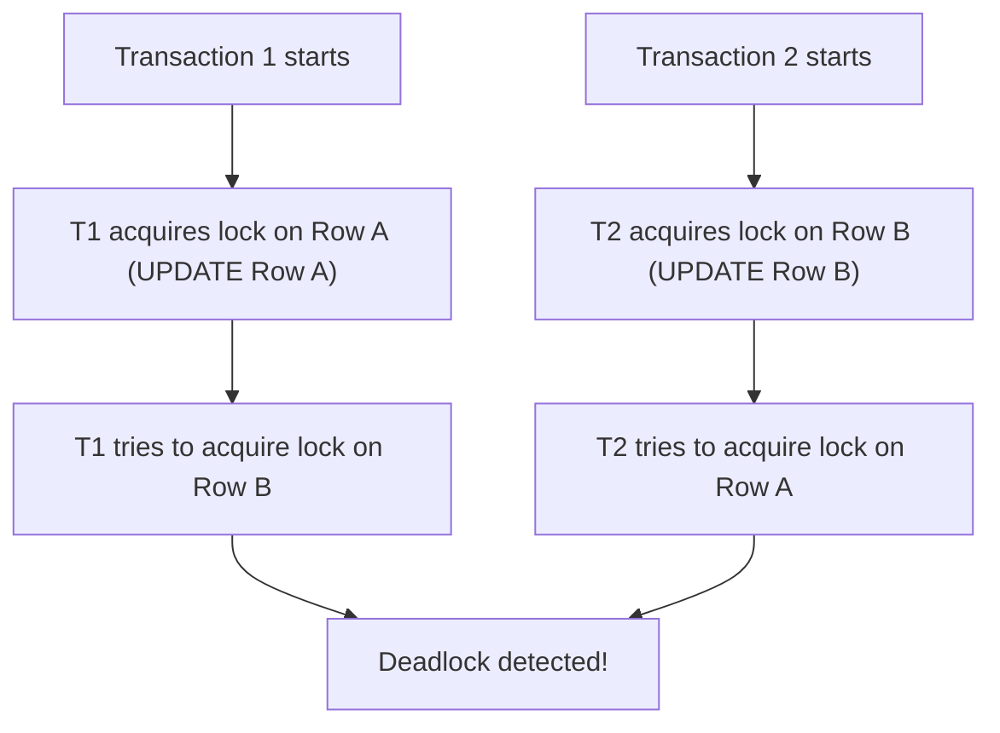

## Deadlocks: How they happen and how to prevent them
### Core Concepts

*   **Definition:** A deadlock occurs in a multi-transactional database system when two or more transactions are waiting indefinitely for one another to release a lock, creating a circular dependency where no transaction can proceed.
*   **Necessary Conditions (Coffman Conditions):** While typically discussed in OS contexts, they apply:
    1.  **Mutual Exclusion:** Resources (database rows/tables) are held exclusively by one transaction.
    2.  **Hold and Wait:** A transaction holding one resource requests another, while holding the first.
    3.  **No Preemption:** Resources cannot be forcibly taken from a transaction.
    4.  **Circular Wait:** A circular chain of transactions exists, where each transaction waits for a resource held by the next in the chain.

### Key Details & Nuances

*   **Postgres Deadlock Detection:**
    *   Postgres uses a **deadlock detection algorithm** rather than prevention.
    *   It periodically checks for cycles in the lock wait graph.
    *   Detection is triggered after a `deadlock_timeout` (default 1 second). If a transaction has been waiting for a lock for longer than this, the checker runs.
    *   When a deadlock is detected, Postgres chooses one of the transactions involved as a **"victim"** and aborts it (rolls back its changes). The other transaction(s) can then proceed.
    *   The aborted transaction receives an error (e.g., `ERROR: deadlock detected`).
*   **How Deadlocks Happen:**
    *   Most commonly, when two or more transactions attempt to acquire locks on the same set of resources (e.g., rows) but in a **different order**.
    *   `SELECT ... FOR UPDATE`, `FOR SHARE`, `INSERT ... ON CONFLICT UPDATE`, `UPDATE`, `DELETE` operations are primary culprits as they acquire row-level locks.
    *   Table-level locks (`LOCK TABLE`) can also lead to deadlocks if not carefully managed.
    *   Advisory locks, if not consistently ordered, can also cause deadlocks.
*   **Isolation Levels:**
    *   `READ COMMITTED` (Postgres default): Deadlocks primarily occur due to row-level locks.
    *   `REPEATABLE READ`: More prone to deadlocks than `READ COMMITTED` as it holds locks for longer, but Postgres often converts these to serialization failures at the `SERIALIZABLE` level.
    *   `SERIALIZABLE`: Aims to prevent deadlocks (and other concurrency anomalies) by using predicate locks and sophisticated conflict detection. Instead of traditional deadlocks, it typically aborts transactions with a `serialization_failure` error if it detects a potential anomaly, forcing the client to retry. This is often preferred for high integrity applications.

### Practical Examples

**Scenario:** Two transactions (`T1`, `T2`) try to update two rows (`Row A`, `Row B`) but in different orders.



**SQL Example:**

```sql
-- Session 1 (Transaction 1)
BEGIN;
UPDATE accounts SET balance = balance - 10 WHERE id = 1; -- T1 locks Row A
-- (Simulate delay or context switch)
SELECT pg_sleep(0.1);
UPDATE accounts SET balance = balance + 10 WHERE id = 2; -- T1 tries to lock Row B (waits for T2)

-- Session 2 (Transaction 2)
BEGIN;
UPDATE accounts SET balance = balance - 5 WHERE id = 2;  -- T2 locks Row B
-- (Simulate delay or context switch)
SELECT pg_sleep(0.1);
UPDATE accounts SET balance = balance + 5 WHERE id = 1;  -- T2 tries to lock Row A (waits for T1)
-- After ~1 second (default deadlock_timeout), one session will error:
-- ERROR: deadlock detected
-- DETAIL: Process 12345 waits for ShareLock on transaction 67890; blocked by process 54321.
-- Process 54321 waits for ShareLock on transaction 67891; blocked by process 12345.
-- HINT: See server log for details.
-- CONTEXT: while updating tuple (0,27) in relation "accounts"
```

### Common Pitfalls & Trade-offs

*   **Unordered Lock Acquisition:** The most common cause. Always acquire locks (explicit or implicit via DML) in a consistent, predetermined order (e.g., by primary key, or by resource ID if abstracting).
*   **Long-Running Transactions:** Holding locks for extended periods increases the window for deadlocks. Minimize transaction duration.
*   **Ignoring Deadlock Errors:** Applications must be designed to catch `deadlock detected` errors and **retry the entire transaction** (often with a small backoff to avoid immediate re-deadlock).
*   **Overuse of `SELECT ... FOR UPDATE`:** While powerful for ensuring consistency, it explicitly takes row locks. Use only when necessary.
*   **Advisory Locks:** If used, they must also follow a strict, consistent ordering.
*   **Trade-off: Isolation Level vs. Concurrency:**
    *   `READ COMMITTED` (default) allows higher concurrency but requires more application-level care for certain anomalies. Deadlocks are possible but easier to avoid.
    *   `SERIALIZABLE` provides the strongest guarantees and usually converts deadlocks to `serialization_failure` errors. This simplifies application logic for correctness but might lead to more retries, impacting throughput for highly contended workloads. The trade-off is between *detection + retry* (`READ COMMITTED`) vs. *prevention of anomalies + retry* (`SERIALIZABLE`).

### Interview Questions

1.  **What is a database deadlock, and how does PostgreSQL typically handle it?**
    *   **Answer:** A deadlock is a state where two or more transactions are stuck, each waiting for a lock held by another, forming a circular dependency. PostgreSQL handles deadlocks by detecting them (periodically checking for cycles in the lock wait graph, after `deadlock_timeout`). When detected, it chooses one transaction as a "victim" and aborts it, rolling back its changes, allowing the other transactions to proceed. The victim transaction receives a `deadlock detected` error.

2.  **Describe a common scenario leading to a deadlock in a PostgreSQL application, and provide a concrete example.**
    *   **Answer:** The most common scenario is two concurrent transactions attempting to acquire locks on the same set of resources (e.g., database rows) but in different orders.
    *   **Example:**
        *   Transaction A: `BEGIN; UPDATE accounts SET ... WHERE id = 1; UPDATE accounts SET ... WHERE id = 2;`
        *   Transaction B: `BEGIN; UPDATE accounts SET ... WHERE id = 2; UPDATE accounts SET ... WHERE id = 1;`
        *   If Transaction A acquires the lock on `id=1` and Transaction B acquires the lock on `id=2` almost simultaneously, then A tries to lock `id=2` (blocked by B) and B tries to lock `id=1` (blocked by A), a deadlock occurs.

3.  **What strategies can you employ at the application level to prevent or mitigate deadlocks?**
    *   **Answer:**
        1.  **Consistent Lock Ordering:** Always acquire locks (explicitly via `FOR UPDATE` or implicitly via `UPDATE`/`DELETE`) on multiple resources in a consistent, predefined order (e.g., by primary key, or a deterministic hash of IDs).
        2.  **Minimize Transaction Duration:** Keep transactions as short and concise as possible to reduce the time locks are held.
        3.  **Retry Logic with Backoff:** Implement robust error handling to catch `deadlock detected` errors and automatically retry the entire transaction after a short, possibly exponential, backoff period.
        4.  **Use `SELECT ... FOR UPDATE NOWAIT`:** For non-critical paths, `NOWAIT` can prevent a transaction from waiting, immediately failing instead if the lock is unavailable. This avoids contributing to a deadlock cycle, but requires immediate error handling.
        5.  **Consider Serializable Isolation:** For critical transactions requiring strong consistency, the `SERIALIZABLE` isolation level converts many potential deadlocks into `serialization_failure` errors, which still require retries but provide stronger guarantees against other anomalies.

4.  **How do different PostgreSQL isolation levels influence the occurrence and handling of deadlocks?**
    *   **Answer:**
        *   **`READ COMMITTED` (default):** Deadlocks primarily occur due to explicit row-level locks on data being modified. It's the most common level where the "different lock order" scenario leads to classic deadlocks. Postgres handles these by detection and aborting a victim.
        *   **`REPEATABLE READ`:** Holds locks for longer within a transaction, making it theoretically more susceptible to deadlocks than `READ COMMITTED`. However, in Postgres, `REPEATABLE READ` often behaves similarly to `SERIALIZABLE` regarding conflict detection and can convert traditional deadlocks into `serialization_failure` errors, especially when concurrent writes on the same rows happen.
        *   **`SERIALIZABLE`:** Aims to prevent all concurrency anomalies, including situations that would lead to deadlocks, by using predicate locks and more rigorous conflict detection. Instead of a "deadlock detected" error, transactions that would cause an anomaly (including a deadlock) are aborted with a `serialization_failure` error, requiring the application to retry. This provides stronger guarantees but might lead to more retries under high contention.