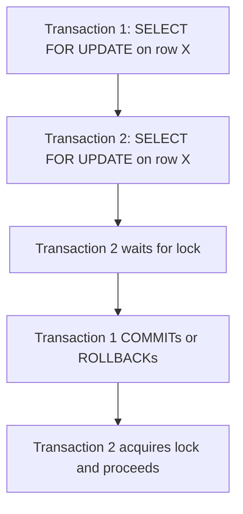

## Locking Mechanisms (Row vs. Table locks, Advisory Locks)
### Core Concepts

*   **Locking Mechanisms:** Database locks are crucial for managing concurrent access to data, ensuring data integrity (ACID properties), and preventing race conditions. They prevent multiple transactions from modifying or reading data in conflicting ways simultaneously.
*   **Row Locks (Tuple Locks):** Granular locks applied to individual rows (or specific versions of rows, "tuples" in Postgres). They are automatically acquired by DML operations (e.g., `UPDATE`, `DELETE`) and can be explicitly requested by `SELECT ... FOR` clauses.
*   **Table Locks:** Broader locks applied to entire tables. They are implicitly acquired by DDL operations (e.g., `ALTER TABLE`, `DROP TABLE`) and can be explicitly requested for specific concurrency control needs.
*   **Advisory Locks:** Application-level locks managed by PostgreSQL but *not* enforced by the database's standard locking mechanisms for data access. They are cooperatively used by applications to coordinate actions that don't directly map to data modifications (e.g., ensuring only one instance of a cron job runs).

### Key Details & Nuances

*   **Row Locks (`SELECT ... FOR`):**
    *   `FOR UPDATE`: Acquires an exclusive lock on selected rows. Other transactions cannot `UPDATE`, `DELETE`, or `SELECT FOR UPDATE/SHARE` these rows until the current transaction commits or rolls back. Ideal for "read-modify-write" patterns.
    *   `FOR NO KEY UPDATE`: Similar to `FOR UPDATE` but weaker; allows other transactions to update non-key columns. Prevents `DELETE` and `SELECT FOR UPDATE/SHARE`.
    *   `FOR SHARE`: Acquires a shared lock. Other transactions can `SELECT FOR SHARE` these rows but cannot `UPDATE` or `DELETE` them. Prevents `SELECT FOR UPDATE`.
    *   `FOR KEY SHARE`: Similar to `FOR SHARE` but weaker; prevents changes to key columns. Allows updates to non-key columns.
    *   **Implicit Row Locks:** `INSERT`, `UPDATE`, `DELETE` operations implicitly acquire row-level locks on the affected rows.
*   **Table Locks (Implicit & Explicit):**
    *   **Implicit Acquisition:**
        *   `SELECT`: Acquires `ACCESS SHARE` (allows other reads, no writes).
        *   `INSERT`, `UPDATE`, `DELETE`: Acquire `ROW EXCLUSIVE` (allows other reads, no DDL, blocks exclusive locks).
        *   `CREATE INDEX`: Acquires `SHARE UPDATE EXCLUSIVE` (allows concurrent reads, blocks writes, blocks other DDL).
        *   `ALTER TABLE`, `DROP TABLE`, `TRUNCATE`: Acquire `ACCESS EXCLUSIVE` (blocks all other operations on the table).
    *   **Explicit Acquisition:** `LOCK TABLE <table> IN <lock_mode>`.
        *   `ACCESS SHARE`: Least restrictive, default for `SELECT`.
        *   `ROW EXCLUSIVE`: Acquired by DML (`INSERT`, `UPDATE`, `DELETE`).
        *   `SHARE UPDATE EXCLUSIVE`: Acquired by `CREATE INDEX`. Prevents concurrent DDL and `ACCESS EXCLUSIVE` locks.
        *   `EXCLUSIVE`: Prevents all concurrent operations except `ACCESS SHARE` (reads).
        *   `ACCESS EXCLUSIVE`: Most restrictive. Prevents all concurrent access. Acquired by DDL.
    *   **Lock Compatibility Matrix:** Understanding which lock modes are compatible is crucial for predicting concurrency behavior. E.g., `ROW EXCLUSIVE` is compatible with `ROW SHARE` and `ACCESS SHARE` but not with `EXCLUSIVE` or `ACCESS EXCLUSIVE`.
*   **Advisory Locks (Application-level):**
    *   **Purpose:** Not for data integrity; for coordinating application logic. E.g., ensuring a single background job instance, rate limiting, or managing a shared resource outside the database.
    *   **Functions:**
        *   `pg_advisory_lock(key)`: Acquires a session-level advisory lock, blocking if already held.
        *   `pg_try_advisory_lock(key)`: Attempts to acquire, returns boolean if successful (non-blocking).
        *   `pg_advisory_unlock(key)`: Releases the lock. Locks are automatically released at session end.
        *   Key can be a single `BIGINT` or two `INT`s.
    *   **Key Feature:** They do *not* prevent or block standard data operations (reads/writes) on rows or tables. Their effect is purely advisory, requiring applications to respect them.

### Practical Examples

**1. Row-Level Lock (`SELECT ... FOR UPDATE`) to prevent race conditions:**

```typescript
// Scenario: Transferring money between accounts
async function transferMoney(
  dbClient: any, // PostgreSQL client instance (e.g., node-postgres)
  fromAccountId: number,
  toAccountId: number,
  amount: number
) {
  await dbClient.query('BEGIN');
  try {
    // Lock the sender's account row
    const fromAccountResult = await dbClient.query(
      'SELECT balance FROM accounts WHERE id = $1 FOR UPDATE',
      [fromAccountId]
    );

    if (fromAccountResult.rows.length === 0) {
      throw new Error('Sender account not found');
    }
    const fromAccount = fromAccountResult.rows[0];

    if (fromAccount.balance < amount) {
      throw new Error('Insufficient funds');
    }

    // Update sender's balance
    await dbClient.query(
      'UPDATE accounts SET balance = balance - $1 WHERE id = $2',
      [amount, fromAccountId]
    );

    // Lock the receiver's account row (or rely on implicit update lock)
    // For safety against non-existent receiver, a FOR UPDATE here is good.
    const toAccountResult = await dbClient.query(
      'SELECT balance FROM accounts WHERE id = $1 FOR UPDATE',
      [toAccountId]
    );
    if (toAccountResult.rows.length === 0) {
      throw new Error('Receiver account not found');
    }

    // Update receiver's balance
    await dbClient.query(
      'UPDATE accounts SET balance = balance + $1 WHERE id = $2',
      [amount, toAccountId]
    );

    await dbClient.query('COMMIT');
    console.log(`Transferred ${amount} from ${fromAccountId} to ${toAccountId}`);
  } catch (error) {
    await dbClient.query('ROLLBACK');
    console.error('Transfer failed:', error.message);
    throw error;
  }
}
```

**2. Advisory Lock for a Singleton Job:**

```typescript
// Assume 'dbClient' is a PostgreSQL client
async function runSingletonJob(dbClient: any) {
  const JOB_LOCK_KEY = 123456789; // Unique BIGINT key for the advisory lock

  // Try to acquire the advisory lock (non-blocking)
  const lockAcquiredResult = await dbClient.query(
    'SELECT pg_try_advisory_lock($1) as locked',
    [JOB_LOCK_KEY]
  );
  const locked = lockAcquiredResult.rows[0].locked;

  if (locked) {
    console.log('Successfully acquired lock. Running job...');
    try {
      // --- Your singleton job logic here ---
      await new Promise(resolve => setTimeout(resolve, 5000)); // Simulate work
      console.log('Job completed.');
    } finally {
      // Release the lock
      await dbClient.query('SELECT pg_advisory_unlock($1)', [JOB_LOCK_KEY]);
      console.log('Lock released.');
    }
  } else {
    console.log('Could not acquire lock. Another instance is likely running. Skipping job.');
  }
}

// Example usage
// runSingletonJob(dbClient);
```

**3. Illustrative Diagram of Blocking Lock**



### Common Pitfalls & Trade-offs

*   **Deadlocks:** Occur when two or more transactions are each waiting for a lock held by the other. Postgres has a deadlock detector that aborts one of the transactions (usually the one that has done less work) to resolve the situation.
    *   **Mitigation:** Consistent lock ordering, using `NOWAIT` or `SKIP LOCKED` (if applicable), keeping transactions short.
*   **Lock Contention:** Too many transactions waiting for the same lock can significantly degrade performance.
    *   **Trade-off:** Stronger isolation levels (e.g., `SERIALIZABLE`) offer maximum data consistency but can increase lock contention and transaction retries. Weaker isolation (`READ COMMITTED`, default) reduces contention but allows more concurrency anomalies.
    *   **Mitigation:** Optimize queries to affect fewer rows, keep transactions short, use appropriate lock levels (e.g., `FOR SHARE` instead of `FOR UPDATE` if only reading), consider optimistic locking where appropriate.
*   **Misuse of Advisory Locks:** Relying on advisory locks for data integrity is a critical error. They do not prevent concurrent data modifications. They are for application-level coordination only.
*   **Lock Escalation:** Unlike some other databases, PostgreSQL does *not* automatically escalate row locks to table locks. This keeps concurrency high but requires careful design to avoid excessive row lock overhead on very large updates.

### Interview Questions

1.  **Explain the primary differences and use cases for `SELECT ... FOR UPDATE` versus `SELECT ... FOR SHARE`.**
    *   **Answer:** `FOR UPDATE` acquires an exclusive lock, preventing other transactions from updating, deleting, or acquiring any `FOR` lock on the selected rows. It's for "read-modify-write" scenarios where you intend to modify the data immediately. `FOR SHARE` acquires a shared lock, allowing other transactions to also acquire `FOR SHARE` locks (multiple readers) but preventing any `UPDATE` or `DELETE` on the rows. It's for scenarios where you need to read stable data and prevent concurrent modifications, but allow other readers.

2.  **When would you consider using an advisory lock in PostgreSQL over a standard row or table lock? Provide a concrete example.**
    *   **Answer:** Advisory locks are used when you need to coordinate application logic *outside* of standard database data integrity. They don't block data access. A concrete example is ensuring a "singleton" background job (e.g., a daily report generator, an external API synchronization script) runs only one instance at a time across multiple application servers. You'd acquire an advisory lock at the start of the job; if it fails, another instance is already running, and the current instance can exit.

3.  **How does PostgreSQL handle deadlocks, and what are common strategies to prevent them in your application design?**
    *   **Answer:** PostgreSQL uses a deadlock detector that periodically checks for cycles in the "waits-for" graph. When a deadlock is detected, Postgres automatically chooses one of the involved transactions (typically the one that has performed less work or acquired fewer exclusive locks) as the "deadlock victim" and aborts it. The aborted transaction's work is rolled back, releasing its locks and allowing the other transactions to proceed.
        *   **Prevention strategies:**
            1.  **Consistent Lock Ordering:** Always acquire locks on multiple resources (e.g., rows in different tables) in the same predefined order across all transactions.
            2.  **Short Transactions:** Keep transactions as short as possible to minimize the time locks are held.
            3.  **Use `NOWAIT` or `SKIP LOCKED`:** For specific scenarios, `SELECT ... FOR UPDATE NOWAIT` will immediately return an error if a lock cannot be acquired, or `SKIP LOCKED` will simply skip locked rows, allowing the application to handle contention gracefully.

4.  **Describe a scenario where excessive lock contention might become a performance bottleneck. How would you identify it, and what steps would you take to mitigate it?**
    *   **Answer:** **Scenario:** A popular e-commerce product's stock count is frequently updated (e.g., every purchase, every return, every inventory adjustment), and each update involves a `SELECT ... FOR UPDATE` to read and modify the stock. If many users are buying this product simultaneously, transactions will queue up waiting for the stock row's exclusive lock.
    *   **Identification:** High `pg_stat_activity` wait events (specifically `Lock` or `DataLock`), long query execution times for seemingly simple updates, and increased transaction latency or timeouts. Monitoring tools often show "lock waits" metrics.
    *   **Mitigation:**
        1.  **Reduce Lock Duration:** Ensure transactions are as short and efficient as possible. Only lock what's strictly necessary.
        2.  **Optimistic Locking:** Instead of pessimistic `FOR UPDATE`, read the current stock, perform the check in application logic, then `UPDATE ... WHERE stock_count = <original_read_value>`. If the update affects 0 rows, another transaction modified it, and the current transaction can retry. This reduces contention at the cost of potential retries.
        3.  **Batching/Queuing:** For non-real-time updates, batch them or use a queueing system to serialize updates to the highly contended resource.
        4.  **Application-Level Sharding/Partitioning:** If feasible, partition the data such that hot spots are spread across multiple logical entities, reducing contention on a single row/table.